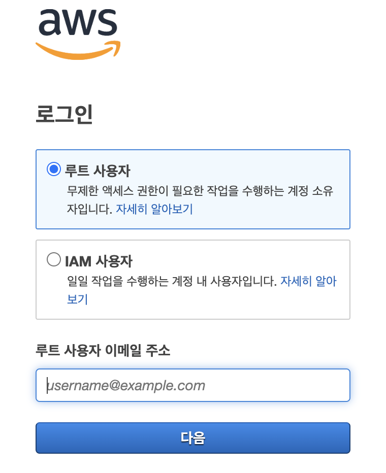
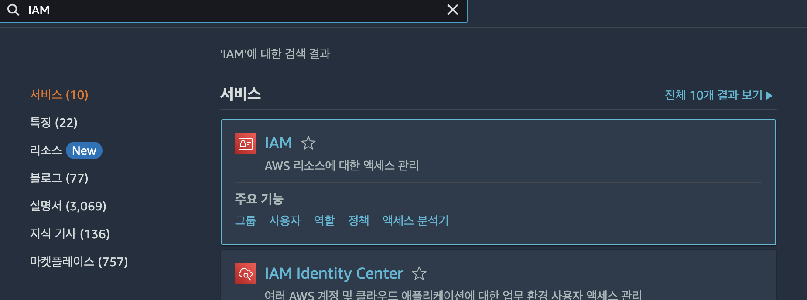
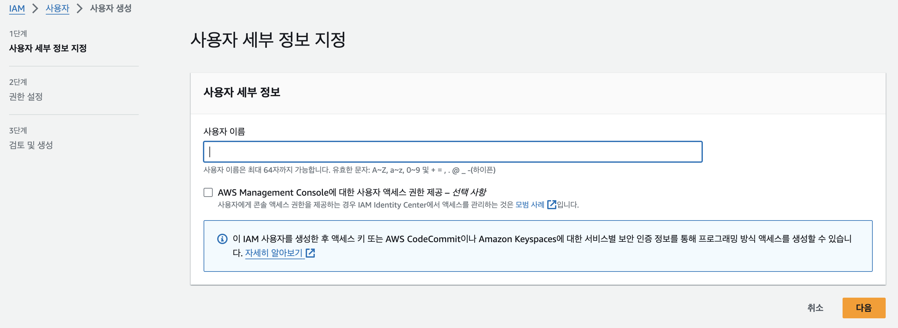
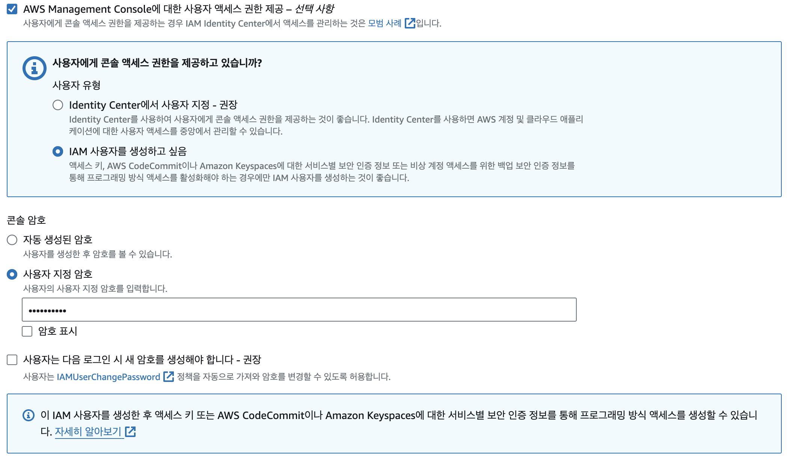
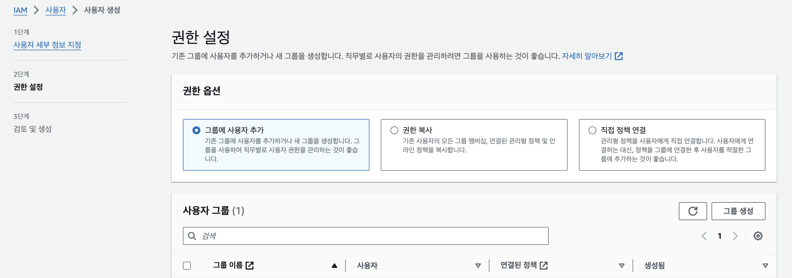
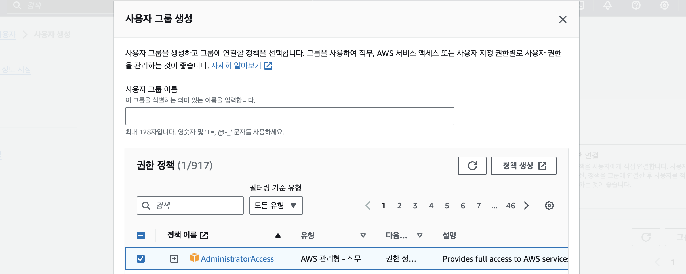
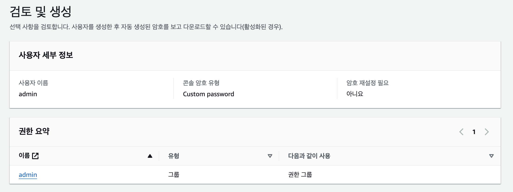

# [AWS] IAM

<br><br>
<center></center>

## 여담

Amazon Web Service Document에 따르면 AWS에서 제공하는 프로덕트의 개수는 300종 이상이다.
내가 개발할 때 직접 사용해봤거나 이론으로만 접해본 서비스는 극히 일부라는 것이다.  
백엔드 공부를 시작하며 인프라 관리에 관한 막연한 궁금증이 생겼었다. 가상의 서버, 데이터베이스, 네트워크 등을 AWS로 손쉽게 구축할 수 있는데, 이런 클라우드 환경은 어떻게 짜여지고 동작하는 건지? 클라우드 서비스가 없다면 물리적으로는 어떻게 구축하는지? 클라우드 환경에서 애플리케이션을 효율적으로 관리하기 위한 도구들도 제대로 공부하고 써보고 싶었다.  
현재로서는 무지한 상태, 배움이 많이 필요한 상황이기 때문에 좀 더 깊이있게 기술을 이해해보고 다른 개발자들과 경험 및 이슈를 나눠보려고 한다. 올해 AWS Cloud Clubs에 함께하게 되어, 매주 세션에서 제시하는 주제를 바탕으로 추가 공부를 해보고자 cloud 카테고리를 개설하게 되었다. 아직 모르는 게 많기 때문에, 관련 경험이나 유용한 지식을 활발히 공유받고 <span style="color:lightgray">가능하면 나도 공유하고</span> 싶다!
<br><br>

# AWS IAM?

<center></center>

> Identity and Access Managememt
  
IAM이란 AWS 리소스에 대한 액세스를 안전하게 제어할 수 있는 웹 서비스이다.  
즉 다양한 AWS 서비스들에 관한 접근 권한을 중앙에서 관리하도록 해주는 서비스라고 볼 수 있다.

### 역할

- 인증(Authentication)과 권한 부여(Authorization) 관리
    - 리소스를 사용할 수 있도록 인증 및 권한 부여된 대상을 제어한다.
- 사용자와 그룹 생성 및 관리
    - 특정 사용자의 service-level activity 및 액세스 권한을 확인하고 관리할 수 있다.
    - 사용자 그룹을 생성해 권한을 부여하거나 정책을 연결한다.
    - 사용자 별로 토큰을 발급할 수 있다.

### 구성

- User
    - AWS 계정에 속하는 ID로 인증할 수 있는 단일 개인 또는 애플리케이션
- Group
    - IAM User 집합
    - 그룹에 속한 사용자는 그룹에 부여된 권한을 지님
- Role
    - AWS 계정의 특정 AWS 리소스에 대한 임시 액세스 권한이 부여된 것
    - AWS User와 유사하지만 Role은 특정 개인과 연결되지 않음
- Policy
    - 액세스할 수 있는 리소스와 각 리소스에 대한 액세스 수준을 정의
    - Principal, Action, Resource, Condition, Effect 등의 키 값을 지닌 JSON 형식  
    e.g. 날짜 및 시간을 기준으로 작업에 대한 액세스를 허용하는 자격 증명 기반 정책을 생성하는 방법
    ```json
        {
            "Version": "2012-10-17",
            "Statement": [
                {
                    "Effect": "Allow",
                    "Action": "service-prefix:action-name",
                    "Resource": "*",
                    "Condition": {
                        "DateGreaterThan": {"aws:CurrentTime": "2020-04-01T00:00:00Z"},
                        "DateLessThan": {"aws:CurrentTime": "2020-06-30T23:59:59Z"}
                    }
                }
            ]
        }
    ```


IAM에 관해 간단히 알아봤으니, AWS 콘솔에 접속하여 어떤 서비스인지 직접 살펴보자.

## Root User & IAM User

<center></center><br>

AWS 콘솔 로그인 페이지로 접속하면 위와 같은 화면을 가장 먼저 보게 된다.  
**루트 사용자**는 AWS 계정을 만들 때 자동으로 생성되는 기본 사용자이고, **IAM 사용자**는 AWS 계정 내에 별도로 생성된 사용자이다.  

### IAM User 생성

이제 콘솔에 루트 사용자로 접속한 뒤, IAM 서비스를 이용해 IAM 사용자를 만들어 보자.

<center></center>

왼쪽 상단의 검색창에서 IAM을 검색하여 접속한다. 
   
cf. 아래의 `IAM Identify Center`가 아니라 `IAM`으로 접속한다.  
Identify Center를 이용하여 IAM User를 생성하고 관리할 수도 있다. 일반적으로 해당 방법이 권장되는 듯하나 사용 목적에 차이가 있어 보이기 때문에 지금은 이용하지 않겠다.

<br><center></center>

왼쪽 목록에서 `사용자` 탭으로 들어가 사용자를 생성한다.  

<br><center></center>

`AWS Management Console에 대한 사용자 액세스 권한 제공` 
옵션을 선택하여 콘솔에 대한 접근 권한을 부여할 수 있다. 앞서 등장했던 Identify Center를 이용하는 것을 권장하지만, 당장 필요하지 않으므로 사용자 생성만 해보겠다. 참고로 이 옵션을 선택하지 않고 건너뛰어도 `사용자 정보 > 보안 자격 증명 > 콘솔 로그인`에서 콘솔 액세스를 관리할 수 있다.  


**cf. 콘솔에 대한 액세스 권한을 부여하지 않으면 어떻게 되나? 콘솔을 사용하지 않을 때가 있나?**  
User의 콘솔 액세스 권한이 없어도, Role을 사용하여 콘솔에 액세스하는 것을 막지는 못하며 User에게 위임된 권한에 영향을 주지는 않는다. 또한 활성화된 Access Key가 있다면 AWS CLI 또는 AWS API를 통해 액세스할 수 있다.  
→ 아 ~ 직접 AWS에 로그인하여 리소스에 접근하지 않는 경우(CLI 사용 or API 호출)에는 필요하지 않을 수 있겠구나

<br>
위와 같이 콘솔에 로그인할 때 필요한 암호를 설정하면, 이제 해당 IAM User에게 콘솔 접근 권한이 부여된다.  


<br><center></center>

AWS에서는 사용자에게 권한을 세 가지 방식으로 부여하고 있다.  
그룹을 생성하여, 사용자를 그룹 멤버십에 따라 권한이 부여되도록 할 것이다. `그룹 생성`으로 그룹을 만든다.

<br><center></center>
그룹 이름을 지어주고 부여할 권한을 선택한다.  
  
cf. `권한 경계 설정`: IAM entity에 부여할 수 있는 최대 권한을 설정하여, 필요한 최소한의 권한만 가지도록 해준다.

<br><center></center>
설정이 올바른지 확인 후 사용자 생성을 완료한다.  
  
cf. `태그`: 다른 AWS 서비스에도 존재하는 것으로 AWS 리소스를 식별하고 구성하는 데 도움이 된다. 서로 다른 서비스의 리소스에 동일한 태그를 할당하여 해당 리소스의 관련 여부를 나타낼 수 있다.

<br>

이렇게 생성한 IAM User로 AWS 콘솔에 다시 로그인해보자!  
사용자 정보에서 ID와 비밀번호를 확인하여 직접 입력하거나, 로그인 링크를 통해 접속한 뒤 비밀번호를 입력하면 로그인할 수 있다.  
콘솔에 접속해보면 Root 계정과는 달리 접근할 수 있는 서비스에 제약이 있음을 알 수 있다.

### Root User vs IAM User

이렇게 생성한 IAM User는 Root User와 어떤 차이가 있을까?
- 권한 부여에 의해서만 권한이 생긴다.
- AWS 관리는 Root User로, 이를 제외한 작업은 IAM User을 생성하여 사용한다.
- **AWS API 호출이 가능하다.**
    - Access Key를 부여받는다.
    - 이러한 특징이 우리가 IAM User를 사용해야 할 이유가 된다.

## IAM User가 필요한 이유?
Access Key를 발급받을 수 있다.  
Access Key = access key ID + secret access key  
Access Key를 사용하면 AWS CLI를 사용하거나, AWS API를 호출할 수 있다.  
(직접, 혹은 SDK를 통해 접근할 수 있다.)  

항상 콘솔을 통해서만 리소스에 접근하는 것이 아니다.  
자동화 환경을 구축하는 경우 등 SDK/CLI를 통해 접근해야 할 때가 있기 때문에,  
IAM User를 사용해 토큰을 발급받는 과정이 필요하다!

그 외의 이유는 사용할 기회가 생겼을 때 더 알아가보겠다~

<br><br>
<details>
<summary> 📁 참고 자료</summary>
<div markdown="1">
- AWS-Documentation
- ACC KHU 1주차 세션
- 피로그래밍 19기 배포 세션
</div>
</details>