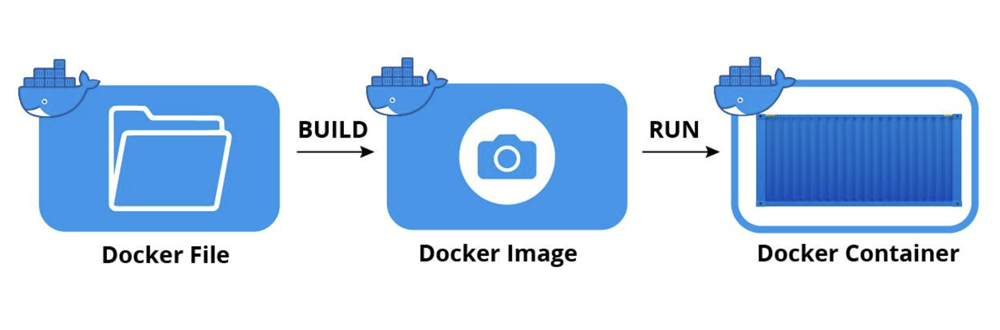

# [Docker] 컨테이너 기술과 Docker

<br><br>
<center></center>
<br><br>

## 여담

컨테이너의 개념을 공부하며 다시 한번 되짚고자 했던 점이 있다.  

***"도커를 사용하는 이유를 물었을 때 나와야 할 근본적인 대답이 무엇인가?"***  

동아리에서 실사용하는 서비스의 유지보수 과정을 지켜보며, 컨테이너 기술을 도입하는 이유와 그 사용 방법을 접하게 되었다.  
서비스 초반에는 서로 다른 두 애플리케이션이 각자의 서버에서 동작하고 있었다.  
하나의 애플리케이션이 하나의 컴퓨터 자원을 혼자서 모조리 쓰고 있었던 것이다.  
그러나 각각에 할당된 자원에 비해 실제로 사용하고 있는 자원의 양은 많지 않았다.  
이것은 낭비이다. 하나의 컴퓨터를 두 애플리케이션이 나눠쓰도록 하면 좋을텐데!  
이런 문제 상황을 해결하기 위해, 환경을 완벽히 분리한 두 애플리케이션이 **하나의 리소스**를 공유하도록 컨테이너 기술을 도입하였고  
자원을 보다 효율적으로 사용하게 만들 수 있었다.  

이러한 이해가 틀린 것은 아니다. 그러나 당시 나는 애플리케이션의 **환경 분리**에 집중하였기 때문에 가상화 기술에 대해 이해하지 못하였고, 클라우드와 온프레미스 환경을 구분하여 생각하지 못했다. 물론 이때는 가상 머신이 컨테이너의 비교 대상인지, 클라우드 서비스를 사용하지 않고서는 어떻게 인프라를 구축하는지… 기본적인 의문을 가질 수도 없을 정도로 아는 것이 없었다.  
<span style="color:lightgray">경험이 없었으니 어찌보면 당연함 ㅎㅎ</span>  

EC2로 했던 작업이 무엇인지 이해하지 못한 채 무작정 새로운 기술을 접하니 포인트를 놓쳤던 것 같다.  
기술의 필요성을 느끼고 제대로 공부하는 것의 중요성을 다시금 깨닫는다.  
따라서 이번 글은 새로운 기술과 이전 기술을 비교하며 Docker에 대해 이해할 수 있도록 작성해보려고 한다.

<br>

---

# 서론

본론으로 들어가기 전, 이해를 돕기 위해 미리 알고 있어야 할 개념을 소개하겠다.

## 클라우드 (Cloud) vs 온프레미스 (On-Premise)

  우리가 서비스를 개발할 때를 떠올려보자.  
  열심히 작성한 코드와 파일들만 덩그러니 ~ 있다고해서 뭐 특별한 일이 일어나지는 않는다.  
  애플리케이션의 구축과 실행을 위해서는 서버, 데이터베이스, 네트워크, 운영체제 등 갖춰진 환경이 필요히다!  
  이러한 애플리케이션을 위한 인프라를 구축하는 방식에는 크게 두 가지가 있다.

### 클라우드
  - 서버, 스토리지, 데이터베이스, 네트워킹 등의 IT 리소스를 **인터넷을 통해** 제공한다
  - **원격**: 물리적으로 가까운 내 컴퓨터가 아닌, 클라우드에 연결된 다른 가상의 컴퓨터로 정보를 처리한다
  - **온디맨드 (On-Demand)**: 필요시 바로 제공되며, 어디서나 접근할 수 있다
  - 직접 접근할 수 있는 물리적인 인프라로부터가 아니라, AWS와 같은 클라우드 공급자로부터  
  컴퓨팅 파워, 스토리지, 데이터베이스와 같은 기술 서비스를 **내가 원할 때 원하는 만큼** 사용할 수 있다  
  
### 온프레미스
  - 클라우드와 같은 원격 환경이 아닌, 회사나 개인의 자체적인 인프라에 호스트되어있는 환경
  - 물리적 데이터 센터와 서버를 구입, 소유 및 유지 관리하는 것

  - 쉽게 말하자면 클라우드 서비스는 돈을 지불하고 세팅 잘 되어있는 남의 컴퓨터를 빌려서 쉽게 사용하는 것,    
  온프레미스는 사용자가 직접 서버 컴퓨터, 데이터 센터, 네트워크 연결을 손수 만들고 관리하는 것
  - 클라우드 서비스 이전에는 기업이 자체적으로 온프레미스 환경을 구축하여 사용했다.  
  지금도 기업이나 개인이 필요에 따라 온프레미스 환경을 사용하기도 하지만 클라우드 서비스를 많이 활용하는 편
  - 사용해야 할 컴퓨팅 자원이 무엇인지, 요구되는 자원의 특성이 무엇인지, 예산이 얼마인지 등  
    상황에 따라 적절한 방법을 선택할 수 있다.

## 가상 머신 (VM) vs 컨테이너 기술 (Container)

서론에서 언급했듯 기존의 컴퓨터 사용 방식은 리소스를 낭비한다는 문제가 있었다.  
물리적인 서버를 보다 효율적으로 사용하기 위해 **가상화 기술**이 등장하였다.  
두 가상화 기술을 간단히 비교해보자.
<br><br>

<details>
<summary> &nbsp; <b>cf. Below your programs: </b> 어떠한 구조로 프로그램이 실행되는가? </summary>
  <center>
    
    <div class="figcaption">애플리케이션, 운영체제(OS), 하드웨어가 낯설다면 🤨 위 그림을 참고하자!</div>
  </center>
</details>

### 가상 머신
  - Virtual Machine
  - 실행 중인 애플리케이션과 운영체제를 포함하여, 컴퓨터와 거의 동일하게 모든 기능을 수행할 수 있는 컴퓨터의 가상화된 인스턴스
  - 하이퍼바이저를 이용하여 호스트 시스템의 하드웨어 자원을 가상화한다.  
    이 자원을 각각의 가상머신이 사용할 수 있도록 할당한다.  
  
  > **하이퍼 바이저란?**  
  > 가상화한 하드웨어와 각각의 가상머신을 모니터링하는 중간 관리자  
  > 호스트 시스템에서 여러 개의 게스트 OS를 구동할 수 있게 해주는 소프트웨어
  
  - 하이퍼바이저가 *하드웨어 바로 위에서 실행되는 방식*과 *호스트 OS 위에서 실행되는 방식*이 존재한다.
  

### 컨테이너 기술
  - LXC, Linux Container라는 기술을 기반으로 한다.  
    이는 호스트 OS에서 프로세스 사이에 벽을 만드는 기술로, 격리된 고유 영역에서 애플리케이션을 실행할 수 있도록 해준다.
  - 애플리케이션 실행에 필요한 것들을 '이미지(image)' 단위로 빌드하여 패키지로 배포한다.  
    따라서 어떠한 환경에서든 애플리케이션을 동일하게 실행시킬 수 있다.
  - OS(Operating System, 운영체제) 수준의 가상화  
    따라서 이미지에 운영체제는 들어있지 않다 → 이미지에 운영체제가 포함되는 가상 머신에 비해 가볍다!
  
  <br>
  조금 더 자세한 내용은 본론에서 Docker를 예시로 비교하며 알아보자!

<br>

---

# Docker

## Docker란?

애플리케이션을 신속하게 구축, 테스트 및 배포할 수 있는 소프트웨어 플랫폼이다.  
도커는 소프트웨어를 **컨테이너**라는 표준화된 유닛으로 패키징한다.  
이 컨테이너에는 라이브러리, 시스템 도구, 코드, 런타임 등 소프트웨어를 실행하는 데 필요한 모든 것이 포함되어 있다.  
따라서 환경에 구애받지 않고 애플리케이션을 배포 및 확장할 수 있다.

## Docker의 작동 방식 및 원리

<center></center><br>

도커는 컨테이너를 위한 **운영 체제**이다.  
가상 머신은 서버 하드웨어를 가상화하고 공유하여 사용하는 기술이다. 반면 컨테이너는 서버 운영 체제를 가상화한다. 그러므로 운영 체제의 자원을 컨테이너들이 공유하는 것으로 이해할 수 있을 것이다. 위 그림과 같이, 각각의 컨테이너는 각각의 게스트 OS를 사용하지 않고 **하나의 호스트 OS**(정확히는 리눅스 커널)를 공유하여 사용한다. 

이러한 컨테이너 기술은 앞서 말했듯 LXC(리눅스 컨테이너)를 기반으로 한다.  
리눅스는 **`namespace`**와 **`cgroup`**이라는 기능을 제공하는데,  
바로 이 기능이 컨테이너가 환경을 분리하고 그에 따라 자원을 관리할 수 있도록 만들어 준다.

### Namespaces
- **Limits what you can see**
- 프로세스가 각자의 파일시스템, 네트워크, 유저, 호스트네임 등에 대해서 독립적인 뷰를 가질 수 있도록 만든다.
- 즉, 각각의 프로세스를 분리하여 관리할 수 있도록 한다. 프로세스들은 서로 영향을 주지 않으며 독립적으로 작동한다. 
- 프로세스들은 자신만의 '공간'을 갖는다고 이해할 수 있다.

### Cgroups (Controll groups)
- **Limits how much you can use**
- 각 프로세스가 사용할 수 있는 리소스를 제한한다.
cf. 리소스: CPU, 메모리, I/O, 네트워크 대역 등

<br>

## Docker의 구조

<center></center><br>

도커는 클라이언트-서버 아키텍처를 사용한다. 컨테이너를 생성 및 실행하는 서버 측과 클라이언트가 통신하는 구조이다.

- **Docker client**
  - 도커 데몬에게 명령하기 위해 API를 사용할 수 있도록 CLI를 제공하는 것
  - 사용자가 `docker`로 시작하는 명령어를 입력하면 도커 클라이언트를 사용하는 것이다.
  - 도커 클라이언트는 입력된 명령어를 도커 데몬에게 API로서 전달한다.  
  **cf.** 이때 도커 클라이언트는 `/var/run/docker/sock에 위치한 Unix Socket`을 통해 도커 데몬의 API를 호출한다.  
  Jenkins를 사용할 때 중요한 개념이라고 한다!

- **Docker host**
  - 도커가 띄워져 있는 서버를 의미한다.

- **Docker daemon**
  - 도커 데몬은 외부에서 API 입력을 받아 도커 엔진의 기능을 수행한다.
  - 도커 프로세스가 실행되어 서버로서 입력을 받을 준비가 된 상태를 말한다.

- **Docker registry**
  - 도커 이미지를 저장, 공유하는 외부 저장소
  - 기본값으로 `Docker Hub`에서 이미지를 찾아 사용한다. 

<br>

## Docker 이미지와 컨테이너

도커에서 생성하고 사용하는 객체로는 `이미지, 컨테이너, 네트워크, 볼륨 등`이 있다.  
그중 도커 엔진의 기본 단위인 **`이미지`**와 **`컨테이너`**에 대해 알아보자.

### Image

- 도커 컨테이너를 생성하기 위한 지침이 들어있는 읽기 전용 템플릿이다.
- 애플리케이션의 종속성과 실행환경을 설명하는 명령어들로 구성된 `Dockerfile`이라는 텍스트 파일에 이미지가 정의된다.
- 도커 파일의 **각 명령어**는 이미지에 **`레이어`**를 생성한다.  
  이미지를 새롭게 빌드할 때, 레이어에 변경 사항이 없으면 이전 버전의 레이어를 참조하고  
  파일이 추가되거나 수정되면 새로운 레이어를 생성하는 방식이다.
- 기본적인 레이어는 읽기 전용(Read-Only Layer)으로 생성된다.

  ```docker
    # 도커로부터 node를 베이스 이미지로 가져오기
    FROM node

    # 컨테이너에 working directory를 만들어 app 소스코드 구분
    WORKDIR /usr/src/app

    # COPY (1) 효율적인 재빌드를 위해 COPY 절차를 구분
    COPY package.json ./

    # 도커 서버가 수행할 명령
    RUN npm install

    # COPY (2)
    COPY ./ ./

    # 포트 번호를 명시적으로 설정해주기
    EXPOSE 8080

    # 컨테이너가 실행될 때의 {시작 명령어}
    CMD ["node", "server.js"]
  ```

이해를 돕기 위한 Dockerfile 코드 예시이다.  
이는 Node.js 애플리케이션을 실행할 컨테이너를 만들기 위한 Dockerfile이다.

### Container

- 이미지를 이용해 생성되는, 실행가능한 이미지 인스턴스이다.
- 애플리케이션을 실행할 수 있는 독립된 프로세스로,  
  필요한 모든 실행 파일, 바이너리 코드, 라이브러리 및 구성 파일 등이 들어있다.
- Docker API 또는 CLI를 사용하여 컨테이너를 생성, 시작, 중지, 이동 또는 삭제할 수 있다.
- 컨테이너를 생성할 때 기존의 읽기 전용 레이어 위에 새로운 쓰기 가능한 레이어(Read-Write Layer)가 생성된다.  
  따라서 컨테이너가 실행될 때 발생하는 변경사항은 읽기/쓰기 전용 레이어에 저장하고, 기존의 이미지는 보존된다.

<br><center></center>

그림을 통해 도커 실행 과정을 살펴보면,  
`Dockerfile`로 `Docker Image`를 빌드하고, `Docker Image`를 이용해 `Docker Container`를 생성하고 실행한다.  
다음 포스트에서는 docker 명령어로 직접 도커를 사용해보도록 하자!

<br>

---

# 정리

컨테이너 기술인 도커를 정확히 이해하고 사용할 수 있도록 공부해보았다.  
공부를 시작하기 전 궁금했던 점을 바탕으로 정리해보자면,  

**Q. 가상화 기술 왜 써?**  
컴퓨터 하나에 하나의 OS만 사용하니 남는 리소스가 아깝다.  
하나의 컴퓨터에 여러 개의 OS를 올려 리소스를 최대한 알차게 쓰자!

**Q. 그 문제는 가상 머신으로도 해결이 가능한데 왜 도커가 필요해?**  
가상 머신은 운영체제까지 가상화하기 때문에 굉장히 무겁다.  
도커는 리눅스 운영체제 위에서 애플리케이션을 가상화하여 분리한 것이기 때문에 가볍고,  
성능 및 관리 측면에서도 많은 이점이 있기 때문에 사용한다.

와 같이 이해할 수 있었다!  
잘못된 내용 혹은 추가로 도움이 될 만한 내용이 있다면 언제든 알려주길 바란다 😋


<br><br>
<details>
<summary> &nbsp; 📁 참고 자료</summary>
<div markdown="1">
- ACC KHU 1주차 세션
- AWS-Documentation
- docker.docs
</div>
</details>