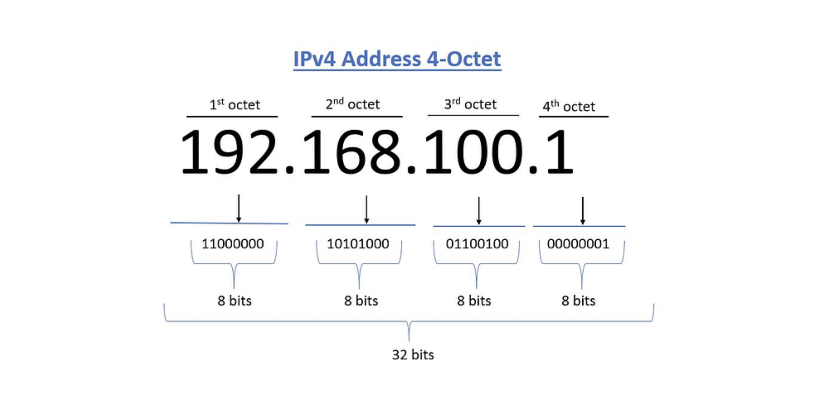
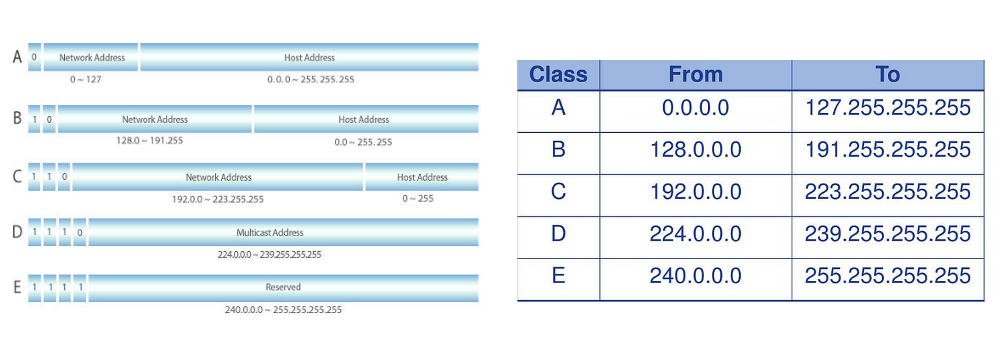
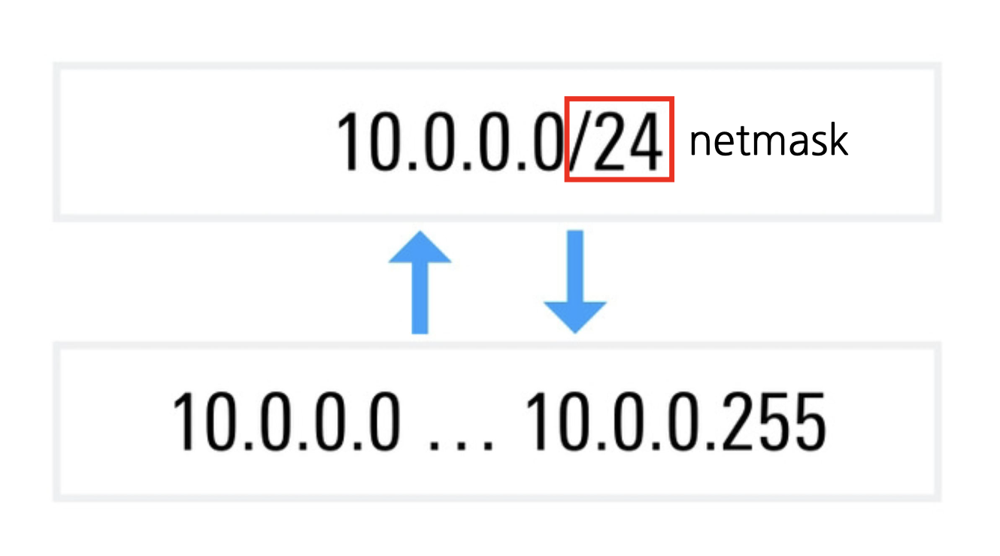
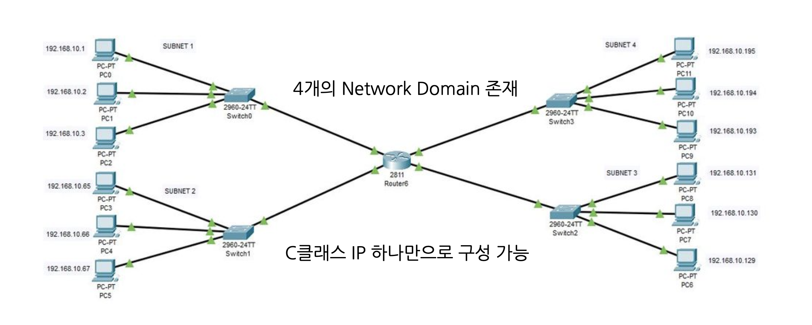
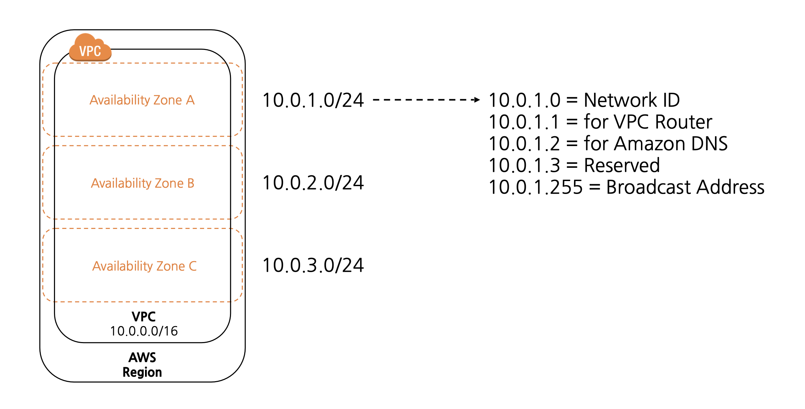
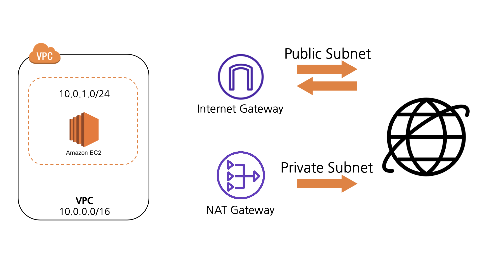
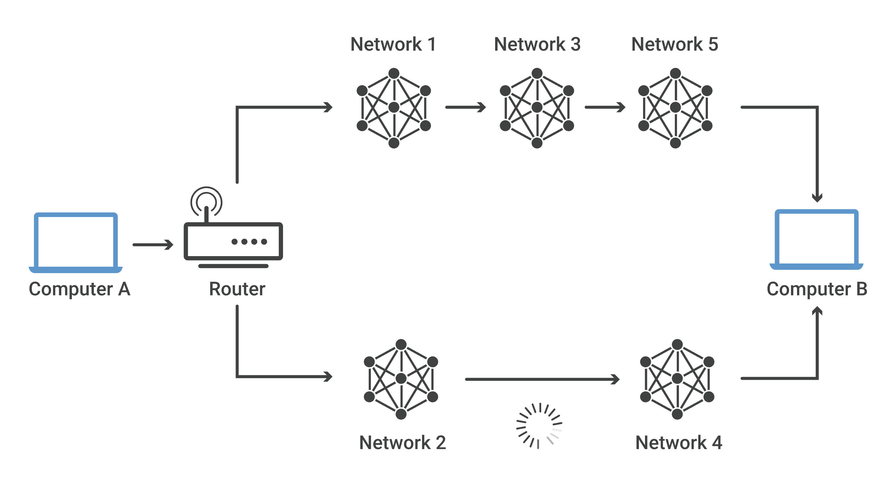

# [AWS] 네트워크 구성

  

   

ACC 3주차 \<네트워크 구성\> 세션 내용을 정리했다.  
Amazon EC2의 네트워킹에 대해 알아보고 인스턴스에 네트워크 설정을 적용하는 핸즈온을 진행해 보았는데, EC2를 사용해본 적이 없거나 네트워크 개념이 낯설다면 이해하기 조금 어려울 수 있을 것 같았다. 따라서 <a href="https://mingdodev.github.io/blog/cloud/2024-05-15-AWS-EC2/" target="_blank">4주차 EC2 세션</a> 을 참고하여 3주차 내용을 이해하면 더 좋을 것 같다!

1. toc
{:toc .large-only}

# Region & AZ

- **Region**
    - 별도의 지리적 영역. 가까운 곳들을 묶어둔 개념이다.
    - 일반적으로 리전과 리전은 격리되어 있고, 각 리전에 리소스가 연결된다.
    - 각 리전은 가용 영역을 여러 개 가지고 있다.
- **Availability zone**
    - 가용 영역
    - 하나 이상의 데이터 센터로 구성되어있다.
    
    **e.g.** 가용 영역 코드 `us-east-1a`
    
- 33 Regions & 105 Azs

## Why?

- Availability
    - 가용성
- Scalability
    - 확장성
    - 일반적 스케일업보다 넓은 범위의 개념
    - 물리적으로 같은 지역이 아닌, 다른 지역의 서버를 늘린다.
    
    → 하나의 리전 + 다른 리전에 서버 추가
    
- Robust
    - 장애 발생 관리에 용이하다.
- Communication time
    - 서버와 물리적 거리를 줄이자!

→ 일종의 **QoS**(Quality of Service)

 

---

# VPC

- Virtual Private Cloud
- 논리적으로 할당된 가상의 네트워크 공간
- AWS에서 나만의 private cloud를 만들 수 있는 서비스
    - `private cloud`: 어떤 조직체 내에서만 접근 가능
    - `public cloud`: EC2와 같이 콘솔에서 누구나 접근 가능
- 기본적으로는 Region 당 최대 5개의 VPC를 생성할 수 있다.
- 각 Region에는 default VPC가 존재한다.
- <u>Private IP 주소</u>만 할당 가능하다.
- 각 Region마다 존재하는 VPC는 <u>IP 대역</u>이 서로 달라야 한다.

→ 이게 무슨 말일까❗️ IP에 관해 알아보자.

 

---

# Public IP & Private IP

- **Public IP**는 공인된 ISP(Internet Service Provider)로부터 IP 주소를 구입하여 사용하는 것
- **Private IP**는 물리적으로 가까운 범위의 통신 장치들끼리 연결한 네트워크 내부의 IP 주소
    - 주소 자체는 무과금

### Private IP Internet connection

- private IP는 직접 인터넷 연결이 안 된다.

→ **`NAT (Network Address Translation)`** 필요

 

- NAT는 private address를 public addresses로 변환하여 인터넷에 접속할 수 있도록 해준다.
- 여러 개의 private address가 하나의 public address를 사용하는 것도 가능하다.
- private address는 외부에 노출되지 않는다.

 

---

# CIDR & Subnet

- IPv4 Address는 다음과 같이 8bits 필드 4개로 표현한다.
- 각 필드는 0-255까지의 숫자로 구성되며, IP 주소 범위를 IP 대역이라고 한다.

 

- 하나의 IP는 `Network Address` + `Host Address`로 구성되어 있다.

- **Network Address**
    - LAN끼리 같은 IP 대역을 사용한다.
    - IP Class
        - Network Address를 관리하기 쉽게 범위를 나눈 것
    - 보통 A - C class를 ISP로부터 할당받아 사용한다.

- **Host Address**
    - 같은 LAN에서 엔드 디바이스 정보의 출발점 또는 도착점 를 식별한다.

## CIDR

- Classless Inter-Domain Routing
- IP 주소 32bits 중 netmask 값 만큼을 가리겠다. 마스크하겠다.

 

- `/24` 이므로 24개의 비트를 마스크한다. 이 경우 32 - 24 = 8비트만 가려지지 않는다.  
이는 8비트는 범위 내에서 자유롭게 변할 수 있음을 의미한다.  
위 사진처럼 마지막 8비트 (1byte, 필드 하나)만 0-255값을 가질 수 있게 된다.

## Subnet

- 네트워크를 더 작은 네트워크로 분리하는 개념
- IP 주소에 Subnet Mask를 적용하여 Network Address와 Host Address를 구별할 수 있다.
    - IP 값에 서브넷 마스크 값을 비트 연산(AND)하면 네트워크와 호스트 값이 도출되는 방식으로 이해했다.
- Subnet Mask 값을 조정하여 네트워크 영역(class)을 조절할 수 있다.

 

네트워크 도메인끼리 서로 다른 서브넷을 지니도록 하면 C class IP 하나만으로 네트워크를 구성할 수 있다.  
네트워크를 더 작은 네트워크로 나누어 사용하다는 것이 무슨 뜻인지 알겠죠!

 

---

# VPC Architecture

 

- VPC를 생성할 때 VPC의 **CIDR 블록**을 지정해야 한다.
- [RFC 1918](http://www.faqs.org/rfcs/rfc1918.html) 규격에 따라 Private IPv4 주소 범위에 속하는 CIDR 블록을 지정하는 것이 좋다고 한다.
- 그림은 RFC 1918 범위에 따른 CIDR 블록 중 `10.0.0.0/16` 을 사용하는 VPC와 가용 영역들이다.  
가용 영역 A의 **Subnet** A는 `10.0.1.0/24`이다.
- 각 가용 영역에는 총 다섯 개의 IP가 reserved되어 있다.

- VPC 내부의 EC2 인스턴스가 인터넷에 접속하려면 어떻게 해야 할까?
- 앞서 말했듯 Private IP가 Public IP로 변환되는 작업이 필요하다.
- AWS의 `Internet Gateway` 또는 `NAT Gateway` 이 NAT의 역할을 수행한다.
- **NAT Gateway**는 Private Subnet의 리소스가 인터넷으로 나가는 트래픽을 라우팅하여 Private Address를 Public Address으로 변환한다. 그러나 <u>인터넷에서 들어오는 요청은 허용하지 않는다.</u>
- **Internet Gateway**는 Public Subnet의 리소스와 인터넷 사이의 트래픽을 <u>양방향</u>으로 라우팅한다.
    - IPv4 통신의 경우 NAT의 역할도 수행한다.

 

---

# IP Routing & Gateway

서로 다른 LAN에 존재하는 두 컴퓨터가 있다.  
데이터 패킷이 컴퓨터 A에서 B로 전달되려면 어떤 경로로 지나갈지 선택하는 과정이 필요한데, 이 역할을 수행하는 것이 **라우터**이다.
**라우팅**이란 하나 이상의 네트워크에서 경로를 선택하는 프로세스를 말한다. 마찬가지로 인터넷에서 라우팅은 데이터의 **IP 패킷**이 원본에서 대상으로 이동하는 방식을 의미한다. 라우터는 대상에 도달하기 위해 선택해야 하는 경로가 기록된 내부 **라우팅 테이블**을 가지고 있는데, 이를 참조하여 패킷을 특정 경로로 라우팅 라우팅 라우팅...하고 목적지에 도착하게 할 수 있다.

여기서 서로 다른 LAN에 존재한다는 것은, 서로 다른 IP 대역 간 통신이 필요하다는 뜻이다. 같은 네트워크끼리는 직접 통신이 가능한데, 서로 다른 네트워크에서는 어떻게 통신이 이루어질까? 이를 가능하게 해주는 것이 **`Gateway`**이다. 게이트웨이가 특정 네트워크를 다른 대역으로 라우팅해준다.

즉 LAN의 출입구를 게이트웨이라고 할 수 있다. 이때 **라우터**는 네트워크 간의 통신을 하도록 도와주는 '장치'이고, **게이트웨이**는 다른 네트워크로 연결할 때 반드시 거쳐야 할 개념적 '통로'이다. 게이트웨이를 거쳐야 다음으로 연결할 네트워크 대역에 맞는 IP 주소를 얻을 수 있는 것이다.

예를 들어, VPC를 생성하기만 하면 당장으로서는 인터넷으로 나갈 수 있는 게이트가 없다.  
따라서 Internet Gateway로 연결하여 인터넷으로 나가는 트래픽을 얻을 수 있도록 해야 한다. (또한 인터넷 게이트웨이에 연결하기 위해서는 Public IP가 필요하기 때문에 NAT도 필요하다.)  

다음 게시글에서 이 개념들을 바탕으로 <strong>EC2 인스턴스에 인터넷에 연결하는 과정</strong>을 설명하도록 하겠다. 

 

 &nbsp; <strong>cf. Route53</strong>

 
&nbsp;&nbsp;&nbsp;&nbsp;  

AWS의 DNS(domain name service)

  

 &nbsp; 📁 참고 자료

- ACC KHU 3주차 세션
- <a href="https://sharplee7.tistory.com/108" target="_blank">IP Class, Subnet mask 그리고 CIDR 이란?</a>
- <a href="https://www.cloudflare.com/ko-kr/learning/network-layer/what-is-routing/" target="_blank">라우팅이란? | IP 라우팅</a>
- <a href="https://hstory0208.tistory.com/entry/Gateway%EA%B2%8C%EC%9D%B4%ED%8A%B8%EC%9B%A8%EC%9D%B4%EB%9E%80-Router%EB%9D%BC%EC%9A%B0%ED%84%B0%EB%9E%80-%EA%B0%81-%EA%B0%9C%EB%85%90%EA%B3%BC-%EC%B0%A8%EC%9D%B4%EC%A0%90%EC%97%90-%EB%8C%80%ED%95%B4-%EC%95%8C%EC%95%84%EB%B3%B4%EC%9E%90" target="_blank">Gateway(게이트웨이)란? Router(라우터)란? 각 개념과 차이점에 대해 알아보자.</a>

