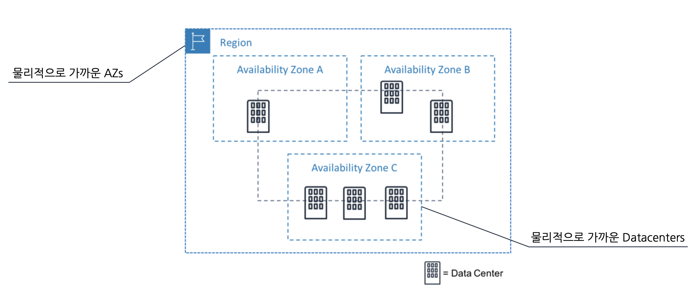
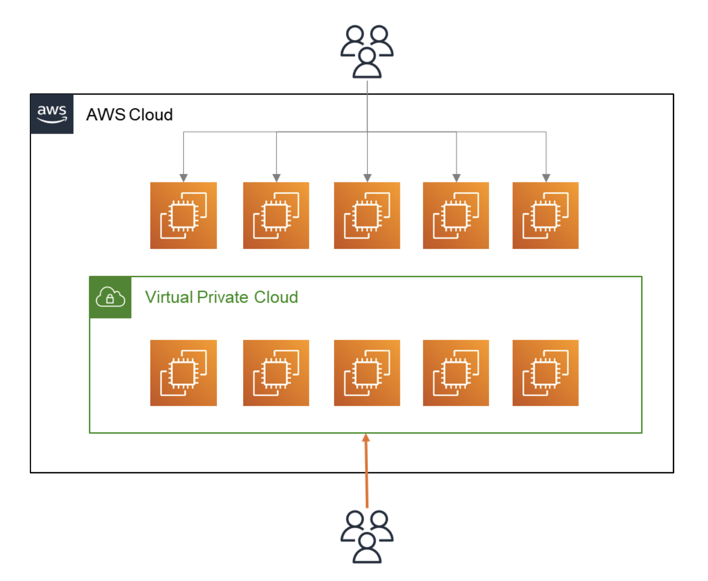
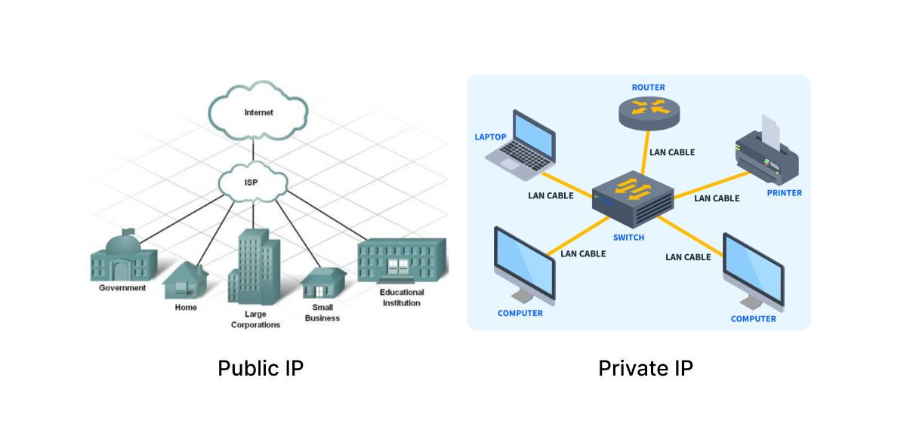
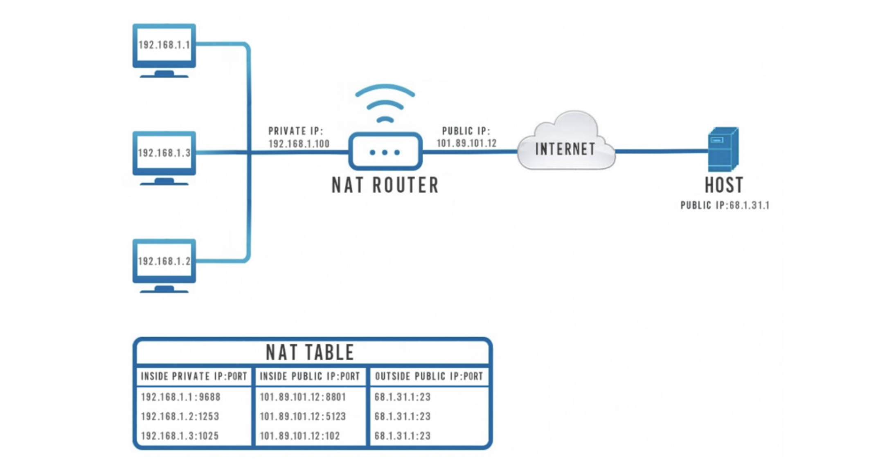

# [AWS] 네트워크 구성

  

   

ACC 3주차 \<네트워크 구성\> 세션 내용을 간단히 정리했다.  
Amazon EC2의 네트워킹에 대해 알아보고 인스턴스에 네트워크 설정을 적용하는 핸즈온을 진행해 보았는데, EC2를 사용해본 적이 없거나 네트워크 개념이 낯설다면 이해하기 조금 어려울 수 있을 것 같았다. 따라서 <a href="https://mingdodev.github.io/blog/cloud/2024-05-15-AWS-EC2/" target="_blank">4주차 EC2 세션</a> 을 참고하여 3주차 내용을 이해하면 더 좋을 것 같다!

# Region & AZ

- Region
    - 별도의 지리적 영역. 가까운 곳들을 묶어둔 개념이다.
    - 일반적으로 리전과 리전은 격리되어 있고, 각 리전에 리소스가 연결된다.
    - 각 리전은 가용 영역을 여러 개 가지고 있다.
- Availability zone
    - 가용 영역
    - 하나 이상의 데이터 센터로 구성되어있다.
    
    **e.g.** 가용 영역 코드 `us-east-1a`
    
- 33 Regions & 105 Azs

## Why?

- Availability
    - 가용성
- Scalability
    - 확장성
    - 일반적 스케일업보다 넓은 범위의 개념
    - 물리적으로 같은 지역이 아닌, 다른 지역의 서버를 늘린다.
    
    → 하나의 리전 + 다른 리전에 서버 추가
    
- Robust
    - 장애 발생 관리에 용이하다.
- Communication time
    - 서버와 물리적 거리를 줄이자!

→ 일종의 **QoS**(Quality of Service)

 

---

# VPC

- Virtual Private Cloud
- 논리적으로 할당된 가상의 네트워크 공간
- AWS에서 나만의 private cloud를 만들 수 있는 서비스
    - `private cloud`: 어떤 조직체 내에서만 접근 가능
    - `public cloud`: EC2와 같이 콘솔에서 누구나 접근 가능
- Region 당 최대 5개
- 각 Region에는 default VPC 존재
- 사설 <u>IP 주소</u>만 할당 가능
- 각 Region마다 존재하는 VPC는 <u>IP 대역</u>이 서로 달라야 한다.

→ IP에 관해 알아보자.

 

---

# Public IP & Private IP

ISP(공인됨)로부터 IP주소를 구입하여 사용 **vs** 물리적으로 가까운 범위의 통신 장치들끼리 연결 + (주소 자체는 무과금)

### Private IP Internet connection

- private IP는 직접 인터넷 연결이 안 된다.

→ **`NAT (Network Address Translation)`** 필요

 

- NAT는 private address를 public addresses로 변환하여 인터넷에 접속할 수 있도록 해준다.

 

---

# CIDR & Subnet