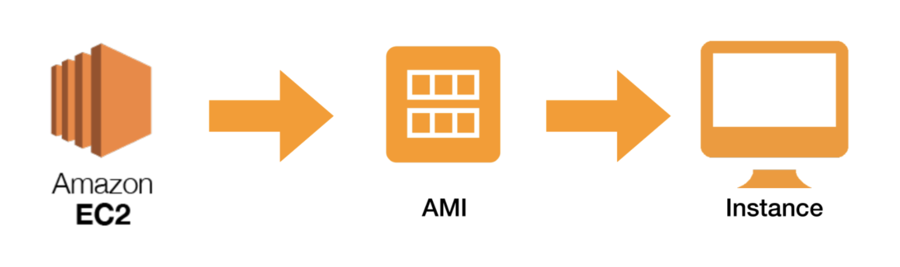
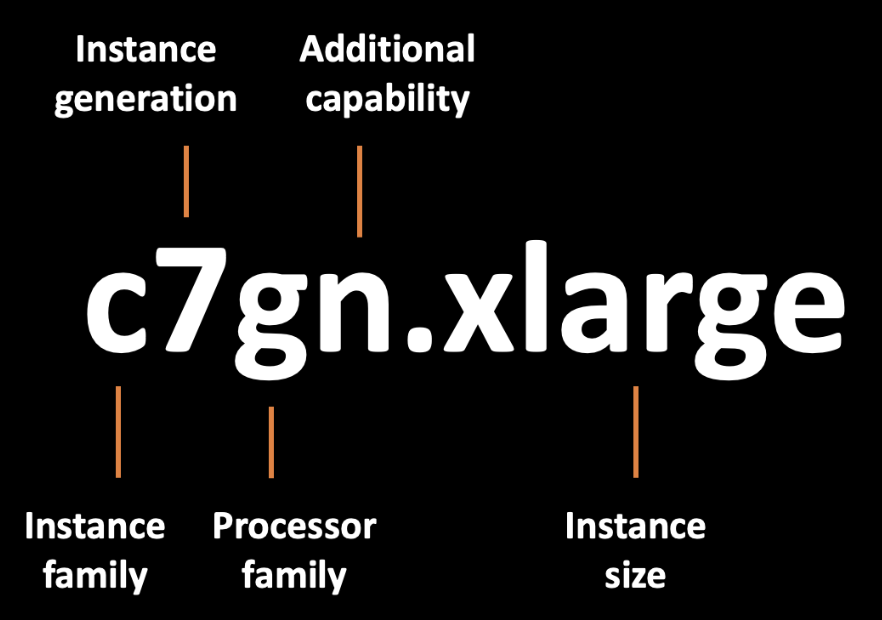
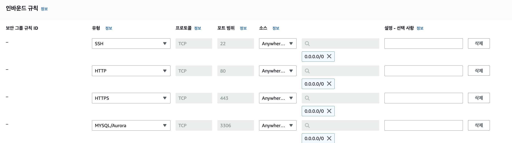
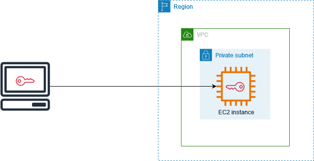
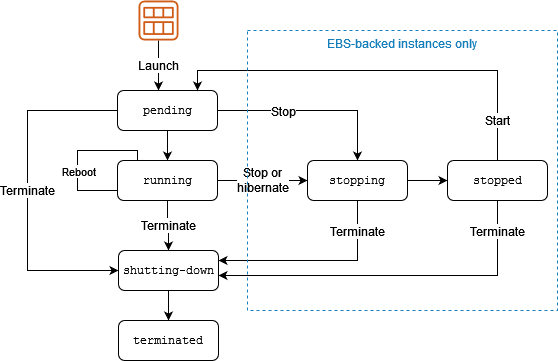
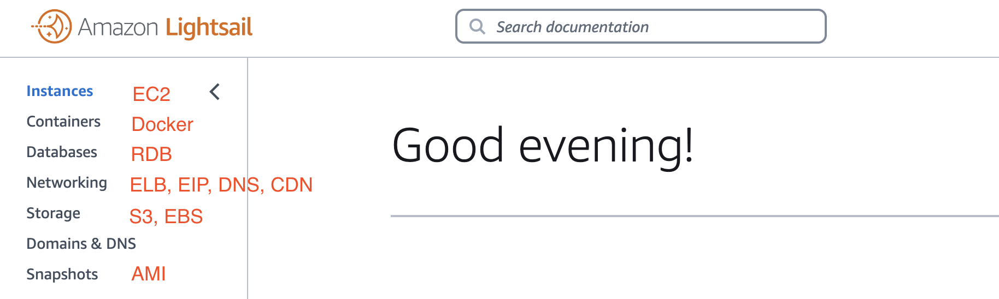
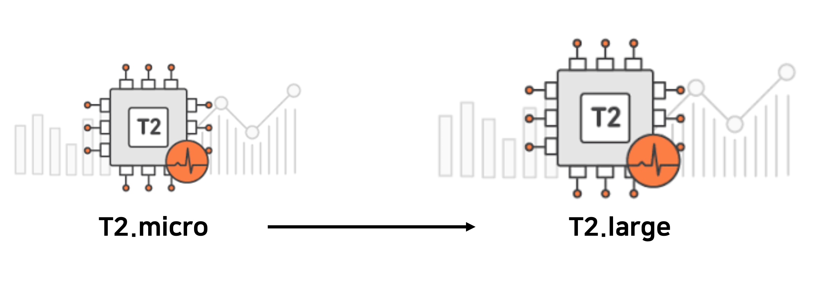
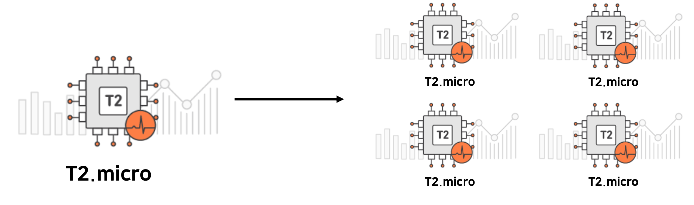
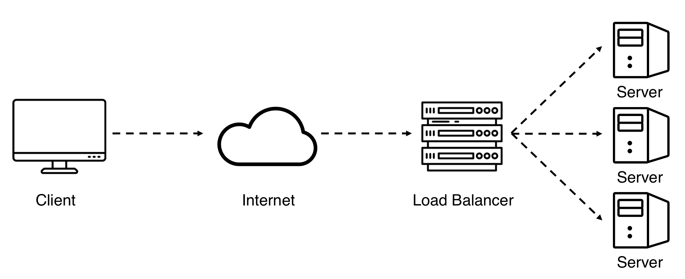

# [AWS] EC2

  

   

**AWS EC2** 서비스가 어떻게 동작하는지, 구성 요소들은 무엇이 있는지에 대해 공부해보자.  
또, 함께 사용할 수 있는 AWS 서비스들은 어떤 것이 있는지 알아보자!

 

---

# AWS EC2

> Elastic Compute Cloud
  
- AWS에서 제공하는 클라우드 컴퓨팅 서비스
- AWS를 통해 원격으로 제어할 수 있는 **가상의 컴퓨터**를 빌리는 것이다.
- Pay As You Go : 사용한 만큼 비용을 지불한다.
- 필요에 따라 성능과 용량을 조절할 수 있다.

## EC2 Architecture

Amazon Virtual Private Cloud(VPC) 내에 배포된 Amazon EC2 인스턴스의 기본 아키텍처이다.

 

- EC2 인스턴스는 해당 리전의 가용 영역(Availability Zone) 내에 있다.
- EC2 인스턴스는 보안 그룹의 보호를 받는다.
- Amazon EBS 볼륨이 인스턴스를 지원하고 있다.
- VPC는 인터넷 게이트웨이를 사용하여 인터넷과 통신한다.

## EC2 구성

### Instance

- 클라우드에서 사용하는 가상 서버
- CPU, 메모리, 그래픽 카드 등 연산을 위한 하드웨어

### Instance Type

- 인스턴스에 사용되는 호스트 컴퓨터 사양과 성능
- 인스턴스 유형 명명법은 다음과 같이 표기한다고 한다.
    - 제공하는 컴퓨팅, 메모리, 스토리지를 기준으로 같은 Instance Family로 분류한다.

### AMI

- Amazon Machine Image
- EC2 인스턴스를 실행하기 위한 정보를 담고 있는 이미지
    - 운영체제, 아키텍처 타입, 저장 공간 용량 등
    - 인스턴스용 사전 구성 템플릿이라고 이해하면 쉽다.
- 직접 만들 수도 있으며, 백업 용도로 사용한다.

### **Regions and Zones**

- 인스턴스와 Amazon EBS 볼륨 등 리소스에 대한 여러 물리적 위치

### Security Group

- 보안 그룹
- 가상의 방화벽 역할로, 들어오고 나가는 트래픽을 제어한다.

- **Security Groups Regulate**
    - Port들에 대한 접근
    - 승인된 IP 범위 (IPv4, IPv6)
    - 인바운드 네트워크 제어 (외부 → instance)
    - 아웃바운드 네트워크 제어 (instance → 외부)

 

EC2 인스턴스의 인바운드 규칙을 편집하여 필요한 포트들에 대한 접근을 허용할 수 있다.

### Key Pair

- Public Key + Private Key
- Amazon EC2 인스턴스에 연결할 때 사용하는 보안 자격 증명 키
- Private Key는 로컬 컴퓨터에 저장되고 Public Key는 인스턴스에 저장된다.

- Asymmetric Key (비대칭키)
    - 암호화와 복호화에 서로 다른 키를 사용한다.
    - 모든 사람이 접근 가능한 공개키로 암호화를, 사용자만 가지고 있는 개인키로 복호화를 수행한다.

 

### EBS Volume

- Elastic Block Store
- 영구 스토리지 볼륨
    - 클라우드에서 사용하는 가상 하드디스크
- EC2와 함께 사용한다.
- 특정 가용 영역에 위치하며, 가용 영역 내에 자동 복제된다.
- 단일 구성 요소 장애로부터 보호되고, 높은 고가용성을 제공한다.

**e.g.** 윈도우로 따지면 C 드라이브, D 드라이브가 각각 EBS 볼륨이 된다.

**cf. Instance store volume**이라는 임시 데이터용 스토리지 볼륨도 따로 있다.  
인스턴스 스토어에 저장된 데이터는 인스턴스 중지, 종료 또는 하드웨어 장애 발생 시 보존되지 않는다.

## EC2의 생명 주기

인스턴스를 시작, 중지, 재부팅, 종료함에 따라 인스턴스의 상태가 다양하게 전환된다.  
참고로 인스턴스가 `running` 상태일 때 인스턴스 사용 요금이 청구된다.

 

 

---

# Without EC2, With EC2

EC2에 비해 편리하게 인스턴스를 생성할 수 있는 **`lightsail`**,  
그리고 AWS EC2와 함께 활용할 수 있는 **`Auto Scaling`**, **`Load Balancer`**에 대해 알아보자.

## Amazon Lightsail

- 저렴한 비용으로 웹 서비스에 필요한 기능을 쉽게 관리할 수 있게 제공하는 VPS 서비스
- VPS
    - Virtual Private Server
    - 하나의 물리 서버를 여러 개의 가상 서버로 나누어 사용하는 것
- 인스턴스뿐만 아니라 컨테이너, 스토리지, 데이터베이스도 쉽게 생성할 수 있다.

 

lightsail에서 사용할 수 있는 서비스들과 독립적인 서비스

## Auto Scaling

컴퓨터의 성능을 높이기 위해서는 두 가지 방식 중 하나를 사용할 수 있다.

- Scale Up
    

    - CPU, RAM의 성능을 업그레이드하거나 개수를 추가한다.  
    **e.g.** 가상 CPU의 개수를 1개에서 2개로 늘린다.
- Sclae Out
    

    - 컴퓨터 자체를 여러 대 추가한다.

### AWS Auto Scaling

- CPU, 메모리, 디스크, 네트워크 트래픽과 같은 시스템 자원들의 메트릭(Metric)값을 모니터링하여 서버 규모를 자동으로 조절하는 서비스
- EC2 인스턴스 개수 보장
    - 그룹의 최대, 최소 인스턴스 개수를 관리 (인스턴스 삭제, 추가)
- 다양한 스케일링 정책 적용 가능
    **e.g.** CPU 부하에 따라 인스턴스 개수를 증가시킨다
- 가용 영역에 인스턴스가 골고루 분산되도록 인스턴스 분배

## Load Balancer

 

- 클라이언트와 서버 사이에 위치하여, 서버에 가해지는 트래픽을 여러 대의 서버에 균등하게 분배한다.
- Scalability
    - 트래픽을 분산시켜 성능을 최적화
- Availability
    - 서버 오류를 방지하여 안정성을 보장
- Security
    - 디도스 공격에 대한 보호와 데이터 암호화를 보장

### Elastic Load Balancer

- 특징
    - 트래픽 자동 분산 처리
    - Health check와 Monitoring 제공
    - 애플리케이션에 사용 가능한 정적 DNS를 제공

- 구성
    - Listener
        - 요청을 받아 검사하고 타겟으로 전달
    - Rule
        - 리스너와 타겟 그룹 사이의 트래픽 분배를 위한 라우팅 규칙
    - Target Group
        - 부하 분산 대상들의 모임

- 종류
    - Application Load Balancer
        - 트래픽을 모니터링하여 라우팅
        - 이미지 서버와 웹 서버와 같이, 기능에 따른 서버로 분리되어 있다.
    - Network Load Balancer
        - TCP 기반 빠른 트래픽 분산
        - Elastic IP 할당 가능

  

 &nbsp; 📁 참고 자료

- AWS-Documentation
- ACC KHU 4주차 세션

