# [AWS] Serverless

  

   

<strong>Serverless란!</strong> 서버가 없다는 뜻이 아니다.  

개발자가 서버를 직접 관리할 필요가 없는 아키텍처를 **Serverless**라고 한다. 애플리케이션 코드 실행, 데이터 관리 등을 위한 서버 인프라를 AWS와 같은 클라우드 제공업체가 관리해주는 것이다. 서버에 대해 일절 관리할 필요가 없기 때문에, 개발자는 비즈니스 로직에 더욱 집중할 수 있다. 또한 가장 특징적인 점은 **서버를 사용한 만큼만 비용을 지불한다**는 것이다. 사용량에 따라 자원이 할당되기 때문에, 자원 관리에 대한 부담이 없을 뿐더러 사용하지 않을 때에는 비용을 지불할 필요가 없다. 예를 들어, 우리가 EC2로 서비스를 배포하고 서버를 켜두었다면 비록 사용자가 0명일지라도 요금이 청구되는 마음 아픈 상황을 겪을 수도 있다. 하지만 서버리스 아키텍처에서는 이런 일이 일어나지 않는다!

## History of Cloud

Serverless의 개념은 어떻게 도입된 것일까? 지금까지 인프라 관리가 어떤 방식으로 이뤄져왔는지 간단하게 흐름을 살펴보자.  
 

 

AWS 출시 이래로, 기업의 IT 환경이 **데이터 센터**에서 **`IaaS(Infrastructure as a Service)`**로 변화하는 흐름이 시작되었다.  
AWS는 기본적으로 IaaS이다. IaaS에서는 API 호출이나 AWS 콘솔을 통해 인프라를 띄우고 프로비저닝 IT 인프라를 생성하고 설정 할 수 있다. 이로서 개발자는 하드웨어 관리에 대한 부담을 덜었다. 하드웨어를 구비하여 직접 서버를 구축 온 프레미스 하는 대신 환경이 잘 세팅된 컴퓨터 클라우드 를 빌려 인프라를 보다 손쉽게 구축할 수 있게 되었다.

IaaS 이후 AWS는 **`PaaS(Platform as a Service)`** e.g. Elastic Beanstalk 를 출시했다. PaaS에서는 애플리케이션을 업로드하기만 하면 AWS가 애플리케이션을 기반으로 인프라를 생성해준다. 그러나 이때까지는 프로비저닝된 서버, 운영 체제에 대해서는 유지 관리가 여전히 필요했다.

PaaS 이후 AWS는, 이런 고민들을 해결할 수 있는 **Serverless 인프라**를 출시하게 된다. 서버리스 인프라를 사용하면 컨테이너가 기본 운영체제와 서버 확장까지 관리한다. 즉 IaaS 및 PaaS에 대해 개발자가 신경 쓸 부분이 사라진 것이다. 또한 특정 코드를 실행할 때 필요한 만큼의 자원만 동적으로 할당시켜주기 때문에 소프트웨어 관리에 대한 부담도 감소했다고 볼 수 있다.  
인프라 프로비저닝 측면에서 완전한 혁명이다!

### Serverless의 특징

- `Auto Scaling` : 사용량에 따라 자원이 할당
- 사용한 만큼 값을 지불
- 높은 가용성과 보안 수준

## Serverless Model

서버리스는 크게 BaaS와 FaaS로 구분된다.

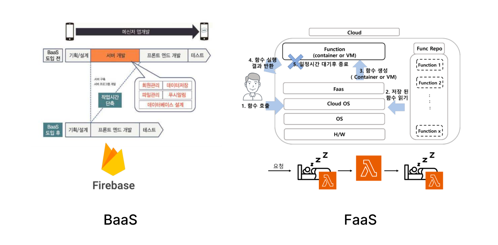

### BaaS(Backend as a Service)

- 백엔드 기능들, 즉 애플리케이션 개발에 필요한 다양한 기능들을 API로 제공하여 쉽고 빠르게 개발할 수 있도록 한다.
    - 회원 관리, 데이터 저장, 파일 시스템 등
- 비용은 API를 사용한 만큼 지불한다.
- e.g. 클라우드 데이터베이스 서비스 Firebase, 클라우드 인증 서비스 Auth0 등

### FaaS(Function as a Service)

- 사용자가 쓸 기능들을 함수 단위로 나누어 구현하고 서비스로 제공한다.
- 애플리케이션을 여러 개의 함수로 만들어 컴퓨팅 자원에 함수를 등록한 후, 함수가 호출된 횟수에 따라 비용을 지불한다.
- 프로그램 내부에서 FaaS 함수를 호출하는 코드를 삽입하고 프로그램을 실행하면, FaaS에게 Rest API 형식의 HTTP 요청이 전달된다. FaaS는 저장소로부터 해당 함수를 읽어와 함수가 포함된 컨테이너나 가상 머신을 생성하고, 그걸로 함수를 실행한 뒤 결과를 반환하거나 요청한 동작을 수행하는 원리이다.
- e.g. AWS lambda

 

---

# AWS lambda

AWS가 제공하는 서버리스 서비스로는 `AWS lambda`가 있다.

 
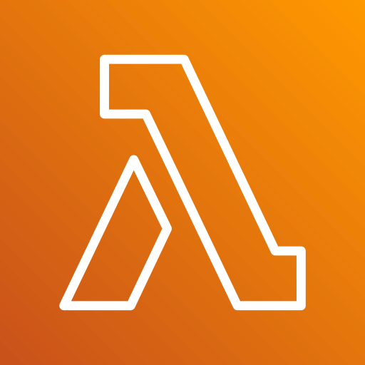
 

- Function as a service **FaaS**
    - 함수 단위로 애플리케이션을 올린다.
    - 이벤트가 발생했을 때 함수를 실행하는 개념이다.
- Serverless Application
    - 프로비저닝 관리할 필요 없이 코드 실행 가능
    - 실행한 만큼 과금
    - 사용량에 따라 자동으로 확장
- 에러 발생 시 자동 Failure Handling
- 독립적인 보안

 
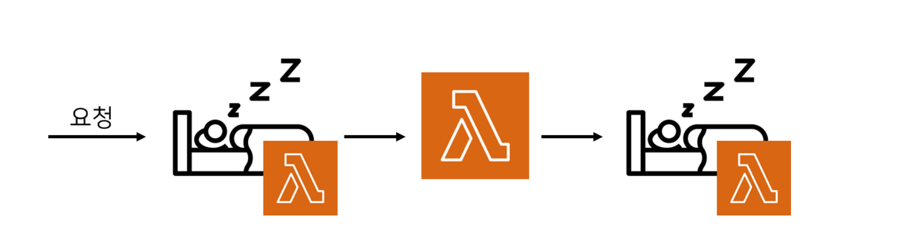
 

사용한 만큼만 비용이 나갈 수 있는 이유를 한 마디로 설명하자면... 람다가 평소에는 자고있기 때문이다. 

### 장점

- 비용 절감
    - 순수한 코드 실행에 따른 요금만이 발생한다.
- 여러 언어 지원
    - Java, Go, JS, Ruby, Python
- 완전한 자동화가 이루어진다.
- 분석과 **모니터링 기능**
    - 함수가 실행되면 AWS CloudWatch로 로그가 전송되어 lambda 함수의 성능과 사용량을 모니터링할 수 있다.

### 단점

- Cold Start
    - 서버리스의 함수들은 요청이 없을 때에는 수면 상태이다.
    따라서, 요청이 들어올 때마다 함수들을 깨우고 실행해야 하므로 아무래도 상시 대기 중인 것에 비해 지연이 발생한다.
    - 빠른 속도가 요구되는 서비스, 실시간 서비스에 적합하지 않다.
- 긴 시간을 요하는 작업에 불리하다.
    - 함수가 호출될 때마다 사용할 수 있는 메모리와 시간이 제한적이기 때문에, 큰 기능을 최대한 작게 나누어 구현해야 한다.
- Stateless
    - 호출될 때만 깨어있는 함수들은 함수 실행 전후 상태에 대한 정보가 없는 무상태이다.
    따라서 데이터나 변수를 공유할 수 없다. local storage를 사용할 수 없다.
- 클라우드 제공 플랫폼에 종속되어 있음
    - 클라우드 서비스가 모든 걸 해주는 만큼 해당 플랫폼에 강하게 종속될 수밖에 없다.
    - IaaS나 PaaS같은 경우에는 AWS에서 Google Cloud Platform을 플랫폼을 바꿔도 큰 문제가 되지 않는다.
    - 그러나 서버리스는 애플리케이션의 구조 자체를 변경해야 하기 때문에 플랫폼을 변경하기 어렵다.

## Amazon API Gateway

 
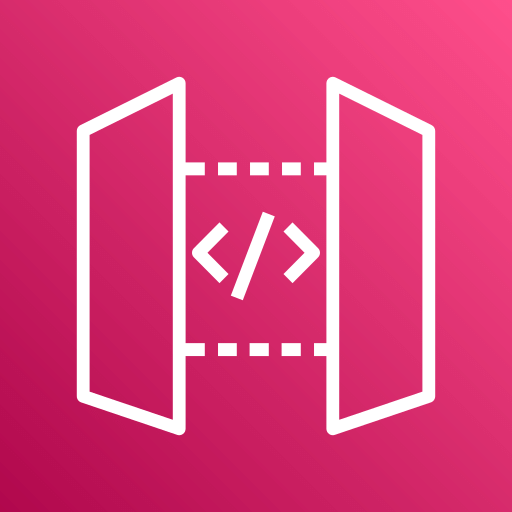
 

- 개발자가 쉽게 API를 발행할 수 있도록 도와주는 서비스
- Serverless 애플리케이션을 구축할 때 사용한다.
- **백엔드 서비스와 API 사용자 사이**에 위치하여
API 엔드포인트에 대한 HTTP 요청을 처리하고 올바른 백엔드로 라우팅해준다.
- HTTP API, REST API, WebSocket API 유형을 지원한다.
- API Gateway는 MSA(MicroService Architecture) 구축에 필수로 사용된다고 한다.

## Lambda architecture

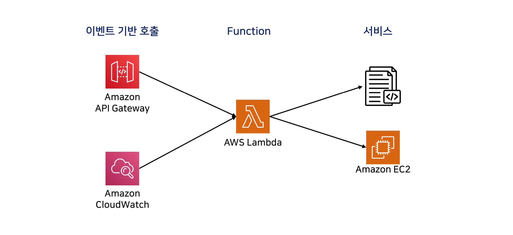

특정 이벤트가 발생했을 때 Lambda가 실행되어 코드에 작성해둔 로직을 수행한다.   

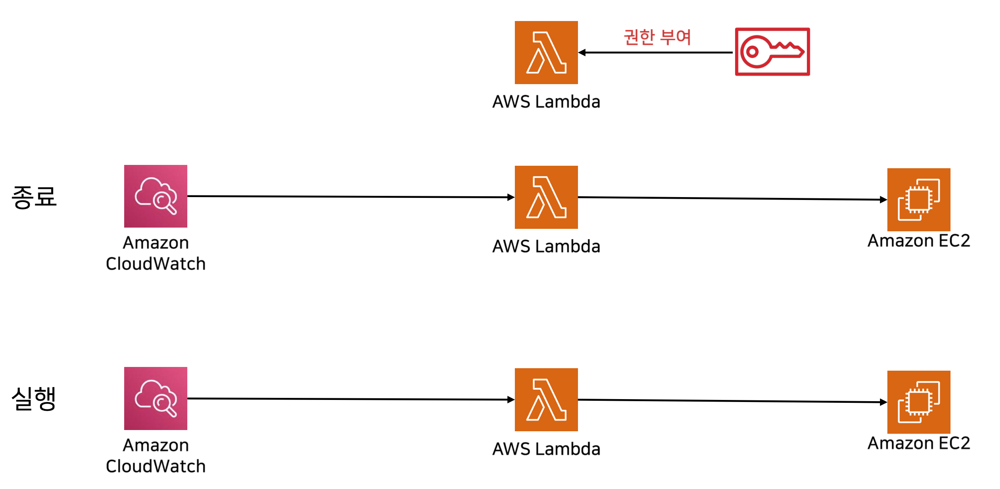
 

CloudWatch가 사용량을 관찰한 뒤, 권한이 부여된 Lambda가 EC2를 종료하거나 실행할 수 있도록 한다.  
→ 사용하지 않을 때는 인스턴스를 종료하여 비용이 나가지 않도록 할 수 있는 것

## Lambda vs EC2

- AWS Lambda
    - 서버 관리 부담을 줄이고 싶은 경우
    - 특정 시간/기간만 사용하는 경우

- Amazon EC2
    - 상태 정보를 유지할 때 (Stateful)
    - 대용량 데이터 처리 및 고성능 컴퓨팅 작업일 때

 

---

# Amazon API Gateway + Lambda 사용하기

API마다 Lambda 함수를 생성하여, 호출했을 때 특정 코드가 실행되도록 하는 간단한 핸즈온을 진행해 보았다.

### 1. Lambda 함수 생성하기

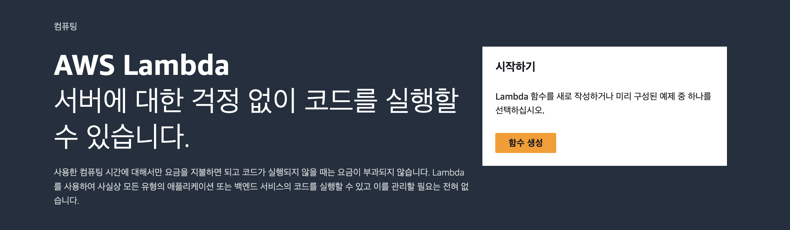
 
AWS Lambda 서비스에서 python 함수를 하나 만들어보자.

 
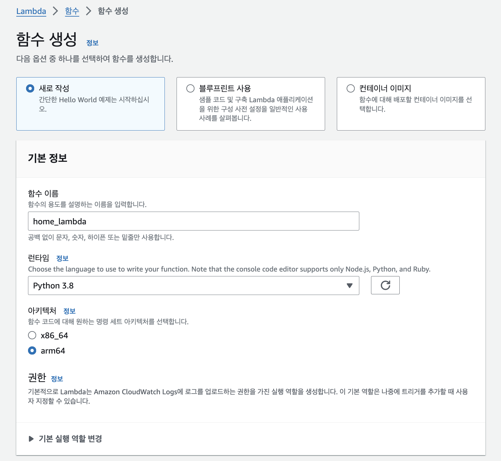
 
python 3.8로 작성한 함수를 실행할 Lambda 함수를 생성해주었다.  
아키텍처는 CPU 아키텍처를 말한다. x86_64는 Intel 기반이고, 내 Mac은 arm64를 사용하고 있어서 똑같이 설정해보았다. 찾아보니 가격 대비 성능이 좋다고 한다.

 
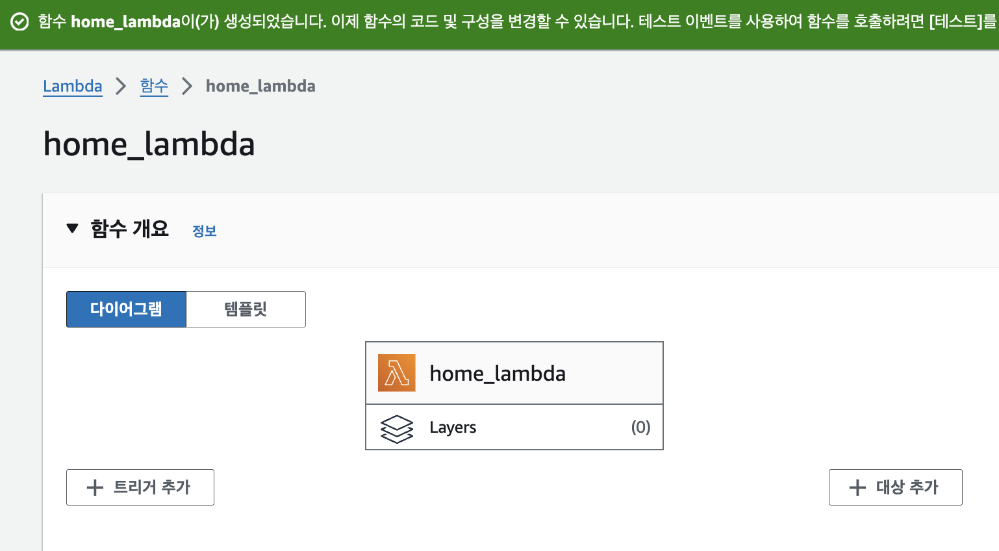
 
생성 완료! 이제 아래에서 코드 소스를 확인하고 변경해보자.

 
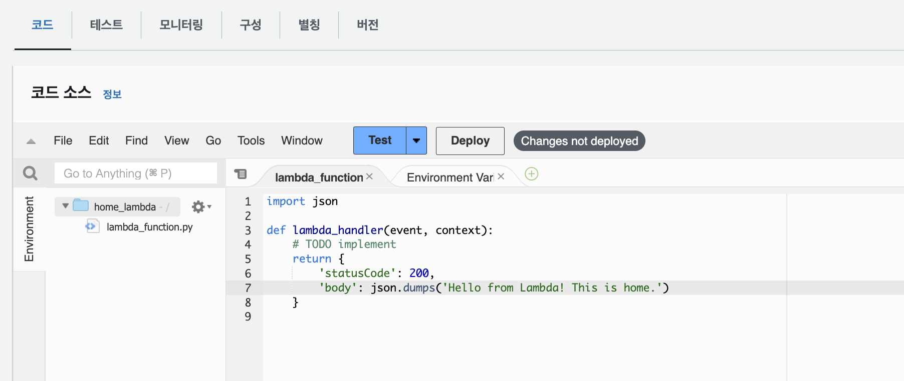
 

**`lambda_handler`** 함수와 parameter를 살펴보면 event에 따라 어떤 동작이 수행될지 예상할 수 있다. **`event`**는 lambda 함수가 처리해야 할 데이터 input으로 JSON 형태이며, **`context`**는 lambda 런타임이 전달하는 컨텍스트 객체로 함수 및 런타임 정보 등을 포함하고 있다.  

나는 body에 JSON 문자열로 들어가는 부분을 변경해보았다. 코드 변경이 있다면 Deploy 버튼 옆에 'Changes not deployed'라고 뜰 텐데, 이때 **Deploy** 버튼을 눌러 변경한 코드를 배포해줘야 한다. 배포가 완료되었으면 **Test** 버튼을 눌러 이벤트를 구성해보자.

 
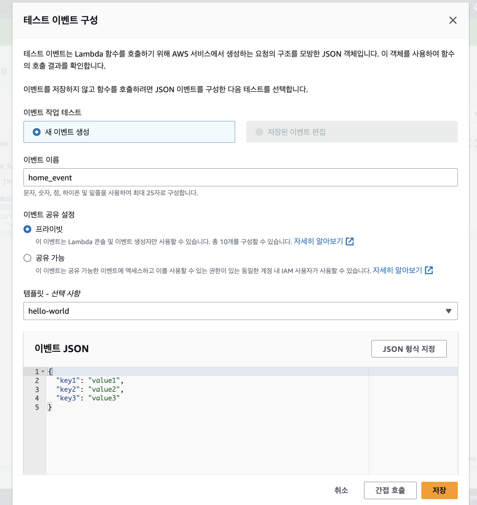
 

이벤트 이름을 지정하여 새로운 이벤트를 생성해준다. 이벤트 JSON은 아까 언급한 데이터 input의 형식이다. 지금은 받아온 JSON 데이터를 활용하지는 않을 것이라 이대로 생성해준다.

 
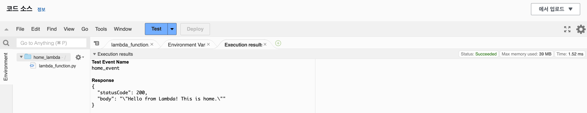
 

**Test** 버튼을 다시 눌러 이 이벤트가 발생했을 때에 대한 테스트를 수행한다. 다음과 같이 실행 결과를 확인할 수 있다.

 

### 2. API 생성하고 API Gateway로 연결하기

이제 API Gateway로 API를 생성해 백엔드 서비스와 통신할 수 있도록 해보자. 콘솔에서 API Gateway 서비스로 접속한다.

 
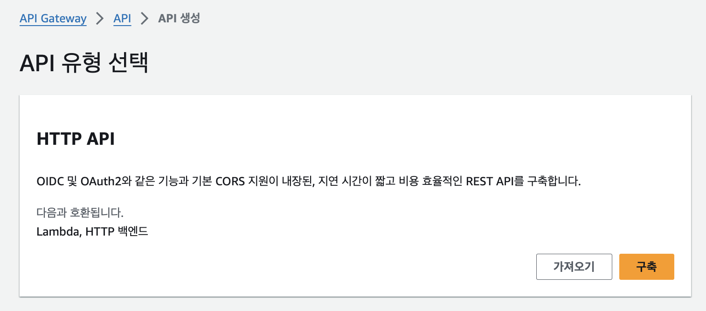

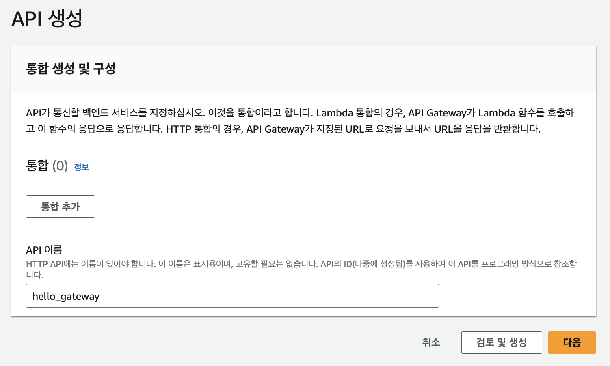
 

복잡한 기능이 필요하지 않으므로 HTTP API를 생성하여 람다 함수와 연결할 것이다. API 이름만 지정해주고 선택사항은 패스한 뒤 API를 만들어준다.

 
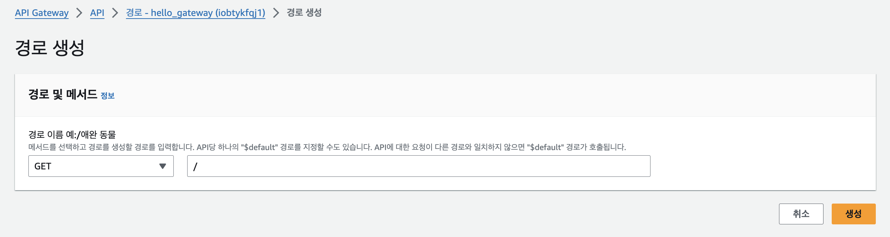
 

생성된 API에 경로와 메서드를 추가해주자. 우선 home 경로로 설정할 GET method의 root url을 추가해주었다.

 
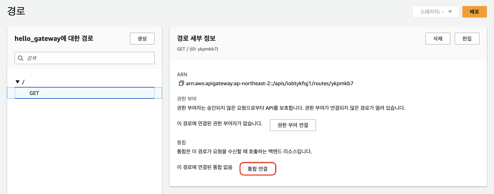
 

이제 이 경로로 요청이 들어오면 호출할 백엔드를 경로에 연결해준다. 이 서비스에서 백엔드 리소스는 람다함수이다. **통합 연결**을 눌러 연결해보자.

 
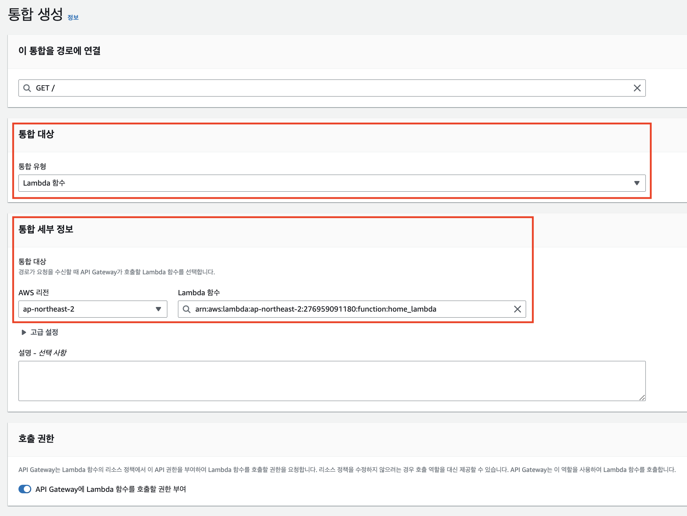
 

통합 대상을 Lamda 함수로 설정하고, 이 경로를 통해 실행할 코드가 담긴 람다 함수를 지정해준다. home_lambda와 연결해주었다.

 
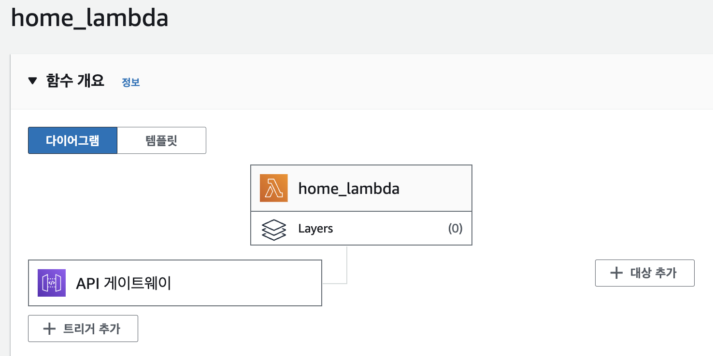
 

다시 Lambda 서비스로 돌아와 확인해보면 트리거 목록에 API 게이트웨이가 추가된 것을 확인할 수 있다.

 
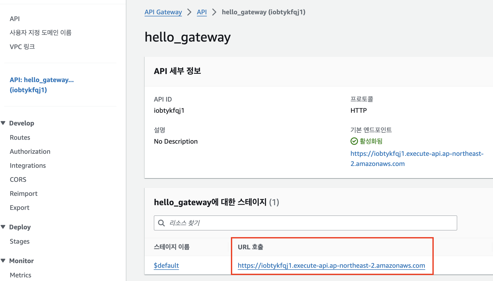
 

이제 직접 url을 호출해볼텐데, 만든 게이트웨이의 세부정보 아래 스테이지 정보에서 URL을 획득하여 요청을 보내보자!

 
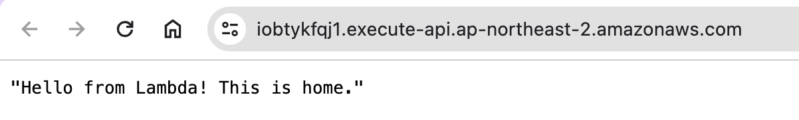

쨘

아까 작성한 코드에서 받아온 문자열을 잘 출력하고 있다.

 
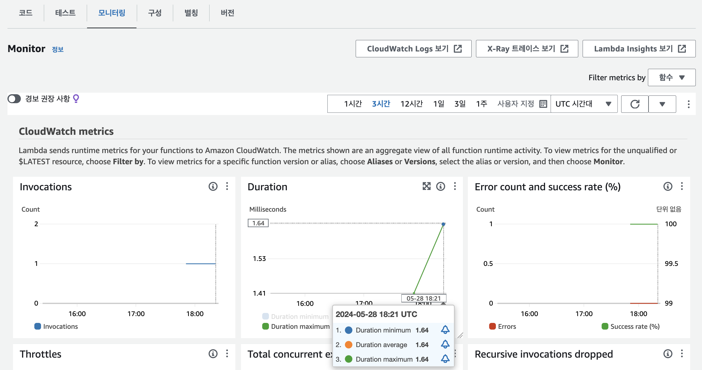
 

추가로, url 호출이 일어난 후 람다 함수의 모니터링 탭에 들어가보면 다음과 같은 화면을 확인할 수 있다. **CloudWatch**가 람다 함수를 모니터링하여 측정 정보를 제공하고 있다.

 

### 3. 경로 추가해 보기

한 번 더 ~❗️ 이번엔 `/hello` 경로로 요청을 보내고 'Hello from Lambda!'가 담긴 응답을 받으려면 어떻게 해야 할까?  

새로운 코드가 담긴 **새로운 람다 함수**를 만들어주어야 한다.  
이 흐름이 자연스럽게 진행된다면 Lambda의 동작에 대해 잘 이해했다고 할 수 있겠다.  
전체 애플케이션 관점에서 생각해보면, 이런 방식으로 코드가 잘게 쪼개지는 것이다. 

 
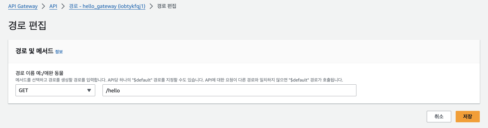

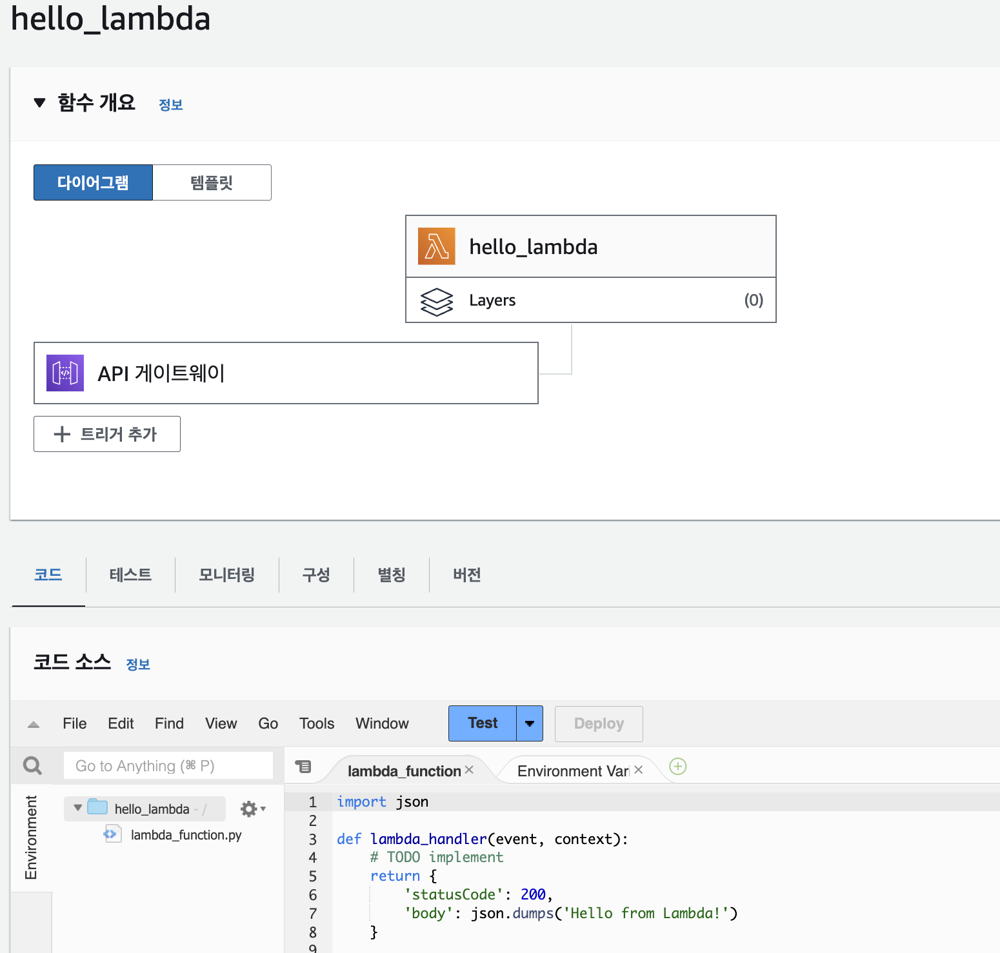
 

똑같은 과정을 수행해주고 요청 경로와 응답 데이터만 알맞게 변경해준다.

 
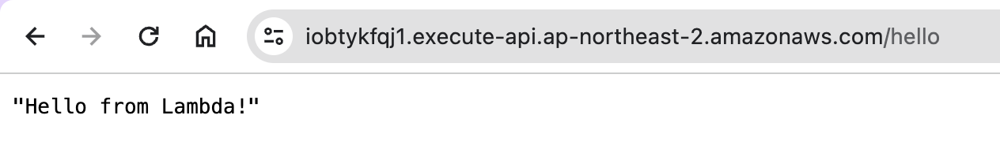

쨘2

root url에 hello를 붙여주면 원하는 문자열이 출력되는 것을 확인할 수 있다.

  

이렇게 Serverless의 개념을 알아보고, AWS의 서버리스 서비스 Lambda를 사용하여 동작 방식을 이해해 보았다.  
종강하고 서버리스 아키텍처로 애플리케이션을 배포할 기회를 만들어 EC2 서버 관리에 비해 편리한 점이 무엇인지 느껴봐야겠다!!

  

 &nbsp; 📁 참고 자료

- ACC KHU 8주차 세션
- AWS-Documentation
- <a href="https://www.einfochips.com/blog/serverless-architecture-the-future-of-software-architecture/" target="_blank">Serverless Architecture: The Future of Software Architecture</a>
- <a href="https://inpa.tistory.com/entry/WEB-%F0%9F%8C%90-%EC%84%9C%EB%B2%84%EB%A6%AC%EC%8A%A4ServerLess-%EA%B0%9C%EB%85%90-%F0%9F%92%AF-%EC%B4%9D%EC%A0%95%EB%A6%AC-BaaS-FaaS" target="_blank">서버리스(ServerLess) 개념 정리 (BaaS / FaaS)</a>

