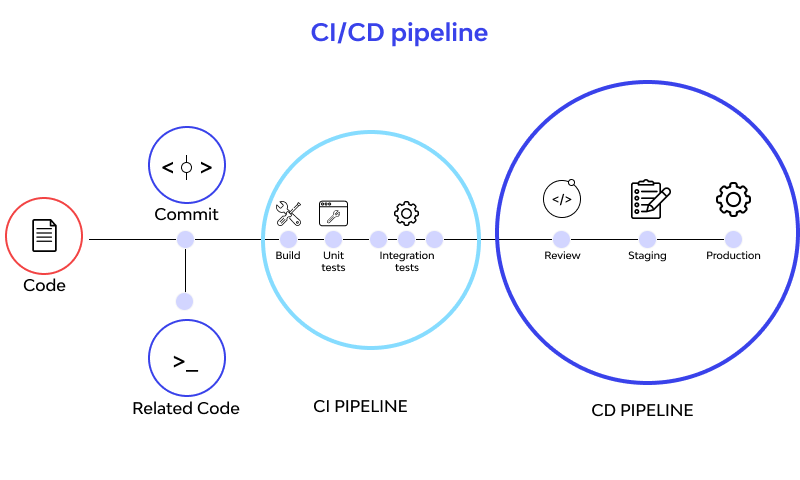

# [DevOps] CI/CD란? + 자동화 툴 비교

한번 배포에 성공하더라도 변경 사항이 생길 때마다 개발자가 여러 가지 작업을 직접 해줘야 하니 몹시 번거로웠다. 코드 저장소의 내용을 변경하는 것만으로 알아서 배포가 이루어질 수 있도록 자동화 도구를 사용해보고자 CI/CD에 관해 찾아보게 되었다. 마침 ACC 초반 세션 중 제대로 정리가 안 되어있는 부분을 발견해서 복습할 겸 추가 공부를 해보려고 한다.

 

---

# DevOps

- Development + Operation
- 개발담당자와 운영담당자가 협력하는 개발 방법론
- 2007년에서 2008년 즈음 IT 운영 및 소프트웨어 개발 커뮤니티 사이에서 기존의 소프트웨어 개발 모델에 문제가 있다는 우려를 제기하기 시작했다. 코드를 작성하는 부서와 코드를 배포하고 지원하는 부서가 분리되어 있어 각자의 목표와 성과에만 신경쓰고 있다는 것이 문제였다.
- 2000년대 초 공동작업을 중요시하는 애자일 방법론이 널리 채택되며 개발팀과 운영팀이 서로 동떨어지는 문제가 더욱 부각된 것으로 보인다. 소프트웨어 제품을 배포하고 관리하는 운영 팀의 프로세스와 요구 사항이 배제되는 경향이 있었고, 이를 해결하여 전체 조직의 역량을 향상시키기 위해 DevOps 방법론을 도입하게 되었다.
- 결론적으로는 서비스를 더 빠르게 제공하고 고객을 더 잘 지원할 수 있는 새로운 개발 모델이라고 할 수 있다.

 

---

# CI/CD

- 지속적 통합 + 지속적 배포

https://blog.openreplay.com/what-is-a-ci-cd-pipeline/

**CI**는 코드의 변경사항을 테스트하여 검증한 뒤 병합하는 과정, **CD**는 병합한 코드를 프로덕션 환경으로 배포하는 과정으로 볼 수 있다. 컴퓨터 과학에서 파이프라인은 서로 연결된 데이터 처리 단계들을 말하는데, 위와 같은 코드 변경의 연속적인 통합, 테스트, 배포 단계들을 **CI/CD 파이프라인**이라고 부른다.

## CI (Continuous Integration)

- 지속적 통합
- **`Build → Test → Merge`** 과정의 자동화
- 소스 코드 충돌을 방지할 수 있다.
- 버그를 신속하게 찾아서 해결할 수 있게 된다.  
    →  코드가 통합되기 전 테스트를 거치도록 파이프라인을 구성해두면 충돌, 버그 등 작은 단위의 문제들을 더 큰 문제가 생기기 전에 발견하고 해결할 수 있게 된다.

## CD (Continuous Delivery / Deployment)

- 지속적 배포
- Production 레벨까지 **`Deploy`** 하는 과정의 자동화
    - 공유 레포지토리부터 고객이 사용할 수 있는 프로덕션 환경 수준까지 자동으로 Release
- 코드를 release하는 속도가 빨라지는 것 자체로 다양한 이득이 생긴다.

 

---

# CI/CD Pipeline 구축을 위한 툴

 

 

CI/CD의 전체적인 프로세스는 크게 **`Source → Build → Test → Deploy`**로 구분할 수 있다. 여러 가지 도구로 수행되는 이 과정을 자동화할 수 있는 CI/CD 툴 중 Jenkins, Github Actions, 그리고 AWS Code Series를 간단히 비교해보자. 

## Jenkins

 

  

- 자체 서버를 사용한다.
    - 서버가 분리되므로 독립성을 지니며 보안을 위한 자체 설정이 가능하다.
    - 추가 리소스를 사용함에 따라 추가 비용이 발생 한다.
- 설정, 관리해야 할 것이 많아 어려운 편이다. 하지만 반대로 생각해보면 커스터마이징에 용이하다는 장점을 지닌다.
- 사용자가 많아 플러그인이 다수 존재하며 레퍼런스도 충분하다.
- 대규모 프로젝트에 사용하기 좋다.

## Github Actions

- Workflows, Events, Jobs, Steps, Actions, Runners
- Github 사용자에게 익숙하다.
- 초기 설정이 쉽다. 반면 커스터마이징에 한계가 있다.
- public repository일 경우 무료로 사용할 수 있다. 그러나 무료로 활용할 수 있는 범위 제한이 있다.

## AWS code series

 

 

- AWS에서 호스팅하는 완전 관리형 서비스들을 통틀어 말한다.
- 서버리스로 구축 가능하다.
    - jenkins 등 다른 툴과 함께 구축할 수도 있다.

  

 &nbsp; 📁 참고 자료

- ACC KHU 2주차 세션
- AWS-Documentation
- <a href="https://www.atlassian.com/ko/devops/what-is-devops/history-of-devops" target="_blank">Atlassian: History of Devops</a>
- 

