# [Docker] Spring Boot 프로젝트 배포하기

<br><br>
<center></center>
<br><br><br>

돌아보니 스스로 충분히 고민해서 서비스를 배포해본 적이 없다고 느껴졌다. 또, 배포를 위한 여러 가지 툴이 있는데 경험이 부족하니 언제 이걸 쓰고 저걸 쓰는지 잘 와닿지 않았다. 그래서 공부 + 기록 목적으로 이것저것 써보고 정리해보려고 한다.

<br>

> 해당 프로젝트는 `Spring Boot 3.2.3` , `java 17` 을 사용하였다.  
> 로컬 개발 환경은 `macOS/arm64`, 배포 환경은 `Ubuntu 24.04 LTS`로 진행하였다.

<br>

## ❗️ To do: 프로젝트 배포하기

- 도커 컨테이너
- EC2 인스턴스
- 데이터베이스

크게 신경써야 할 포인트를 세 가지로 두고 어떤 순서로 일을 진행해야 할지 생각해보았다.

<br>

우선 배포할 프로젝트는 PostgreSQL, Redis를 이용한다. 여기서 고민했던 것이 `데이터베이스를 어디에 두는 것이 적절한가?` 였다.

<center>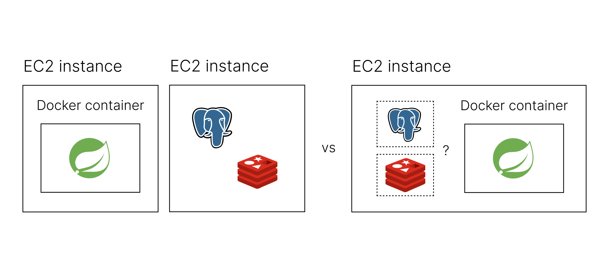</center>

지금까지 진행했던 프로젝트는 데이터베이스 서버를 애플리케이션 서버와 분리해서 관리했었다. 실제로 사용하는 서비스라면 데이터베이스와 애플리케이션을 분리하는 게 맞다고 생각했다. 하지만 지금은 보존할 중요한 데이터가 없고, 각 서버가 리소스를 많이 사용하지도 않기 때문에 하나의 인스턴스에서 동작하도록 만들었다.

<br>

❗️ <a href="https://hyeon9mak.github.io/why-does-not-run-database-on-docker/" target="_blank">도커 위에 데이터베이스를 운영하지 않는 이유</a>

<br>

또 한 가지의 고민은 하나의 인스턴스에서 동작한다면 `데이터베이스도 컨테이너 위에서 운영히는 것이 좋은가?` 였는데, 위 글을 읽어보고 궁금증을 해결하였다. 도커를 컨테이너 위에서 돌리면 데이터베이스 이전 과정에서 데이터의 손실이 일어날 수 있다고 한다. 또한 EC2를 로컬 컴퓨터와 동등하게 놓고 비교해보았을 때, 데이터베이스가 굳이 컨테이너에 들어갈 필요가 없다는 생각이 들기도 했다.

<br><center>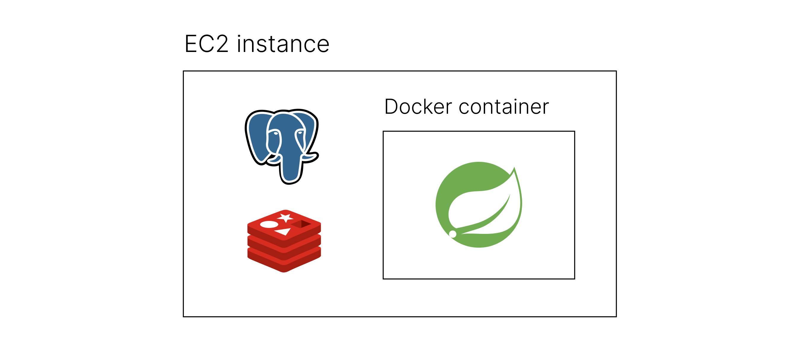</center><br>

따라서 다음과 같은 구조로 애플리케이션을 배포하기로 했다.

<br>

---

# 도커 이미지 준비하기

도커 파일을 작성한 뒤 스프링 부트 애플리케이션을 배포하기 위한 이미지를 생성해보자.

## 로컬의 jar 파일로 이미지 생성

```bash

    # gradlew 파일의 실행 권한 부여 명령어
    chmod +x gradlew

    # Jar 실행 파일 생성
    ./gradlew clean bootJar

```

- Java 애플리케이션을 배포하기 위한 압축 파일인 Jar 파일을 생성한다.

<br>


```docker

    # Dockerfile

    # OpenJDK 17 기반 이미지 사용
    FROM openjdk:17

    # 해당 위치 jar 형식의 파일을 JAR_FILE 변수로 정의
    ARG JAR_FILE=build/libs/*.jar

    # JAR_FILE을 app.jar라는 이름으로 도커 이미지의 루트 디렉토리에 복사
    COPY ${JAR_FILE} app.jar

    # 컨테이너가 시작될 때 실행할 명령어
    ENTRYPOINT ["java", "-jar", "app.jar"]

```

- 도커 파일을 작성해준다.

<br>

```bash

    docker build --platform linux/amd64 -t mingdodev/gillait:0.1 .

```

- 도커 파일이 있는 위치에서 위 명령어를 실행하여 도커 이미지를 생성한다.
- 도커는 현재 시스템의 아키텍처에 기반하여 이미지를 생성하기 때문에, EC2 Ubuntu 인스턴스 <span style="color:#737373; font-size:14px; font-weight:300;"> amd64 (x86_64) </span>에서 사용하기 위해 `linux/amd64` 플랫폼 옵션을 지정해야 한다.
    - 그렇지 않으면 내 맥북 아키텍처 <span style="color:#737373; font-size:14px; font-weight:300;"> arm64 </span>를 따라간다.
- `-t` 옵션으로 태그를 지정했다.
    - 지정하지 않으면 `latest`가 기본값으로 설정되지만, 태그를 지정한 경우에는 태그를 명시하여 명령어를 작성해야 한다.


## 도커 허브에 이미지 올리기

```bash

    docker push username/repositoryname:tag

```

원격 컴퓨터(EC2 인스턴스)에서 이미지를 pull 받아 컨테이너를 생성할 수 있도록 도커 허브에 방금 생성한 이미지를 push 해준다.

<br>

<center>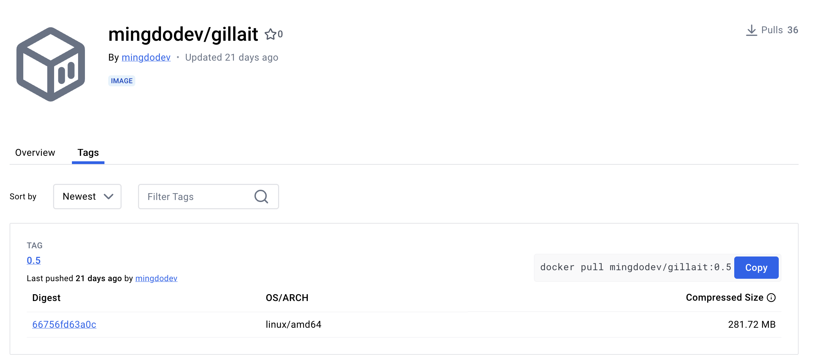</center><br>

도커 허브에 검색해보면 이렇게 내가 올린 이미지를 확인할 수 있다.

<br>

---

# EC2 인스턴스 생성하고 설정하기

이제 AWS를 통해 EC2 인스턴스를 생성하고, 스프링 부트 애플리케이션이 외부와 통신할 수 있도록 세팅해줄 것이다.

## 인스턴스 생성

이미 애플리케이션 서버가 존재한다면 이 단계를 건너뛰어도 된다.

<br>

<center>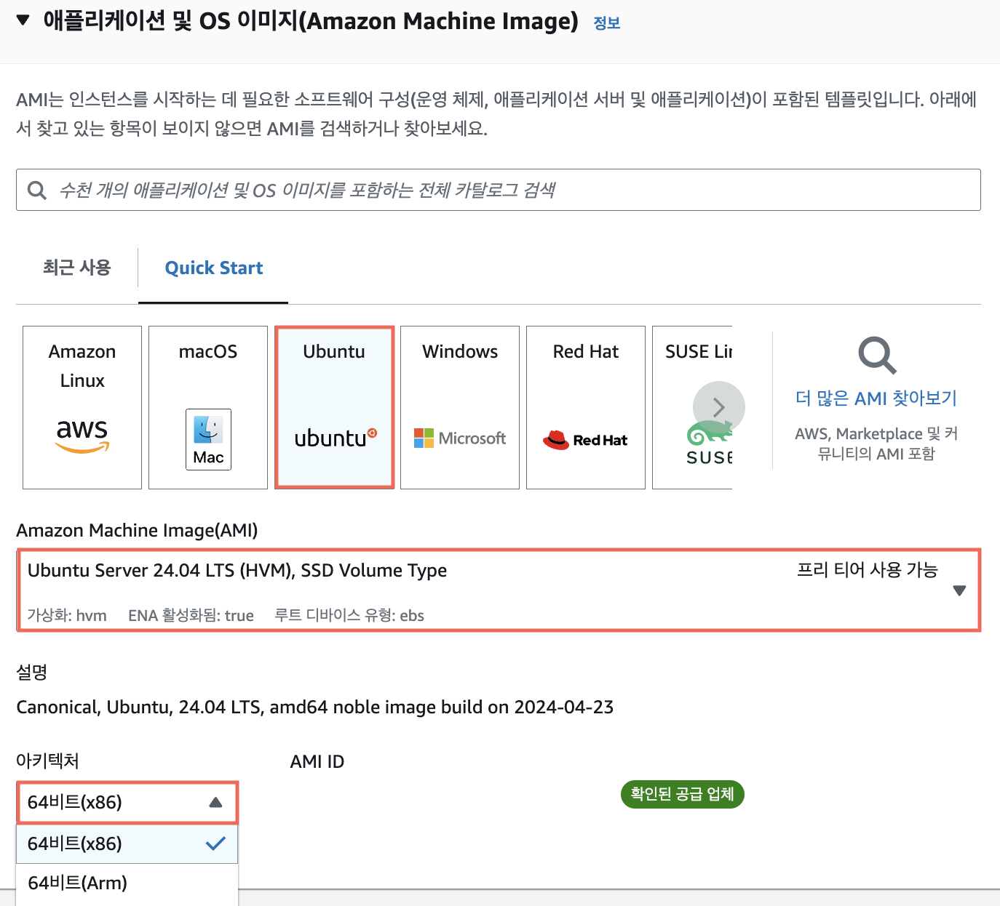</center><br>

프리티어로 사용할 수 있는 Ubuntu 이미지를 사용하였고, x86 아키텍처를 지정해주었다. 이에 맞게 앞서 도커 이미지를 생성해준 것이다. <span style="color:#737373; font-size:14px; font-weight:300;"> amd를 사용할 수 있음에도 x86을 사용하는 이유가 궁금해서 찾아봤는데, 아무래도 아직까지는 x86에서만 지원하는 기술이 많다고 한다. 호환성 문제라고 할 수 있다. </span>

<br><center>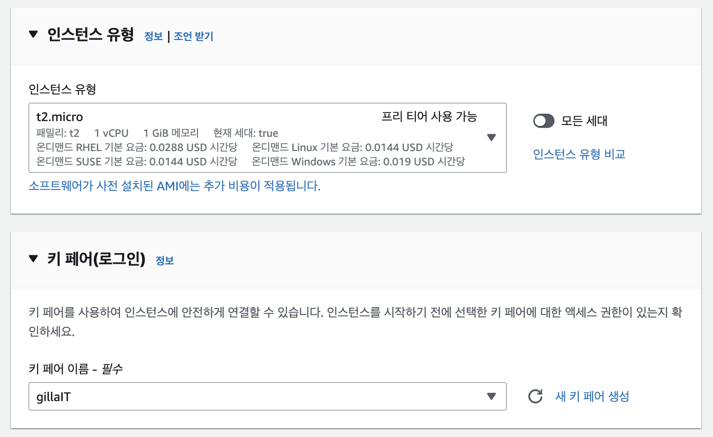</center><br>

프리티어로 사용할 수 있는 t2.micro에 기존에 생성해두었던 키 페어로 인스턴스에 연결할 수 있도록 설정했다.

<br><center>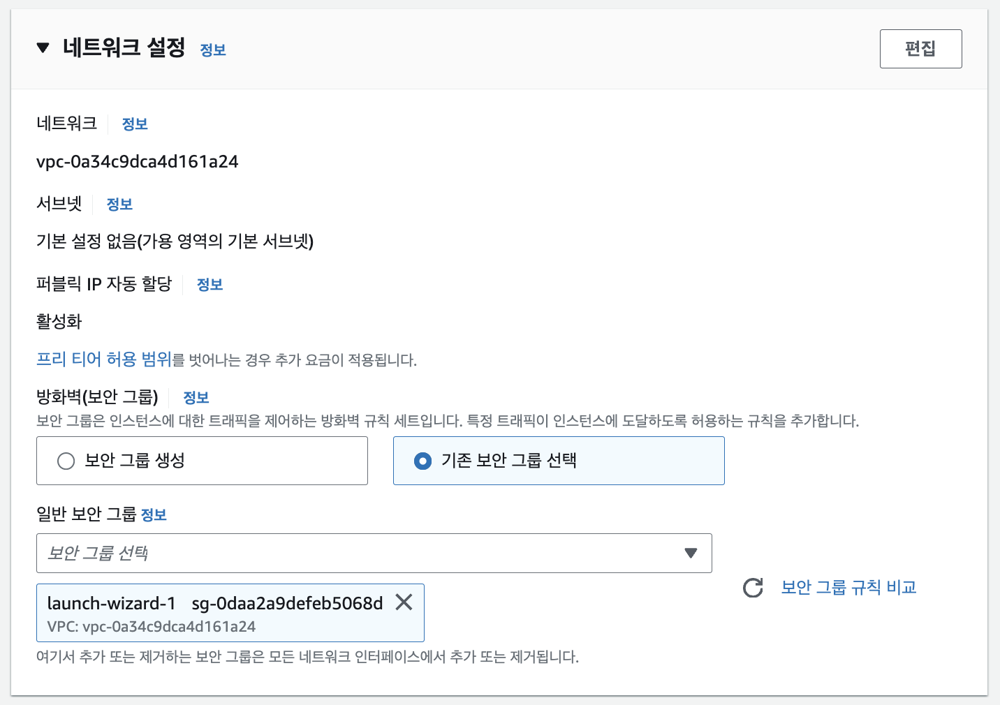</center><br>

보안 그룹은 바로 뒤에 나오는 네트워크 설정에서 자세하게 다루겠다. 사진에 나와있는 것처럼, **보안 그룹**은 특정 트래픽이 인스턴스에 도달할 수 있도록 하는 방화벽 규칙 세트이다. EC2 및 보안 그룹에 대한 설명은 <a href="https://mingdodev.github.io/blog/cloud/2024-05-15-AWS-EC2/#ec2-%EA%B5%AC%EC%84%B1" target="_blank">해당 포스팅</a>에서 확인할 수 있다.

이렇게 보안 그룹을 생성해주고 스토리지 설정까지 완료하면 인스턴스가 생성된다.

## 네트워크 설정

인스턴스 설정 탭을 보면 다음과 같이 연결된 보안 그룹을 찾을 수 있다.
<center>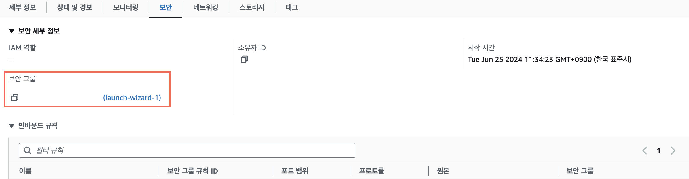</center><br>

여기로 들어가 인스턴스에 특정 트래픽이 접근할 수 있도록 허용해 줘야 한다.

<br>

<br><center>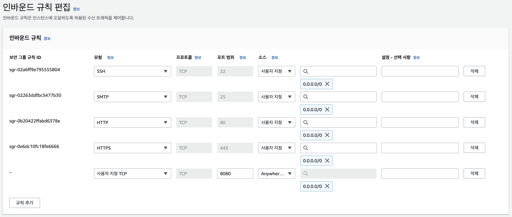</center><br>

인스턴스의 외부에서 내부<span style="color:#737373; font-size:14px; font-weight:300;"> 인바운드 </span>로 접근하려는 트래픽에 대한 규칙을 추가해 준다.

- **HTTP/HTTPS 80/443**
    - 내 애플리케이션을 세상에 공개하기 위한 핵심 작업
    - HTTP/HTTPS 프로토콜을 사용하여 웹 사이트에 접근하므로 인터넷에 연결하기 위해 열어준다.
    - 실제로 지금 배포하는 웹 애플리케이션은 아직 HTTP 프로토콜만 사용하긴 한다.
- **사용자 지정 8080**
    - 배포하려는 웹 애플리케이션이 HTTP를 사용하지만 기본 포트인 80포트가 아닌 8080 포트를 사용하도록 설정했기 때문에 열어주었다.
- **SMTP 25**
    - 이메일 인증 기능에서 SMTP 서버와의 통신이 필요하므로 열어주어야 한다.

- **cf.** 데이터베이스는 인스턴스 기준 `로컬`에 위치하므로 외부 통신을 위한 포트를 열어줄 필요가 없다.

<br><center>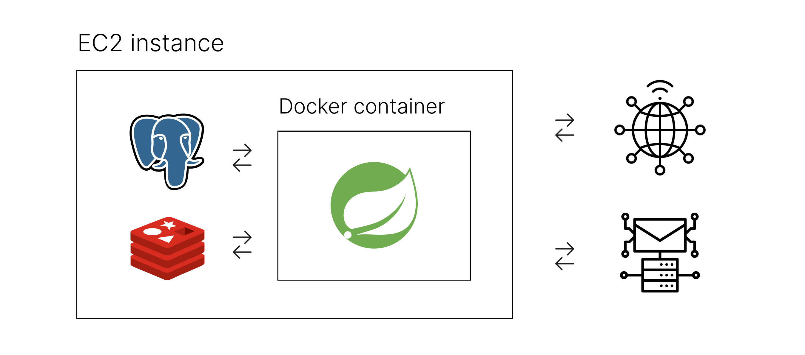</center>
<div class="figcaption"> 간단하게 이해해보자면 위 그림에서 오른쪽 두 개의 통신을 가능하게 만들어준 것이다. </div>

## 인스턴스 접속 및 도커 설치 확인

인스턴스가 준비된 상태라면 건너뛰어도 된다.

<br>

```bash

    scp -i ${pemkey} .env ${ec2instance}:/home/ubuntu

```
- env파일로 관리하고 있는 환경변수가 있는 경우, 로컬의 env 파일을 ec2 인스턴스로 복사해준다.
    - 나중에 해당 파일을 이용해 컨테이너에 환경변수를 주입하기 위해 이 방식을 사용했다.
    
<br>

❗️ <a href="https://docs.docker.com/engine/install/ubuntu/" target="_blank">우분투에 도커 설치하기</a>

<br>

`sudo docker run hello-world` 명령어로 도커 설치를 확인해준다.


## 데이터베이스 설치 및 설정

```bash

    # postgresql 설치
    sudo apt install postgresql

    # postgresql 실행 확인
    sudo service postgresql status

    # postgresql 실행
    sudo service postgresql start

    # postgresql 접속 (postgres는 기본 데이터베이스명)
    sudo psql postgres

```
PostgreSQL을 설치하고 실행한다.

<br>

```bash

    sudo -i -u postgres

    create user ${username} password ${password} superuser;

```
프로젝트에서 사용할 사용자를 생성한다. `application.yml`에 명시해둔 사용자 정보가 있어 그에 맞게 슈퍼유저로 생성해주었다.

이후 프로젝트에서 사용할 데이터베이스도 생성해주었다.

<br>

```bash

    # redis 설치
    sudo apt install redis-server

    # redis 실행 확인
    systemctl status redis-server

    # redis 실행 명령어
    sudo systemctl start redis-server

    # redis 접속
    redis-cli

```

마찬가지로 redis도 설치해고 실행해준다.

<br><center></center>

이제 위 그림의 왼쪽에 있는 두 개의 통신, 데이터베이스와 컨테이너 간의 통신을 가능하도록 만들어줄 것이다.

데이터베이스는 컨테이너 내부의 스프링 부트 애플리케이션과 통신해야 한다. 도커 컨테이너는 기본적으로 로컬 네트워크가 아닌 `브리지 네트워크`를 사용하기 때문에, 호스트의 `127.0.0.1` 주소와는 다른 IP 주소를 갖게 된다. 즉 호스트와 같은 네트워크 환경에 있는 상태가 아니다. 따라서 데이터베이스에 컨테이너로부터 오는 트래픽이 접근할 수 있도록 각각의 설정파일을 수정해줘야 한다.

<br><center>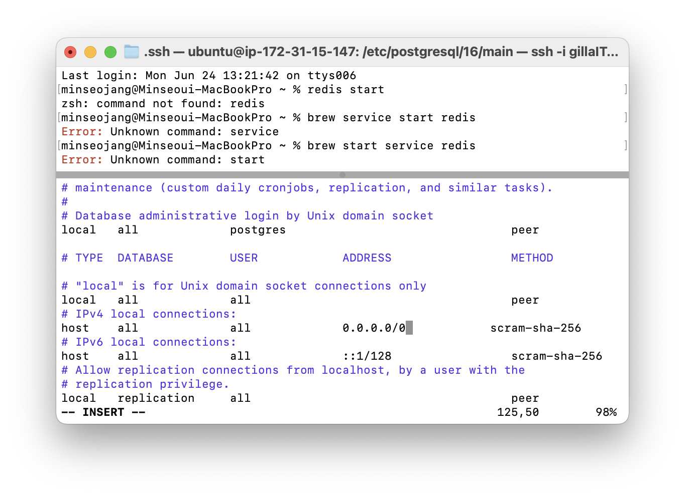</center>

PostgreSQL과의 통신을 위해 `pg_hba.conf` 파일의 IPv4 local connections 부분의 Address를 `0.0.0.0/0`으로 변경하여 모든 IP로부터의 접속을 허용한다. 파일은 `etc/postgresql/16`과 유사한 경로에서 찾을 수 있을 것이다.

<br><center>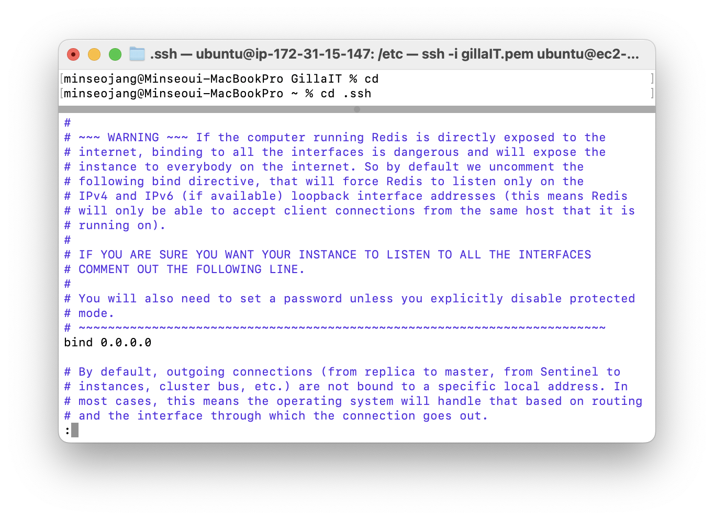</center>

Redis도 통신을 위해 `sudo vim etc/redis/redis.conf`으로 설정 파일을 수정해줘야 한다.

위 사진처럼 네트워크 설정을 위한 부분을 찾아 bind 뒷 부분을 `0.0.0.0/0`으로 변경하여 모든 IP로부터의 접속을 허용한다.

<br>

---

# 도커 컨테이너 생성하기

이제 애플리케이션 실행을 위한 모든 준비가 끝났다.  
도커 허브로부터 이미지를 내려받아 컨테이너를 생성하고 애플리케이션 배포를 마무리하자.

<br>

```bash

    # 도커 허브로부터 이미지 내려받기
    sudo docker pull username/repositoryname:tag

    # 도커 컨테이너 생성 및 실행
    sudo docker run -d --name containername -p 8080:8080 --env-file=.env username/repositoryname:tag

```

- `-d`: 백그라운드 실행 <span style="color:#737373; font-size:14px; font-weight:300;"> detached mode </span>
- `--name`: 컨테이너 이름 지정
- `-p`: 포트 바인딩
    - 호스트의 8080 포트로 들어오는 요청이 컨테이너의 8080 포트로 전달된다.
- `--env-file=.env`: 환경변수로 주입할 파일 설정

이렇게 컨테이너가 실행되면 도커 이미지에 작성해둔 명령어로 스프링 부트 애플리케이션이 실행되고, `http://EC2인스턴스의publicIP주소:8080/`로 접속하면 애플리케이션이 정상적으로 배포된 것을 확인할 수 있다.

<br>

```bash

    sudo docker logs containername

```

접속이 되지 않는다면 컨테이너의 로그를 확인해보자. 스프링 부트가 실행될 때 찍히는 로그를 동일하게 확인할 수 있으며, 에러 메시지를 통해 오류를 해결할 수 있다.

<br><center></center><br>

분명 배포가 잘 돼서 기분이 좋았을텐데 캡쳐를 하나도 안 해뒀다 사진이 없다  
한번만 봐주시길 바란다

<br><br>
<details>
<summary> &nbsp; 📁 참고 자료</summary>
<div>
    ❗️ <a href="https://e-room.tistory.com/170" target="_blank">Docker로 spring-boot EC2에 배포하기</a>
    </div>
    <div>
    <div>
    ❗️ <a href="https://backendcode.tistory.com/265" target="_blank">ubuntu postgresql 설치</a>
    </div>
    <div>
    ❗️ <a href="https://tbmaster.tistory.com/89" target="_blank">postgresql 외부 접속 허용 설정</a>
    </div>
    <div>
    ❗️ <a href="https://happylie.tistory.com/75" target="_blank">레디스 외부 접속 허용 설정</a>
    </div>
    
</details>