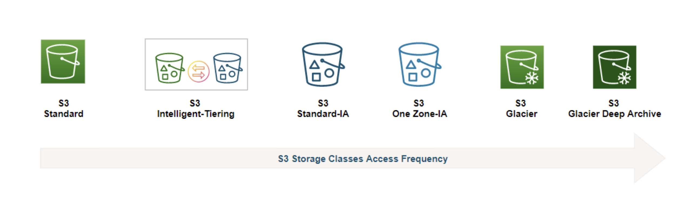

# [AWS] 스토리지 서비스와 S3

  

   

스토리지 서비스와 Amazon S3에 대해 간단하게 정리해보았다.

 

---

# Storage Service

컴퓨터에서 **스토리지**란 데이터를 저장하고 보존하는 역할을 하는 장치를 말한다. 클라우드 서비스 업체에서는 인터넷을 통해 원격 서버에 데이터를 저장, 액세스, 보호 및 분석을 할 수 있는 **스토리지 서비스**를 제공한다.

### 아마존의 스토리지 서비스
- Amazon S3, EBS, EFS, Storage Gateway, FSx, Backup

### 원격 컴퓨터 자체의 스토리지(물리적 저장소)도 있을텐데 스토리지 서비스를 왜 사용할까?

- 웹 서버의 파일 시스템에 콘텐츠를 저장하여 콘텐츠를 제공할 수도 있다. 추가로 CDN(콘텐츠 전송 네트워크) 서비스를 이용하거나 FTP(파일 전송 프로토콜)/SSH를 사용할 수도 있다.
- 그렇지만 어쨌든 이 방법은 고정적인 물리 자원을 사용하는 개념이므로 확장성이 낮다.
→ 확장성을 위해 클라우드 서비스를 활용하게 되는 것. 

### cf. CDN (Content Delivery Network)

**콘텐츠 전송 네트워크(CDN)**는 지리적 제약 없이 전세계 사용자에게 빠르고 안전하게 콘텐츠를 전송할 수 있게 하는 기술이다. 사용자가 웹 사이트를 방문하면 해당 웹 서버의 데이터는 사용자의 컴퓨터에 도달하기 위해 **인터넷**을 통해 이동한다. 따라서 사용자가 서버로부터 멀리 있는 경우에는 대용량 파일을 로드하는 데 오랜 시간이 걸린다. 이러한 방법 대신 웹 사이트 콘텐츠를 **사용자와 지리적으로 가까운 CDN 서버**에 저장하면 데이터가 훨씬 빨리 도달하게 할 수 있다.

## 스토리지 vs 데이터베이스

데이터를 저장한다는 측면에서는 유사하지만 서로 다른 맥락에서 의미를 지닌다.

- `스토리지`는 데이터를 물리적으로 저장하는 시스템
    - 물리적 저장소라고 생각하면 된다.
    - 주로 단순히 데이터를 저장하고 접근하는 데 사용된다.
    - 데이터베이스, 사진, 영상, 파일 등이 저장될 수 있다.

- `데이터베이스`는 데이터를 체계적으로 저장하고 관리하기 위한 시스템
    - 일반적으로 데이터를 관리하는 소프트웨어인 DBMS의 의미로 사용된다.
    - 데이터 저장뿐만 아니라 검색, 관리하며 질의문과 트랜잭션을 처리한다.

 

---

# Amazon S3

**Amazon Simple Storage Service(Amazon S3)**는 아마존의 데이터 스토리지 서비스이다. 웹 사이트, 모바일 애플리케이션, 백업 및 복원, 빅 데이터 분석 등 다양한 사용 사례에서 원하는 양의 데이터를 저장하고 보호할 수 있다.

 

 

### 특징

- 데이터 저장
    - 데이터는 객체 단위로 저장이 된다.
- Access 제어
    - 객체 별 접근 허가  Access Control List, ACL 를 통해 데이터에 접근 가능한 사용자 특정이 가능하다.
- 내구성
    - 99.9999999%의 내구성을 지닌다.  11 nines of durability 

## 작동 원리

S3는 데이터를 버킷 내의 객체로 저장하는 객체 스토리지 서비스이다.  
**버킷**은 객체에 대한 컨테이너이고, **객체**는 해당 파일에 대한 모든 메타데이터를 의미한다.

우선 이름과 **AWS 리전**이 지정된 S3 버킷을 생성해야 한다. Amazon S3에서 객체로 해당 버킷에 데이터를 업로드하여 데이터를 관리하게 된다. 데이터는 동일한 리전 내 여러 가용 영역에 복제하여 분산 저장된다.

### Bucket

- S3에 객체를 저장하게 해주는 시스템
- 전역적으로 UNIQUE한 이름이 필요하다.
- 리전 수준에서 정의된다.

### Object

- 객체는 일반적으로 파일을 의미한다.
    - png, jpeg, html 등
- 객체는 키를 가진다.
    - 키는 파일의 전체 경로이다.
    - 또는 키 이름을 가질 수도 있다.
    - 버킷 내 객체에 대한 고유한 식별자로 사용한다.
- 객체 최대 크기는 5TB, 한 번에 5GB 이상 업로드 할 수 없다.

### S3 Versioning

- 버킷의 버전 관리를 통해 여러 버전의 객체를 보관할 수 있고, 실수로 삭제되거나 덮어써진 객체를 복원할 수 있다.

### S3 Replication

- 재해 복구의 일종으로 객체를 복제할 수 있는 시스템을 갖추고 있다.

- CRR (Cross Region Replication)
    - 동일 리전의 버킷에서 객체를 복제
- SRR (Same Region Replication)
    - 교차 리전 복제, 서로 다른 리전의 버킷에서 객체를 복제

### S3 Encryption

- 데이터를 암호화하는 여러 가지 방법이 있다.

- SSE Server-Side Encryption
    - SSE-S3: S3가 자체 관리하는 암호화 키.
    - SSE-KMS: AWS KMS가 관리. 키를 좀더 세분화하여 관리할 수 있음.
    - SSE-C: 사용자가 관리하는 키. AWS에 키를 저장하지 않음.
- CSE Client-Side Encryption
    - 데이터를 업로드 하기 전에 클라이언트 측에서 직접 암호화.

### Storage Class

다양한 클래스가 존재한다. 각 클래스는 동일한 내구성을 지니지만 가용성이 다르다.

 

- **Standard**
    - default
    - 짧은 지연시간과 높은 처리

- **Intelligent-Tiering**
    - 액세스 패턴이 예측 불가능한 데이터를 위한 클래스
    - 사용 패턴에 따라 데이터를 적절한 클래스로 이동시킨다.

- **Standard-Infreqeunt Access**
    - 액세스 빈도가 낮으나 필요할 때 빠르게 액세스
    - 장기 스토리지 및 백업용으로 적합하다.

- **One Zone-Infrequent Access**
    - 액세스 빈도가 낮으나 액세스 시 빠른 속도가 필요한 데이터를 위한 클래스
    - 쉽게 재생성 가능한 데이터에 적합하다.

- **S3 Glacier**
    - 데이터 아카이빙을 위한 클래스
    - S3 수명주기 정책을 통해 적절한 시기에 적절한 다른 스토리지 클래스로 자동 전환할 수도 있다. S3 스토리지와 Glacier 간 데이터 전송이 가능하다.

- **S3 Glacier Deep Archive**
    - 비용이 가장 저렴한 스토리지 클래스
    - 일 년에 한두 번 액세스 하는 데이터에 대한 장기 보존을 위한 클래스

 

---

# Amazon CloudFront

AWS에서 제공하는 Global CDN 서비스이다. 전 세계 사용자에게 빠르고 안전하게 콘텐츠를 전송할 수 있다.

 

 

- **데이터 전송 속도 및 안정성, 가용성 향상**
    - 전 세계에 분포된 엣지 로케이션을 사용하여 콘텐츠를 캐시하고 분배한다. 사용자들은 가까운 엣지 로케이션에서 콘텐츠를 전달 받아 빠르게 콘텐츠에 접근할 수 있다.
    - 즉 원본 서버에서 직접 콘텐츠를 가져오는 것보다 데이터 전송 속도가 빠르다.
    - S3와 연동하면, 캐싱을 지원하여 S3에 저장된 컨텐츠에 직접 접근하지 않아도 되어 응답이 빠르고 S3의 비용을 절감할 수 있다.

- **보안성 향상**
    - CloudFront는 HTTPS 통신을 지원하여 데이터를 안전하게 전송할 수 있다.
    - 원본 서버가 HTTPS를 지원하지 않아도 클라우드프론트 내에서 HTTPS 통신을 지원한다.
    - AWS Shield, AWS WAF(Web Application Firewall)을 통해 DDoS 공격으로부터 보호한다.