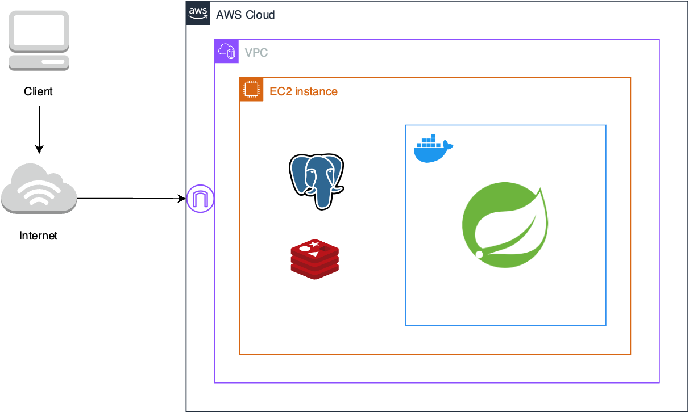
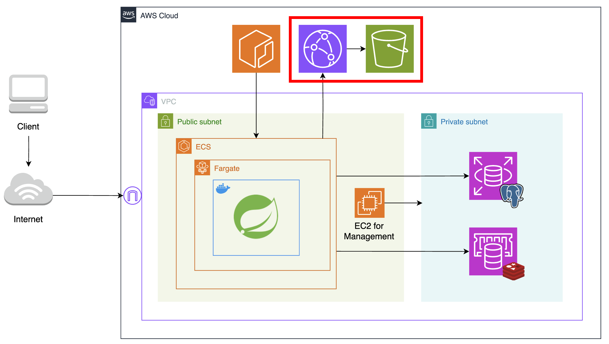
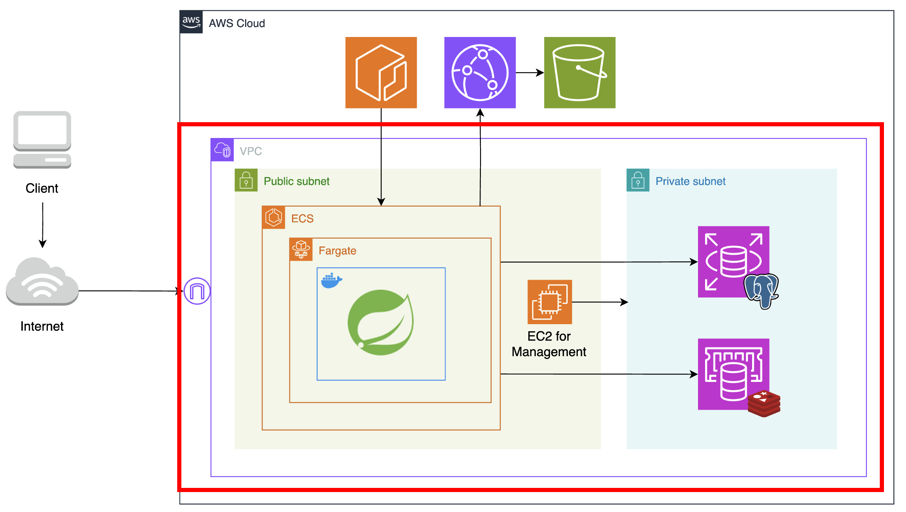
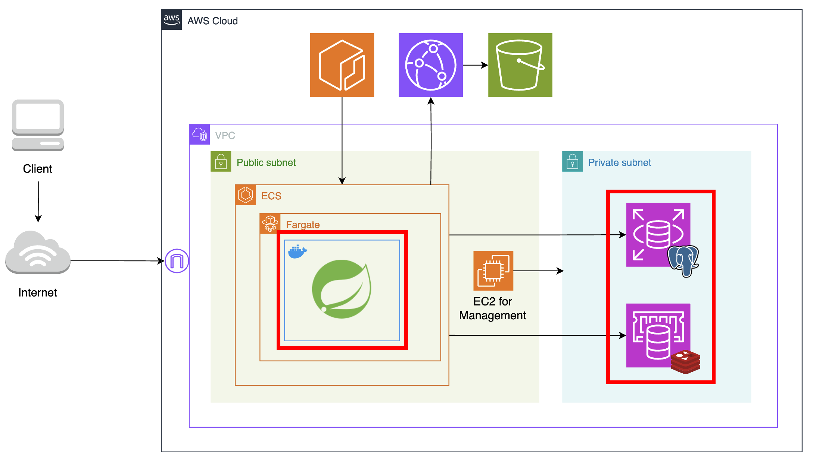
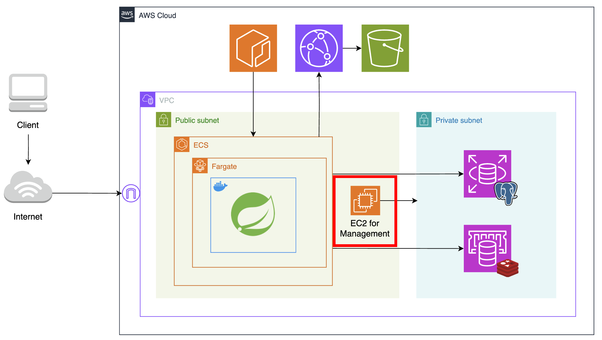
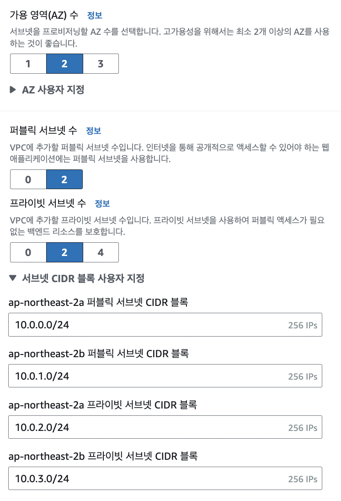
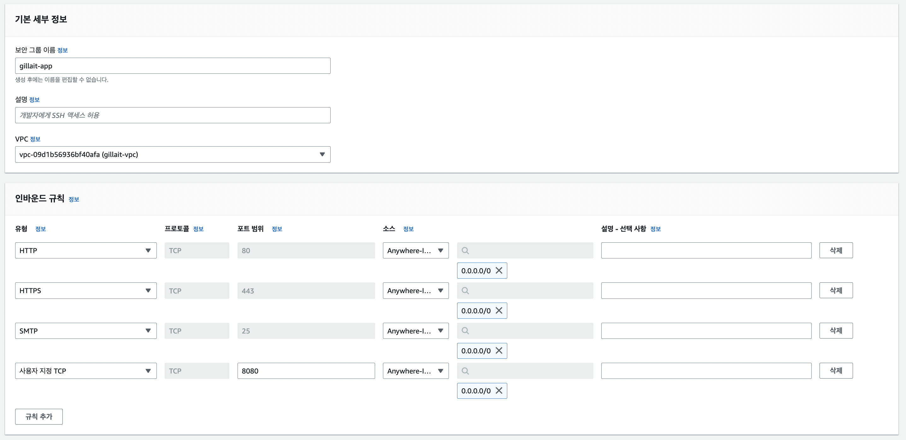

# [AWS] 클라우드 아키텍처 개선으로 AWS와 친해지기

  

  

### 서론

그동안은 프로젝트를 시작할 때 클라우드 아키텍처를 제대로 설계해본 적이 없었다. 인프라 설계에 대한 궁금증과 '써 본적 없는 클라우드 서비스를 언젠가는 다 경험해봐야지!'라는 막연한 생각이 있었는데 마침 교내 AWS Cloud Clubs에서 발표할 기회가 생겨 이참에 해보고싶었던 걸 다 해보기로 했다. 발표란 내가 원래 잘하던 걸 해야하지 않나 싶어 고민했었는데, 부담 없이 자유롭게 지식을 공유할 수 있는 자리로 만들어주셔서 과감히 새로운 시도를 해보게 되었다. 결과적으로 발표 덕분에 정말 많은 것을 배우고 느낄 수 있었다 🙌 

내 첫 아키텍처 도전기의 목표는 **첫 번째, 이론으로만 접했던 AWS 서비스 사용해보고 필요한 이유 느끼기**, **두 번째, 아키텍처 설계 직접해보기** 두 가지로 잡았다. 따라서 해당 발표는 AWS에 익숙하지 않은 초심자가 아키텍처를 위해 어떤 고민을 했는지, 그리고 직접 AWS를 활용하여 구현해본 과정과 느낀 점을 소개하는 것이 핵심이었다고 할 수 있다. 발표 당시에는 시간이 한정적이라 내 생각과 접근 방식에 초점을 맞추었는데, 블로그에서는 전체적인 내용을 점검하며 그때 못 다뤘던 세부적인 지식들도 정리해보려고 한다!

 

---

# 클라우드 아키텍처 설계하기

우선, 클라우드 아키텍처라고 했을 때 어떤 요소들을 고려해야 하는지 생각해보았다.

**클라우드 아키텍처**란, 클라우드 환경에서 애플리케이션을 실행하고 배포하기 위한 청사진이라 할 수 있다. 하드웨어, 가상 리소스, 가상 네트워크 시스템, 소프트웨어 기능 등의 **클라우드 기술 구성 요소들이 어떻게 연결되어 있고 상호작용하는지**를 나타낸다.

## 기존 프로젝트의 아키텍처

요구사항을 바탕으로 설계하기 위해 이전에 짧게 진행했던 프로젝트를 가져왔다.  
따로 아키텍처 고민을 하지 않았던 프로젝트의 아키텍처를 살펴보고 이를 개선하는 방향으로 새로운 아키텍처를 구상할 것이다. 클라우드 기술 구성 요소들을 중심으로 파악한 기존 프로젝트의 아키텍처는 다음과 같다.

 

 

우리 서비스는 이메일 인증을 포함한 회원가입과 로그인, 게시글 CRUD 정도의 기능이 구현되어 있다. 데이버베이스 서버로 PostgreSQL을, 이메일 인증을 위한 key-value의 데이터를 임시로 저장하기 위해 Redis를 사용하였다.

애플리케이션 개발 공부를 위한 프로젝트였기에 '배포' 자체만을 목표로 했고, 많은 트래픽을 필요로 하지 않았다. 그러나 이번에는 어느정도의 사용자가 있는 서비스라고 가정하고 문제점을 개선해보았다.

### 현재 아키텍처의 요구사항 및 개선 가능한 부분

1. 기능 추가

    - 게시글에 이미지를 첨부하는 기능이 추가되어야 했다. 따라서 파일을 저장하고 접근할 수 있는 Storage가 필요하다.

2. 개선 사항

    - 하나의 EC2 인스턴스에 데이터베이스 서버와 애플리케이션 서버가 함께 존재한다. 두 서버는 EC2 인스턴스 기준 온프레미스 환경으로 구축되어 있다.

        - 하나의 컴퓨팅 자원을 서로 다른 두 서버가 공유하고 있다. 이는 장애 전파의 위험이 있으며, 서버 확장 시 각자의 요구사항에 맞게 독립적으로 관리할 수 없다는 단점이 있다.

    - 이외에도 여러모로 가용성과 확장성을 고려하지 않고 있다.

    - 보안 강화를 위한 장치가 없다.

## 새로운 아키텍처

이러한 개선 사항을 고려하여 새로운 아키텍처를 설계해보았다.

 

 

전체적인 아키텍처는 위 그림과 같다. 구체적으로 어떤 서비스가 어떤 문제점을 개선했는지 각 구성 요소에 대해 하나씩 소개해보겠다.

   

 

우선 이미지 파일 저장소로 **S3**를 사용했다. 또한 CDN 서버로 **Cloudfront**를 함께 사용하여 **캐싱**으로 S3의 부하를 줄이도록 했다. 그러나 캐싱도 중요하지만, CDN 서버를 이용한 주 목적은 **보안 강화**였다. 외부 클라이언트가 객체에 직접 접근하지 못하도록 퍼블릭 액세스를 차단하고, 따로 정책을 지정해 **Cloudfront를 통해서만 객체에 접근**할 수 있도록 만들었다.

   

 

다음으로는 VPC 내 네트워크를 **Public Subnet**과 **Private Subnet**으로 분리하였다. 퍼블릭 서브넷이란 라우팅 테이블에 인터넷 게이트웨이가 있어, 호스트들에게 public ip를 할당해 인터넷과 직접 통신할 수 있는 네트워크를 말한다. 반면 프라이빗 서브넷은 public ip를 가지지 않아 인터넷과 직접 통신할 수 없다. 쉽게 말해 큰 네트워크를 작은 네트워크로 나누었는데, 이때 인터넷으로부터 직접 트래픽을 받을 수 있는 부분과 그렇지 못한 부분을 나눠 용도에 맞게 사용하도록 작업을 해준 것이다.

인터넷과 직접 통신하지 않아도 되는 데이터베이스 서버는 프라이빗 서브넷에 두어 **보안을 강화**하였고, 프라이빗 서브넷에 대한 접근을 제한하였다. 두 네트워크 간 통신은 각각 **보안 그룹**을 생성하여, **퍼블릭 서브넷의 애플리케이션 서버와 관리용 EC2 인스턴스에서만 프라이빗 서브넷에 접근**하도록 설정해주었다.

   

 

관리 및 유지보수를 위해 데이터베이스 서버와 애플리케이션 서버를 분리했다. '분리'라는 목적에 추가로 온프레미스 환경 대신 AWS가 관리해주는 클라우드 환경인 RDS, ElastiCache를 이용하여 고가용성과 자동화를 활용하고자 했다.

   

 

다음으로는 애플리케이션 서버를 올릴 컴퓨팅 자원을 EC2에서 ECS의 fargate로 마이그레이션했다.

도커 이미지 저장소로 ECR을 사용하여 IAM 자격 증명을 통해서만 이미지에 접근할 수 있도록 보안을 강화했다. 또한 서버리스 환경인 fargate로 컴퓨팅 자원을 사용해, 사용한 만큼만 요금을 지불할 수 있게 만들었다.

### 🧐 Public Subnet에 위치한 EC2의 역할?

보안 강화를 위해 데이터베이스 서버에 대한 접근을 제한하니, **데이터베이스 설정을 위해 서버에 접속해야 하는 개발자마저도 접근이 차단**되었다.

 

 

따라서 같은 네트워크 내의 퍼블릭 서브넷을 통해서만 데이터베이스 서버에 접속할 수 있다. 그러나 퍼블릭 서브넷의 fargate는 서버리스 환경으로, 항상 익숙하게 해왔던 로컬 디바이스에서의 ssh 원격 접속이 불가능했다. 따라서 **데이터베이스 접속을 위한 퍼블릭 서브넷 내의 매개체**가 필요하다고 생각했고, 새로운 관리용 EC2 인스턴스를 만들어 매개체 역할을 수행하도록 만들었다.

이러한 외부와 내부 네트워크 간 일종의 게이트웨이 역할을 하는 호스트를 **Bastion Host**라고 한다.

> 멋대로 관리용 호스트라는 이름을 붙이고 여러 가지 다른 방법을 찾아보다보니 Bastion Host라는 개념이 있었다. AWS에서 제공하는 Session Manager, VPN 우회와 같은 다른 방법이 있다고 하는데, 각각의 장점이 무엇인지 이건 따로 다뤄볼 예정이다.

 

---

# 설계한 아키텍처 AWS로 구현하기: VPC

이제 간단히 설명한 아키텍처를 직접 어떻게 구현했는지 소개해보겠다. 단 Storage와 CDN 서버는 애플리케이션과의 상호작용이 필요하고, 아키텍처 개선보다는 단순 기능 추가에 가까워서 Spring Boot와 함께 다른 카테고리로 분류하려고 한다.

 

> 글이 많이 길어질 것 같아.. VPC와 전체적인 네트워크 설정, Database, Computing, 그리고 Spring Boot 프로젝트에서 S3와 Cloudfront 사용하기로 주제를 나눠서 책임을 분리해보겠다 😅

## VPC 생성

우선 RDS, ElastiCache, fargate 등 AWS 객체들을 담을 네트워크인 VPC를 생성할 것이다. VPC와 서브넷 등 네트워크 관련 개념이 기억나지 않는다면 [이 글](https://mingdodev.github.io/blog/cloud/2024-05-14-AWS-Networking/)을 먼저 읽고 관련 내용을 복습하면 좋을 것 같다.

앞서 언급했듯 퍼블릭 서브넷과 프라이빗 서브넷을 분리하여 명시적으로 관리하기 위해, 생성할 때 VPC만 설정하지 않고 `VPC 등`이라는 옵션을 선택해준다.

 

 

이 옵션을 선택하면 할당받을 IP의 크기와 서브넷을 직접 지정할 수 있다. 기본적으로 지정된 `10.0.0.0/16`을 사용하였다.

> IPv4 32비트 중 서브넷 마스크의 비트 수인 16만큼을 네트워크 식별에 사용한다는 뜻이다. 앞에서부터 16비트까지의 주소를 네트워크 주소로, 나머지를 그 네트워크 내부의 호스트 주소로 생각하겠다는 표기 방식이다.

  

  
  

 

왼쪽 사진은 **서브넷**을 나누는 작업이다. 우선 VPC의 가용영역은 고가용성을 누려보기 위해 2개로 지정해 주었다. 이렇게 되면 각각의 가용영역에 퍼블릭 서브넷 하나, 프라이빗 서브넷 하나, 총 네 개의 서브넷을 생성하게 된다.

이 부분에서 서브넷의 CIDR 블록도 직접 설정해준다. 서브넷과 서브넷 마스크의 개념에 따라 큰 네트워크를 작은 네트워크로 나누어주는 작업이다.

예를 들어 사진처럼 `ap-northeast-2a` 퍼블릭 서브넷 CIDR 블록을 `10.0.0.0/24`로 지정해주면 앞의 24비트가 네트워크를 식별하는 부분, 나머지 8비트가 호스트를 식별하는 부분이 된다. 나머지 세 서브넷의 CIDR블록을 보면 네트워크 주소인 앞의 24비트가 서로 다른 주소로 설정되어 있음을 확인할 수 있다. 

 

추가로 **NAT 게이트웨이**를 생성할지 선택할 수 있다. NAT는 private ip주소를 public ip주소로 변환하여 내부 네트워크에서도 인터넷으로 아웃바운드 요청을 보내고 응답을 받을 수 있게 도와준다. 예를 들어 내부 네트워크에 애플리케이션 서버를 둔 경우, 애플리케이션에서 사용하는 라이브러리 업데이트를 위해 패키지를 다운로드할 일이 생길 수 있다. 이렇게 인터넷으로 요청을 보내야 하는 경우가 필요하다면 NAT 게이트웨이를 추가할 수 있다. 우리 애플리케이션에는 불필요하고 과금 이슈도 발생하기 때문에 따로 추가하지 않았다.

**VPC 엔드포인트의 S3 게이트웨이**는 VPC 내부의 리소스가 S3로 요청을 보낼 일이 생길 때, 인터넷을 거치지 않고 AWS의 내부 네트워크를 통해서 안전하게 통신할 수 있도록 해주는 기능이다. 굳이 인터넷을 사용해 인터넷 데이터 전송 비용을 늘리고 보안 위험에 노출될 필요 없이, AWS가 안전하게 직접 S3와 통신할 수 있도록 도와준다고 이해할 수 있다.

현재 아키텍처는 VPC 내 리소스가 Cloudfront로만 요청을 보내므로 직접 S3에 접근할 일은 없다. 따라서 굳이 필요한 설정은 아니다.

## 보안 그룹 설정

다음으로는 보안 그룹을 생성하여 네트워크 연결을 설정해줄 것이다.

 

 

먼저, 퍼블릭 서브넷에 위치할 애플리케이션 서버를 위한 보안 그룹을 생성해준다. 인터넷과 통신해야 하는 애플리케이션 서버는 HTTP/HTTPS로 들어오는 모든 트래픽을 허용해준다.

사용자 지정 8080 포트는 애플리케이션 서버가 8080 포트를 통해 요청을 받도록 따로 지정해주었기 때문에 열어두었다. HTTP 요청을 기본 80 포트로 받으면, 웹 서버에서 이 트래픽을 받아 8080 포트로 redirection해준다.

SMTP 서버와의 통신이 필요하다고 생각해서 25 포트를 열었었는데, 생각해보니 서버에 아웃바운드 요청만 보내고 **서버로부터 오는 요청을 받을 일은 없기 때문에** 이에 대한 인바운드 규칙은 지정할 필요가 없는 것이었다 😱

  

 

다음은 RDB와 ElastiCache가 담길 데이터베이스 서버를 위한 보안 그룹을 생성해준다.

방금 생성한 보안 그룹과 달리, 프라이빗 서브넷에 있는 서버들은 퍼블릭 서브넷에서 오는 트래픽 외에는 전부 차단해야 한다. 따라서, 인바운드 규칙을 설정할 때 **소스** 정보를 방금 만든 **애플리케이션 보안그룹의 Id**로 설정해주었다. 이를 통해 현재 데이터베이스 서버는 애플리케이션 서버를 통한 접근만 허용되는 상태가 되었다.

 

여기까지 완료하면 안전한 통신을 위한 기본적인 네트워크 설정이 완료되었다.

이 다음으로는 RDS 서비스로 데이터베이스 서버를 만드는 과정부터 다시 소개해보도록 하겠다!