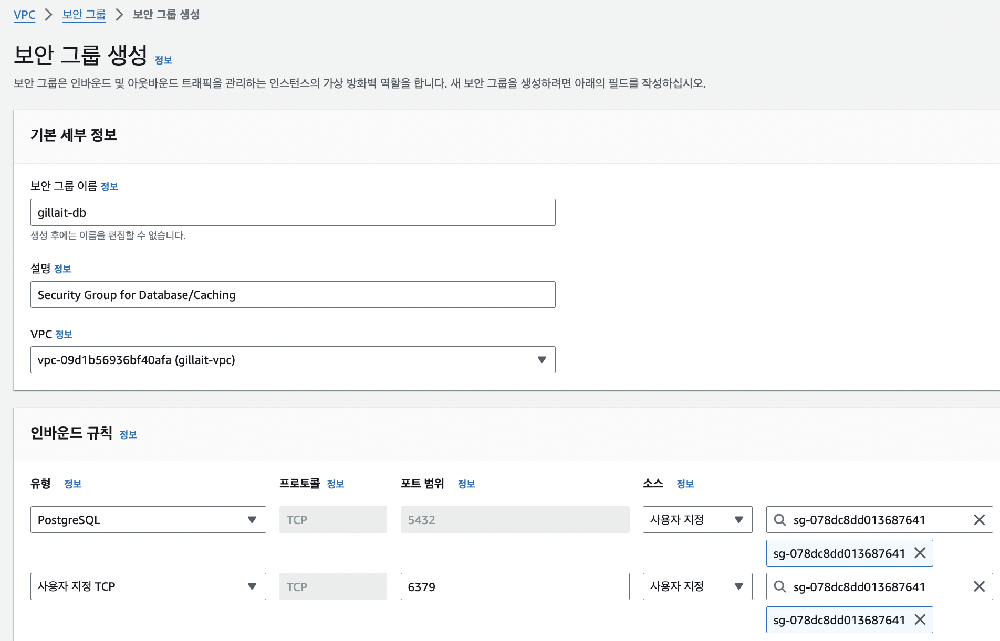

# [AWS] 클라우드 아키텍처 개선으로 AWS와 친해지기

  

  

 

---

# 설계한 아키텍처 AWS로 구현하기

이제 설명한 아키텍처를 직접 어떻게 구현했는지 소개해보겠다. 단 Storage와 CDN 서버는 애플리케이션과의 상호작용이 필요하고, 아키텍처 개선보다는 단순 기능 추가에 가까워서 이 글에서는 다루지 않을 예정이다.

## VPC 생성

 

 

 

 

 

 

 

 

 

 

 

---

# Database

## RDS

 

 

## ElastiCache

발표에서는 이 부분을 `Caching` 파트로 따로 다루었었다. 이름처럼 주로 캐시 서버를 위해 사용하는 서비스라 분리했었는데, 사실상 우리 서비스에서는 캐싱을 위한 서버가 아니라 휘발성이 있는 데이터를 저장하기 위해 Redis를 사용한 것이기 때문에 블로그에서는 `Database` 파트로 묶기로 했다. 전통적인 '데이터베이스'라기 보다는 '임시 데이터 저장소' 정도로 이해하면 되겠다.

 

---

# Computing

## ECR

## ECS & fargate

