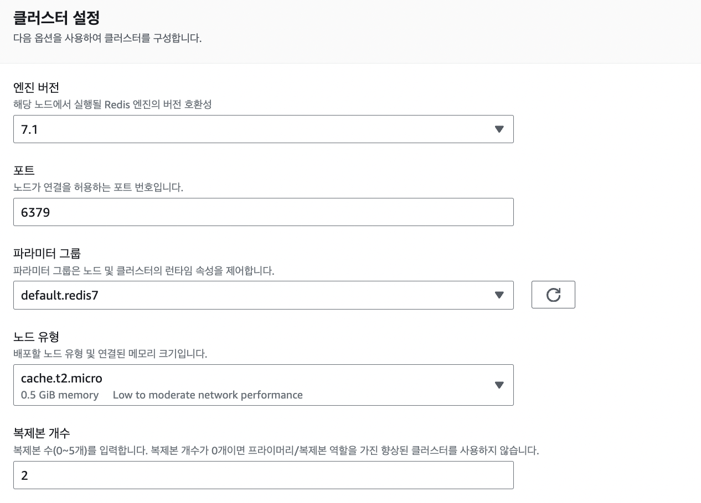

# [AWS] 클라우드 아키텍처 AWS로 구현하기: RDS, ElastiCache

  

   

전체적인 아키텍처 구성과 네트워크 설정을 완료했던 [지난 글](https://mingdodev.github.io/blog/cloud/2024-11-05-cloud-architecture-with-aws-intro-vpc/)에 이어, 이번 글에서는 데이터베이스로 사용할 PostgreSQL, 인증 키를 위한 Redis 서버를 클라우드 서비스로 구축하는 방법에 대해 정리하겠다.

# RDS

AWS RDS로 데이터베이스 서버부터 만들어볼 것이다.

## DB Subnet Group 생성

우선, RDS 인스턴스의 네트워크 설정을 위한 **데이터베이스 서브넷 그룹**을 미리 생성해준다.

 

 

DB 서브넷 그룹에 사용할 서브넷들이 위치한 VPC 식별자를 지정하고, VPC의 가용 영역 중 데이터베이스 네트워크에서 사용할 가용 영역을 선택해준다.

만들어둔 두 개의 가용 영역 전부를 선택했고, 이 두 가용 영역 각각이 가지는 **프라이빗 서브넷** 두 개를 이 DB 서브넷 그룹에 포함시켰다. 곧 생성할 RDS 데이터베이스 서버는 두 개의 프라이빗 서브넷을 네트워크 환경으로 가질 수 있게 되었다.

사실 지금 당장은 다중 가용 영역을 활용하도록 구성하지는 않을 것인데 실제 프로덕션 환경이라고 가정하고 가능성을 열어뒀다. 이렇게 두 개의 가용 영역을 사용한다면 **다중 AZ DB 인스턴스** 환경을 구축할 수 있다. 하나의 가용 영역에 기본 DB 인스턴스를 두고, 다른 가용 영역에 failover를 위한 예비 인스턴스를 두어 가용성을 확보할 수 있다. 단, 예비 인스턴스는 기본 인스턴스에 장애가 일어났을 때만 유효한 것이지 평소에는 별다른 요청을 받아들일 수 없다.

읽기 요청이 자주 발생하는 경우라면 RDS 전용 **다중 AZ DB 클러스터** 환경을 구축할 수 있다. 최소 3개의 가용 영역이 필요하고, 하나의 Writer 인스턴스 기본 와 두 개의 Reader 인스턴스가 개별 가용 영역에 배포된다. 이 경우에는 평소에도 예비 인스턴스 두 개가 읽기 요청을 처리할 수 있어 읽기 성능이 향상되며, failover에도 두 인스턴스 모두 활용할 수 있다.

## RDS DB 인스턴스 생성

이제 데이터베이스 인스턴스를 생성해준다.

 

 

기존에 사용했던 엔진 유형과 버전에 맞게 선택해준다.

 

 

다음으로 인스턴스의 각종 설정을 돕는 템플릿이 나오는데, 나는 실제 운영환경이 아닌 학습 목적의 배포 환경이라 프리티어 템플릿을 선택했다.  프리티어에서는 앞서 언급한 RDS 전용 다중 AZ 클러스터 및 인스턴스 설정 탭을 이용할 수 없다. 

 

 

DB 인스턴스의 이름과 애플리케이션에서 사용할 데이터베이스의 이름, 마스터 사용자 등 자격 증명을 설정해준다.

 

 

인스턴스 유형, 스토리지 유형과 크기도 필요한 만큼 설정해준다. 예상치 못한 과금을 막기 위해 스토리지 자동 조정을 비활성화해주었다.

 

 

마찬가지로 네트워크 설정을 해준다. 방금 생성한 DB 서브넷 그룹과 기본적으로 사용할 가용 영역을 선택해주고, **public access도 차단**해준다. 대신 저번 글에서 생성했던 데이터베이스용 보안 그룹으로 **같은 VPC내 퍼블릭 서브넷에서 오는 트래픽은 받을 수 있도록** 적용해주었다.

 

 

DB 파라미터 그룹은 하나 이상의 DB 인스턴스에 적용되는 엔진 구성값의 컨테이너 역할을 한다. 따로 지정하지 않으면 기본 DB 파라미터 그룹을 사용하도록 설정된다. 엔진 구성값을 따로 커스텀해야 할 때, 그리고 그 설정값을 여러 인스턴스에서 유지해야 할 때 사용할 수 있을 것 같다. 이번에는 기본값으로 세팅해주었다.

이렇게 하면 RDS 인스턴스 생성이 완료된다.

 

---

# ElastiCache

발표에서는 이 부분을 `Caching` 파트로 따로 다루었었다. 이름처럼 주로 캐시 서버를 위해 사용하는 서비스라 분리했었는데, 사실상 우리 서비스에서는 캐싱을 위한 서버가 아니라 휘발성이 있는 데이터를 저장하기 위해 Redis를 사용한 것이기 때문에 블로그에서는 RDS와 함께 `Database` 파트로 묶기로 했다. 전통적인 데이터베이스라기 보다는 '임시 데이터 저장소' 정도로 이해하면 된다.

ElastiCache는 인 메모리 데이터베이스로 Memcached와 Redis OSS,  Valkey 세 종류를 지원한다.  지지난 달 초까지만해도 두 종류였는데 발표 하루 전날 발키를 지원하겠다고 발표했다 뭔가 짜릿  기존 애플리케이션에서 사용했던 레디스 캐시를 생성할 것이다.

 

 

RDS 인스턴스를 만들고 나면 이렇게 데이터베이스 성능을 높일 수 있는 작업들을 먼저 제안해준다. 이 팝업을 통해 또는 직접 서비스에 접속해서 ElastiCache의 Redis 캐시 클러스터를 만들어 준다.

 

 

새 캐시 설계 옵션을 선택하여, 새로운 클러스터 구성을 직접 설정해준다.

레디스 캐시는 클러스터 관련 설정을 할 수 있는데, 이를 활용하면 프라이머리 노드 하나와 복제본 여러 개를 두어 가용성을 확보할 수 있다. 클러스터 모드를 따로 활용한다면 **샤딩**이 가능해져 데이터를 수평적으로 분산해서 저장할 수 있게 된다. 우리 서비스에서는 레디스를 임시 저장소로 사용하며 데이터는 3분 후 삭제된다. 따라서 클러스터 모드는 사용하지 않고, 바로 뒤에 등장할 다중 AZ 사용 옵션과 노드 복제만 선택해주었다.

 

> 샤드(shard)란 데이터베이스나 저장소 시스템에서 데이터를 여러 서버 또는 노드에 분산하여 저장하는 방법이다.

  

 

오른쪽 옵션의 AWS Outposts는 AWS의 인프라와 서비스를 사용자가 운영하는 온프레미스 환경에서 직접 사용할 수 있도록 지원해주는 서비스이다. 즉 데이터 센터와 같은 물리적 자원으로 인프라를 구축할 때 AWS와 동일한 환경을 이용할 수 있도록 도와주는 AWS의 하드웨어 서비스라고 볼 수 있다.

 

> 왜 RDS 인스턴스를 만들 때에는 이런 선택지가 없었지?
>
> RDS는 대부분의 작업을 AWS에서 관리해준다. 즉 VPC 서브넷과 밀접하게 통합된 환경으로, 서브넷을 설정하는 것으로 Outposts 사용 여부를 결정한다고 한다. ElastiCache는 개발자가 직접 설정하는 작업이 많아다. 노드나 클러스터를 생성할 때에도 Outposts와 통합할 것인지 명시적으로 선택해줌으로써 서비스 사용 여부를 결정한다고 한다. RDS는 못 쓰는 게 아니라 각 서비스의 특성 상 지정하는 방법이 다른 느낌?

 

나는 마땅한 데이터 센터가 없으므로 당연히 클라우드 서비스를 이용해준다.

 

 

레디스 버전, 연결을 허용할 포트, 파라미터 그룹, 노드 유형과 복제본 개수를 지정한다.

필요한 메모리를 고려하여 노드 유형을 선택해주고, 복제본은 2개로 설정했다. 이렇게 하면 프라이머리 노드 하나와 복제된 노드 두 개 총 세 개의 노드가 생성된다. 프라이머리 노드에 문제가 발생한다면 복제 노드 중 하나를 자동으로 승격하여 다운 타임을 최소화할 수 있다.

 

 

캐시 서버 역시 서브넷 그룹을 생성하여 프라이빗 서브넷에 둘 것이다. 앞선 DB 서브넷 그룹과 동일한 방식으로 생성해준다.

 

 

마지막으로 데이터베이스를 위한 프라이빗 서브넷 보안 그룹을 선택해 네트워크 액세스 설정도 완료해준다.

여기까지 하면 프라이빗 서브넷에 둘 인스턴스는 전부 다 생성한 것이다.

 

이어서 다음 글은 ECR, ECS의 Fargate로 컴퓨팅 엔진을 사용하는 과정과 기존 아키텍처와 비교했을 때 어떠한 장단점이 있는지에 대해 작성해보겠다.