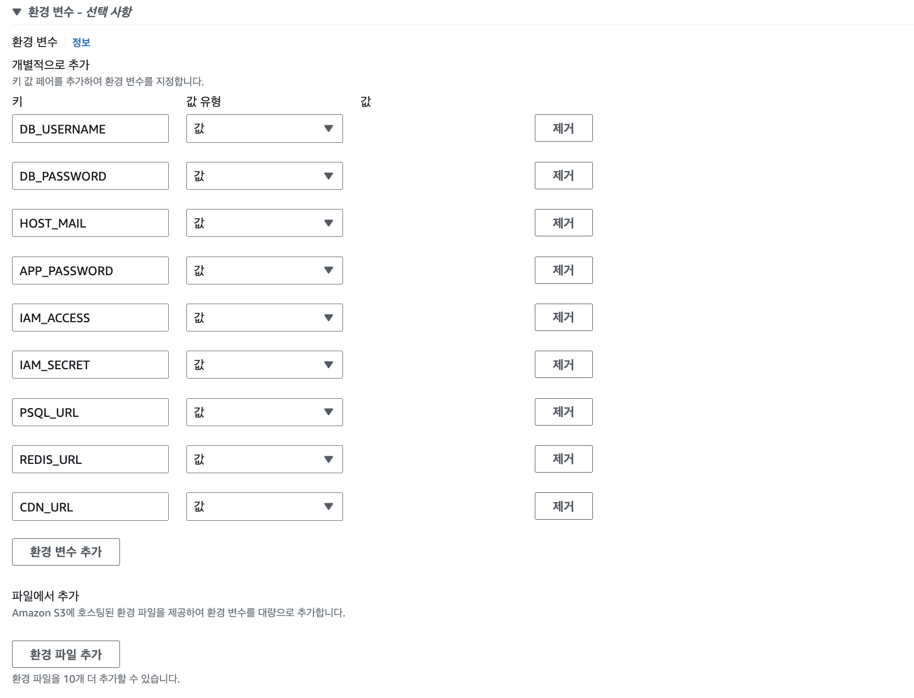

# [AWS] 클라우드 아키텍처 AWS로 구현하기: ECS + fargate

  

   

> [초기 설계 및 VPC 생성](https://mingdodev.github.io/blog/cloud/2024-11-05-cloud-architecture-with-aws-intro-vpc/), [데이터베이스 생성](https://mingdodev.github.io/blog/cloud/2024-12-02-cloud-architecture-with-aws-rds-elasticache/)에 이어지는 글이다.

  

마지막으로 애플리케이션 서버를 배포할 컴퓨팅 자원을 생성한다. 배포를 위해서 사용한 주요 서비스는 **ECR, ECS**의 **Fargate**이다.

 

 

ECR은 도커 이미지 저장소, ECS는 컨테이너 관리 서비스, Fargate는 서버리스 컴퓨팅 엔진이다.
ECR이 ECS에게 도커 이미지를 제공하면 ECS가 그걸로 컨테이너를 띄우는데, 이때 그 컨테이너를 올리는 컴퓨팅 자원이 Fargate라고 이해할 수 있다.

 

---

# ECR

- Elastic Container Registry

- 계정마다 제공되는 레지스트리에 **리포지토리**를 생성하여 도커 이미지를 관리할 수 있다.

- 이미지 취약점 스캐닝, 버전 관리, 태그 및 수명 주기 확인을 지원한다.

- 사용해보면서 느낀 Docker Hub와의 차이점

    - 기본적으로 프라이빗 리포지토리의 개수에 제한이 없다.

    - 프라이빗 ECR 리포지토리에 접근하려면 우선 AWS CLI 또는 SDK를 통한 IAM 자격 증명이 필요하다.

    - 도커허브의 경우 무료 계정 당 1개의 프라이빗 리포지토리만 사용할 수 있거나 따로 프라이빗 레지스트리를 구축해야 했다. 이에 비해 ECR은 AWS 콘솔로 쉽게 퍼블릭/프라이빗을 설정할 수 있었고, IAM이라는 통합 자격 증명 시스템을 활용하니 편리하며 직관적이라고 느껴졌다. 

    - 월별 플랜이 아닌 사용량에 따라 요금이 부과되므로 매우 작은 프로젝트가 아니라면 비용 최적화에 유리하다.

- 다른 AWS 서비스와 통합하고 여러 개의 프라이빗 이미지를 관리해야 한다면 ECR을 사용하는 것이 좋아 보인다.

### 리포지토리 생성

가장 먼저 도커 이미지를 올릴 ECR 리포지토리를 만들자.

 

 

- 이미지 태그 변경 가능성을 설정해주면 같은 태그에 다른 이미지를 덮어쓸 수 있다. 이 경우 어떤 이미지가 실행 중인지 확실하지 않을 수 있다.

- 따라서 이미지 태그 변경을 제한하도록 설정해 줄 수도 있다. 이를 통해 동일한 태그는 항상 동일한 이미지를 참조하고 있도록 구성 가능하다.

 

 

리포지토리 생성을 완료했다.

다음으로는 권한을 부여받은 IAM 사용자의 액세스 키와 비밀 액세스 키가 필요하다.
로컬에서 AWS CLI의 `aws configure` 명령어를 통해 해당 인증 키를 등록해 주었다. 즉 ECR에 접근하기 위한 권한을 로컬에서 획득했다.

인증이 성공하면, ecr 명령어를 통해 로컬의 도커 이미지를 리포지토리에 push할 수 있게 된다.

 

---

# ECS

- Elastic Container Service의 약자로, AWS에서 제공하는 컨테이너 관리 서비스이다.

- ECS에서는 **Task**와 **Service**를 하나의 **Cluster**로 묶어서 관리한다.

- **Task**는 컨테이너의 작업 단위이다. 컨테이너를 위한 청사진으로서 Task를 정의하게 되는데, 이는 ECR로부터 가져온 이미지, 포트 매핑 정보, 환경변수 등을 포함한다.

- 이러한 Task 정의를 바탕으로 Service를 배포할 수 있다.

- 즉 `AWS에서 컨테이너를 실행한다 = ECS 클러스터에 ECS 태스크를 실행한다`의 방식으로 이뤄진다.

## Cluster

이제 ECS 서비스로 접속하여 컨테이너의 집합을 관리하고 여러 태스크를 배포할 수 있는 논리적 그룹인 **클러스터**를 먼저 생성해 준다.
클러스터가 태스크와 서비스를 가지는 개념이다.

 

 

인프라 유형은 전에 계획했던대로 AWS Fargate를 선택해주었다. 서버리스 환경을 경험해보고 결과적으로 비용 부과가 어떻게 되는지도 살펴볼 예정이다.

## Task

다음으로는 태스크 정의를 생성한다.

 

 

앞서 선택한 인프라 요구 사항을 지정해준다. 컨테이너를 올릴 이미지의 아키텍처에 맞게 설정해주고 내가 실행할 태스크는 간단한 작업이므로 CPU, 메모리는 디폴트 값 그대로 두었다.

> 여담인데 규모 있는 서비스를 운용할 인프라를 구성할 때에는 CPU Utilization과 메모리 사용량을 분석해서 구체적으로 이런 값들을 설정해줘야 한다고 생각하니 어떤 과정을 거칠지 굉장히 궁금하다... 그렇기 때문에 서버리스, 완전관리형 시스템이 필요한 것인가~ 이미 좋은 도구들이 많이 나와 있긴 하구나

 

 

컨테이너 이미지를 어디서 가져올지 알려주고, 포트 매핑 정보를 설정해준다.

지금보니까 포트 매핑을 두 개나 해뒀는데 80포트는 지워줘야겠다.

 

 

다음으로는 환경 변수를 주입할 수 있는데, 개인적으로는 이 기능이 너무너무 편리했다!

이전에 EC2와 도커만 사용했을 때에는 기본적으로 퍼블릭한 도커 허브 때문에 민감한 정보 관리에 매우 신경 썼었다. 그래서 따로 환경변수 파일을 만들어 컨테이너 런타임에 주입해주었는데, 이 방식은 환경 변수가 바뀔 때마다 EC2 인스턴스에 원격으로 파일을 복사해 전달해야 해서 매우 번거로웠다. 그런데 ECR 프라이빗 리포지토리를 사용하니 일단 보안이 보장되는 데다 환경변수도 콘솔의 직관적인 UI를 통해 주입할 수 있어 좋았다.

변동이 있을 때도 태스크 개정만으로 바로 재배포가 되니 아주 효율적이었다.

> CI/CD 툴을 사용하면 환경 변수 관리가 용이하다고 하던데 확실히 새로운 기술을 잘 알고 사용하는 것이 편리하긴 하구나, 하는 생각이 들었다. 담에 도전

 

 

또한 옵션으로 CloudWatch를 활용한 로그 수집이 가능하다. 이것도 툴을 활용한 로깅을 해보고 싶었기 때문에 그대로 활성화시켜 두었다.

## Service

이제 마지막으로 배포할 서비스를 생성해준다. 방금 생성한 태스크 정의를 활용하여 배포할 것이다.

 

 

당시 용량 공급자 전략 옵션으로 컴퓨팅을 구성했었는데 실행할 태스크가 하나이기 때문에 굳이 이렇게 할 필요가 없었다.

`시작 유형` 옵션으로 들어가 Fargate, 실행할 플랫폼 버전만 올바르게 지정해 주면 된다.

 

 

내가 원하는 것은 웹 애플리케이션 서비스의 실행이므로 `서비스`를 선택해준다. 실행이 완료되면 종료하는 배치 작업의 경우 `태스크`를 선택할 수 있다.

실행할 태스크 정의의 버전을 확인해주고, 서비스의 이름도 지정해준다.

> 서비스는 실행 중인 태스크 수와 상태 체크를 담당할 수 있다. 즉 실행 중인 태스크에 장애가 발생하여 실패하면 서비스가 자동으로 새로운 태스크로 교체해준다.

 

 

네트워크 설정은 이전 게시글과 동일하게 VPC를 선택해주고, 이번에는 **퍼블릭 서브넷**을 지정해준다.
보안 그룹은 애플리케이션을 위해 만들어 둔 것을 지정해 네트워크 설정을 완료한다. 인터넷과의 통신을 위해 퍼블릭 IP도 자동 지정해준다.

 

 

여기까지 완료하면 ECS를 통해 서비스가 배포된다.

 

 

 

콘솔을 통해 서비스의 상태를 바로 체크할 수 있다. 또한 태스크의 로그 탭에서는 CloudWatch에서 제공하는 로깅을 통해 컨테이너에 직접 접근하지 않고도 로그를 확인할 수 있다.

나는 처음에 배포에 실패했었는데 여기서 로그를 바로 확인하고 태스크에서 잘못된 환경 변수를 재설정한 뒤, 개정한 태스크로 바로 재배포하여 손쉽게 에러를 고칠 수 있었다.

 

 

이렇게 마무리하면, 태스크에 할당된 Public IP로 배포한 서비스를 확인해볼 수 있다.
이메일 서버와의 통신, 애플리케이션 서버 및 RDS/ElastiCache 서버와의 통신, 스토리지로의 접근 모두 잘 되는 모습을 확인할 수 있다.

안정적인 서비스가 무사히 배포되었다. 🚀  with amazing css 

 

---

# 느낀 점

서비스를 많이 사용하려면 오히려 더 복잡하고 문제가 많을 것이라고 생각했는데 확실히 개발자가 직접 나서는 일이 줄어들었고, 눈에 보이지 않는 서비스들 간 상호작용을 AWS 콘솔을 통해 직접 확인할 수 있어 좋았다.

### 🙂 좋은데?

**1. 아키텍처 설계 후 일을 진행하니 다음으로 해야 할 일이 명확해졌다.**

- `아, 얘와 얘가 통신해야 하니 인바운드 규칙을 추가해야겠다.`와 같이 자연스러운 사고가 가능했다.

- 이전에는 일단 눈에 보이는대로 무작정 해보고 오류가 발생하면 `왜 안 되지?` 생각했었는데, 정해진 설계가 있으니 첫 시도부터 큰 문제 없이 배포가 가능했다.

- 또한 에러가 발생하더라도 인스턴스들 간 관계를 되짚으며 스스로 원인 규명을 할 수 있게 되었다.

**2. AWS에서 잘 연계해놓은 서비스로부터 누릴 수 있는 이점이 많다.**

- 로깅, 장애 복구, 보안 강화에 있어 개발자의 일이 최소화된다.

- 앞서 언급한 환경변수 관리의 편리함 또한 이 장점을 체감시켜 주었다.

### 🤔 그런데?

**1. 요금이 얼마나 나올까?**

- 크지 않은 서비스에서는 언제나 많은 트래픽이 몰리는 것이 아니므로 불필요한 서비스 사용에 주의해야 할 것 같다.

- 이번에는 학습을 위해 불필요하게 적용한 옵션들도 있었고, 동시에 요금 폭탄을 막기 위해 제한했던 옵션들도 있어 특정 요구사항에 최적화된 설계를 완성하지는 못했다. 이런 불확실한 상황 속에서 처음 여러 가지 서비스들을 써보니 `요금이 얼마나 나올까...` 걱정이 되기도 했다. 그래서 발표일까지 서비스를 운영하려던 계획을 취소하고 반나절만 유지했더니 600원 정도 나왔다.

- 실제 상황에서는 예산을 책정하고 이에 맞는 규모로 요금을 최적화하는 과정이 더욱 중요할 것이라 느껴졌다. 그러기 위해서는 최대한 다양한 서비스를 경험해 볼 필요가 있다는 생각이 든다.

**2. 클라우드 서비스의 장점에 대한 조금 다른 시각**

이번 설계를 통해 단순히 개인적으로 느낀 점이다.

서버리스 컴퓨팅 엔진인 Fargate는 개발자가 인프라를 관리하지 않아 편리했지만, EC2처럼 SSH 원격 접속을 통해 자원에 직접 접근하는 익숙한 작업이 불가능했다. 물론 서버리스의 이점이 많고 이런 간단한 이슈들은 해결 방법이 존재하기 때문에 큰 문제로 생각되지는 않는다. 그러나 클라우드 서비스를 제대로 처음 사용해본 초심자의 입장에서는 `개발자의 일이 줄어든다`의 의미가 `내가 하고 싶어도 할 수 없는 일이 생긴다`라고 느껴지기도 했다.

역시 아키텍처에는 정답도 오답도 없음을 체감했다. 합의를 통해 집단의 최선에 가까워지는 것이 우리가 잘 해내야 할 일이구나.

 

이런 경험을 토대로 여러 가지 이점을 느끼고 새로운 생각도 해볼 수 있었다. 처음 해보는 아키텍처 설계이기 때문에 잘못된 설계나 미흡한 부분이 많을 수도 있다. 하지만 이렇게 이론을 바탕으로 직접 차근차근 생각하며 실전을 마주하니 모호했던 부분이 명확해졌고, 마냥 어렵게만 느껴졌던 아키텍처를 앞으로 더 재밌게 공부할 수 있을 것이라는 자신감도 생겼다.

앞으로도 아키텍처 고민에 충분한 시간을 투자하며, 다양한 경험에 도전해봐야 겠다!