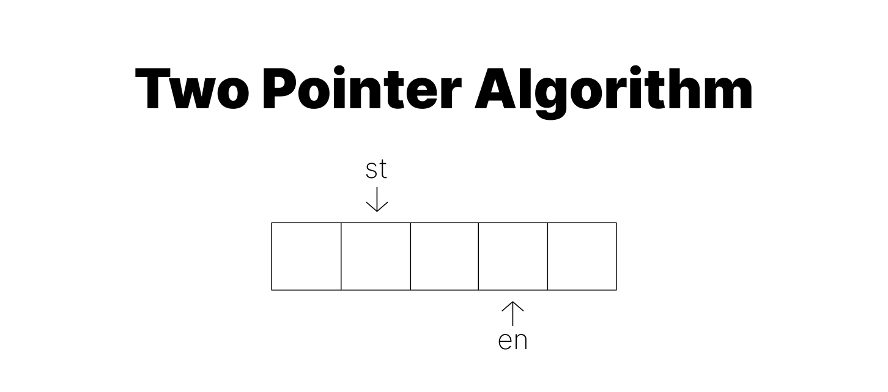
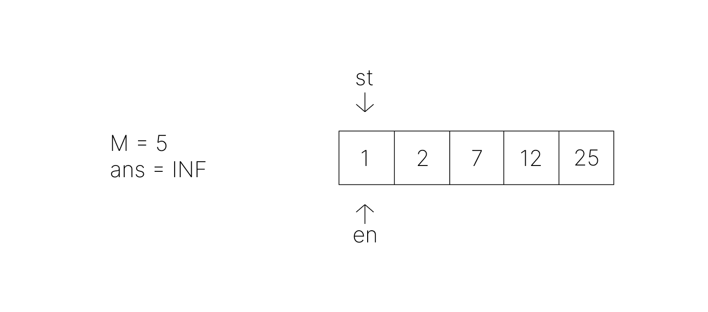
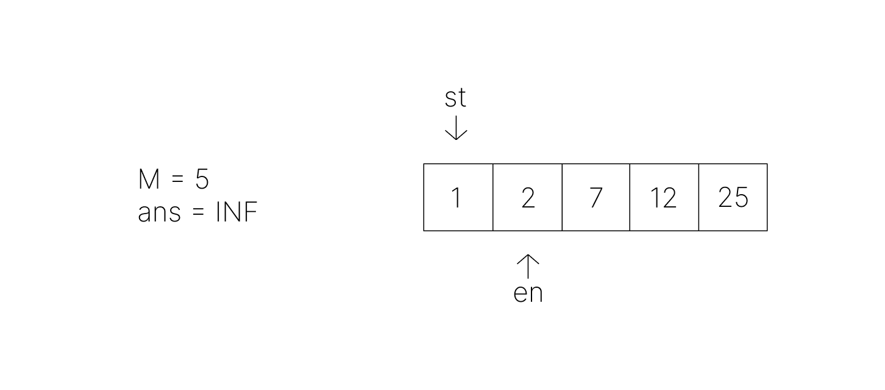
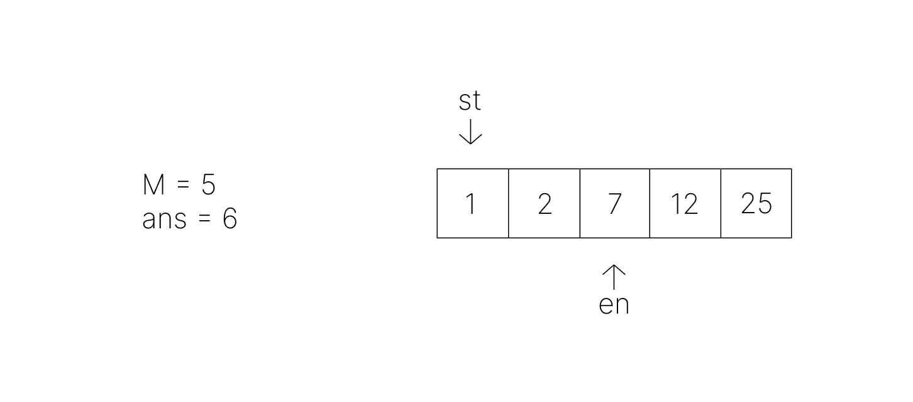
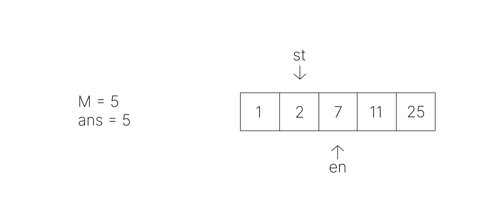
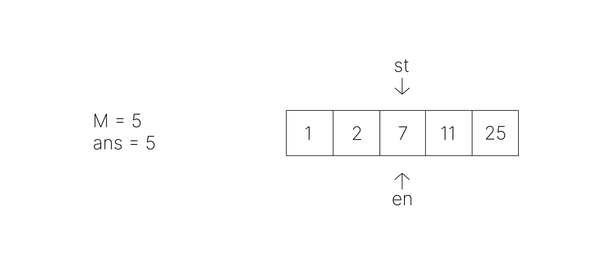
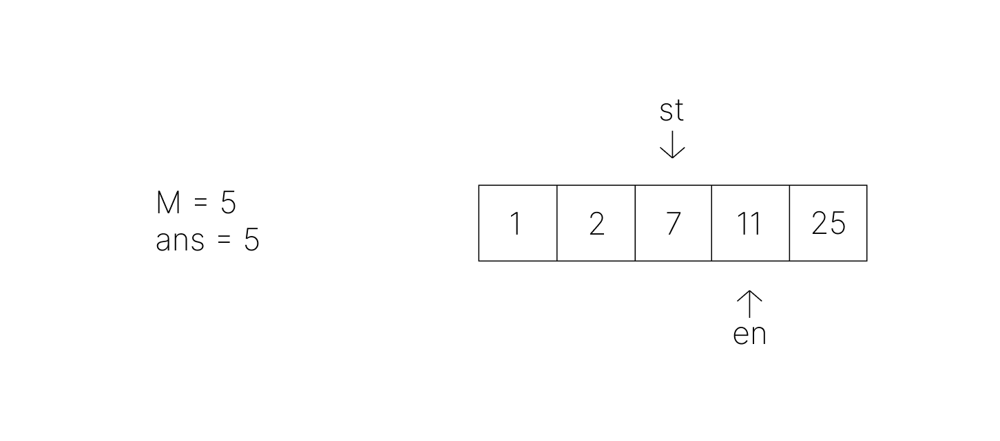
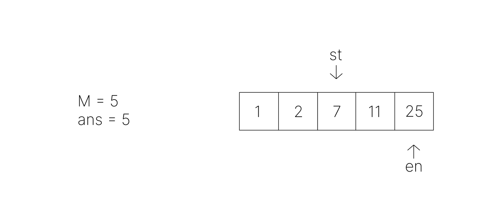

# [Algorithm] 투 포인터 알고리즘

<center></center><br>

최근 코딩 테스트 준비를 시작하며 어떻게 시간 복잡도를 줄이는지 전혀 감이 잡히지 않는 문제들이 있었는데, 투 포인터 알고리즘을 활용하면 풀릴 때가 여러 번 있었다. 특히 슬라이딩 윈도우 문제를 처음 접했을 때 포인터가 어떻게 동작하는 건지 도저히 이해가 되지 않았어서 내가 이해한 대로 차근차근 정리해보려고 한다. <span style="color:#737373; font-size:14px; font-weight:300;"> 처음 공부해 보는 내용이라 더 알고싶은 게 많기 때문에 설명에 오류가 있거나 더 좋은 방법이 있다면 반드시 댓글로 꼭 알려주시기를 간곡히 부탁드린다. 🙏 </span>

<br>

---

# 투 포인터 알고리즘이란?

<br>

- **배열**(또는 리스트)에서 두 개의 포인터를 움직여 원하는 값을 찾아내는 알고리즘

- **이중 for문을 이용한 탐색**으로 O(N²)의 시간복잡도를 가지는 작업을 **포인터 2개를 이용한 탐색**으로 O(N)에 해결하는 알고리즘

    - 이중 for문은 구조상 이전에 탐색했던 정보 값을 재사용하지 않는다.
    - 그러나 투 포인터를 이용하면 i = 0일 때 계산하면서 얻은 정보를 i = 1일 때 활용하는 방식으로 시간복잡도를 줄일 수 있다.

    **cf.** 삼중 for문의 경우 요소 하나를 고정시킨 후 투 포인터를 사용하면 O(N²)의 시간복잡도를 만들 수 있다.

- 주로 정렬된 배열에서 **주어진 조건을 만족하는 요소 쌍**을 찾는 데 사용한다.
- 정렬되지 않은 배열이라면 연속적인 부분 배열로 문제를 해결할 수 있어야 한다.

<br>

설명만으로 이해하기는 어렵기 때문에 바로 예제를 통해 알고리즘이 어떻게 동작하는지 알아보자.

<br>

---

# EX 1: BOJ 2230 수 고르기

<br>

> <a href="https://www.acmicpc.net/problem/2230" target="_blank">📑 BOJ 2230 수 고르기</a>

<br>

주어진 수열에서 두 수를 골랐을 때, 그 차이가 M 이상이면서 가장 작은 경우를 출력하는 문제이다.  
M = 5, 수열 A = {2, 12, 1, 25, 7}일 때로 가정하고 설명해보겠다.

### 이중 for문

가장 단순한 방법으로 이중 for문을 이용한 탐색을 떠올릴 수 있다. 수열의 원소가 N개일 때 `i = 0 ... N-1` 동안 각각 N번, `|A[i] - A[j]|`가 M 이상이면서 최소값인지 확인하는 방법이 있다. 그러나 이 경우 시간복잡도가 O(N²)이다. 이러한 이중 반복문을 개선하는 방향으로 문제를 해결할 수는 없을까? 라는 아이디어로 투 포인터를 활용할 수 있다.


```py

    for i in range(N):
        for j in range(i, N):
            if abs(A[i]-A[j]) >= M:
                ans = min(ans, abs(i-j))

```

### 투 포인터 알고리즘

우선 가장 먼저 파악해야 할 포인트는 주어진 수열을 비내림차순으로 **정렬**한 뒤 투 포인터를 활용해야 한다는 점이다. **포인터의 이동**은 답을 효율적으로 구하기 위한 **특별한 의미**를 지녀야 한다.

예를 들어 배열이 [1, 2, 3, 4, 5]와 같이 정렬되어 있을 때 오른쪽 포인터의 오른쪽 이동은 '두 수의 차이가 커진다'라는 의미를 가진다. 반대로 왼쪽 포인터의 오른쪽 이동은 '두 수의 차이가 작아진다'라는 의미이다.

하지만 배열이 정렬되어 있지 않다면 포인터의 이동은 무의미하다. 즉 이전에 탐색했던 정보와 앞으로 탐색할 정보 사이의 관계가 사라져, 이를 활용할 수 없게 된다.

```py

    INF = 2000000000
    M = 5
    # 정렬했다고 가정
    A = [1, 2, 7, 12, 25]
    ans = INF

```

배열을 정렬한 상태라고 가정하고 투 포인터 알고리즘으로 해답을 찾아볼 것이다.  
그림에서 직접 포인터를 움직여가며 동작원리를 이해해보자.

<br>

---

<center></center><br>

- 배열의 시작 요소(0)에 시작 포인터와 끝 포인터를 배치한다.
    - 변수 st가 반복문의 i, en이 j와 유사한 역할
- 요소를 탐색하며 두 수의 차이값을 계산하고
- 그 값이 M 이상인지 확인한 뒤
- 현재 ans보다 작은 차이값이 등장할 때 업데이트해줄 것이다.

<br><center></center><br>

- 우선 기본적으로는 새로운 값을 탐색해야 한다. en을 오른쪽으로 이동시켜 두 수의 차이를 점점 크게 만들면서 M보다 큰지 확인할 것이다.
- 첫 번째 이동 후 차이값은 1이고 M보다 작으므로 새로운 값 탐색을 계속한다.

<br><center></center><br>

- 두 번째 이동 후 차이값이 6이 되고, M 이상이므로 현재 answer 값과 비교해보면 6이 새로운 ans 값이 된다. 드디어 M 이상이라는 조건을 만족하는 지점까지 왔기 때문에 **오른쪽으로 en을 이동하면 차이값이 더 커지는 것은 자명하다.**
    - 이러한 아이디어로 불필요한 탐색을 줄일 수 있게 되는 것이다.
- 이제 차이값 중 최소라는 조건을 만족시키기 위해 st를 오른쪽으로 이동시킬 것이다.

<br><center></center><br>

- st의 이동 후 차이값이 5가 되고, 여전히 M 이상이며 5가 새로운 최소값이 된다.
- 아직 M 이상이라는 조건을 만족하므로 st 이동 킵고잉

<br><center></center><br>

- st의 이동 후 차이값이 0이 되고, M 이상이라는 조건을 만족하지 않는 지점까지 오게 되었다.
- 이제 여기서부터는 다시 새로운 값 탐색을 할 필요성이 생기는 것이다.
- 따라서 다음에 수행할 일은 en의 이동으로 차이값을 키우는 작업이다.
- 이러한 방식으로 탐색을 반복하면 된다!

<br><center></center><br>

- en의 이동 후 차이값은 4, M 이상을 만족하지 않으므로 탐색을 이어간다.

<br><center></center><br>

- en의 이동 후 차이값은 18, M 이상을 만족하지만 최소 차이값이 아니다.
- 이제 다시 st의 이동을 시작한다.

- 이 과정을 배열의 인덱스를 벗어나기 전까지 반복한다.
    - 탐색이 끝날 때까지 반복하는 것이므로 포인터 en을 기준으로 종료 시점을 설정하면 된다.

<br>

다음과 같은 python 코드로 구현 가능하다.
이중 for문과 달리, 요소 탐색에서의 시간복잡도가 O(N)으로 감소했음을 확인할 수 있다. <span style="color:#737373; font-size:14px; font-weight:300;"> 단, 전체 시간복잡도는 정렬의 시간복잡도 O(NlogN)의 영향을 받는다. </span>

```py

    # 두 수의 차이 최소값 초기화
    INF = float("inf")
    ans = INF

    # N, M 입력
    N, M = map(int, input().split(' '))

    # A 입력 배열로 받기
    A = []
    for i in range(N):
        A.append(int(input()))

    # A 정렬
    A.sort()

    # en에 따른 st의 움직임
    en = 0
    for st in range(N):
        # 조건에 맞는 en 설정: 차이값이 M 이상이면 en 이동 멈춤
        while en < N and A[en] - A[st] < M :
            en += 1

        # en 포인터가 배열을 벗어나면 즉시 종료
        if en >= N:
            break

        # 차이값 중 최소값 찾기
        ans = min(ans, A[en] - A[st])

    # 정답 출력
    print(ans)

```

**cf.** while문에서 en의 범위를 먼저 체크해줘야 list out of index error가 발생하지 않는다.

<br>

---

# EX 2: BOJ 1806 부분합

<br>

> <a href="https://www.acmicpc.net/problem/1806" target="_blank">📑 BOJ 1806 부분합</a>

<br>

어떤 배열의 부분 배열 합에서 포인터의 이동은 **이미 의미를 지닌다.** 자연수로 구성된 배열에서 오른쪽 포인터를 오른쪽으로 이동한다면 부분합은 당연히 증가할 것이다. 따라서 이 문제는 `정렬되지 않은 배열의 연속적인 부분 배열을 활용하는 문제`라고 할 수 있다.

이처럼 정렬되지 않은 배열에서도 투 포인터를 활용해 문제를 해결할 수 있다.  

알고리즘의 동작 원리는 첫 번째 예제와 동일하며, 첫 번째 코드를 조건에 맞게 변형하면 다음과 같은 코드로 투 포인터 탐색을 구현할 수 있다.

```py

    # 부분 배열의 길이 최소값 초기화
    INF = float("inf")
    ans = INF

    # N, S, 배열 A 입력 받기
    N, S = map(int, input().split(' '))
    A = list(map(int, input().split(' ')))

    # en에 따른 st의 움직임
    en = 0
    tempSum = A[0]

    for st in range(N):
        if st > 0:
            tempSum -= A[st-1]
        
        while en < N and tempSum < S :
            en += 1
            if en < N:
                tempSum += A[en]

        # en 포인터가 배열을 벗어나면 즉시 종료
        if en >= N:
            break

        # 조건을 만족하는 부분 배열의 길이 중 최소값 찾기
        ans = min(ans, en - st + 1)

    # 정답을 찾지 못하면 0 출력, 찾으면 정답 출력
    if ans == INF:
        print(0)
    else:
        print(ans)

```

<br>

---

# 함께 알아둘 알고리즘 키워드

### 정렬

- 앞서 언급했듯 데이터를 정렬한 뒤 투 포인터 알고리즘을 사용하는 문제가 많다.
- 문제의 조건을 바탕으로 정렬이 가능한지 또는 필요한지 판단해볼 수 있다.

### 슬라이딩 윈도우

- 고정 크기의 윈도우가 이동함에 따라 내부 데이터들을 활용할 수 있게 해준다.
- 특정 구간의 값 비교에 유용하다. (최대, 최소, 구간합, 부분 문자열 등)
- queue의 동작 구조와 유사하다.
    - 한쪽 끝에서 요소 push, 한쪽 끝에서 요소 pop
- 윈도우의 크기가 변하는 경우 투 포인터 알고리즘을 사용할 수 있다.
    - 윈도우의 크기가 고정적이라면 포인터가 두 개일 필요가 없다.

### 이분탐색

문제 풀이에 함께 사용된다기보다, 투 포인터 알고리즘으로 풀리는 문제가 이분탐색으로 풀리거나 이분탐색으로 푼 문제가 투 포인터 알고리즘으로 풀리는 경우가 있다. 이분탐색 역시 포인터 두 개를 처음과 끝으로 설정하고 탐색 범위를 반씩 줄여 나간다는 점에서 투 포인터와 유사한 점이 있기 때문이다. 투 포인터로만 풀리거나 투 포인터를 이용해 시간 복잡도를 줄일 수 있는 경우도 있으나, 정렬된 배열에서 특정 값을 찾는 등 이분탐색을 사용하는 것이 훨씬 간편할 수 있으므로 문제에 따라 적절히 활용할 수 있겠다.


<br><br>
<details>
<summary> &nbsp; 📁 참고 자료</summary>
<div markdown="1">
- <a href="https://www.geeksforgeeks.org/two-pointers-technique/" target="_blank">https://www.geeksforgeeks.org/two-pointers-technique/</a>
- <a href="https://blog.encrypted.gg/1004" target="_blank">[실전 알고리즘] 0x14강 - 투 포인터</a>
- <a href="https://hstory0208.tistory.com/entry/%EC%95%8C%EA%B3%A0%EB%A6%AC%EC%A6%98-%ED%88%AC-%ED%8F%AC%EC%9D%B8%ED%84%B0Two-Pointers-%EC%8A%AC%EB%9D%BC%EC%9D%B4%EB%94%A9-%EC%9C%88%EB%8F%84%EC%9A%B0Sliding-Window" target="_blank">[알고리즘] 투 포인터(Two Pointers)란?</a>

</div>
</details>