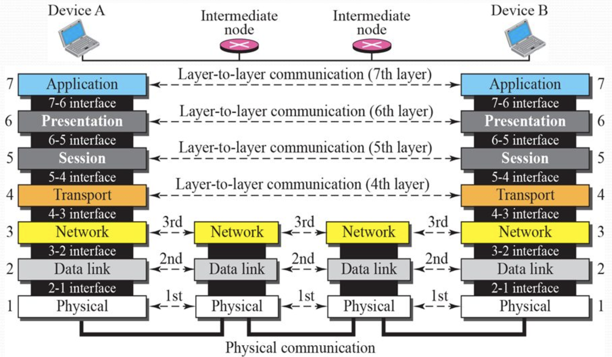
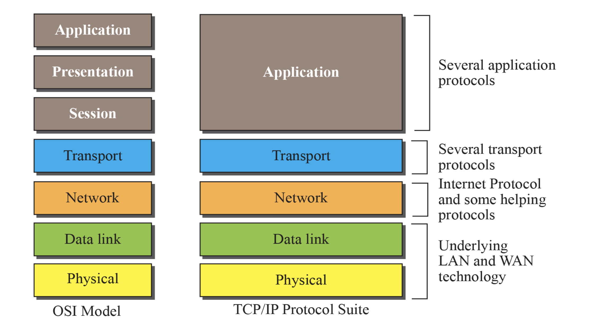
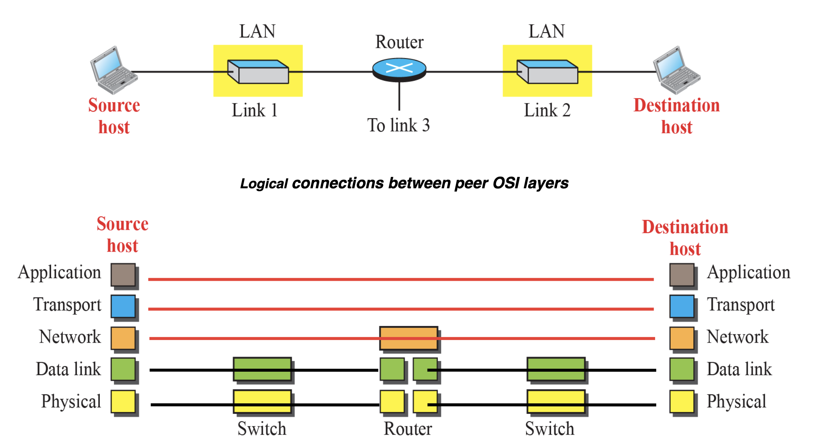

# [Network] OSI 7계층과 TCP/IP 4계층

인터넷에서 컴퓨터들이 서로 정보를 주고받을 때에는 각각의 상황에 따른 **통신 규약**이 필요하다. 이러한 통신 규약을 **프로토콜**이라고 하며, 이를 통해 네트워크 통신이 일어나는 과정을 **OSI 7 계층 모델** 또는 **TCP/IP 4계층 모델**로 설명할 수 있다.
  
컴퓨터들 간의 통신은 사람이 *말을 뱉고, 말이 공기를 통해 전달되고, 다른 사람이 말을 듣는 대화의 과정* 혹은 *편지를 쓰고, 내용을 암호화한 뒤, 봉투에 넣어 우편을 보내는 과정* 에 빗대어 이해할 수 있다. 이러한 하나하나의 동작이 계층을 이루게 되며, 이 계층들 간에는 상관 관계가 없다. 오로지 각 계층에서 산출된 결과만 전달할 뿐이다.

 

---

# OSI 7 Layer

 

  

## 1. Physical Layer

- 디바이스 간 비트(Bit) 단위 0과 1을 보낼 수 있도록 연결해주는 무선 또는 유선 회로이다.

- 물리적인 매체로 0과 1을 구현하여 데이터를 전송한다.
    - 즉 데이터를 전기적인 신호로 표현하고, 디바이스 간의 물리적인 연결을 정의하는 계층이다.

- 데이터를 **전달**하는 것 그 자체만 생각한다.

## 2. Data Link Layer

- 1계층 Physical layer의 에러를 감지하고 복구한다.
- 송신과 수신의 속도를 일치시키는 흐름 제어 및 속도 조절을 담당한다. flow control

- PDU: **프레임(Frame)**

> **cf. PDU (Protocol Data Unit)**
>
> - 네트워크의 어떠한 계층에서 계층으로 데이터가 전달될 때 한 덩어리의 단위를 말한다.
> - 제어 관련 정보들이 포함된 '헤더', 데이터를 의미하는 '페이로드'로 구성되어 있다.
> - 계층마다 부르는 명칭이 다르다.

 

- 0110101.. 과 같은 데이터를 올바른 값으로 읽을 수 있도록 `프레임`으로 나누는 역할이라고 생각할 수 있다.

- MAC Layer + Data Control Layer로 세분화된다.

    - Media Access Control Layer
        - 데이터를 `프레임`이라는 단위로 캡슐화한다.
    - Logical Link Control Layer
        - 프레임의 순서를 제어한다.

- 프로토콜
    - Ethernet, MAC, PPP, LAN, Wifi
   
> physical layer와 data link layer는 주로 한몸으로 움직인다.  
> 이 계층들은 디바이스 두 대의 관계를 다룬다.
> 이러한 물리적 연결 위에 소프트웨어가 쌓인다고 생각하면 된다.

## 3. Network Layer

- 특정 호스트에서 또 다른 호스트로, 즉 어떤 경로로 데이터를 넘겨주는 중간 장치의 역할이다.
- routing(router), switching(hub)

- 이제 데이터는 데이터가 도착해야 할 디바이스를 찾아가야 한다.  
    목적지 디바이스의 주소인 **IP** 주소를 통해 경로를 탐색하여 목적지에 도달한다.

- PDU: **패킷(Packet)**

- 주요 프로토콜
    - IP(Internet Protocol)

## 4. Transport Layer

- 출발지에서 목적지까지 에러 검출 및 흐름 제어로 신뢰성 있는 데이터를 보장한다. end-to-end error control
    - 패킷의 전송이 유효한지 확인하고 전송에 실패한 패킷을 재전송

- 헤더에 **포트번호**가 포함되어 있어 디바이스의 여러 프로세스들 중 찾아가야할 프로세스를 구분한다.

- PDU
    - TCP일 때 **세그먼트(Segment)**
    - UDP일 때 **데이터그램(Datagram)**

- 주요 프로토콜
    - TCP(Transmission Control Protocol)
    - UDP(User Datagram Protocol)

### ❓ 2계층에서 에러 검출 및 복구가 일어나지만, 4계층에서도 필요한 이유가 무엇일까?

- 2계층의 통신 프로토콜들이 에러 검출 및 복구를 항상 수행하지 않으며, 하더라도 실패할 수 있기 때문이다. 복구를 시도하다가 실패하는 프로토콜들도 있고, 애초에 에러 검출 및 복구를 하지 않는 PPP와 같은 프로토콜도 존재한다.
- 또한 3계층 스위치/라우터의 특정 포트에 트래픽이 몰리게 되는 경우, 하드웨어나 프로그램 자체에 버그가 있는 경우 등 프로토콜 문제 이외에도 에러가 발생할 수 있다.
- 따라서 애플리케이션 바로 밑의 4계층에서 에러 검출 및 복구를 최종적으로 책임지게 된다.

 
   
> 1, 2, 3, 4계층은 운영체제 내부에서 관리된다.
> 5, 6, 7계층에서 웹 서버가 작동한다.

## 5. Session Layer

- 디바이스의 프로세스 간 세션 연결을 설정, 유지, 종료한다.
    - 세션을 관리함으로써 응용 프로그램 간 데이터를 동기화할 수 있고,  
    하나의 서비스를 구성하는 등록, 인증, 과금 등의 동작이 수행될 수 있다.

- authentication, authorization(permissions), session restoration

- 프로토콜
    - SSH (Secure Shell)
    - TLS (Transport Layer Security)

## 6. Presentation Layer

- 영상, 채팅, 글자 등 데이터의 표현 방식(형식)을 결정하는 계층이다.
- 데이터의 인코딩-디코딩 및 암호화가 일어난다.
- encryption, compression

- 프로토콜
    - JPG, MPEG, SMB, AFP

## 7. Application Layer

- 기술들을 묶어 하나의 서비스로 제공한다.
- 사용자가 볼 수 있는 인터페이스를 갖는다. 즉 사용자와 하위 계층 간의 데이터 전달을 담당한다.

- 주요 프로토콜
    - HTTP, DNS, Telnet, FTP 등

 

---

## 🤔 OSI 7 Layer, TCP/IP 4 Layer와는 무엇이 다른가?

 

 

TCP/IP 계층과 달리 OSI 계층은 애플리케이션 계층을 세 개로 나누고 링크 계층을 데이터 링크 계층 / 물리 계층으로 나눠 설명하는 것이 다르며, 인터넷 계층을 네트워크 계층으로 부른다는 점이 다르다.

OSI 7계층 모델은 통신을 조금 더 세분화하여 설명하며 네트워크를 처음 학습할 때 사용하는 이론적 모델이고, 실제 **인터넷 프로토콜 스위트**  인터넷 프로토콜의 집합 는 TCP/IP 4계층 모델에 기반하여 동작한다.

 

---

# TCP/IP 4 Layer

TCP/IP 4계층은 OSI 7계층보다 단순화된 구조로, 실질적으로 인터넷과 대부분의 네트워크 통신에서 사용한다.  
7계층과 반대로 상위 계층인 애플리케이션 계층부터 하나씩 살펴보도록 하자!

 

  

 Data link, Physical 레이어를 하나의 Link 레이어로 본다. 

## 1. Application Layer

- 애플리케이션 계층은 응용 프로그램이 사용되는 계층으로,  
    웹 서비스, 이메일 등 **서비스를 실질적으로 사용자에게 제공**하는 계층이다.

- 프로토콜
    - FTP
    - SSH
    - HTTP
    - SMTP

## 2. Transport Layer

- 전송 계층은 송신자와 수신자를 연결하는 통신 서비스를 제공한다.
- 애플리케이션과 인터넷 계층 사이의 데이터가 전달될 때 중계 역할을 한다.
- 연결 지향 데이터 스트림 지원, 신뢰성, 흐름 제어

- 프로토콜
    - TCP
    - UDP

## 3. Internet Layer

- 인터넷 계층은 장치로부터 받은 네트워크 패킷을 IP 주소로 지정된 목적지 디바이스로 전송한다.
- 상대방이 제대로 받았는지에 대해 보장하지 않는다.  비연결형적 특성 

- 프로토콜
    - IP
    - ARP
    - ICMP

## 4. Link Layer

- 링크 계층은 전선, 광섬유, 무선 등으로 실질적으로 데이터를 전달하며, 장치 간 신호를 주고받는 `규칙`을 정하는 계층이다.
- 네트워크 접근 계층이라고도 한다.

- 물리 계층과 데이터 링크 계층으로 나누기도 한다.
    - 물리 계층: 유무선 LAN을 통해 0과 1로 이루어진 데이터를 보낸다.
    - 데이터 링크 계층: 이더넷 프레임을 통해 에러 확인, 흐름 제어, 접근 제어를 담당한다.

  

 &nbsp; 📁 참고 자료

    

    ❗️ <a href="https://backendcode.tistory.com/167" target="_blank">[네트워크] OSI 7 계층 (OSI 7 Layer)</a>
    

    

    ❗️ 면접을 위한 CS 전공지식 노트 (도서)
    

    

    ❗️ 컴퓨터 네트워크 수업을 열심히 들은 나
    

