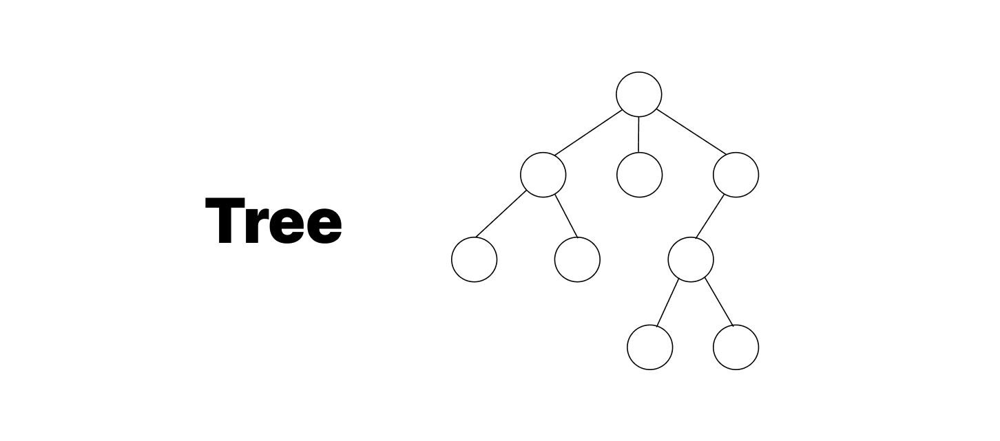
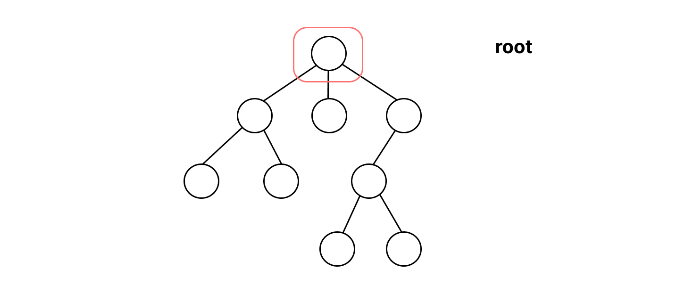
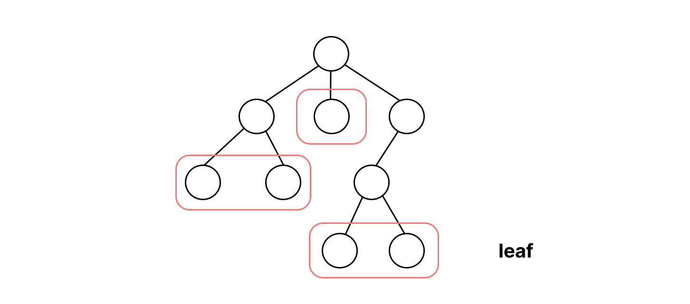
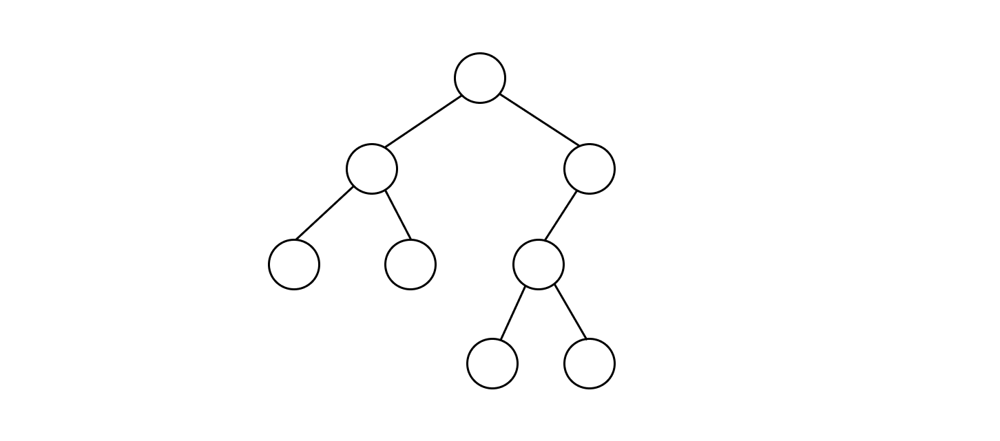
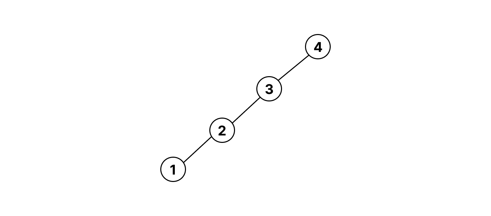
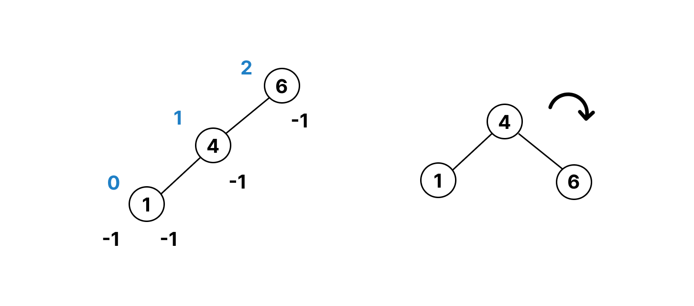
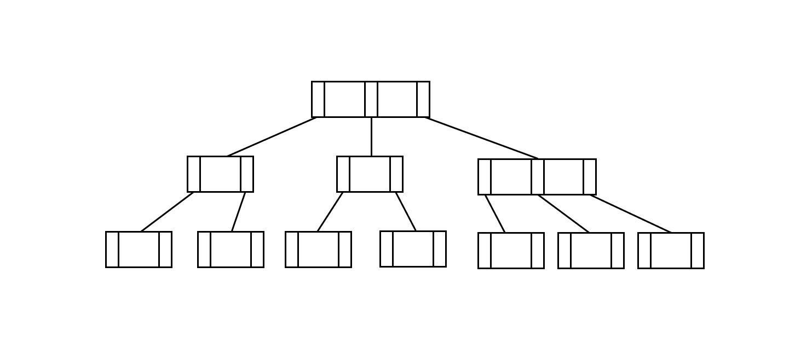

# [Data Structure] 트리(Tree) 자료구조란?

# 트리의 특징

트리 자료구조는 **계층구조**를 갖는 **비순환**의 **연결 그래프**로 **비선형 자료구조**이다.

> **그래프와 트리의 차이?**  
> - 트리는 계층 구조(루트 노드, 부모-자식 관계)가 존재한다.
> - 그래프는 사이클이 존재할 수 있다.
> - 그래프는 특정 두 노드를 잇는 간선이 여러 개일 수 있다.

## 비선형 자료구조

- 하나의 아이템 다음에 두 개 이상의 아이템이 올 수 있다.
- 복잡한 연결 관계를 저장할 수 있다.
    - 실생활의 여러 복잡한 데이터를 다루는 데 적합하다. 

**cf. 선형 자료구조**
- 하나의 아이템 다음에 단 하나의 아이템이 올 수 있다.
- 단순한 데이터를 저장할 때 사용한다.
- 구현이 쉬운 편이다.
- 메모리 저장 및 접근이 효율적이다.

## 비순환의 연결 그래프

- 비순환 그래프
    - 사이클이 없는 그래프
    > 사이클: 특정 노드에서 길(walk)을 따라가다 다시 초기 노드로 돌아올 수 있다면 사이클이 있는 그래프이다.

- 연결 그래프
    - 특정 노드에서 다른 노드로 가는 경로가 존재하는 그래프
    - 노드 간 경로가 없다면 연결 그래프가 아니다.
    > 경로: 그래프에 포함된 임의의 정점 사이에 가능한 길 중에서 같은 간선을 두 번 이상 포함하지 않는 길

 

---

# 트리의 구성 요소

루트 노드, 리프 노드, 깊이와 레벨, 높이에 관해 알아보자.

## Root node & Leaf node

- 루트 노드
    - 가장 상단에 위치하는 하나의 노드

- 리프 노드
    - 자식 노드가 없는 노드

## Depth & Level

- 깊이
    - 루트 노드를 기준으로 특정 노드까지의 거리를 측정한 것이다.
    - 루트 노드의 깊이 = 0
- 레벨
    - 일반적으로 깊이와 동일한 개념으로 사용한다.
    - 루트 노드의 레벨 = 0 으로 두는 경우가 많으나, 루트 노드 레벨을 1로 두는 상황 또는 문제가 존재하기도 한다.

## Height

- 높이
    - 리프 노드를 기준으로 특정 노드까지의 거리를 측정한 것이다.
    - 리프 노드의 높이 = 0
    - 트리의 높이 = Max(리프 노드로부터 루트 노드까지의 거리들)

 

---

# 트리의 형태와 종류

특정 노드에 연결된 자식 노드의 개수를 **차수**라고 한다. 일반 트리는 불규칙한 차수를 가질 수 있는데, 자주 사용되는 트리 자료구조의 형태를 생각해본다면 트리의 형태는 크게 두 가지로 나눠볼 수 있다. 차수가 2인 **이진 트리**와 그보다 큰 차수를 갖는 트리로 나누어 트리의 종류와 용도에 대해 정리해보자.

## Binary Tree

-  **이진 트리**

    - 루트 노드를 중심으로 두 개의 서브트리로 이루어진 트리
    - 나누어진 두 개의 서브트리도 이진 트리라는 재귀적 특성을 갖는다.
        - 따라서 공집합도 이진트리로 정의한다.

## Binary Search Tree

- **이진 탐색 트리**
- BST

    - **이진 트리에서 탐색**을 하기 위한 자료구조로, 데이터를 저장할 때 다음과 같은 규칙을 갖는다.

    1. 이진 탐색 트리의 노드에 저장된 키는 유일하다.
    2. 왼쪽 자식 노드의 키는 부모 노드의 키보다 작다.
    3. 오른쪽 자식 노드의 키는 부모 노드의 키보다 크다.
    4. 왼쪽과 오른쪽 서브트리도 이진 탐색 트리이다.

## Binary Heap

- **힙**

    - **이진 트리에서 최솟값 또는 최댓값을 빠르게 찾기** 위한 자료구조로, 데이터를 저장할 때 다음과 같은 규칙을 갖는다.

    1. 최소힙의 경우 부모 노드의 키는 자식 노드의 키보다 작다.
    2. 최대힙의 경우 부모 노드의 키는 자식 노드의 키보다 크다.

    따라서 루트 노드가 최솟값 또는 최댓값이 된다.

- 최소 힙
    - 원소의 삽입, 최솟값 확인, 최솟값 삭제
- 최대 힙
    - 원소의 삽입, 최댓값 확인, 최댓값 삭제

의 기능을 제공한다.

 

---

## Balanced Binary Search Tree

- **이진 균형 탐색 트리**
- BBST

이진 탐색 트리에는 `편향` 문제가 존재한다.  
삽입과 삭제 연산에서 어떤 데이터가 어떤 순서로 연산되냐에 따라 다음과 같이 한 쪽 깊이로 그래프가 쏠리는 현상이 나타날 수 있다. 이러한 형태의 그래프는 탐색에 있어 시간복잡도(`O(height)`)가 증가하여 좋지 않다.

따라서 항상 트리의 `균형`을 유지하도록 설계된 이진 균형 탐색 트리가 등장했다. 일반적으로 **균형도가 절대값 2 미만인 경우**를 **균형** 트리라고 한다.

## AVL Tree

- **AVL 트리**

- **균형도**의 개념을 이용하여 삽입, 삭제 연산 시 트리의 균형을 맞춘다.
- null: 높이 `-1`로 둔다.
- 균형도 = (좌측노드 높이) - (우측노드 높이)

삽입, 삭제 후 균형도가 2 이상인 경우가 발생하면, rotate라는 연산을 통해 트리의 균형을 다시 맞춰준다.

## Red-Black Tree

- **레드 블랙 트리**
- RBT

- 각 노드에 색상 정보를 부여하여 균형을 유지한다.
- AVL 트리와 다르게 균형도 규칙이 아닌 자체의 규칙을 가지는데, 이에 따라 AVL 트리보다는 재배치 가능성이 적다. 즉 삽입 삭제 성능이 좋다.  그래서 균형 트리 중 가장 자주 사용하는 편이라고 한다. 

- 모든 노드는 빨강 또는 검정이다.
- 루트 노드는 검정이다.
- 항상 리프 노드는 null이며 검정이다.
- 새로운 노드는 빨강으로 삽입된다.

- 모든 빨강 노드의 자식은 검정이다.
- 특정 노드에서 리프 노드로 가는 경로에는 동일한 수의 검정 노드가 존재한다.

위 두 개의 규칙으로 인해 색상 변경 및 재배치 작업이 일어나고 트리의 균형이 유지된다.

 

---

 

다수의 데이터를 효율적으로 관리하기 위해, 차수가 2보다 큰 트리를 사용할 수 있다.

## B-Tree

- **비트리**

    - 하나의 노드가 가질 수 있는 자식 노드의 최대 숫자가 2보다 큰 트리

- 최대 m개의 자식을 가질 수 있는 트리를 m차 B-트리라고 한다.
    - 최대 m-1개의 키를 가질 수 있다.
- 루트, 리프 노드를 제외한 각 노드는 최소 ⌈M/2⌉개의 자식 노드를 가진다.

- 삽입 연산을 반복하여 각 노드가 가질 수 있는 키의 개수를 위반하게 되면 `노드 분할`을 통해 트리의 **균형**을 유지한다.

## B+Tree

- **비 플러스 트리**

    - B-Tree의 변형으로, 모든 데이터가 리프 노드에만 저장된다.
        - 비트리의 **순차 접근 문제**를 해결하기 위해 등장했다.
        - 데이터를 선형 탐색해야 할 경우 중위 탐색이 필요한데, 그렇다면 트리 전체를 탐색하게 되어 성능 저하가 발생한다.
    - 리프 노드가 연결 리스트 형태로 저장된다.
    - 범위 검색에 용이하기 때문에 데이터베이스의 인덱스를 구현할 때 자주 사용한다.

## B*Tree

- **비 스타 트리**

    - B-Tree의 개량으로, 비트리의 메모리 낭비, 보조 연산 문제를 해결하기 위해 등장했다.
        - 비트리는 전체 노드의 상당 부분이 비어있게 되는 문제가 있었다.
        - 삽입, 삭제 연산 후 재배치로 인한 연산을 최소화하기 위한 규칙이 추가된다.

    - 루트 노드를 제외한 모든 노드는 최대 2m-1에 대해 2/3 이상의 데이터가 저장되어야 한다.
    - 노드가 넘칠 경우 일단 양쪽 형제 노드로 키를 재분배하고, 모든 형제 노드가 가득 찬 상태일 때만 노드 분할을 수행한다.

  

 &nbsp; 📁 참고 자료

    

    ❗️ <a href="https://github.com/JaeYeopHan/Interview_Question_for_Beginner/tree/main/DataStructure#binary-heap" target="_blank">Interview_Question_for_Beginner - DataStructure
    </a>
    

    

    ❗️ <a href="https://velog.io/@chanyoung1998/B%ED%8A%B8%EB%A6%AC" target="_blank">B-트리란?
    </a>
    

    

    ❗️ <a href="https://8iggy.tistory.com/191" target="_blank">B+트리, B*트리(B+Tree, B*Tree)
    </a>
    

