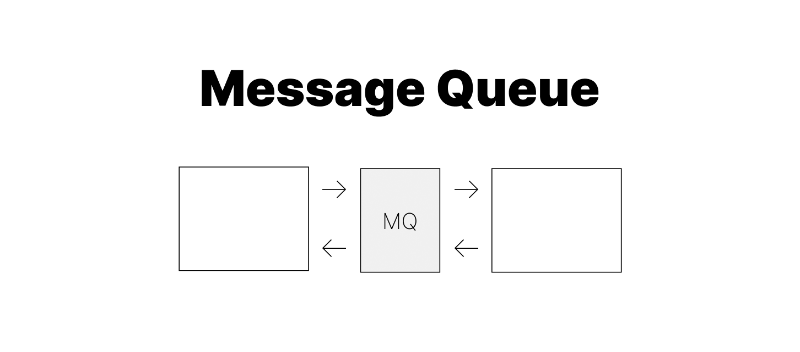
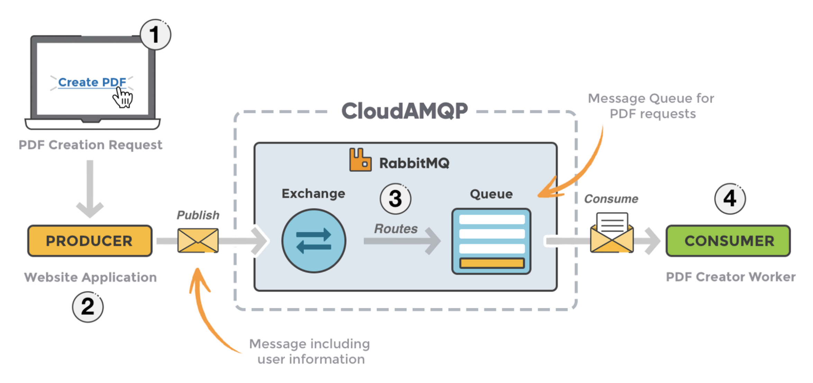

# [Network] 메시지 큐(Message Queue, MQ)란?

# Message Queue란?

메시지 큐 Message Queue, MQ 란 메시지 지향 미들웨어와 메시지 브로커를 소프트웨어로 구현한 기술이다.

## Message Oriented Middleware (MOM)

- 메시지 지향 미들웨어/디자인

- 독립적인 애플리케이션 간 데이터를 주고받을 수 있도록 하는 시스템 디자인
    - 함수 호출의 개념이 아니라 **메시지를 교환할 수 있도록 해주는 중간 계층**에 대한 개념이다.
    - 분산 시스템 간 메시지를 교환하는 방식을 통해 결합성을 낮춘 통신을 가능하게 한다.
    - 따라서 `MSA`에서 서비스간 결합도를 낮추는 데이터 송수신 방법으로 사용된다.
- 비동기로 메시지를 전달한다.
- 메시지 전달의 방식은 `Queue, Brodcast, Multicast` 등이 있다.
- 메시지를 발행하는 Publisher(Producer), 메시지를 소비하는 Subscriber(Consumer)로 구성된다.

## Broker

시스템 간 메시지 또는 이벤트를 송수신하기 위해 중개자인 브로커를 사용한다.

### 메시지 브로커 (Message Broker)

- 서비스 간의 메시지 전달을 중개한다.
- Producer가 생산한 메시지를 메시지 큐에 저장한다.
- 저장되어있는 메시지를 Consumer가 가져갈 수 있게 한다.
- Consumer가 메시지 큐에서 데이터를 가져가면 짧은 시간 내에 메시지 큐에서 삭제된다.
- RabbitMQ, ActiveMQ, AWS SQS, Redis

### 이벤트 브로커 (Event Broker)

-  이벤트의 게시와 구독을 관리하는 데 사용한다.
- 기본적으로 메시지 브로커의 역할을 수행할 수 있다.
- Producer가 이벤트를 발행하고, 이를 구독한 모든 Consumer에게 전달한다.
- 메시지 브로커와 달리 Consumer가 메시지 큐에서 데이터를 가져간 후에도 해당 데이터를 다시 소비할 수 있다.
- Kafka

### ❗️ Message Broker vs Event Broker

- 분산 시스템 간 통신에서 중요한 중개자의 역할을 한다.

- 메시지 브로커는 메시지의 순서를 보장하고, 장애가 발생했을 때 메시지의 손실을 방지하는 데 중점을 둔다.
- 이벤트 브로커는 대용량의 이벤트 데이터를 실시간으로 처리하고, 그 데이터를 영구적으로 저장하는 것이 중요하다.

## AMQP (Advanced Message Queueing Protocol)

- 메시지 지향 미들웨어의 표준 프로토콜
- 메시지를 안전하고 신뢰성 있게 주고받기 위한 인터넷 프로토콜

 

**메시지 큐**를 다시 한번 정리하자면, 메시지를 교환하여 통신하는 방식의 미들웨어 MOM 를 Queue를 이용한 소프트웨어로 구현한 것이라고 할 수 있다. 메시지 지향 미들웨어를 구현하는 과정에서 `메시지 브로커` 또는 이벤트 브로커 가 사용될 수 있고, 메시지 송수신의 안정성을 보장하기 위해 `AMQP`와 같은 프로토콜을 사용할 수 있다.

 

---

## 메시지 큐의 장점

### 비동기 (Asynchronous)

- Queue에 데이터를 넣어두고 처리 가능할 때 가져오는 방식으로 동작한다.

- HTTP 요청을 보내고 응답을 받는 방식은 서버 프로그램이 요청한 일을 수행할 때까지 클라이언트 프로그램이 대기하는 시간이 발생한다.
- 메시지 큐를 이용하면, 송신자는 요청을 큐에 넣어두고 곧바로 다른 일을 수행할 수 있으며 수신자는 바쁘지 않을 때 요청을 꺼내 수행한 뒤 다시 큐에 넣어둔다. 이렇게 하나의 요청에 대한 응답이 완료될 때까지 기다리지 않는 **비동기** 통신을 할 수 있다는 것이 메시지 큐의 특징이다.

### 낮은 결합도 (Decoupling)

MSA와 같은 여러 가지 아키텍처에서 지향하는 유연한 설계를 위해서는 하나의 서비스를 구성하는 애플리케이션 간 결합도를 낮추어야 한다. 이를 통해 확장성을 확보하고 유지 보수에 효율을 더하며, 장애가 전파되는 것을 방지할 수 있다.

### 과잉 (Redundancy)

정상적인 메시지 송수신이 실패할 때 재실행이 가능하기 때문에 복구할 수 있다. 처리할 일을 메시지로 메시지 큐에 넣어두면 장애가 발생한 일정 기간 동안 송신된 메시지는 큐에 남아있어, 복구가 가능하다.

따라서 다음과 같은 경우 메시지 큐를 사용한다.

- 이미지 처리, 비디오 인코딩, 대용량 데이터 처리와 같은 서버 부하가 많은 작업에 메시지 큐를 사용하여 작업을 비동기로 처리한다.
- 처리할 데이터가 많을 때 각 서버가 자신의 처리량에 맞게 작업을 큐에서 가져와 수행하는 부하 분산 처리에 사용된다.
- 데이터 손실을 방지하기 위해 사용한다.

 

---

# ZeroMQ (ØMQ, 0MQ or ZMQ)

  

   

- 분산/동시성 애플리케이션을 위한 비동기 메시징 라이브러리
- 메시지 지향 미들웨어와 다르게 **메시지 브로커 없이 작동**할 수 있다.  zero라는 이름은 브로커가 없다는 뜻도 담고 있다 
- Berkeley socket과 유사하게 디자인되었다.
    - Berkeley socket API의 일부를 사용한다.
    - 일반적인 소켓 기반 통신으로 이해할 수 있다. ZeroMQ를 사용하면서도 소켓을 생성하고 연결하고 메시지를 송수신하는 코드를 작성하게 된다.

- ZeroMQ API는 **소켓**을 제공하여 각 엔드포인드 간 `many-to-many` 커넥션을 만들 수 있다.
- `메시지` 단위로 시스템이 운영되기 때문에, 프로토콜을 직접 다루기보다 `메시징 패턴`을 사용하여 네트워크 통신을 쉽게 구현할 수 있다.

- 추상화를 통해 네트워크 통신의 복잡성을 감추고 개발자가 **메시지를 주고받는 방식에 집중**할 수 있도록 도와준다.
- 대신 브로커가 없기 때문에 브로커가 제공하는 영속성 및 전달 보장성이 없다.

### Messaging Patterns

- **Request-reply**

    - 클라이언트와 서비스를 연결하여, 클라이언트가 요청을 보내면 서비스가 응답하는 패턴
    - RPC(Remote Procedure Call)
    - Task distribution pattern

- **Publish-subscribe**

    - 발행자와 구독자를 연결하여, 발행자가 데이터를 전송하면 구독자가 데이터를 받는 패턴
    - Request-reply가 일대일 통신이라면 Publish-subscribe는 일대다 통신
    - Data istribution pattern

- **Push-pull**

    - push 노드가 pull 노드들에게 데이터를 순차적으로 전송하는 패턴
    - Pipeline 패턴이라고도 함
    - Parallel task distribution / Collection pattern

- **Exclusive pair**

    - 두 개의 특정 소켓 사이를 연결하여 독점 쌍으로 만드는 패턴
    - 특정한 경우에만 사용하는 Advanced low-level pattern

 

---

# RabbitMQ

  

   

- 오픈소스 메시지 브로커 소프트웨어  혹은 메시지 지향 미들웨어 
- AMQP  Advanced Message Queuing Protocol 를 구현한 프로그램
- 메시지 송수신의 신뢰성, 안정성을 위한 다양한 기능을 제공한다.
- 브로커 중심의 형태를 가진다.

- 유연하고 복잡한 라우팅을 지원한다.
- 관리 UI가 존재하며, 거의 모든 언어와 운영체제를 지원한다는 장점이 있다.
- 데이터 처리가 주력이기 보단 관리 측면이나 다양한 기능 구현을 위한 서비스 구축에 사용한다.

 

 

 

---

# Apache Kafka

  

   

- **대규모 데이터 스트리밍과 이벤트 처리**에 특화된 메시징 시스템
- 기존 범용 메시징 시스템 대비 `TPS(Transaction Per Second)`가 매우 우수한 편이다.
- 다만 대규모 데이터 스트리밍에 특화된 만큼 범용 메시징 시스템에서 제공하는 다양한 기능들은 제공하지 않는다.
- AMQP를 사용하지 않고 단순한 메시지 헤더를 가진 TCP 기반 프로토콜을 사용하여 오버헤드를 감소시켰다.
- Consumer가 브로커로부터 직접 메시지를 가지고 가는 pull 방식으로 동작하여, 자신의 처리 능력 만큼만 메시지를 가져와 성능이 향상되었다.

<!--  

---

## 메시지 큐 기반 아키텍처 -->

  

 &nbsp; 📁 참고 자료

    

    ❗️ <a href="https://kaizen8501.tistory.com/218" target="_blank"> [RabbitMQ] 다른 메시지 큐 간 차이 (MQTT, ZeroMQ, Kafka)
    </a>
    

    

    ❗️ <a href="https://victorydntmd.tistory.com/343C" target="_blank"> 메시징 시스템의 이해
    </a>
    

    

    ❗️ <a href="https://medium.com/naukri-engineering/naukriengineering-rabbitmq-messaging-that-just-works-dafcd0cfd194" target="_blank"> RabbitMQ 사진 출처
    </a>
    

    

    ❗️ <a href="https://velog.io/@choidongkuen/%EC%84%9C%EB%B2%84-%EB%A9%94%EC%84%B8%EC%A7%80-%ED%81%90Message-Queue-%EC%9D%84-%EC%95%8C%EC%95%84%EB%B3%B4%EC%9E%90" target="_blank"> [서버] 메세지 큐(Message Queue) 을 알아보자
    </a>
    

    

    ❗️ <a href="https://velog.io/@spamdong/%EB%A9%94%EC%84%B8%EC%A7%80-%EC%A7%80%ED%96%A5-%EB%AF%B8%EB%93%A4%EC%9B%A8%EC%96%B4MOM" target="_blank"> 메세지 지향 미들웨어(MOM)
    </a>
    

