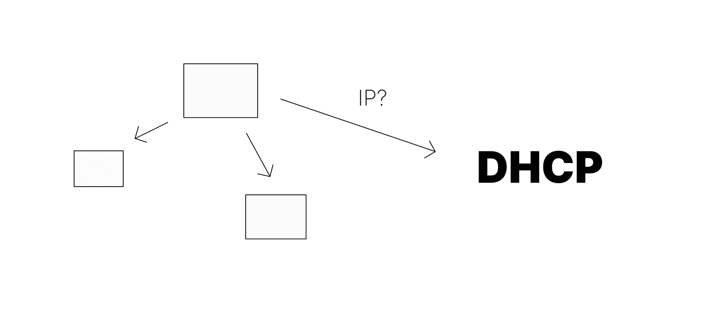
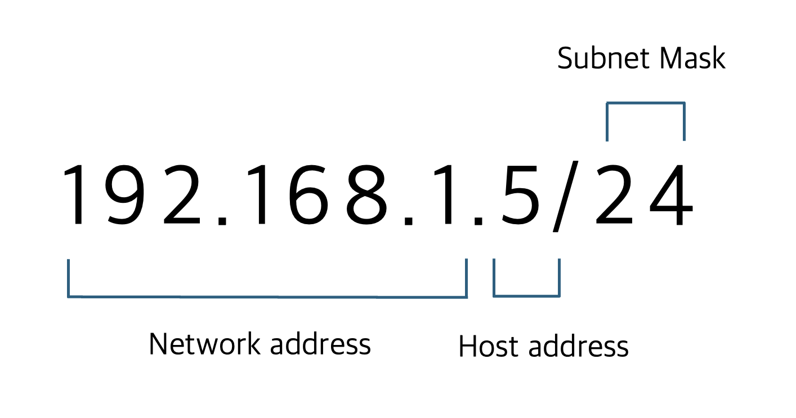
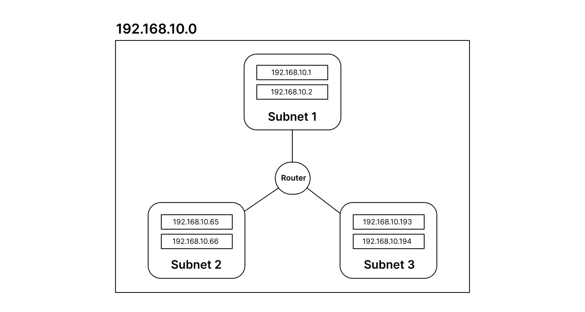
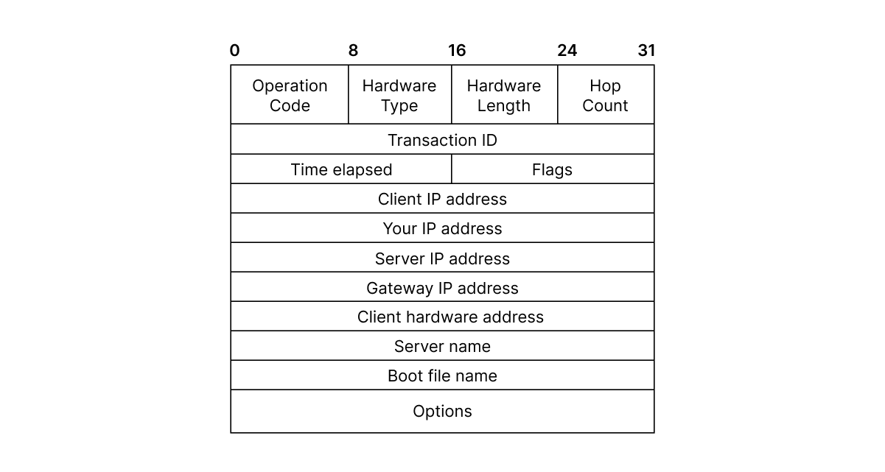
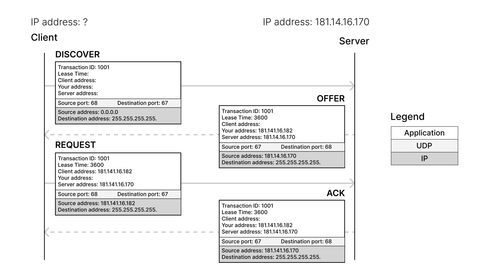
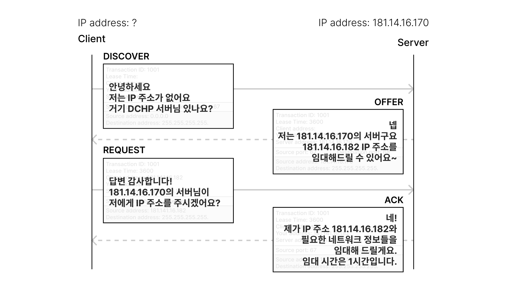

# [Network] DHCP를 이해하자

특정 조직에서 인터넷을 사용하기 위해, 인터넷 서비스 제공자(ISP)로부터 IP 주소 블록  연속적인 IP 주소의 범위 을 할당받을 수 있다. 쉽게 말하면 학교, 회사, 카페 등 여러 장치가 인터넷에 접속해야 하는 집단은 그들에게 나눠줄 수 있는 IP 주소를 한꺼번에 제공받는다. 이렇게 조직에 IP 주소 블록이 할당된 후, 네트워크 관리자는 개별 호스트나 라우터에게 수동으로 IP 주소를 하나씩 나눠줄 수도 있을 것이다. 그러나 실제로 조직에서의 IP 주소 할당은 **DHCP**라는 프로토콜을 통해 자동으로 수행된다.

DHCP는 어떻게 동작할까? 이를 이해하기 위해 IP주소와 관련한 개념부터 살펴보자.

 

---

# IP Address

- 네트워크에서 통신을 위해 부여된 각 장치의 위치 주소

    - 장치들 간 메시지를 주고받기 위해서는 수신자와 발신자가 어디에 위치해 있는지 알고 있어야 한다. 네트워크 내에서 특정 장치의 위치를 식별해주는 유일한 주소이다.

- 네트워크와 호스트를 식별하기 위한 주소

    - 커다란 네트워크에서 특정 네트워크의 위치를, 또 네트워크 내부의 개별 장치들을 구별해준다는 의미로 이해할 수 있다.

- 즉 IP 주소는 두 부분으로 나뉜다.

    - `네트워크 주소` + `호스트 주소`

 

 IP 주소의 예시, IPv4. 8비트의 필드 4개. 각 필드는 십진수로 표현되어 있다. 

 

## IP 주소의 형식과 사용 범위에 따른 분류

### IPv4 vs IPv6

- IP 주소 지정 시스템의 두 가지 버전으로 `IPv4`와 `IPv6`가 있다.
- 32비트 주소 형식을 사용하는 IPv4의 주소 범위가 부족해지자 등장한 것이 128비트 주소 형식의 IPv6로, 단계적으로 대체되고 있으나 아직까지는 Ipv4를 사용하는 장치가 대부분이다.  따라서 해당 포스팅에서도 IPv4 형식의 주소를 이용해 설명할 것이다. 

### Private IP

- 사설 IP
- 내부 네트워크  공인되지 않은 조직 내부의 네트워크, 라우터 안쪽의 네트워크 에서 사용하는 주소

- RFC 1918 표준에 정의되어 있는 사설 IP 주소 대역

    - 내부 네트워크에서 사용하도록 예약되어 있는 IP 대역
    - 포함된 IP 주소의 개수, 즉 규모에 따른 클래스로 구별
    - A가 가장 큰 규모, B는 중규모, C는 가정용과 같은 소규모에 적합한 클래스이다.

    - class A `10.0.0.0` ~ `10.255.255.255`
    - class B `172.16.0.0` ~ `172.31.255.255`
    - class C `192.168.0.0` ~ `192.168.255.255`

### Pubic IP

- 공인 IP
- 인터넷 전 세계적으로 연결된 네트워크 에서 유일하게 식별되는 주소
- 인터넷 상의 다른 네트워크나 장치와 통신할 때 사용
- `Internet Service Provider, ISP`에서 할당해준다.

> ISP란? 여러 사용자가 인터넷에 접속할 수 있도록 인터넷 연결 서비스를 제공하는 공인된 조직이다. 한국에서는 KT, SK Broadband, LG U+ 등이 있다.

 

## Subnet

- 하나의 네트워크를 더 작은 네트워크로 분리하는 개념이다.
- **Subnet Mask**를 이용하여 IP 대역을 나눔으로써 네트워크가 세분화된다.

> IP 주소 범위를 IP 대역이라고 한다.  
> 숫자들로 이루어진 네트워크의 IP 주소 범위는 다시 여러 개의 범위로 나눌 수 있을 것이다.

- 네트워크 세분화로 인한 성능 개선, 관리 효율 증가의 효과가 있다.

### Subnet Mask

- 앞서 IP 주소는 `네트워크 주소 + 호스트 주소`로 이뤄진다고 언급했었다.
- IP 주소 뒤에 표기한 서브넷 마스크의 비트 수는 어디까지가 네트워크 주소를 나타내는지를 의미한다.

 

 앞에서부터 24비트를 가린다. 네트워크 주소는 왼쪽의 24비트, 나머지 8비트는 호스트 주소. 

> cf. 이 서브넷에서 호스트 주소로 사용할 수 있는 주소의 개수는 254개이다.
>
> 호스트 주소가 가질 수 있는 값은 하나의 옥텟, 0부터 255으로 256개 아닌가?  
> IP 주소에서 특별한 의미로 예약된 값이 존재하기 때문에 이를 제외하고 254개이다.  
>
> `호스트 부분이 전부 0인 경우`: 해당 서브넷의 네트워크 주소를 의미  
> `호스트 부분이 전부 255인 경우`: 해당 네트워크의 브로드캐스트 시 사용하는 주소

 

 

- 세분화된 작은 네트워크들이 각각의 서브넷이 된다.

- 각각의 서브넷 주소 범위는 세분화할 네트워크 주소 값과 `서브넷 마스크 값`의 비트 연산을 통해 정해진다. 그러나 오늘의 목표인 DHCP 이해에 핵심적으로 작용하진 않아 깊게 다루지 않을 것이다.

 

## Gateway

- 서로 다른 IP 대역과 통신하기 위해 거쳐가는 개념적 통로

    - 같은 네트워크의 장치들은 서로의 위치 주소를 알고 있다. 하지만 다른 네트워크에 존재하는 장치와 통신하기 위해서는 **게이트웨이를 통해** 다음으로 연결할 네트워크 대역에 맞는 IP 주소를 얻어야 한다.

- 예를 들어 가정용 공유기 = 라우터 는 기본 게이트웨이의 역할을 수행한다.

    - 내부 네트워크와 외부 네트워크 인터넷  간의 데이터 전송을 중계한다.

    - ISP와의 연결을 관리하여 데이터가 나가야 할 방향을 결정해준다.

 

DHCP를 이해하기 위해 필요한 개념들을 가볍게 훑어보았으니 이제 DHCP를 파헤쳐보자.

 

---

# DHCP

- **Dynamic Host Configuration Protocol**

- 네트워크에 연결된 장치들에게 IP 주소를 비롯한 네트워크 설정 정보를 자동으로 할당하는 통신 규약

- 호스트 Host 가 네트워크에 접속하고 싶을 때 구성 정보 Configuration 를 동적으로  Dynamic  제공해준다.
- 새로운 호스트가 네트워크에 연결되고 DHCP 서버에 요청 메시지를 보내면, 서버는 IP 주소를 포함한 기본적인 네트워크 설정 정보를 할당해준다.

새로운 호스트가 연결될 때마다 네트워크 관리자가 수동으로 작업하는 것이 아니라, DHCP를 사용한 자동 IP 할당이 이루어진다.

## DHCP 통신의 구성 요소

**DHCP 클라이언트**

- 네트워크 설정 정보가 필요한 장치  

    `e.g.` 공부하기 위해 카페에 노트북을 들고갔을 때, 인터넷에 연결하고자 IP주소를 필요로 하는 내 노트북

**DHCP 서버**

- DHCP 서버를 작동하는 장치

- 라우터를 서버로 사용하거나 따로 서버를 구축한다.  
    `e.g.` 카페의 공유기

**IP 주소 풀**

- 클라이언트에서 이용할 수 있는 IP 주소의 범위. 일정한 IP 대역.

- DHCP 서버 설정 시 임대 시간  IP 주소를 대여할 수 있는 기간  등과 함께 관리자가 정의한다.

**+) DHCP 릴레이**

- 클라이언트와 서버가 서로 다른 서브넷에 있는 경우 통신하기 위한 네트워크 장비

- 여러 네트워크에서 하나의 중앙 DHCP 서버를 이용할 수 있게 해준다.

## DHCP Message Format

 

- **Operation Code**

    - 메시지 유형 요청과 응답 을 구분
    - `1: request`, `2: reply`

- **Hardware Type**

    - 네트워크 인터페이스의 물리적 유형을 나타냄
    - IANA Internet Assigned Numbers Authority 에서 정한 표준 값을 사용

- **Hardware Length**

    - 하드웨어 주소의 길이

- **Hop Count**

    - 서버와 클라이언트가 다른 네트워크에 있을 때, 릴레이 에이전트가 패킷을 중계한다.
    - 클라이언트가 0으로 세팅하여 발송하며, 릴레이를 경유할 때마다 값이 증가한다.

- **Transaction ID**

    - 요청과 응답 쌍을 짝 짓는 데 사용하는 수
    - 클라이언트가 랜덤으로 32비트의 수를 선택한다.

- **Time Elapsed**

    - Number of Seconds
    - 네트워크 정보의 임대 획득 또는 갱신 이후 경과한 초의 수

- **Flags**

    - 클라이언트가 서버의 응답을 `유니캐스트/브로드캐스트` 중 어떤 방식으로 받기 희망하는지 전달
    - `0: unicast`, `1: broadcast`

- **Client IP Address**

    - 클라이언트의 IP 주소
    - 최초 요청시에는 주소를 갖지 않으므로 `0.0.0.0`으로 세팅된다.

- **Your IP Address**

    - 서버가 클라이언트에 할당하는 IP 주소
    - 응답메시지에 포함된다.

- **Server IP Address**

    - `Offer, Ack` 단계에서 서버의 IP 주소를 돌려줘야 한다.
    - 이때 사용하는 서버 자신의 IP 주소

- **Gateway IP Address**

    - 기본 게이트웨이의 IP 주소
    - 또는 릴레이가 존재할 경우 DHCP Relay Agent의 IP 주소

- **Client Hardware Address**

    - 클라이언트의 MAC 주소

- **Server Name**

    - 서버 호스트의 이름
    - String 타입

- **Boot File Name**

    - 클라이언트가 부팅할 때 사용할 부트 파일의 경로 및 파일명

- **Options**

    - DHCP 확장 대부분이 이 옵션을 통해 구현된다.
    - 주로 DHCP 응답 메시지에 사용되는 추가 정보가 여기에 담긴다.

 

---

# DORA: DHCP Operation

DHCP 통신 과정은 네 단계로 구성된다. 각 단계의 앞 글자를 따서 `DORA`라고 부른다.

 

 

- 메시지의 일부 정보만 표기하였다.

- `UDP`로 메시지를 주고받는다.

    - `port 67`: DHCP Server
    - `port 68`: DHCP Client

- Destination address의
`255.255.255.255.`는 `IPv4`에서의 브로드캐스트 주소로
네트워크 내 모든 장치가 수신한다.

### 🤔 DHCP는 몇 계층 프로토콜일까?

DCHP는 `전송 계층의 UDP`를 사용해 클라이언트-서버 통신을 수행하고, 이를 통해 네트워크 계층의 IP 주소와 관련된 네트워크를 설정한다. 이렇게 하위 계층의 전송 프로토콜을 이용해 정보를 주고받지만 **실제 서비스 제공은 애플리케이션 계층에서 이루어진다.** 7계층은 사용자와 네트워크 서비스를 이어주는 계층으로, IP주소와 네트워크 정보를 제공하는 DHCP의 동작은 애플리케이션 계층에서 수행된다.  위 다이어그램에서는 색상으로 계층을 구분해두었다. legend를 참고하라.

## 1. Discover (Client)

처음 장치를 부팅할 때에는 IP 주소가 없다.
부팅 후 네트워크가 시작되면 IP주소를 설정하여 TCP/IP를 초기화하려는 시도를 한다.
따라서 LAN 내에서 DHCP 서버를 찾는 요청을 생성 후 메시지를 브로드캐스트한다.

> 왜 브로드캐스트하는가?  
> 아직 서버의 위치, 즉 주소를 알지 못하기 때문이다.

## 2. Offer (Server)

Discover 메시지를 받은 서버는 사용 가능한 IP 주소 하나와 필요한 네트워크 정보를 담은 DHCP 패킷을 만들어 브로드캐스트한다. 클라이언트의 IP 주소가 아직 없기 때문이다. 다만 클라이언트의 MAC 주소로 유니캐스트도 가능하다고는 한다. 

> IP 주소 외에 전달되는 네트워크 정보들은 무엇이 있을까?  
> 
> 서브넷 마스크, 기본 게이트웨이 주소, DNS 서버 주소는 IP 주소와 함께 Offer 단계에서 제공된다.  
> 이들은 클라이언트가 네트워크에 연결하기 위해 필수로 주어져야 할 정보들이다.

## 3. Request (Client)

받은 클라이언트가 IP 주소를 즉시 사용하지 않고 주소를 포함한 패킷을 다시 브로드캐스트한다.  하나의 네트워크에 여러 대의 DHCP 서버가 있을수도 있기 때문이다. 채택되지 않은 서버에게도 전달하여 채택되지 않은 사실을 알려야 한다. 

## 4. Ack (Server)

서버가 자신이 채택되지 않았다면 해당 IP 주소를 주소 풀에 유지하고,
채택되면 임대 기간동안의 네트워크 정보를 담은 패킷을 최종적으로 유니캐스트 또는 브로드캐스트한다.

 

 

다시 흐름만 살펴보자면 이런 느낌으로 DHCP 통신 과정이 이루어진다고 이해할 수 있다!

 

---

## DHCP 사용의 장단점

DHCP를 사용하는 이유와 DHCP의 단점은 다음과 같이 이해할 수 있다.

 

- **장점**

    - 켜져있는 장치에만 IP 주소가 할당되므로 고정 IP에 비해 IP를 절약할 수 있다.

    - 네트워크 정보가 변경되었을 때 DHCP 서버에만 변동 사항을 반영하면 된다.

- **단점**

    - DHCP를 사용하는 장치는 부팅 시 Broadcast 메시지를 전송하므로 트래픽이 발생한다.
        
        - 모든 단말에 전송되므로 네트워크 성능 저하가 발생한다.
    
    - 임대 기간이 존재하므로 그 전에 장치를 끄면 남은 기간 동안은 해당 IP를 사용하지 못한다.
    
        - 또한 지속적인 사용을 위해서는 임대 기간이 끝나기 전 새로운 요청을 생성해야 한다.
    
    - DHCP 서버에 의존하므로 서버에 문제가 생기면 장치들이 네트워크 설정 정보를 할당 받지 못한다.

        - 따라서 같은 스코프 내에서 DHCP 서버를 이중화하는 `DHCP Failover` 구성을 사용하기도 한다.

     

## DHCP의 주소 할당 방식

DHCP 서버는 동적 할당 외에도 다른 방식으로 IP 주소를 할당할 수 있다. 따라서 환경에 따라 알맞은 방식을 사용하여 단점을 보완할 수 있을 것이다.

 

- **동적 할당**

    - 임대 기간 Lease time 동안 주소를 할당
    - 혹은 주소를 할당받은 장치에서 해지 메시지를 보낼 때까지 할당

- **자동 또는 영구 할당**

    - 서버가 자동으로 할당한 주소가 특정 클라이언트에게 기간에 상관없이 영구적으로 할당
        - 따라서 과거 할당한 IP 주소 정보가 저장되어 있어야 한다.

- **수동 할당**

    - 클라이언트의 MAC 주소에 따라 고정 IP를 할당하는 방식
    - DCHP 서버 설정 시 관리자가 수동으로 지정

 

> 서버를 구현한 하드웨어 또는 소프트웨어 플랫폼에 따라 구체적인 할당 방식에는 차이가 있을 것으로 보인다.

  

 &nbsp; 📁 참고 자료

    

    ❗️ Textbook: Behrouz A. Forouzan, “Data Communications and Networking, 5th Edition”, McGraw-Hill Companies, Inc.
    

    

    ❗️ <a href="https://blog.naver.com/khnkd/80180898474" target="_blank">IP주소를 수동으로 할당? 난 자동이다! DHCP!</a>
    

    

    ❗️ <a href="https://m.blog.naver.com/s87boyo/223083936128" target="_blank">공유기 DHCP란 무엇일까?</a>
    

    

    ❗️ <a href="https://velog.io/@suyeon12/dhcp#-dhcp%EC%9D%98-%EA%B5%AC%EC%84%B1%EC%9A%94%EC%86%8C" target="_blank">DHCP</a>
    

    

    ❗️ <a href="https://steadiness.dev/subnet/" target="_blank">서브넷(Subnet), 서브넷 마스크(Subnet Mask) 정리</a>
    

    

    ❗️ <a href="https://www.garykessler.net/library/dhcp.html" target="_blank">The Dynamic Host Configuration Protocol (DHCP) and Windows NT</a>
    

    

    ❗️ <a href="https://docs.oracle.com/cd/E19455-01/806-5529/dhcp-overview-8/index.html" target="_blank">Solaris DHCP Administration Guide</a>
    

