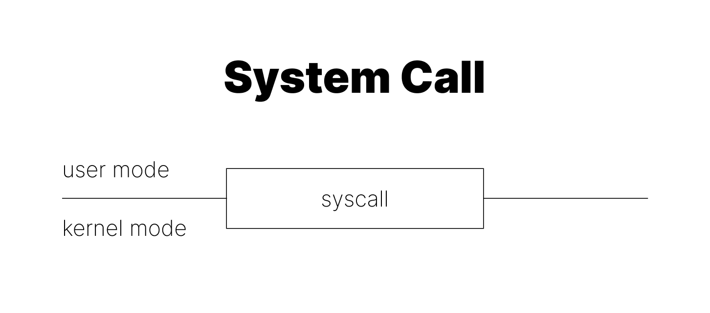
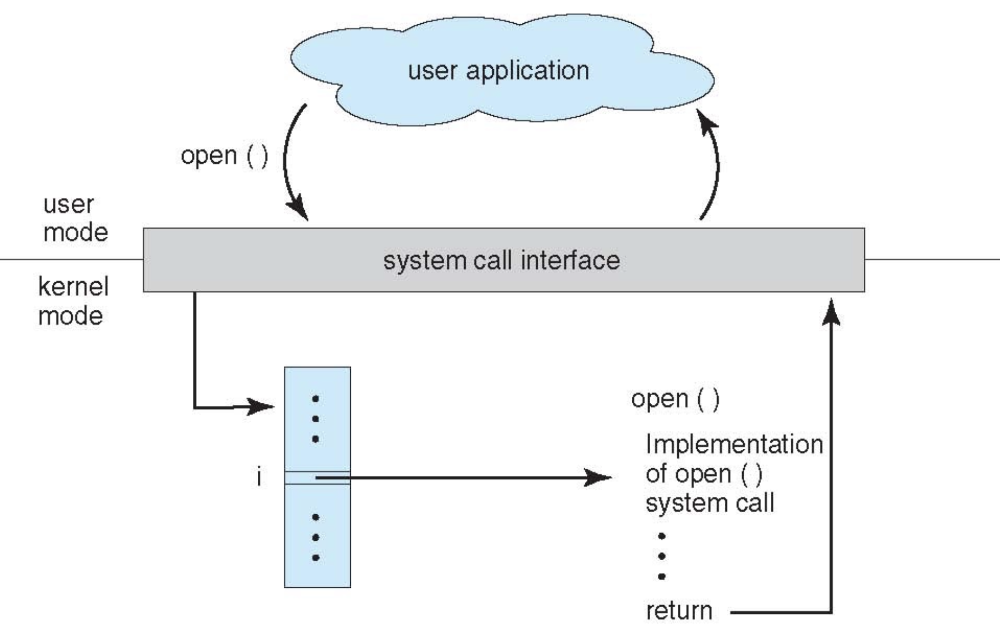
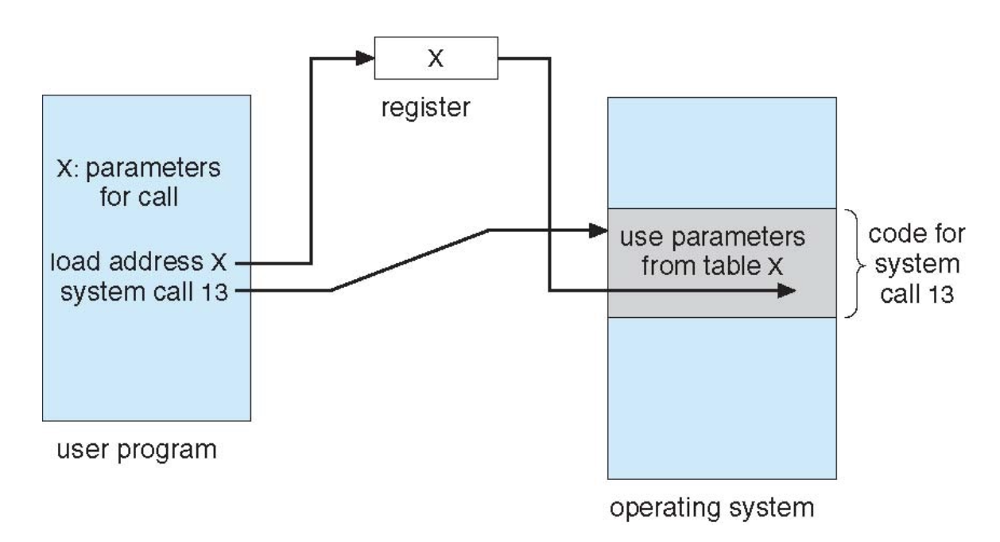

# [OS] 시스템 콜(System Call)

 

사용자 프로그램이 컴퓨터 시스템에서 특정 작업을 수행하고자 한다면 일단 운영체제에게 부탁을 해야 한다. 디스크를 읽거나, 화면에 결과를 출력하는 등의 행위는 운영체제에게 요청을 보냄으로써 이루어지는 것이다. 이러한 부탁을 위한 인터페이스가 **시스템 콜**이다.

사용자 프로그램에서 시스템 콜을 호출하면 **Trap**이 발생한다. Trap이란 무엇일까?

 

---

# Interrupts

컴퓨터 시스템에서 이벤트, 에러, 예외 조건 등 특정 사건이 발생했을 때, CPU가 하던 일을 멈추고 이를 처리할 수 있는 특정 작업을 수행하도록 하는 메커니즘을 통틀어 **Interrupt**라고 부른다. Interrupt는 발생 원인과 동작 방식에 따라 다음과 같이 구분할 수 있다.

## Interrupt

- 모든 메커니즘을 아우르는 말이기도 하지만, 보통 **하드웨어 장치에서 발생하는 인터럽트**를 Interrupt라고 부른다.

- 인터럽트가 처리된 뒤에는 **다음 명령어를 수행**한다.

- **비동기**  Asynchronous 인터럽트이다.

    - 프로세서 외부에서 발생하여, 프로세서는 해당 인터럽트가 언제 발생한다는 사실을 알지 못한다.

- 키보드나 마우스와 같은 입력 장치, 타이머나 외부 신호에 의한 인터럽트 등이 있다.

**e.g.** timer interrupt, keyboard interrupt, etc.

> timer interrupt는 프로세스들을 짧은 특정 시간만큼 번갈아 실행시켜 병렬적으로 실행하는 것처럼 보이게 해준다.

## Trap

- **소프트웨어에서 발생하는 인터럽트**로, 프로그램의 명령에 따라 명시적으로 발생시킬 수 있다.

- **동기**  Synchronous  인터럽트이다.

    - `실행하고 있는 명령어의 결과`에 의해 발생하는 이벤트이다.

- kernel을 호출하는 경우로 하드웨어 인터럽트와 반대 방향으로 발생하는 인터럽트라고 볼 수 있다.

- 인터럽트가 핸들링된 이후 **다음 명령어를 수행**한다.

**e.g.** `new` 키워드로 heap에 메모리를 할당하기

## Fault (Exception)

- **하드웨어에서 발생할 수도, 소프트웨어에서 발생할 수도** 있다.

- **동기**  Synchronous  인터럽트이다.

    - 그러나 사용자의 의도에 의해 발생되는 것은 아니고 오류로 인해 발생하는 것이다.  Exception  

- **CPU 명령에 의해 발생**한다. CPU가 명령을 실행하는 도중 예외 상황을 감지하여 발생한다.

- 일반적으로 CPU 프로세서가 fault를 감지하고 예외 처리가 완료되면, fault가 발생했던 프로그램에서 **원래 수행하던 명령어로 돌아간다.**

> 예를 들어 프로그램이 메모리에 존재하지 않는 페이지에 접근하는 page fault가 일어나면, 인터럽트가 발생해 운영체제가 디스크에서 필요한 페이지를 메모리로 가져온다. fault가 발생한 명령어는 제대로 실행되지 않은 것이므로, 이후 다시 해당 명령어로 돌아가 다시 실행하면 제대로 명령어가 실행된다. (하드웨어에서 발생한 인터럽트)

**e.g.** Divide-by-zero, page fault, protection fault, etc.

## Abort (Exception)

- **하드웨어에서 발생할 수도, 소프트웨어에서 발생할 수도** 있다.

- - **동기**  Synchronous  인터럽트이다. 마찬가지로 오류로 인해 발생하는 것이다.  Exception  

- 치명적인 오류로 인해 프로세서가 더 이상 프로그램을 실행할 수 없는 경우이다. 복구불가능한 상황을 처리하기 위한 인터럽트이며, **프로그램이 즉시 종료**된다.

 

본론으로 돌아와 시스템 콜에 대해 알아보자.

 

---

# System Call이란?

- 프로세스가 시스템의 하드웨어 자원에 접근하거나 서비스가 필요한 경우, 이를 운영체제에게 요청하는 인터페이스
- 듀얼 모드 시스템 체계에 의해 사용자의 프로그램이 실행되는 **User Mode**에서 시스템의 커널이 제공하는 서비스를 이용하기 위한 **Kernel Mode**로 전환한다.

## Dual Mode System

듀얼 모드 시스템은 운영체제를 보호하기 위한 보안 기법의 한 종류이다. 응용 프로그램이 운영체제의 자원(Memory, CPU, HardDisk 등)에 직접 접근하는 것을 막기 위해 `User Mode`와 `Kernel Mode`를 구분하여 요청에 따라 모드를 전환한다.

### User Mode

- 사용자가 만든 프로그램이 CPU를 사용하는 상태
- PC Register가 사용자 프로그램이 올라가 있는 메모리의 위치를 가리키고 있을 때
- 프로세스는 자체적으로 가상 주소 공간을 갖는다.
- 시스템 데이터에 일부 접근 가능하나 하드웨어 자원에는 직접 접근할 수 없다.

### Kernel Mode

- 운영체제가 CPU에 접근할 권한을 가진 상태
- PC Register가 운영체제가 존재하는 부분을 가리키고 있을 때
- 프로세스는 단일 주소 공간을 갖는다.
- 모든 시스템 자원에 접근할 수 있다.

## System Call이 필요한 이유?

- 커널이 해주는 작업은 User Mode인 응용 프로그램(대표적인 User Process)에서는 수행할 수 없다. 왜 커널 작업을 위해 모드를 분리하고 커널 모드로 전환한 후에 해당 작업을 수행하도록 해야 할까?

- 커널 모드로의 전환은 `작업을 수행할 권한을 얻는 것을 의미한다. 이 권한을 통해, 시스템 전체에 영향이 갈 수도 있는 하드웨어 명령어에 대한 엄격한 제한을 둠으로써 시스템 하드웨어를 보호할 수 있게 된다. 따라서 유저 모드에서 시스템 콜이 호출된다면 운영체제는 이를 불법적인 접근이라 여기고 trap을 발생시키는 것이다.

## 시스템 콜의 동작 방식

 

 

- `open()`이라는 시스템 콜을 호출한다.

    - 실제로 개발자가 직접 시스템 콜을 호출할 일은 거의 없으며, 프로그래밍 언어에서는 라이브러리 형태로 제공된다.

- 유저 모드에서 커널 모드로 전환한다.

- `open()`이라는 시스템 콜의 인덱스가 가리키는 곳에 이 작업에 대한 처리 과정이 저장되어 있다.

    - 커널 모드인 시간이 오래 지속된다는 것은 애플리케이션의 성능이 떨어진다는 뜻이다. 따라서 상수값으로 인덱스를 정해둔다.
    - `open, close, read, write 등` 반드시 필요하고 자주 사용하는 작업들이 접근성이 좋은 값에 배치된다.

- Parameter passing

    - 매개 변수 전달이 필요할 경우, CPU 레지스터에 직접 값을 전달하거나 매개변수를 메모리에 저장해 해당 메모리의 주소를 레지스터에 전달한다. 또는 프로그램에 의해 스택에 전달될 수도 있다(일반적인 매개변수 전달 방법).
    - 첫 번째 방법의 경우, 시스템 콜만 예외로 CPU 레지스터에 다이렉트로 넣을 수 있도록 해주는 것으로 이를 통해 커널 모드의 수행시간을 단축한다.

 

- 작업이 완료되면 시스템 콜의 결과가 사용자 프로그램에 반환되며 ,커널 모드에서 유저 모드로 다시 전환된다.

 

---

# 시스템 콜의 유형

- `Windows, Unix` 형식으로 구분하여 정리하였다.
- 앞서 언급했듯 개발자가 직접 다룰 일은 거의 없으므로 어떤 기능이 있다 정도만 이해해보자.

- **Process Control**

    - 프로세스 생성 및 종료, 메모리에 로드 및 실행 등

    - `CreateProcess()`, `fork()`
    - `ExitProcess()`, `exit()`
    - `WaitForSingleObject()`, `wait()`

- **File Manipulation**

    - 파일 생성 및 삭제
    - 파일 열기, 닫기, 읽기, 쓰기
    - 파일 속성 값 확인, 지정 등

    - `CreateFile()`, `open()`
    - `ReadFile()`, `read()`
    - `WriteFile()`, `write()`
    - `CloseHandle()`, `close()`

- **Device Manipulation**

    - 디바이스 요청 및 해제
    - 읽기, 쓰기 등

    - `SetConsoleMode()`, `ioctl()`
    - `ReadConsole()`, `read()`
    - `WriteConsole()`, `write()`

- **Information Maintenance**

    - 프로세스, 파일, 디바이스의 속성 가져오기 및 설정하기
    - 시간 확인, 지정 등

    - `GetCurrentProcessId()`, `getpid()`
    - `SetTimer()`, `alarm()`
    - `Sleep()`, `sleep()`

- **Communication**

    - 커뮤니케이션 연결 생성 및 삭제
    - 메시지 송수신 등

    - `CreatePipe()`, `pipe()`
    - `CreateFileMapping()`, `shmget()`
    - `MapViewofFile()`, `mmap()`

- **Protection**

    - Permission 획득 및 설정 등

    - `SetFileSecurity()`, `chmod()`
    - `InitializeSecurityDescriptor()`, `umask()`
    - `SetSecurityDescriptorGroup()`, `chown()`

  

 &nbsp; 📁 참고 자료

    

    ❗️ <a href="https://bo5mi.tistory.com/169" target="_blank">프레임워크와 라이브러리의 차이점</a>
    

    

    ❗️ <a href="https://yunchan97.tistory.com/68" target="_blank">[PintOS] 인터럽트는 무엇이며, 왜 필요하며, 타이머 인터럽트의 역할은 무엇인가</a>
    

    

    ❗️ <a href="https://blog.naver.com/palyly/20154645190" target="_blank">Interrupt / Trap / Fault / Abort</a>
    

    

    ❗️ <a href="https://velog.io/@ongddree/%EC%9A%B4%EC%98%81%EC%B2%B4%EC%A0%9C-%EC%9D%B4%EC%A4%91-%EB%8F%99%EC%9E%91-%EB%AA%A8%EB%93%9COS-dual-mode-operation" target="_blank">운영체제 이중동작모드</a>
    

    

    ❗️ <a href="https://velog.io/@nnnyeong/OS-%EC%8B%9C%EC%8A%A4%ED%85%9C-%EC%BD%9C-System-Call#%EC%8B%9C%EC%8A%A4%ED%85%9C-%EC%BD%9C%EC%9D%B4-%ED%95%84%EC%9A%94%ED%95%9C-%EC%9D%B4%EC%9C%A0" target="_blank">[OS] 시스템 콜, System Call</a>
    

