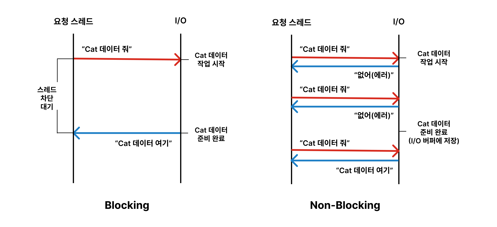
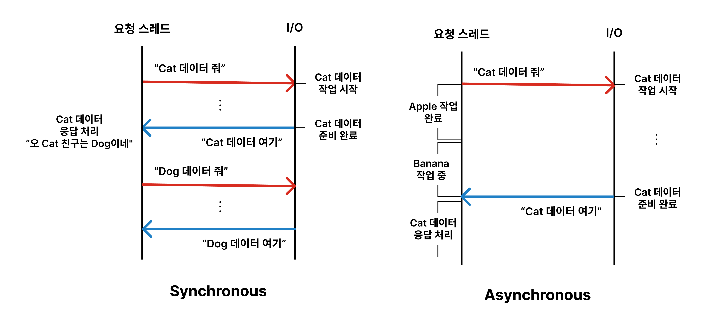

# 간단하게 이해하는 동기/비동기 vs 블로킹/논블로킹

일반적으로 운영체제에서 입출력 요청이 처리될 때에는 `Blocking/Synchronous` 또는 `Non-Blocking/Asynchronous`로 동작한다고 배웠습니다. 그러나 각각의 용어는 엄밀히 다른 개념이며, 특히 애플리케이션 프로그래밍을 할 때에는 상황에 따라 개념을 구분할 필요가 있다고 느꼈습니다.

따라서 **입출력 작업을 어떻게 처리할지 결정하는 관점에서, 동기/비동기와 블로킹/논블로킹**에 대해 나름대로 이해한 것을 간단하게 정리해 보았습니다. 정의를 이분법적으로 명확하게 구분하는 것보다 개발자가 어떤 특성을 활용하여 어떤 방식을 채택할 수 있는지에 집중해보려 합니다.

마지막으로는 입출력을 포함한 전반적인 요청을 처리할 때 어떤 작업 흐름으로 설계할 수 있을지 정리하며 마무리해보겠습니다 🙌

 

---

## Blocking vs. Non-Blocking

우선 블로킹과 논블로킹이 어떤 의미인지 생각해봅시다. **블로킹**이란 단어에서 알 수 있듯 무언가를 **막는, 차단하는** 처리 방식일 것입니다. 여기서 차단되는 것은 **요청을 보내는 스레드**입니다. 이는 결과로서의 의미이며, 블로킹과 논블로킹 I/O의 결정적인 차이는 다음과 같이 **응답 방식**으로 설명할 수 있습니다. 

#### Blocking

- 요청을 보낸 스레드는 **작업이 완료될 때까지 대기한 후 응답을 받습니다.**
- 요청을 보낸 스레드는 작업이 완료되어 응답이 도착할 때까지 **프로그램에 대한 제어권이 없습니다.**
- 이에 따라 응답 전까지 다른 작업을 수행할 수 없습니다.
- 즉 **요청을 보낸 스레드는 차단**되며, 기다림(Wait)이 발생합니다.
- 요청한 작업이 완료되면 응답이 반환되고 이에 따라 다시 프로그램에 대한 제어권을 얻습니다.

#### Non-Blocking

- 요청을 보낸 스레드는 **즉시 응답을 받습니다.**
- **프로그램에 대한 제어권이 즉시 반환**되어 작업 완료까지 대기하지 않습니다.
- 즉, 작업 완료 여부와 관계 없이 응답을 받습니다. (응답 데이터가 없을 수도 있습니다)

이해를 돕기 위해 매우매우 간단한 상황을 가정해 보았습니다.

 

 Blocking vs. Non-Blocking 

블로킹과 논블로킹 I/O를 그림으로 이해해 본다면 위와 같이 나타낼 수 있을 것입니다.

참고로 실제로는 `요청을 보낸 시점 = 작업 시작 시점`은 아닙니다. 대기 시간, 스레드 차단에서의 차이에 집중하기 위해 위 그림에서는 단순하게 표현해 보았습니다.

 

---

## Synchronous vs. Asynchronous

이번에는 동기와 비동기가 의미하는 바에 대해 생각해 봅시다. 동기, **동시에 일어난다**라는 것은 어떤 의미일까요? **요청에 대한 응답이 같은 때에 일어난다**는 뜻입니다.

사실 해당 표현은 모호하여 직관적으로 이해하기엔 어려움이 있다고 생각합니다. 따라서 [Wikipedia](https://ko.wikipedia.org/wiki/%EB%B9%84%EB%8F%99%EA%B8%B0_%EC%9E%85%EC%B6%9C%EB%A0%A5)에서 언급하고 있는 `Sequential/Non-Sequential`이라는 표현을 빌려 설명하려 합니다. 즉 둘을 구분하는 기준은 **작업의 순서**입니다. 여기서 '작업'이란 완료 시점까지를 포함한 개념입니다.

#### Synchronous (Sequential)

- **요청에 대한 작업의 순서가 보장**됩니다.

- 작업을 순차적으로 진행하거나, 작업이 병렬적으로 실행되더라도 작업이 완료되는 순서가 항상 보장된다면 동기식 처리입니다.
- 작업의 순서를 보장하기 위해 스레드가 블로킹될 수 있을 뿐, 동기 방식이라고 무조건 블로킹되는 것은 아닙니다.

#### Asynchronous (Non-Sequential)

- **요청에 대한 작업의 순서를 보장하지 않습니다.**

- 작업을 요청 순서대로, 순차적으로 진행하려 하지 않습니다.
- 작업이 병렬적으로 실행될 수 있으며, 기존 작업의 완료 여부가 새로운 작업의 진행 여부에 영향을 주지 않습니다.

 

이해를 위한 또 다른 예시를 들어보겠습니다.

 

 Synchronous vs. Asynchronous 

동기 I/O 처리 방식의 경우, 요청이 들어온 Cat, Dog 순서대로 작업이 시작되었다면 Cat, Dog 순서로 작업이 완료됩니다. 즉 작업의 순서가 보장됩니다. 블로킹/논블로킹 개념을 배제하면서 최대한 '동기'의 목적에 가까운 예시를 들기 위해 Dog 데이터 작업이 Cat 데이터 작업과 관련이 있음을 표현해 보았습니다.  

그러나 비동기 I/O 처리라면 요청이 들어온 순서와 상관 없이 Apple, Cat, Banana 순서로 작업이 완료되고 응답이 반환될 수 있습니다. 즉 데이터가 준비되는 순서대로 응답이 반환됩니다. 따라서 비동기 처리 방식은 작업의 순서가 보장되지 않아도 되는 상황에서 채택해야 할 것입니다!

#### Q. 이러한 처리 방식에서의 '작업'은 I/O 작업만을 의미하나요?

아니요, I/O 작업만을 의미하는 것은 아닙니다. 예를 들어, 위 사진에서의 Apple, Banana 작업은 I/O 작업일 수도 있고, CPU 연산 작업일 수도 있습니다.

동기/비동기, 블로킹/논블로킹의 개념이 POSIX 표준 등에서 정의한 운영체제의 I/O 처리 방식에서 유래되었기 때문에 **I/O** 작업으로 대표되는 경우가 많으나, 지금은 이 개념들이 I/O뿐만 아니라 더 넓은 의미의 작업 처리 방식에 적용되고 있습니다.

다만 지금까지의 예시가 싱글 스레드에서의 I/O 요청 처리로 통일된 이유는, 멀티스레딩과 같은 다른 작업 처리 방식을 설명하려면 추가적인 개념이 필요하기 때문입니다.

그러나 애플리케이션 작업 흐름을 설계할 때에는 이런 작업의 특성을 파악하고 구분해야 한다고 생각합니다! 구체적인 기술 없이 개념을 설명하는 게 생각보다 어렵네요 ㅎㅎ

 

---

## 소프트웨어 기술에 활용되는 동작 방식

대부분의 경우 동기/블로킹 처리와 비동기/블로킹 처리가 자연스럽지만, 다른 조합으로 동작하기도 합니다.

#### Synchronous/Blocking

- 작업 순서를 보장하며, 요청 작업이 완료될 때까지 해당 스레드는 다른 작업을 수행할 수 없습니다.
- 따라서 요청이 들어올 때마다 작업 스레드를 생성하거나 스레드 풀을 활용하는 멀티 스레딩으로 여러 요청을 처리할 수 있도록 합니다.

#### Synchronous/Non-Blocking

- 앞서 보여드린 `Blocking vs. Non-Blocking` 그림처럼, 논블로킹 방식은 즉시 프로그램 제어권을 반환받지만 요청한 데이터가 즉시 사용 가능한 상태임을 보장하지 않습니다.
- 따라서 각 요청이 순서대로 진행되지만, 데이터가 즉시 준비되지 않았다면 주기적으로 확인하고(Polling) **다시 요청하는 작업을 반복**하는 과정이 필요할 수 있습니다.

#### Asynchronous/Non-Blocking

- 비동기 방식에서는 요청과 응답이 분리되므로, 요청한 순서대로 응답이 도착한다는 보장은 없습니다.
- 주로 **콜백** 또는 **이벤트 기반** 처리를 사용하여 데이터가 준비되면 요청시 등록한 콜백을 호출하는 방식으로 동작합니다.
    - "콜백 자체가 작업 순서를 보장하는 매커니즘 아닌가요?" 라고 할 수 있지만 여기에서 말하는 작업 순서는 커다란 전체 흐름에서의 작업 순서라고 이해하면 되겠습니다.
- 요청 시 콜백을 등록하고 즉시 제어권이 반환됩니다. 이후 요청한 작업이 완료되면 등록된 콜백이 실행됩니다.

**e.g.** "다 되면 알려줘~" 라고 요청을 보내둔 뒤 신경 쓰지 않고 다른 일을 하다가, "다 됐어~" 라는 말이 들리면 원하던 응답을 받아서 처리하는 식입니다.

**cf.** 비동기 처리에서도 `Java Future의 get()`과 같이 Blocking을 통해 작업 순서를 조정할 수도 있습니다. 이처럼 비동기를 기반으로 하지만 특정 시점에서 블로킹이 발생하는 동작 방식을 **Asynchronous/Blocking I/O** 조합으로 볼 수 있겠습니다!

  

  &nbsp; Reference  

     
    <ul>
    <li>
        <a href="https://jins-dev.tistory.com/entry/%EB%8F%99%EA%B8%B0Synchronous-%EC%9E%91%EC%97%85%EA%B3%BC-%EB%B9%84%EB%8F%99%EA%B8%B0Asynchronous-%EC%9E%91%EC%97%85-%EA%B7%B8%EB%A6%AC%EA%B3%A0-%EB%B8%94%EB%9D%BDBlocking-%EA%B3%BC-%EB%84%8C%EB%B8%94%EB%9D%BDNonBlocking-%EC%9D%98-%EA%B0%9C%EB%85%90" target="_blank">동기(Synchronous)작업과 비동기(Asynchronous)작업, 그리고 블락(Blocking)과 넌블락(Non-Blocking)의 개념</a>
    </li>
    <li>
        <a href="https://choi-geonu.medium.com/%EB%B0%B1%EC%97%94%EB%93%9C-%EA%B0%9C%EB%B0%9C%EC%9E%90%EB%93%A4%EC%9D%B4-%EC%95%8C%EC%95%84%EC%95%BC%ED%95%A0-%EB%8F%99%EC%8B%9C%EC%84%B1-2-%EB%B8%94%EB%A1%9C%ED%82%B9%EA%B3%BC-%EB%85%BC%EB%B8%94%EB%A1%9C%ED%82%B9-%EB%8F%99%EA%B8%B0%EC%99%80-%EB%B9%84%EB%8F%99%EA%B8%B0-e11b3d01fdf8" target="_blank">백엔드 개발자들이 알아야할 동시성 2 — 블로킹과 논블로킹, 동기와 비동기</a>
    </li>
    </ul>

