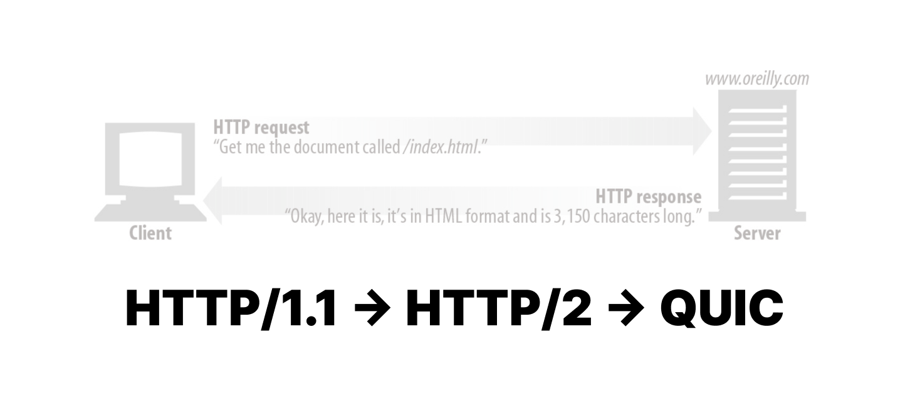
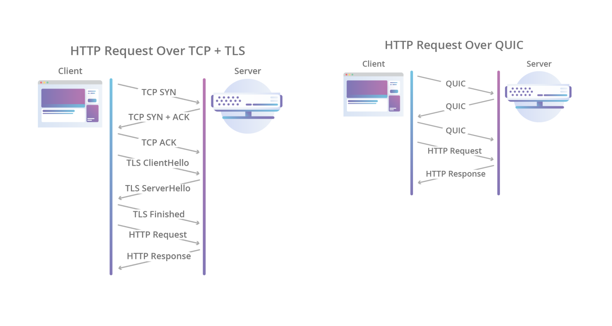

# HTTP의 과거 현재 미래 (HTTP/1.1, HTTP/2, HTTP/3)

 

**HTTP는 왜 계속 진화하는 걸까?**

우리나라에서 인터넷은 1990년대 중반까지는 대학교나 연구소에서 제한적으로 사용되었지만, 이후 상용화와 함께 대중에게 빠르게 퍼졌다. 특히 2000년대 들어 3.5세대 이동통신과 스마트폰이 등장하면서, 전 세계적으로 인터넷 사용이 폭발적으로 증가했다.

1990년대까지만 해도 인터넷이 이렇게 다양한 용도로 쓰이고, 수많은 사람들이 동시에 사용하는 인프라가 될 거라 예상한 사람은 많지 않았다. HTTP는 본래 단순히 문서를 가져오기 위한 용도로 등장했지만, 점점 복잡해지는 웹 구조와 증가하는 사용자수에 기존 기술은 한계를 드러내기 시작했다. 이에 따라 HTTP는 시대의 요구에 맞게 계속해서 진화하게 되었다.

2021년 기준, 전 세계 웹사이트의 약 45.9%가 HTTP/2를 사용 중이라고 배웠었다. 그러나 2025년 6월 10일 현재는 HTTP/2의 비율이 33%로 감소했고, HTTP/3는 35%, QUIC은 8%로 변화된 양상을 [확인](https://w3techs.com/technologies/overview/site_element)했다. 단 4년 간의 변화만 지켜봐도, 정보 통신 기술이 빠르게 변화하는 세상 속에서 공부하고 있는 게 체감이 된다.  가끔 참 신기하다... 

이번 글에서는 수업 시간에 배운 내용을 바탕으로, **HTTP/1.1**부터 **HTTP/2, HTTP/3 기반 QUIC**까지의 흐름을 순서대로 정리하며 각 기술이 어떤 문제를 어떻게 해결했는지 복습하려고 한다.

 

---

## HTTP/1.1: 성능 상의 한계

HTTP/1.1은 가장 널리 사용되는 HTTP 프로토콜이다. 0.9, 1.0을 거쳐 여러 가지 문제점을 해결하고 보편적으로 사용하기 좋게 릴리즈 되었다. 대표적인 특징으로는 한 번 요청과 응답이 이뤄지면 연결이 끊어졌던 점을 보완한 **연결 지속(Keep-Alive)**이 있다.

 

 

HTTP/1.1은 **텍스트 기반**의 요청-응답(Request-Response) 방식으로 동작한다. 클라이언트가 요청(Request)을 보내면, 서버는 이에 대한 응답(Response)을 보내 데이터를 전달한다. 이러한 통신은 연결을 맺기 위한 3-way handshake 과정을 거쳐, **TCP 연결(Connection)** 위에서 이루어진다.

HTTP/1.1에서는 데이터를 주고받을 때 **메시지(Message)** 단위로 통신이 이루어지며, 각 메시지는 그림과 같이 요청/응답 라인과 헤더, 본문으로 구성된다.

이러한 통신 형태는 직관적이고 보편적으로 이해 가능한 구조이지만, 성능(Performance) 측면에 있어서는 다음과 같은 한계가 있다.

 

### 한계

1. **Head of Line Blocking**

    HTTP/1.1 통신에서는, 클라이언트가 서버로 복수의 request를 전송했을 때 서버는 요청 받은 순서대로 response를 보내야 한다. 그런데 만약 서버가 중간 response를 작성하는 데 문제를 겪는 경우, 후속 요청들은 모두 클라이언트에 전송되지 못하고 **지연(blocking)**된다. 이런 문제를 **Head of Line (HoL) Blocking**이라고 부른다.

2. **Fat Message Headers**

    HTTP/1.1의 헤더에는 많은 메타 정보들을 저장한다. 그런데 헤더는 매 요청마다 전송되므로 이는 결국 중복된 헤더 값을 반복해서 전송하게 됨을 의미한다. 또한 헤더에는 각 도메인에 설정된 쿠키도 매 요청마다 포함된다. 이렇게 헤더의 양이 불필요하게 많아지는 문제를 **Fat Message Headers**라고 한다.

3. **Limited Priority**

    웹 브라우저 입장에서, 페이지에 있는 어떤 요소는 빠르게 처리해야 하지만 어떤 요소는 비교적 덜 중요한 경우가 있다. 그러나 HTTP/1.1에서는 네트워크 수준에서 우선순위를 명시적으로 지정할 수 없다. 따라서 중요한 요청에 대한 처리가 비교적 덜 중요한 처리에 막혀 지연되는 상황이 생길 수도 있다.

4. **Client-driven Transmission**

    HTTP/1.1의 기본적인 통신 구조는 클라이언트가 서버로 정보 요청을 해야만 통신이 가능한 구조이다. 즉, 서버는 클라이언트의 요청 없이는 정보 전달이 불가능하다.  양방향 통신은 long polling으로 흉내내거나, WebSocket 프로토콜로의 업그레이드가 필요하다 

 

---

## HTTP/2: Stream, Frame의 등장

이러한 HTTP/1.1의 한계를 해결하기 위해, HTTP/2.0이 등장, 2015년에 RFC 7450으로 표준화되었다. HTTP/2의 주요 목표이자 특징은 다음과 같다.

- **지연 시간 감소**

- **응답 다중화**

- **HTTP 헤더 압축**을 통한 오버헤드 최소화

- **요청 별 우선순위 지정**

- **서버 Push**

또한, HTTP/2는 기존 HTTP/1.1의 메시지 구조(Method, Status Code, URI, Header)를 그대로 지원하여, 애플리케이션 코드를 대부분 수정하지 않고도 사용할 수 있는 호환성을 제공한다.

HTTP/2는 어떻게 목표를 달성하여 기존의 문제들을 해결한 것일까? 그 중심에는 새로운 개념인 **Stream**, 그리고 **Frame**이 있다.

### Stream과 Frame

 

우선 HTTP/2에서 달라진 인코딩 방식에 대해 언급하고자 한다. 줄 바꿈을 활용한 일반 텍스트 HTTP/1.1과 달리, HTTP/2는 더 작은 단위인 **프레임**으로 분할되며 **바이너리 형식**으로 인코딩한다. 즉, 기존의 문자열 파싱이 아닌 완전히 새로운 **바이너리 인코딩 메커니즘**을 사용하는 것이다.

 

HTTP/1.1에서는 TCP 연결 위에서 메시지를 주고 받으며 Client-Server 통신이 이뤄졌다. HTTP/1.1에 **연결(Connection)과 메시지(Message)**의 개념이 있다면, HTTP/2에서는 이에 더해 **스트림(Stream)과 프레임(Frame)**이라는 개념이 새롭게 도입되었다.

 

 

- **스트림**

    - TCP 연결 내에서 전달되는 **바이트의 양방향 흐름**으로, 메시지의 상위 개념이다.

- **프레임**

    - HTTP/2에서 **통신의 최소 단위**이며, 메시지의 하위 개념이다. 각 프레임은 하나의 프레임 헤더를 가지며, 이 프레임 헤더를 통해 프레임이 속하는 스트림을 식별한다.
    
    - 각 메시지는 하나의 논리적 HTTP 메시지이며, 하나 이상의 **프레임**으로 구성된다.

모든 통신은 단일 TCP 연결을 통해 수행되지만, 전달될 수 있는 양방향 스트림의 수는 논리적으로 제한이 없다. 즉, HTTP/2 통신은 여러 개의 양방향 스트림을 동시에 처리할 수 있는 구조이다. 각 스트림은 양방향 메시지 전달에 필요한 고유 식별자를 가지며, 선택적으로는 우선순위 정보도 담길 수 있다. 따라서 스트림의 개념을 통해 **요청 및 응답 다중화**와 **우선순위 지정**이 가능해진다.

결론적으로, 여러 요청 및 응답을 하나도 차단하지 않고 병렬로 인터리빙할 수 있으므로 HTTP/1.1의 HoL 문제를 해결할 수 있는 것이다.

서버 푸시(Server Push) 역시 스트림 기반으로 처리되어, 서버가 클라이언트의 요청 없이도 리소스를 미리 스트림으로 전송할 수 있다. 이 리소스도 다중화 및 우선순위 제어가 가능하다.

### 헤더 압축 (HPACK)

HTTP/2는 이렇게 스트림이라는 논리적 연결로 요청들을 묶어냈다. 사실 하나의 TCP 연결에서 클라이언트와 서버가 동일하다면, 내부 스트림이 가진 요청들의 내용은 서로 비슷할 것이다. 앞서 언급했듯 중복된 헤더 필드를 반복해서 전송하는 것은 불필요한 오버헤드이다.

따라서, HTTP/2에서는 Dynamic Table을 기반으로 중복되는 헤더 필드는 인덱스 값만 전송하여, 보내는 데이터의 양을 줄인다. 또한 중복되지 않는 값은 Huffman Encoding 빈도가 높은 정보는 적은 비트, 빈도가 낮은 정보는 큰 비트를 부여하는 인코딩 방식 으로 전송하여 데이터를 줄인다.

 

이렇게 HTTP/2는 혁신적인 방식으로 HTTP/1.1의 한계를 상당히 많이 극복하였다. 그러나 HTTP/2 역시 한계가 존재하는데, 이는 **TCP의 근본적인 문제점**으로 인해 나타난다.

요청과 응답의 다중화를 지원하더라도, 패킷 손실이 발생하면 **TCP의 에러 복구 및 혼잡 제어 메커니즘이 작동하면서** 전체 통신 흐름이 지연되고, 이로 인해 스트림 단위 병렬 처리가 실질적으로 무력화될 수 있다.

 

---

## HTTP/3와 QUIC: UDP로 어떻게 신뢰성 있는 통신을 해요?

그렇다면 Transport Layer에서 TCP를 사용함으로써 발생하는 근본적인 문제는 어떻게 해결할 수 있을까? TCP를 안 쓰면 될 것이다.

**QUIC**은 TCP를 대체하는 범용 목적의 전송 계층 통신 프로토콜이다.

구글의 짐 로스킨드가 처음 설계하였으며, 2021년 5월 IETF RFC9000으로 정식 표준화되었다. 처음에 구글은 QUIC의 이름을 "Quick UDP Internet Connections"로 제안했으나, IETF에서 QUIC 자체를 고유 명사로 지정했다고 한다. 이렇게 초기 이름에서도 알 수 있듯 QUIC은 **UDP 기반의 프로토콜**이다. 그런데, UDP는 TCP와 달리 신뢰성을 보장하지 않는 프로토콜이다. 그렇다면 QUIC은 어떻게 UDP를 사용하면서도 TCP만큼의 신뢰성을 제공할 수 있을까?

 

 

앞서 QUIC은 전송 계층애 속하는 통신 프로토콜이라고 소개했다. 그러나 실제로 QUIC이 TCP를 대체하기 위해 제공하는 기능들은 애플리케이션 계층 위에서 구현된다.  커널 수준에서 돌아가는 TCP, UDP는 성능이 좋지만 개발자가 직접 수정하기 어렵다. 때문에 현대 통신 프로토콜들은 애플리케이션 계층에서 구현되는 것이 일반적이다.  QUIC은 UDP 위에 새로운 계층을 추가함으로써, 해당 계층에서 TCP에 존재하는 패킷 재전송, 혼잡 제어, 속도 조정 및 다른 기능들을 제공한다.

### QUIC의 특징

#### 1. QUIC Connection

QUIC에서의 **연결**은 **두 QUIC 엔드포인트 사이**의 대화를 의미한다.

QUIC의 연결 설정은 **버전 협상, 암호화 설정, (가능한 경우) 초기 데이터 전송**까지 포함하는 통합 핸드쉐이크로 구성된다.
따라서, TCP처럼 3-way handshake 이후 TLS 핸드쉐이크를 별도로 수행하는 구조와 달리, QUIC은 초기 연결 설정에서의 지연 시간이 크게 줄어든다.  참고로, QUIC은 TLS 1.3을 암호화 수단으로 강제 내장하고 있어, 모든 연결은 기본적으로 암호화된다.

또한, QUIC의 각 연결은 Connection ID를 가져, 이를 통해 연결을 식별한다. 이러한 Connection ID의 기능은 하위 프로토콜 계층(UDP, IP 등)에서 주소가 변경되더라도 QUIC 연결의 패킷이 잘못된 엔드포인트로 전달되지 않도록 보장하는 것이다.

예를 들어, QUIC 통신 중인 디바이스가 이동하면서 IP 주소가 바뀌더라도, Connection ID를 통해 연결 상태가 유지되어 서비스가 끊기지 않고 지속된다.

#### 2. 연결 재사용

QUIC은 새로운 연결을 설정할 때 걸리는 시간을 최소화하기 위한 기능을 제공한다.
클라이언트가 이전에 동일한 서버에 연결한 이력이 있다면, 그 연결 과정에서 사용했던 특정 파라미터를 **캐시**해둘 수 있다. 이 정보를 활용하면, 클라이언트는 핸드쉐이크가 완료되기를 기다리지 않고도 바로 데이터를 전송할 수 있다.
앞서 '가능하다면 초기 데이터를 전송할 수 있다'라고 언급한 것이 바로 이 경우이다. (0-RTT)

 

QUIC은 아직까지는 도입 초기 단계라 일부 브라우저나 서비스에서만 제한적으로 사용되고 있다. 알 만한 서비스로는 **Youtube**가 QUIC을 사용한다고 한다~!

 

---

HTTP 기반 통신 기술은 시대의 흐름에 따라 빠르게 발달하고, 성능을 높이고자 여러 가지 문제를 해결하고 있었다. 학교 네트워크 수업 시간에 해당 내용들을 학습했는데, 익숙한 HTTP/1.1을 넘어 새로운 네트워크 기술에 대해 이해해 볼 수 있어 너무너무 재밌는 시간이었다. 최근 gRPC를 사용해 보았는데, 얼른 다른 새로운 기술도 직접 써보고 뭐가 좋은지 직접 느껴보고 싶다~! 가능하다면 프로젝트에도 적절히 적용해 보자 아 뽜이팅