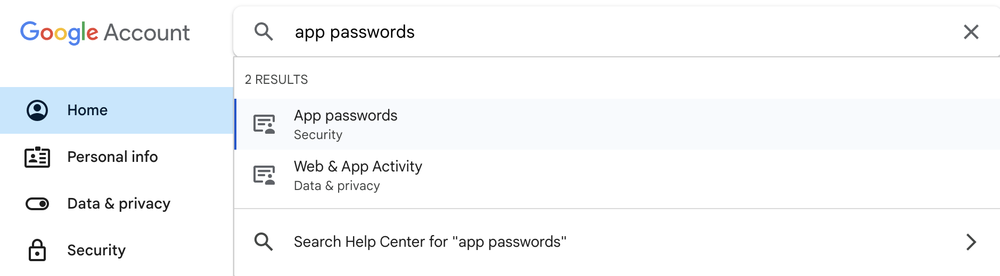
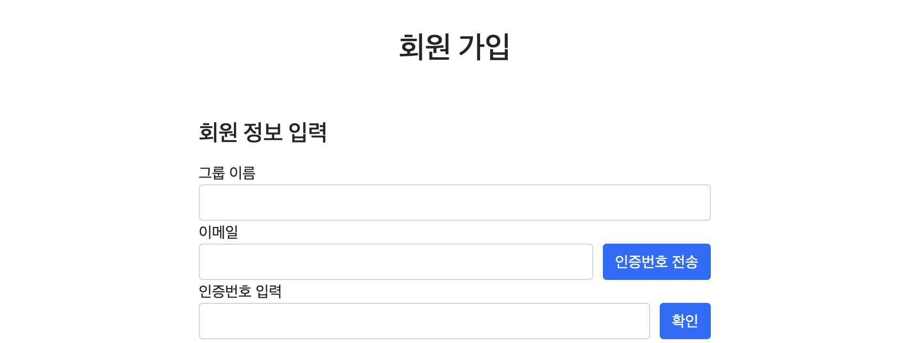

# [Spring Boot] SMTP로 이메일 인증 구현

<br>
<center></center>
<br><br><br>

회원가입을 할 때, 입력한 이메일로 인증번호를 전송해 본인 인증을 하는 기능을   SMTP server와 redis를 이용하여 구현해보았다.

## ❗️ To do

- 인증 번호 전송 버튼을 눌렀을 때, 사용자가 입력한 이메일 주소로 인증 번호 전송하기
- 인증 번호 입력 후 인증 버튼을 눌렀을 때 인증 여부 확인하기

<br>

> 해당 프로젝트는 `Spring Boot 3.2.3` , `java 17` 을 사용하였다.  
> Gmail을 host email로 사용하였다.

<br>

---

# Gmail SMTP server 사용하기

인증 메일을 발송할 이메일 계정을 생성한 후,  Gmail SMTP 서버를 사용하기 위해서는 인증을 위한 App Password가 필요하다.  
이를 발급받기 위해서는 우선 해당 계정이 2단계 인증을 사용하도록 설정해주어야 한다.

<br>

<center></center><br>

계정 설정 페이지에서 App passwords를 발급받아 저장해둔다. 이 값은 유출되지 않도록 환경변수로 설정해 관리하는 것을 추천한다.

## Build.gradle

```groovy
	// email authentication
	implementation 'org.springframework.boot:spring-boot-starter-mail'

	// validation
	implementation 'org.springframework.boot:spring-boot-starter-validation'

	// redis
	implementation 'org.springframework.boot:spring-boot-starter-data-redis'
```

스프링 부트 프로젝트에서 지원하는 email authentication, validation, redis database 의존성을 추가해준다.

## Application.yml

```yaml
spring:
  mail:
    host: smtp.gmail.com
    port: 587
    username: ${MAIL_ADDRESS}
    password: ${APP_PASSWORD}
    properties:
      mail.smtp.auth: true
      mail.smtp.starttls.enable: true
  redis:
    host: localhost
    port: 6379
```

- `username` : 이메일을 전송할 주체의 이메일 주소 (host mail)
- `password` : 발급받은 App password

## Project Layers

이해를 돕기 위해 이메일 전송과 관련된 파일만 표기했다.

```
📁
├── domain/
│   └── email/EmailSendService
├── dtos/
│   ├── EmailRequestDto
│   └── EmailCheckDto
├── web/
│   └── email/EmailCheckDto
├── EmailConfig
└── RedisConfig
```

---

# 🍃 Configuration

이메일 전송과 redis 연동을 위해 설정 파일을 이용하여 Bean 등록을 해줄 것이다.

## EmailConfig

```java
@Configuration
public class EmailConfig {

    // set important data
    @Value("${spring.mail.username}") private String username;
    @Value("${spring.mail.password}") private String password;

    @Bean
    public JavaMailSender mailSender() {

        JavaMailSenderImpl mailSender = new JavaMailSenderImpl();
        mailSender.setHost("smtp.gmail.com");
        mailSender.setPort(587); // TLS port
        mailSender.setUsername(username);
        mailSender.setPassword(password);

        // Use Properties Object to set JavaMailProperties
        Properties javaMailProperties = new Properties();
        javaMailProperties.put("mail.transport.protocol", "smtp");
        javaMailProperties.put("mail.smtp.auth", "true");
        javaMailProperties.put("mail.smtp.socketFactory.class", "javax.net.ssl.SSLSocketFactory");
        javaMailProperties.put("mail.smtp.starttls.enable", "true");
        javaMailProperties.put("mail.debug", "true");
        javaMailProperties.put("mail.smtp.ssl.trust", "smtp.gmail.com");
        javaMailProperties.put("mail.smtp.ssl.protocols", "TLSv1.2"); // TLS v1.2를 사용

        mailSender.setJavaMailProperties(javaMailProperties);

        return mailSender;
    }
}

```

## RedisConfig

```java
@EnableRedisRepositories
@RequiredArgsConstructor
@Configuration
public class RedisConfig {
    @Value("${spring.redis.host}")
    private String host;
    @Value("${spring.redis.port}")
    private Integer port;

    // IoC container를 통해 lettuce connector 설정
    // PersistenceExceptionTranslator 역할을 수행
    @Bean
    public RedisConnectionFactory redisConnectionFactory() {
        return new LettuceConnectionFactory(host, port);
    }

    @Bean
    public RedisTemplate<String, String> redisTemplate() {
        RedisTemplate<String, String> redisTemplate = new RedisTemplate<>();
        redisTemplate.setKeySerializer(new StringRedisSerializer());
        redisTemplate.setValueSerializer(new StringRedisSerializer());
        redisTemplate.setConnectionFactory(redisConnectionFactory());
        return redisTemplate;
    }
}
```

<br>

---

# 📮 이메일 전송 구현하기

<center></center><br><br>

우리 서비스의 회원 가입 폼 일부이다. 기존의 회원 가입 폼에 인증번호 전송 버튼과 인증번호 입력란을 만들었다.

회원 가입은 form 태그로 Member 객체를 넘기도록 설계되어있는데, 아직은 회원가입이 이루어진 상태가 아니기 때문에  
Member 객체를 사용하는 것은 불가능하다. 따라서 input 태그에 입력된 값을 javascript로 가져와 사용할 것이다.

인증번호 전송 버튼을 눌렀을 때 **form 태그를 통해 데이터가 넘어가는 것이 아니다.**  
입력한 이메일을 컨트롤러로 보내는 과정은 **Ajax 요청**을 통해 이루어진다.

또한 학습을 위해 String 형식으로 직접 데이터를 보내는 대신 EmailRequestDto 객체를 통해 데이터를 전달하도록 구현해보았다.

## EmailRequestDto

```java
@Getter
@Setter
public class EmailRequestDto {
    private String email;
}
```

## Signup.html

```jsx
<script type="text/javascript">
    $(document).ready(function () {
        $("#email-button").click(function () {
            var email = $("#email").val();
            var emailRequestDto = {
            email: email
        };
            $.ajax({
                type: "POST",
                url: "/signup/email",
                contentType: "application/json",
                data: JSON.stringify(emailRequestDto),
                success: function () {
                    alert("인증번호 전송에 성공하였습니다.");
                },
                error: function () {
                    alert("인증번호 전송에 실패했습니다.");
                }
            });
        });
    });
</script>
```

script로 인증 버튼을 클릭했을 때 실행할 함수를 추가해줬다.

emailRequestDto를 JSON 문자열로 변환하여 data에 담았는데, 
ajax 요청은 기본적으로 “application/x-www-form-urlencoded” contentType을 사용하기 때문에 "application/json"으로 변경해주었다.

success message에 편의를 위해 ‘인증번호 전송에 성공하였습니다’를 적어두었지만, 실제로는 요청에 대한 응답을 성공적으로 받는 것까지가 success이다. redis 연결 전에는 error가 뜨는 게 정상이다.

## EmailController - mailSend

```java
@Controller
@RequiredArgsConstructor
public class EmailController {
    private final EmailSendService emailSendService;

    @PostMapping("/signup/email")
    public String mailSend(@RequestBody @Valid EmailRequestDto emailRequestDto) {
        System.out.println("이메일 인증 요청" + emailRequestDto.getEmail());
        return emailSendService.joinEmail(emailRequestDto.getEmail());
    }
}
```

## EmailSendService

- 랜덤 인증번호 생성
- 이메일 작성 및 전송

```java
@Service
public class EmailSendService {
    @Autowired
    private JavaMailSender javaMailSender;
    @Autowired
    private RedisConfig redisConfig;
    private int authNumber;

    /* 이메일 인증에 필요한 정보 */
    @Value("${spring.mail.username}")
    private String serviceName;

    /* 랜덤 인증번호 생성 */
    public void makeRandomNum() {
        Random r = new Random();
        String randomNumber = "";
        for(int i = 0; i < 6; i++) {
            randomNumber += Integer.toString(r.nextInt(10));
        }

        authNumber = Integer.parseInt(randomNumber);
    }

    /* 이메일 전송 */
    public void mailSend(String setFrom, String toMail, String title, String content) {
        MimeMessage message = javaMailSender.createMimeMessage();
        try {
            MimeMessageHelper helper = new MimeMessageHelper(message,true,"utf-8");
            helper.setFrom(setFrom); // service name
            helper.setTo(toMail); // customer email
            helper.setSubject(title); // email title
            helper.setText(content,true); // content, html: true
            javaMailSender.send(message);
        } catch (MessagingException e) {
            e.printStackTrace(); // 에러 출력
        }
        // redis에 3분 동안 이메일과 인증 코드 저장
        ValueOperations<String, String> valOperations = redisConfig.redisTemplate().opsForValue();
        valOperations.set(toMail, Integer.toString(authNumber), 180, TimeUnit.SECONDS);
    }

    /* 이메일 작성 */
    public String joinEmail(String email) {
        makeRandomNum();
        String customerMail = email;
        String title = "길라IT 회원 가입을 위한 이메일입니다!";
        String content =
                "동아리의 공식 이메일을 인증하기 위한 절차입니다." +
                        "<br><br>" +
                        "인증 번호는 " + authNumber + "입니다." +
                        "<br>" +
                        "회원 가입 폼에 해당 번호를 입력해주세요.";
        mailSend(serviceName, customerMail, title, content);
        return Integer.toString(authNumber);
    }
}

```

<br>

---

# 🔎 인증번호 확인 구현하기