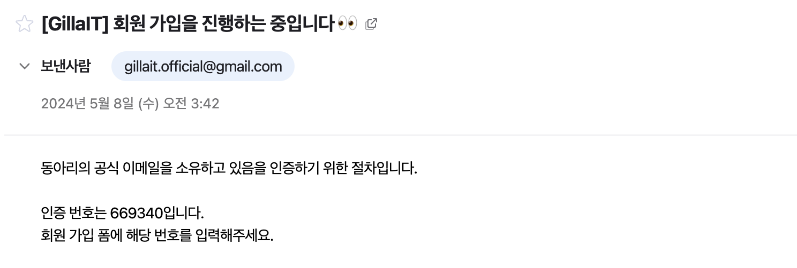
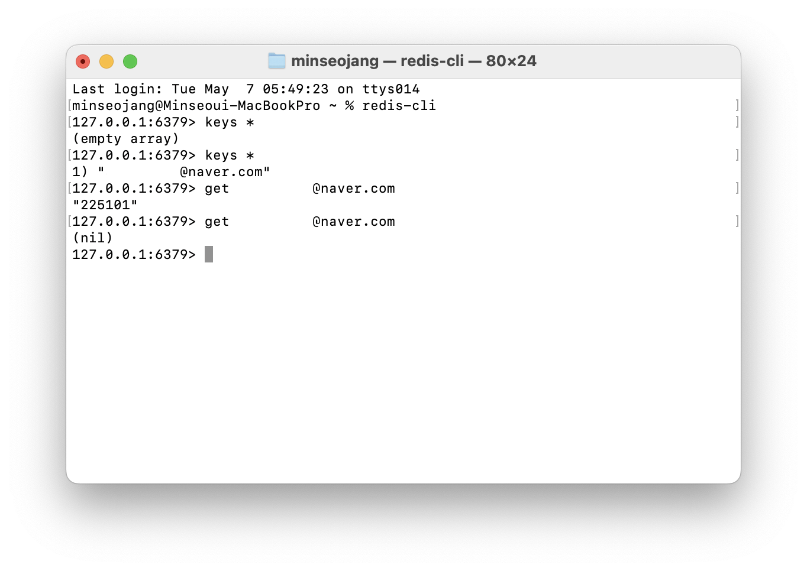
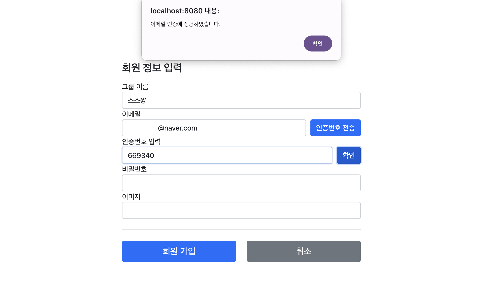

# [Spring Boot] SMTP로 이메일 인증 구현

<br>
<center></center>
<br><br><br>

회원가입을 할 때, 입력한 이메일로 인증번호를 전송해 본인 인증을 하는 기능을 SMTP server와 redis를 이용하여 구현해보았다.

## ❗️ To do

- 인증 번호 전송 버튼을 눌렀을 때, 사용자가 입력한 이메일 주소로 인증 번호 전송하기
- 인증 번호 입력 후 인증 버튼을 눌렀을 때 인증 여부 확인하기

<br>

> 해당 프로젝트는 `Spring Boot 3.2.3` , `java 17`, `thymeleaf template engine` 을 사용하였다.  
> Gmail을 host email로 사용하였다.

<br>

---

# Gmail SMTP server 사용하기

인증 메일을 발송할 이메일 계정을 생성한 후,  Gmail SMTP 서버를 사용하기 위해서는 인증을 위한 App Password가 필요하다.  
이를 발급받기 위해서는 우선 해당 계정이 2단계 인증을 사용하도록 설정해주어야 한다.

<br>

<center></center><br>

계정 설정 페이지에서 App passwords를 발급받아 저장해둔다. 이 값은 유출되지 않도록 환경변수로 설정해 관리하는 것을 추천한다.

## Build.gradle

```groovy
	// email authentication
	implementation 'org.springframework.boot:spring-boot-starter-mail'

	// validation
	implementation 'org.springframework.boot:spring-boot-starter-validation'

	// redis
	implementation 'org.springframework.boot:spring-boot-starter-data-redis'
```

스프링 부트 프로젝트에서 지원하는 email authentication, validation, redis database 의존성을 추가해준다.

## Application.yml

```yaml
    spring:
    mail:
        host: smtp.gmail.com
        username: ${MAIL_ADDRESS}
        password: ${APP_PASSWORD}
        properties:
        mail.smtp.auth: true
        mail.smtp.starttls.enable: true
    redis:
        host: localhost
        port: 6379
```

- `username` : 이메일을 전송할 주체의 이메일 주소 (host mail)
- `password` : 해당 계정으로 발급받은 App password

## Project Layers

이해를 돕기 위해, 프로젝트에서 이메일 전송 기능을 구현한 파일의 위치를 나타낸 구조도이다.

```
    📁
    ├── domain/
    │   └── email/EmailSendService
    ├── dtos/
    │   ├── EmailRequestDto
    │   └── EmailCheckDto
    ├── web/
    │   └── email/EmailCheckDto
    ├── EmailConfig
    └── RedisConfig
```

---

# Configuration

이메일 전송과 redis 연동을 위해 `@Configuration` 설정 파일을 이용하여 Bean 등록을 해줄 것이다.

## EmailConfig

```java
    @Configuration
    public class EmailConfig {

        /* set important data */
        @Value("${spring.mail.username}") private String username;
        @Value("${spring.mail.password}") private String password;

        @Bean
        public JavaMailSender mailSender() {

            JavaMailSenderImpl mailSender = new JavaMailSenderImpl();
            mailSender.setHost("smtp.gmail.com");
            mailSender.setPort(587); // TLS port
            mailSender.setUsername(username);
            mailSender.setPassword(password);

            /* Use Properties Object to set JavaMailProperties */
            Properties javaMailProperties = new Properties();
            javaMailProperties.put("mail.transport.protocol", "smtp");
            javaMailProperties.put("mail.smtp.auth", "true");
            javaMailProperties.put("mail.smtp.socketFactory.class", "javax.net.ssl.SSLSocketFactory");
            javaMailProperties.put("mail.smtp.starttls.enable", "true");
            javaMailProperties.put("mail.debug", "true");
            javaMailProperties.put("mail.smtp.ssl.trust", "smtp.gmail.com");
            javaMailProperties.put("mail.smtp.ssl.protocols", "TLSv1.3"); // TLS v1.3을 사용

            mailSender.setJavaMailProperties(javaMailProperties);

            return mailSender;
        }
    }

```

`org.springframework.mail.javamail.JavaMailSender`의 JavaMailSender를 빈으로 등록한다.

개인정보 보호 및 보안을 위해 이메일을 암호화하는 프로토콜로 `TLS`와 `SSL`를 사용할 수 있다.  
TLS(Trasport Layer Security)도 일반적으로는 SSL(Secure Sockets Layer)인데, TLS가 훨씬 안전한 버전의 SSL이라고 한다. Google SMTP 서버는 TLS 1.3 version까지 지원하므로 이 범위 내에서 사용할 프로토콜의 버전을 설정해준다. 

## RedisConfig

Redis 데이터베이스에 연결하고 RedisTemplate을 사용할 수 있도록 빈을 등록해준다.  
`RedisConnectionFactory`가 RedisConnection을 생성하고 PersistenceExceptionTranslator 역할을 수행해준다.  
이때 connector로 사용할 client를 지정해줘야 하는데, lettuce를 사용하도록 설정해주었다.


```java
    @EnableRedisRepositories
    @RequiredArgsConstructor
    @Configuration
    public class RedisConfig {
        @Value("${spring.redis.host}")
        private String host;
        @Value("${spring.redis.port}")
        private Integer port;

        // IoC container를 통해 lettuce connector 설정
        // PersistenceExceptionTranslator 역할을 수행
        @Bean
        public RedisConnectionFactory redisConnectionFactory() {
            return new LettuceConnectionFactory(host, port);
        }

        @Bean
        public RedisTemplate<String, String> redisTemplate() {
            RedisTemplate<String, String> redisTemplate = new RedisTemplate<>();
            redisTemplate.setKeySerializer(new StringRedisSerializer());
            redisTemplate.setValueSerializer(new StringRedisSerializer());
            redisTemplate.setConnectionFactory(redisConnectionFactory());
            return redisTemplate;
        }
    }
```

<br>

---

# 이메일 전송 구현하기

<center></center><br><br>

우리 서비스의 회원 가입 폼 일부이다. 기존의 회원 가입 폼에 인증번호 전송 버튼과 인증번호 입력란을 만들었다.

회원 가입은 form 태그로 Member 객체를 넘기도록 설계되어있는데, 아직은 회원가입이 이루어진 상태가 아니기 때문에  
Member 객체를 사용하는 것은 불가능하다. 따라서 input 태그에 입력된 값을 javascript로 가져와 사용할 것이다.

인증번호 전송 버튼을 눌렀을 때 **form 태그를 통해 데이터가 넘어가는 것이 아니다.**  
입력한 이메일을 컨트롤러로 보내는 과정은 **Ajax 요청**을 통해 이루어진다.

또한 String 형식으로 직접 데이터를 보내는 대신 EmailRequestDto 객체를 통해 데이터를 전달하도록 구현해보았다.

## EmailRequestDto

- emailSend에 사용할 데이터 전송 객체
- 이메일 email 변수를 갖는 DTO

```java
    @Getter
    @Setter
    public class EmailRequestDto {
        private String email;
    }
```

## Signup.html

- `인증번호 전송` 버튼을 눌렀을 때 Ajax 요청을 보내는 함수

```jsx
    <script type="text/javascript">
        $(document).ready(function () {
            $("#email-button").click(function () {
                var email = $("#email").val();
                var emailRequestDto = {
                    email: email
                };
                $.ajax({
                    type: "POST",
                    url: "/signup/email",
                    contentType: "application/json",
                    data: JSON.stringify(emailRequestDto),
                    success: function (code) {
                        if (code) {
                        alert("입력하신 메일로 인증번호가 전송되었습니다.");
                        } else {
                            alert("인증번호를 받을 수 없습니다.");
                        }
                    },
                    error: function () {
                        alert("인증번호를 받을 수 없습니다. 입력하신 이메일 형식을 확인해주세요.");
                    }
                });
            });
        });
    </script>
```

script로 인증 버튼을 클릭했을 때 실행할 함수를 추가한다.

emailRequestDto를 JSON 문자열로 변환하여 data에 담았는데, 
ajax 요청은 기본적으로 “application/x-www-form-urlencoded” contentType을 사용하기 때문에 "application/json"으로 변경해주었다.

controller로부터 code 값이 담긴 JSON response를 받으면 인증번호 전송에 성공한 것으로 메시지를 띄운다.  
이메일 형식이 잘못되면 올바른 response가 도착하지 않아 error가 발생한다.

## EmailController - mailSend

- mailSend 함수

```java
    @RestController
    @RequiredArgsConstructor
    public class EmailController {
        private final EmailSendService emailSendService;

        /* Send Email: 인증번호 전송 버튼 click */
        @PostMapping("/signup/email")
        public Map<String, String> mailSend(@RequestBody @Valid EmailRequestDto emailRequestDto) {
            String code = emailSendService.joinEmail(emailRequestDto.getEmail());
            // response를 JSON 문자열으로 반환
            Map<String, String> response = new HashMap<>();
            response.put("code", code);

            return response;
        }
    }
```
`@RequestBody` 어노테이션을 사용하면 자동으로 객체를 생성해준다.  
emailRequestDto에 존재하는 email 변수에 JSON의 email 데이터가 저장된 것을 확인할 수 있다.

이메일 값을 보내고 코드 값을 받는 이 과정은 단순히 Data를 주고받는 동작에 그쳐야 한다.  
따라서 `@RestController` 어노테이션을 사용하여, EmailController가 JSON 데이터를 반환하는 역할을 수행하도록 만들어준다.  
만약 `@Controller`를 사용하게 되면 요청에 대한 응답으로 View를 반환한다.  
그래서 Controller로부터 오는 응답 값과 일치하는 thymeleaf 템플릿을 찾아 반환하려는 동작이 수행되고, 오류가 발생하게 된다.  

## EmailSendService

- 랜덤 인증번호 생성
- 이메일 작성 및 전송

```java
    @Service
    public class EmailSendService {
        @Autowired
        private JavaMailSender javaMailSender;
        @Autowired
        private RedisConfig redisConfig;
        private int authNumber;

        /* 이메일 인증에 필요한 정보 */
        @Value("${spring.mail.username}")
        private String serviceName;

        /* 랜덤 인증번호 생성 */
        public void makeRandomNum() {
            Random r = new Random();
            String randomNumber = "";
            for(int i = 0; i < 6; i++) {
                randomNumber += Integer.toString(r.nextInt(10));
            }

            authNumber = Integer.parseInt(randomNumber);
        }

        /* 이메일 전송 */
        public void mailSend(String setFrom, String toMail, String title, String content) {
            MimeMessage message = javaMailSender.createMimeMessage();
            try {
                MimeMessageHelper helper = new MimeMessageHelper(message,true,"utf-8");
                helper.setFrom(setFrom); // service name
                helper.setTo(toMail); // customer email
                helper.setSubject(title); // email title
                helper.setText(content,true); // content, html: true
                javaMailSender.send(message);
            } catch (MessagingException e) {
                e.printStackTrace(); // 에러 출력
            }
            // redis에 3분 동안 이메일과 인증 코드 저장
            ValueOperations<String, String> valOperations = redisConfig.redisTemplate().opsForValue();
            valOperations.set(toMail, Integer.toString(authNumber), 180, TimeUnit.SECONDS);
        }

        /* 이메일 작성 */
        public String joinEmail(String email) {
            makeRandomNum();
            String customerMail = email;
            String title = "회원 가입을 위한 이메일입니다!";
            String content =
                    "이메일을 인증하기 위한 절차입니다." +
                            "<br><br>" +
                            "인증 번호는 " + authNumber + "입니다." +
                            "<br>" +
                            "회원 가입 폼에 해당 번호를 입력해주세요.";
            mailSend(serviceName, customerMail, title, content);
            return Integer.toString(authNumber);
        }
    }

```

이메일을 작성하고 전송하는 서비스이다. 랜덤 인증번호를 생성하여 redis에 3분 동안 이메일과 함께 저장한다.  
메일 템플릿은 따로 템플릿 파일을 분리해도 좋고 필요에 따라 작성하면 된다.

## 결과 화면 

<center></center>
<div class="figcaption">스프링스터디짱이라는뜻</div>

인증번호 전송 버튼을 누르고 정상적으로 이메일이 발송되면 다음과 같은 메시지가 출력된다.

<br><br>

<center></center><br>

입력한 이메일 주소로 바로 메일이 전송된 것을 확인할 수 있다.  
메일 템플릿도 서비스에 구현했던 형태 그대로 잘 나온다!

<br>

<center></center>

redis에서 email 키값으로 데이터를 조회해보면 이메일로 전송된 코드값이 저장되어있음을 직접 확인할 수 있다.  
3분이 지난 후 조회하면 데이터가 더 이상 존재하지 않음도 확인이 가능하다.

<br>

---

# 인증번호 확인 구현하기

이제 이메일에 부여된 인증번호와 입력된 인증번호를 비교하여 회원가입을 위한 인증을 마무리해보자.

## EmailCheckDto

- 이메일 email과 인증번호 authNum 변수를 갖는 DTO 객체
- redis에서 특정 이메일에 부여된 인증번호를 조회하기 위해 필요하다.

```java
    @Data
    public class EmailCheckDto {

        private String email;
        private String authNum;
    }
```

## Signup.html

- `인증` 버튼을 눌렀을 때 Ajax 요청을 보내는 함수

```java
    <script type="text/javascript">
        $(document).ready(function () {
            ...
            $("#auth-button").click(function () {
                var email = $("#email").val();
                var authNum = $("#authNum").val();
                var emailCheckDto = {
                    email: email,
                    authNum: authNum
                };
                $.ajax({
                    type: "POST",
                    url: "/signup/emailAuth",
                    contentType: "application/json",
                    data: JSON.stringify(emailCheckDto),
                    success: function (message) {
                        if (message) {
                            alert("이메일 인증에 성공하였습니다.");
                        } else {
                            alert("인증번호를 받을 수 없습니다. 입력하신 이메일 형식을 확인해주세요.");
                        }
                    },
                    error: function(xhr, status, error) {
                        if (xhr.status == 500) {
                            alert("잘못된 인증번호이거나 시간 초과로 인증번호가 만료되었습니다.");
                        } else {
                            alert("오류가 발생했습니다: " + status);
                        }
                    }
                });
            });
        });
    </script>
```

전달할 변수 외에는 requestDto를 전달하는 방식과 동일하다.  
XMLHttpRequest(XHR)로부터 서버에서 온 Internal Server Error(500)을 감지하면 오류 메시지를 출력한다.  
status는 Ajax 요청이 success인지 error인지를 나타내는 문자열이다.

## EmailController - authCheck

- Eamil Auth 함수

```java
    /* Email Auth: 인증번호 입력 후 인증 버튼 click */
    @PostMapping("/signup/emailAuth")
    public String authCheck(@RequestBody @Valid EmailCheckDto emailCheckDto) {
        Boolean checked = emailSendService.checkAuthNum(emailCheckDto.getEmail(), emailCheckDto.getAuthNum());
        if (checked) {
            return "이메일 인증 성공!";
        }
        else {
            throw new NullPointerException("이메일 인증 실패!");
        }
    }
```

## EmailService

- 인증번호 확인

```java
    /* 인증번호 확인 */
    public Boolean checkAuthNum(String email, String authNum) {
        ValueOperations<String, String> valOperations = redisConfig.redisTemplate().opsForValue();
        String code = valOperations.get(email);
        if (Objects.equals(code, authNum)) {
            return true;
        } else return false;
    }
```

입력한 값과 인증번호가 일치하는지 확인하는 함수를 추가한다.  
redis에서 email을 key값으로 value를 불러와 입력한 코드 값과 비교한다.

## 결과 확인

<center></center><br><br>

올바른 인증번호 값을 입력하고 확인 버튼을 누르면 다음과 같은 성공 메시지가 출력된다.  
이렇게 이메일을 보내고 인증하는 기능을 완성할 수 있다!

<br><br>
<details>
<summary> &nbsp; 📁 참고 자료</summary>
    <div>
    ❗️ <a href="https://velog.io/@dionisos198/%EC%8A%A4%ED%94%84%EB%A7%81%EC%9C%BC%EB%A1%9C-%EC%9D%B4%EB%A9%94%EC%9D%BC-%EC%9D%B8%EC%A6%9D-%EA%B5%AC%ED%98%84%ED%95%98%EA%B8%B0" target="_blank">https://velog.io/@dionisos198/스프링으로-이메일-인증-구현하기</a>
    </div>
    <div>
    ❗️ <a href="https://support.google.com/a/answer/176600?hl=ko" target="_blank">Gmail SMTP 서버를 사용하여 이메일 보내기</a>
    </div>
</details>
