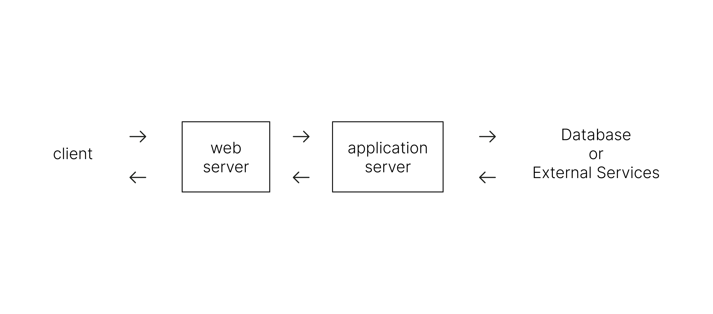
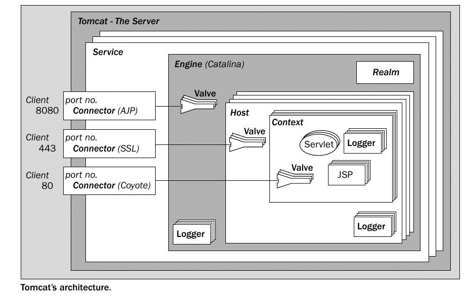
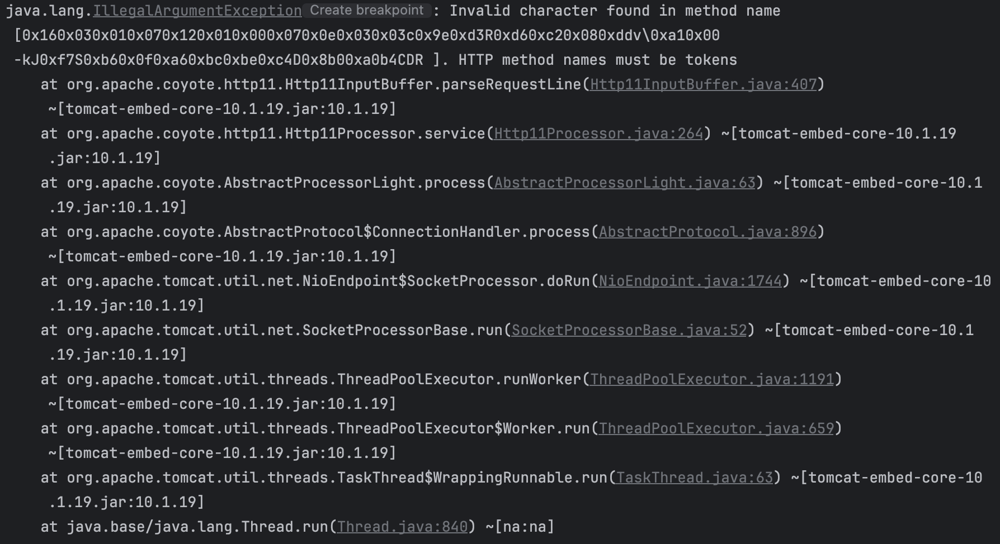

# [Spring Boot] Apache Tomcat은 사용자 요청을 어떻게 처리할까

  

    

- Spring Boot 애플리케이션으로 클라이언트 요청이 들어오면 어떤 일이 일어날까?
- 내장 서버인 Apache Tomcat은 어떤 구조를 가지며 어떻게 동작할까?

에 대해 구체적으로 이해해보고자 정리한 글이다.

 

---

# Servlet Container로서의 Tomcat

웹 서비스를 제공하기 위해 사용되는 소프트웨어 서버로는 크게 웹 서버와 애플리케이션 서버가 있다.

브라우저를 통해 요청이 들어오면 **웹 서버**가 이를 수신한다. 웹 서버에서 요청한 콘텐츠에 액세스할 수 있다면 응답을 보내고, 그렇지 않다면 해당 요청을 애플리케이션 서버에 전달한다. 그러면 **애플리케이션 서버**가 데이터를 처리하고 비즈니스 로직을 사용하여 알맞은 데이터를 제공한다. 웹 서버가 이 응답을 다시 받아 사용자에게 전달하는 방식으로 웹 서버와 애플리케이션 서버가 함께 작동한다.

## Web server

- 웹 브라우저 클라이언트로부터 HTTP 또는 HTTPS 요청을 받아 정적 콘텐츠를 제공하는 서버

- 동적 콘텐츠를 요청 받으면 Web Application Server로 요청을 넘기고, 응답을 다시 클라이언트로 전달한다.

- 즉 인터넷 브라우저와 통신하고 파일을 주고받는 역할만 한다.

## Application server

- 데이터베이스나 외부 서비스와 상호작용하며 비즈니스 로직을 처리한다.

    - 가져온 데이터를 가공해 동적으로 콘텐츠를 생성할 수 있어 사용자나 환경에 따라 다른 형태의 웹 페이지를 보여줄 수 있게 된다.

- 좁은 의미에서 애플리케이션 서버는 프로그래밍 언어를 사용해 개발한 웹 애플리케이션 혹은 이를 실행하고 관리하는 소프트웨어를 가리킨다.

 

> 여기까지는 전반적인 특징으로 구분되는 '역할'의 개념이라면, 앞으로 나올 용어들은 특정 기술과 관련지어 이해할 수 있는 '구체적인' 개념 느낌이다.

### Web Container / Servlet Container

- 동적인 데이터를 처리하여 정적인 페이지로 생성해주는 소프트웨어 모듈

    - Web Application Server, WAS의 일부로서 동작할 수 있다.

- 컨테이너가 요청을 서버측 프로그램인 **서블릿**에게 전달하여 필요한 메서드를 실행하게 해주고, 응답을 받아 다시 웹 서버로 넘기도록 관리해준다.

- 즉 서블릿, JSP 등을 실행하여 요청을 처리하도록 해주는 **구동 환경**이라고 이해했다.

- Apache Tomcat, Eclipse Jetty, Red Hat JBoss 등이 있다.

### 🧐 웹 컨테이너와 서블릿 컨테이너는 차이가 있나?

- 엄격히 구분하면 서블릿만을 처리하는 웹 컨테이너를 서블릿 컨테이너라고 불러야겠지만, 사실상 대부분의 웹 컨테이너가 서블릿 컨테이너이므로 거의 같은 개념으로 사용한다.  왜? 바로 아래에 그 이유에 대해 생각해보았는데, 일단 건너뛰고 WAS의 개념 먼저 읽고 오면 더 이해하기 쉬울 것 같다. 

    - 서블릿 인스턴스를 관리하는 컨테이너가 서블릿 컨테이너이므로 다른 서버측 프로그램 인스턴스만 사용한다면 서블릿 컨테이너가 아니지 않을까? 그런데 다른 인스턴스를 사용하면서 동시에 그를 관리하는 웹 컨테이너가 존재하는 경우가 없는 것 같다.

    - 예를 들어 `Express.js`는 `Node.js`라는 Server side 실행 환경을 웹 서버이자 애플리케이션 서버로 사용한다. 근데 이는 단지 `Node.js`가 WAS의 역할을 수행하는 것이지 따로 웹 컨테이너가 존재해서 동작하는 것이 아니다.

    - 즉 `서블릿 컨테이너가 아닌 이유 = 웹 컨테이너가 없음` 이라서 두 용어를 구분할 일이 없는 것 같다.

### Web Application server, WAS

- 클라이언트 요청을 받기 위한 **Web Server** + 동적인 데이터 처리를 위한 **Web Container**의 역할까지 수행하는 서버

    - 따라서 웹 서버를 포함하므로 정적 컨텐츠 처리도 가능하다. 그러나 동적 데이터 처리만으로도 WAS는 할 일이 많다. 따라서 정적 컨텐츠 처리 역할을 분리, 프록시 서버, 로드 밸런싱 등의 이유로 WAS 앞단에 따로 웹 서버를 두는 것이 권장된다.

    - **동적 데이터 처리**라는 **'역할'**을 하는 것이지 꼭 웹 컨테이너라는 개념이 포함되지 않아도 된다. 애초에 컨테이너는 인스턴스를 관리하기 위해 존재하는 것이므로, 따로 관리가 필요하지 않아도 동적 데이터를 생성할 수 있다면 웹 컨테이너가 없어도 될 것이다.

- Java 환경에서 WAS의 정의는 보통 J2EE  Java Enterprise Edition  의 스펙을 구현하여 서블릿 또는 JSP로 작성된 애플리케이션을 실행하는 소프트웨어이다.

    - 톰캣은 J2EE 중 EJB 기술을 포함한 몇몇 기능이 빠져있어, 엄밀히 따지면 WAS가 아니다.

- `WAS는 애플리케이션 서버의 한 종류이다.` 라는 말을 들은 적 있는데 동시에 `WAS는 웹 서버의 한 종류이다.`라고 말할 수도 있다고 생각한다. 어쨌든 두 역할을 모두 수행한다면 말이다.  인터페이스 두 개를 구현한 구현체 느낌으로~ 

 

어쨌든 다시 톰캣으로 돌아와 정리해보자면, 톰캣은 기본적으로 **서블릿 컨테이너**지만 **자체 웹 서버가 내장**되어 있다. 그러한 점에서 WAS 기능을 일부 가지고 있는 서블릿 컨테이너라고 볼 수 있다.

 

> 이렇게 웹 서버, 웹 애플리케이션 서버 등 여러 용어들이 있지만 이러한 개념들의 경계는 모호하다. 웹 서버도 프로그램을 실행하는 기능을 포함하기도 하고, 웹 애플리케이션 서버도 웹 서버의 기능을 포함한다. 따라서 이건 이거고 저건 저거고.. 명확하게 용어를 구분하는 것보다, 내가 사용하려는 소프트웨어가 어떤 기능을 하는지에 대해 올바르게 이해하는 것이 더 중요할 것이다.
>
> 그래도 개념을 최대한 명확히 이해할 수 있도록 내 생각을 곁들여 구분지어뒀다. 정의하기 나름이라고 생각한다.

 

---

# Tomcat의 구조

> Spring Boot Starter Web
> 
> Starter for building web, including RESTful, applications using Spring MVC. Uses Tomcat as the default embedded container.

 

웹 애플리케이션 개발을 위한 스프링 부트 프로젝트를 생성할 때, `dependencies`에 `spring-boot-starter-web`을 추가하여 웹 개발에 필요한 모든 의존성을 사용할 수 있도록 해준다. 이 종속성을 바탕으로 프로젝트를 생성하면 톰캣 서버가 자동으로 설정된다. 톰캣 서버는 내부적으로 어떻게 구현되어 서블릿 컨테이너로서 사용자의 요청을 받고 응답하는 것인가?

 

 

톰캣에서 핵심 역할을 담당하는 요소들에 대해 알아보자.

## Connector

- 브라우저로부터 들어오는 요청을 받아 서블릿 컨테이너 Catalina 엔진으로 전달하는 **웹 서버**의 역할을 하는 부분

- 프록시 서버로부터 요청을 처리할 때 AJP Connector, `SSL(HTTPS)` 요청을 처리할 때 SSL Connector, `HTTP/1.1, HTTP/1.0, HTTP/2` 요청을 처리할 때 Coyote Connector를 사용하여 각각의 프로토콜을 사용하는 요청을 지원해줄 수 있다.

- Default Connector로 `Coyote`를 사용한다. 즉 스프링 부트 프로젝트를 생성하면 클라이언트 요청은 `Coyote Connector`가 받아서 처리하도록 설정되어 있다.

    - 참고로 톰캣 서버는 기본적으로 `8080 포트`를 사용하도록 설정되어 있다.

 

> 스프링 부트 프로젝트를 생성하고 별다른 작업 없이 다음과 같은 요청을 보내면 어떻게 될까?

 

- 포트를 지정하지 않고 **HTTP 요청**을 보내면?

    - `ERR_CONNECTION_REFUSED`가 발생한다.

    - HTTP 프로토콜의 default port인 80 포트에 서버가 존재하지 않기 때문이다.

 

- `8080`으로 포트를 지정하고 **SSL(HTTPS) 요청**을 보내면?

    - `ERR_SSL_PROTOCOL_ERROR`가 발생한다.

    - 해당 포트에 서버가 존재하지만, 서버가 SSL Connector를 사용하지 않고 있기 때문이다.

 

- 메서드 이름에서 잘못된 문자가 발견되었다는 `IllegalArgumentException`이 발생한다. 즉 HTTP 메서드인 `GET, POST, PUT… 등`이 아니라는 뜻이다. 실제 요청 내용은 [0x160…] 형태인데, 이 메시지는 TLS/SSL 핸드셰이크 메시지일 것이다. 나는 방금 HTTPS 요청을 보냈고, HTTPS 요청은 TLS 핸드셰이크로 시작하기 때문에 위와 같은 형태의 메시지가 전송되었을 것인데, HTTP 커넥터 `Coyote`는 이를 올바르게 파싱하지 못하므로 이런 오류가 발생한 것이다. 

## Catalina

- 서블릿 컨테이너

    - 서블릿은 자바로 작성된 서버 측 애플리케이션 구성 요소로, 클라언트 요청을 처리하고 응답을 생성한다.

    - 많은 요청을 처리할 수 있도록 서블릿 여러 개를 두고 컨테이너가 이들의 생명주기를 관리하는 방식이다.

- 서블릿과 JSP를 실행한다.

    - Jasper에게 JSP 요청을 보내 변환된 서블릿을 받는다.

    - 서블릿 인스턴스에게 서블릿 요청을 보내고 알맞은 응답을 받는다.

- 동적 웹 콘텐츠를 생성해 제공해주는 톰캣의 핵심 엔진이다.

## Jasper

- JSP 컴파일러(엔진)이다.

- JSP 파일을 서블릿으로 변환하고 이를 서블릿 컨테이너로 보내 실행할 수 있도록 한다.  JSP도 결국 서블릿으로 변환되어 실행된다. JSP와 서블릿에 대한 자세한 설명은 [여기](https://ajroot5685.github.io/posts/JSP-And-Servlet/)로 

 

---

# Tomcat의 Request 처리 과정

내장 톰캣 서버에서 실행되는 스프링 부트 애플리케이션에 클라이언트 요청이 들어오면 어떤 일이 일어나는가?

## 1. 요청 수신

- 클라이언트가 HTTP 요청을 보내면, 요청이 애플리케이션이 실행되고 있는 톰캣 서버의 포트로 들어온다.

- 이 요청을 HTTP Connector가 수신하여 서블릿 컨테이너로 전달한다.

## 2. 서블릿 컨테이너의 요청 처리

- 서블릿 컨테이너가 요청 HttpServletRequest 을 DispatcherServlet으로 전달한다.

- Handler Mapping

    - DispatcherServlet이 요청 URL에 맞는 핸들러 Controller  를 찾기 위한 HandlerMapping을 수행한다.

- Handler Adapter

    - 매핑된 핸들러, 즉 컨트롤러의 메서드를 실행하기 위해 핸들러 어댑터를 사용한다. 컨트롤러의 메서드를 호출하고 필요한 파라미터를 주입한다.

- 컨트롤러 메서드가 실행된다. 일반적으로 서비스 계층을 호출하여 비즈니스 로직을 처리하고 요청 데이터를 가공한다.

## 3. 핸들러의 응답 반환

- 컨트롤러 메서드의 리턴 값이 DispatcherServlet으로 전달된다.

- 리턴 값에 따라 처리가 달라진다.

    - View Name  String 을 반환한 경우, **ViewResolver**가 JSP 또는 Thymeleaf와 같은 템플릿 엔진으로 랜더링해준다. Model 객체를 사용하여 뷰에 데이터를 넘겨 동적으로 HTML을 랜더링할 수도 있다.

    - 반환 값이 `@RestController` 또는 `@ResponseBody` 어노테이션이 붙어 있는 REST API 응답일 경우, 뷰 이름이 아닌 데이터 객체가 반환된다. **HttpMessageConverter**가 반환된 객체를 HTTP response body에 포함하기 위해 JSON, XML 등의 형식으로 직렬화한다.

    - `ResponseEntity`를 사용하여 HTTP header와 body, 상태 코드 등을 직접 설정해 응답을 반환할 수도 있다.

## 4. 응답을 클라이언트로 전송

-  DispatcherServlet은 ViewResolver 또는 HttpMessageConverter에 의해 생성된 최종 응답을 서블릿 컨테이너로 전달하고, 서블릿 컨테이너가 HTTP 응답을 클라이언트에게 전송한다.

이러한 과정을 통해 스프링 부트 애플리케이션이 클라이언트가 원하는 데이터를 내려주게 된다!

  

 &nbsp; 📁 참고 자료

    

    ❗️ <a href="https://ajroot5685.github.io/posts/Tomcat/" target="_blank">톰캣은 어떻게 WAS로서 동작하는가?</a>
    

    

    ❗️ <a href="https://medium.com/@potato013068/%ED%86%B0%EC%BA%A3%EC%9D%98-%EA%B5%AC%EC%A1%B0%EC%99%80-%EB%8F%99%EC%9E%91-%EB%A9%94%EC%BB%A4%EB%8B%88%EC%A6%98-91fbebf0eb67" target="_blank">톰캣의 구조와 동작 메커니즘</a>
    

    

    ❗️ <a href="https://kbss27.github.io/2017/11/16/tomcatarchitecture/" target="_blank">tomcat architecture</a>
    

