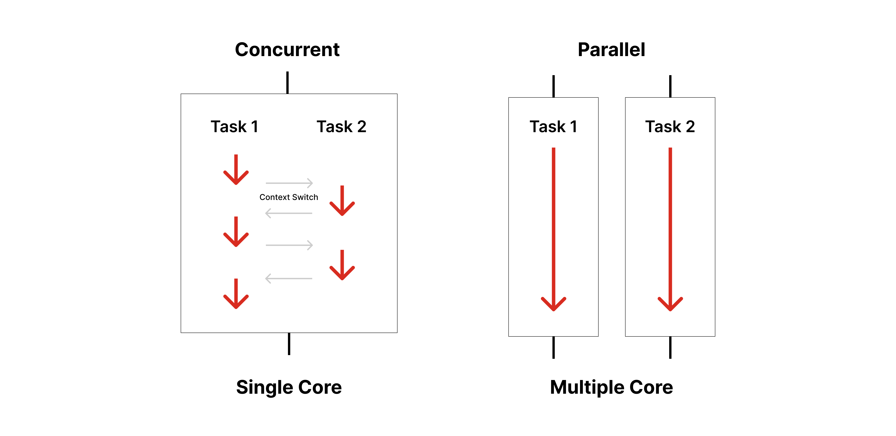

# Spring Boot의 멀티 스레드와 Node.js의 비동기 프로그래밍

<br><br>
<center></center>
<br><br>

스프링 부트 애플리케이션의 멀티 스레드 환경에 대해 공부하다가, 싱글 스레드 환경에서 비동기로 동작하는 Node.js와 정확히 어떻게 다르게 동작하는 건지 궁금해졌다. 스프링과 구별되는 노드의 특징이라 하면 비동기 프로그래밍이 가장 먼저 떠오르는데, 개발할 때 그 차이가 확 와닿는 느낌이 아니었어서 이번 기회에 제대로 정리해보고자 한다.

> 대부분 우리가 사용하는 PC가 그렇듯, 프로그램을 실행하는 컴퓨터의 CPU가 **여러 개의 코어를 가진 CPU**라고 생각하고 설명한다.

<br>

---

# 동시성과 병렬성은 다르다

멀티 스레드 환경과 비동기 프로그래밍을 이해하기 위해서는 동시성과 병렬성의 차이를 인지하고 있어야 한다.

- **동시성, Concurrency**

    - CPU의 Time-sharing을 통해 작업<span style="color:#737373; font-size:14px; font-weight:300;"> 프로세스 또는 스레드 </span>이 동시에 수행되는 것처럼 보이는 것일 뿐, 실제로 CPU가 동시간대에 여러 개의 작업을 수행하는 것이 아니다.

    > Time-sharing이란 일정 주기로 컨텍스트 스위칭이 일어나 작업을 번갈아 처리하는 CPU의 컴퓨팅 기법이다. 매우 짧은 시간 마다 컨텍스트 스위칭이 일어나 사용자의 입장에서는 여러 개의 작업이 동시에 수행되는 것처럼 느껴진다.

- **병렬성, Parallelism**

    - 실제로 CPU 내에서 각각의 작업이 물리적으로 동시에 실행된다.

    - 따라서 CPU의 코어가 여러 개 있는 멀티 코어에서만 병렬성 있게 작업을 수행할 수 있다.

- 싱글 코어에서도 멀티 스레딩이 가능은 하다. 단, 이 경우는 병렬성이 보장되는 것이 아니라, **동시성**을 통해 병렬적으로 작업하는 것처럼 보이도록 작업을 수행한다. 그러나 싱글 코어 멀티 스레딩은 컨텍스트 스위칭 비용, 동기화 등의 이유 때문에 단일 스레드 환경보다 성능이 좋지 않으므로 사용할 일이 많진 않을 것 같다.

<br><center></center><br>
<div class="figcaption"> 동시성과 병렬성의 차이 </div>

<br><br>

또한 애플리케이션에 요청이 들어올 때, 수행해야 할 작업이 어떤 특성을 지녔고 이에 따라 어떤 처리가 필요한지에 대해서도 구분해서 인지하고 있어야 한다.

### I/O-bound Task

- 데이터베이스, 파일 시스템, 네트워크 등 **외부 시스템과 상호작용하는 작업**은 I/O 요청을 통해 이뤄진다.

    - 파일 시스템: 파일 읽기 및 쓰기

    - 네트워크: HTTP 요청 및 응답, 데이터베이스와의 통신 등

    - 입출력 장치: 키보드 입력, 화면 출력 등

- 애플리케이션의 프로세스 또는 메모리 바깥에 있는 시스템을 외부 시스템으로 취급한다. 즉 메모리 내에서 처리할 수 있는 작업은 I/O-bound task가 아니다.

- 일반적으로 I/O 요청은 운영체제의 커널을 통해 작업을 수행한다.

### CPU-bound Task

- I/O 요청이 아닌 요청을 보통 CPU-bound Task, CPU 연산이라고 한다.

- 입출력 없이 CPU만 사용하는 작업으로, 외부와의 상호작용 없이 애플리케이션 내부에서 데이터를 처리한다.

- 주로 메모리 내에서 발생하며 파일, 네트워크 등 외부 시스템과 데이터를 교환하지 않는다.

- 수학 연산, 문자열 파싱과 같은 데이터 가공, 정렬과 탐색, 객체를 생성하고 메모리 내의 데이터를 조작하는 작업 등

<br>

---

# Spring Boot의 멀티 스레드 환경

자바 스프링에서는 클라이언트의 각 요청을 별개의 스레드로 처리한다. 요청이 들어올 때마다 스레드 풀에서 스레드를 할당 받고, 요청이 완료되면 스레드를 반환하는 방식이다.

요청마다 스레드가 할당되기 때문에 한번에 여러 개의 요청을 처리할 수 있다는 장점이 있다. 즉 서버의 응답성이 좋다.

단, 스레드 간 동기화로 인해 성능이 저하될 수 있으며 동기화 문제가 발생할 수 있다. 또한 컨텍스트 스위칭에 의한 오버헤드가 생긴다.

## I/O-bound 작업이 필요한 경우

I/O 요청이 들어오면 외부 시스템과 상호작용하게 된다. 즉, 요청 처리는 애플리케이션 외부에서 수행한다.

따라서 하나의 스레드 내에서 I/O 요청이 발생하면 외부 시스템으로부터 응답이 올 때까지 다른 작업을 수행하지 못한다. <span style="color:#737373; font-size:14px; font-weight:300;"> 동기적 </span> 이 대기 시간으로 인해 CPU 유휴 상태가 발생한다.

<br>

---

# Node.js의 싱글 스레드 환경과 비동기 프로그래밍

각 요청을 각각의 스레드가 처리하는 스프링 부트와 다르게, 노드는 클라이언트의 모든 요청을 하나의 스레드에서 처리한다.

처리에 10초가 걸리는 어떤 요청이 들어온다면, 새로운 다음 요청을 처리하기 위해 반드시 10초 동안 해당 요청이 처리되기를 기다려야 한다.

그렇기 때문에 노드는 일반적으로 싱글 스레드로 동작한다고 알려져 있다. 그런데 노드는 **Libuv 라이브러리**를 통해 일부 작업에서 멀티 스레드로 동작할 수 있다.

## 노드가 I/O-bound 작업을 비동기로 처리하는 방식

노드의 라이브러리 libuv는 이미 커널의 동작 방식에 대해 알고 있다. 따라서 들어온 I/O 요청을 살펴보고, kernel API가 비동기로 처리할 수 있는 작업이라면 kernel API 호출을 통해 해당 요청을 처리하도록 한다. 그러나 커널이 동기적으로 처리하는 작업에 대한 요청이 들어온다면, **libuv 내부의 스레드 풀에서 이를 처리**하도록 만든다. 따라서 어떤 I/O 요청에도 이벤트 루프 입장에서는 비동기인 것처럼 실행되도록 해준다. 애플리케이션 외부에서 처리되는 I/O 요청에 대한 응답을 기다리지 않고, 그동안 다른 작업을 수행할 수 있도록 해주는 것이다.

<br><br>

지금까지의 설명만 읽으면 스프링은 비동기 프로그래밍을 활용하지 못하며, 노드는 멀티 스레딩이 불가능한 것처럼 보인다. 그렇기에 스프링과 노드를 비교할 때 I/O 요청이 많은 서버에는 노드가, CPU 집약적인 작업이 많다면 병렬 처리를 할 수 있는 스프링을 선택하는 것이 적합하다는 특징을 들곤 했다.

그러나 스프링에서의 비동기 처리와 노드에서의 멀티 스레딩이 완전히 불가능한 것은 아니다.

<br>

---

# Spring WebFlux

- 스프링의 비동기/논블로킹 웹 프레임워크 WebFlux라는 기술이 등장했다.

- 스레드를 여러 개 사용하며 컨텍스트 스위칭 비용이 드는 문제를 해결하기 위해, 최소 스레드로 최대 성능을 낼 수 있게 컨텍스트 스위칭 비용을 효율화 한다.

- I/O 요청이 논블로킹으로 처리되어 CPU 유휴 상태를 최소화한다.

- 함수형 프로그래밍 모델로 개발하여 동시 처리 코드에 있어 효율을 더한다.

    - 함수형 프로그래밍은 순수 함수를 사용하기 때문에 상태 변화, 자원이 공유되는 상태를 회피하여 동기화 문제가 발생하지 않는다.

### 한계

- 기존의 동기식 MVC 구조와 완전히 다른 새로운 패러다임이다.

- 기술적 난이도가 매우 높다.

- 아직 RDB 지원이 부족하다.

기존의 코드 구조와 완전히 다르며, 성능을 최적화할 정도로 제대로 활용하려면 매우 어렵기 때문에 빠르게 도입하기는 무리가 있어 보인다. 실무에서도 매우 낮은 비율로 사용하고 있다고 하나 최근에는 활용하려는 시도가 점차 나타나는 것 같다.

<br>

---

# Spring `@Async` Annotation

- 동기식 요청 처리 모델에서도 `@Async` 어노테이션과 `CompletableFuture`을 활용해 비동기 처리를 구현할 수 있다.

- `@EnableAsync`로 비동기 처리를 활성화하고, `@Async`로 비동기로 실행할 메서드를 정의한다.

- `@Async` 어노테이션이 붙은 메서드가 호출되면, 스프링이 해당 호출을 가로채 비동기 실행을 처리하기 위한 프록시 객체를 생성한다. <span style="color:#737373; font-size:14px; font-weight:300;"> Spring AOP </span> 해당 메서드는 `TaskExecutor`에 의해 스레드 풀에 작업으로 등록되고, 호출자와 별도의 스레드에서 작업이 수행되며 호출자 메서드는 블로킹되지 않고 즉시 리턴되게 된다.

- `CompletableFuture`는 비동기 작업이 완료된 이후 결과값을 다루는 다양한 메서드를 제공하여 비동기 처리 결과를 편리하게 다룰 수 있도록 해준다.

- 기존의 동기식 코드에도 간편하게 적용할 수 있으며, 필요에 따라 작업을 비동기로 전환하여 CPU 효율을 높일 수 있다. 가장 일반적으로 사용할 수 있는 방법이다.


<br><br>

다음으로 노드에서 클라이언트 요청에 여러 개의 스레드를 사용할 수 있는 방법들이 있다.

<br>

---

# Node.js worker_thread

Node.js v10.5.0에서 처음 등장해, 2019년 v12 LTS부터 안정적으로 지원되기 시작했다.

```js

    // 부모 스레드의 코드가 담긴 index.js

    import { Worker } from "worker_threads";

    // worker.js에는 자식 스레드의 코드가 담겨있다.
    // 자식 스레드를 생성하는 코드
    const worker = new Worker("./worker.js");

```

- CPU가 멀티 코어라도 노드가 단일 코어에서만 실행되기 때문에 나머지 코어를 활용하지 못한다는 단점을 보완한다.

```js

    import { Worker, isMainThread } from "worker_threads";

    if (isMainThread) {
        // 해당 프로세스가 부모 프로세스(main)인 경우
        const worker = new Worker("./worker.js");
        console.log('parent');
    } else {
        // 해당 프로세스가 자식 프로세스(worker)인 경우
        console.log('child');
    }
    
```

<br>

---

# Node.js Cluster Module

- 워커 스레드는 스레드를 여러 개 만들어 CPU의 작업을 분담하는 것이라면, **클러스터 모듈**을 통해서는 **프로세스 자체를 여러 개 생성**할 수 있다.

- 포트를 공유하는 노드 프로세스를 여러 개 두어, 요청이 많이 들어오더라도 병렬로 실행된 서버 개수만큼 요청을 분산시킬 수 있다.

- 단, 멀티 스레딩이 아닌 **멀티 프로세싱**으로, 메모리, 세션 같은 서버 자원이 공유되지 않는다.

    - 보통 로그인 기능 구현시 세션을 메모리에 저장하는 경우가 많은데, 프로세스가 여러 개가 되어 자원이 공유되지 않는다면 이러한 문제를 해결하기 위해 Redis나 Memcached를 추가로 사용할 수 있다.

### Node.js에서 제공하는 코어 모듈 활용하기

```js

    import cluster from "cluster";
    import { cpus } from "os";
    import process from "process"l

    const cpuCount = cpus().length();

    if (cluster.isPrimary) {
        // 해당 프로세스가 부모 프로세스(pirmary)인 경우
        console.log('Primary ${process.pid} is running');

        // 부모 프로세스에서 자식 프로세스를 fork
        // cpu 개수 - 1(부모 프로세스)만큼 새로운 프로세스를 생성할 수 있다.
        for (let i = 0; i < cpuCount - 1; i++) {
            cluster.fork();
        }
    } else {
        // 해당 프로세스가 자식 프로세스(worker)인 경우
        console.log('Worker ${process.pid} is running');
    }

```

- 노드에 내장되어 있는 코어 모듈 중 하나로 위와 같이 사용할 수 있다.

### PM2 사용하기

- 노드 프로그램의 실행을 관리해주는 **프로세스 매니저 PM2**를 사용하여 개발자가 직접 구현하지 않고도 Cluster 기능을 사용할 수 있다.

- 서버가 중단되면 재시작하는 기능, 멀티 코어 혹은 하이퍼 스레딩 <span style="color:#737373; font-size:14px; font-weight:300;"> 각 코어에서 여러 스레드를 실행 </span>, 요청을 자동으로 여러 노드 프로세스에 분배하는 로드밸런싱 기능을 지원한다.

- PM2의 클러스터 모드 명령어

    ```bash

        pm2 start app.js -i max

    ```

    - 사용 가능한 CPU의 개수를 자동으로 감지하여 최대한 많은 프로세스를 실행하도록 한다.


### 한계

1. 멀티스레드 병렬 처리의 복잡성

- 스프링에 비해 멀티스레드 처리가 직관적이지 않다. 개발자가 세부적인 스레드 관리를 해야 하기 때문에 복잡하고 주의가 필요하다.

2. 메모리 사용량 증가

- 각 워커 스레드는 별도의 V8 인스턴스를 생성한다. 따라서 메모리 사용이 증가한다.

<br>

---

<br>

새로운 기술의 도입으로 약점을 보완할 수 있는 방법이 생겨나고 있다. 그래도 아직은 노드의 강점은 I/O 요청이 빈번한 애플리케이션에서 발휘되며, 스프링은 CPU를 사용하는 복잡한 비즈니스 로직 설계에 적합하다고 볼 수 있을 것 같다.

만약 WebFlux를 충분히 잘 활용할 수 있게 된다면 스프링이 노드의 강점도 확보하는 더 강력한 프레임워크가 될지도 모른다는 생각도 든다. 그치만 노드는 노드만의 가볍고 깔끔한 매력이 있는 것 같다. Node.js 20부터 성능도 크게 향상되었다고 하니...<span style="color:#737373; font-size:14px; font-weight:300;"> 그래서 스프링에 어느정도 익숙해진 뒤 꼭 네스트를 배워보고 싶다. 노드 파이팅 네스트 파이팅 </span>

작년 말에 흥미롭게 봤던 우아콘 발표 영상 [우형의 새로운 백엔드 개발 표준](https://www.youtube.com/watch?v=Z0d7ZrxY-i0)을 공유하며 마치겠다!

<br><br>
<details>
<summary> &nbsp; 📁 참고 자료</summary>
<div>
    <div>
    ❗️ <a href="https://helloinyong.tistory.com/350" target="_blank">Node.js가 왜 싱글 스레드로 불리는지 "정확한 이유"를 알고 계신가요?</a>
    </div>
    <div>
    ❗️ <a href="https://kosaf04pyh.tistory.com/m/340" target="_blank">[node.js] single thread and libuv</a>
    </div>
    <div>
    ❗️ <a href="https://xxeol.tistory.com/44" target="_blank">[Spring] @Async와 스레드풀</a>
    </div>
    <div>
    ❗️ <a href="" target="_blank"> </a>
    </div>
    <div>
    ❗️ <a href="https://velog.io/@elon/Node.js-Worker-threads-%EC%82%AC%EC%9A%A9%EB%B2%95" target="_blank">Node.js Worker threads 사용법</a>
    </div>
</div>
</details>