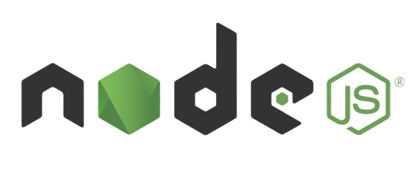
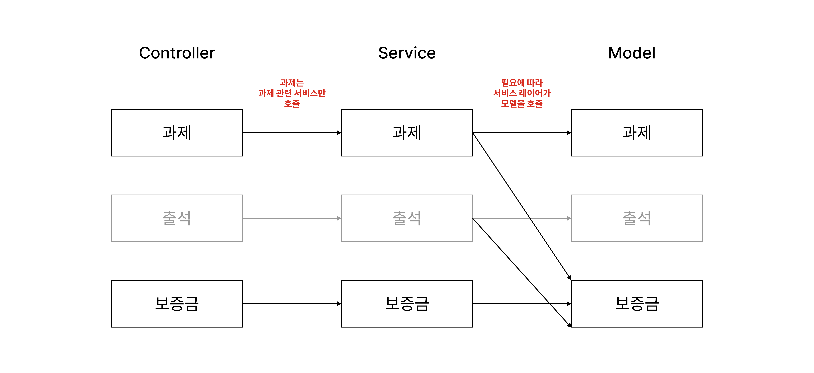

# [Node.js] Transaction으로 동시성 문제 해결하기

<br><br>
<center></center>
<br><br>

항공기 예약, 은행, 신용 카드 처리, 대형 할인점 등에서는 대규모 데이터베이스에 수백, 수천 명 이상의 사용자들이 동시에 접근한다. 즉 많은 사용자들이 동시에 서로 다른 데이터 또는 동일한 데이터에 접근하며 데이터베이스를 사용한다.

데이터베이스의 동일한 부분에 여러 사용자가 동시에 접근하게 된다면 그 결과가 어떻게 처리되어야 할까? 이런 경쟁 상태로 인해 데이터의 결과가 비결정적으로 나오는 문제를 해결하기 위해 데이터베이스에서는 **트랜잭션**이라는 개념을 사용한다.

이전에 개발 도중 트랜잭션 처리를 해주지 않아 의도치 않은 결과가 나왔던 적이 있다. 문제를 해결하려면 프로젝트의 전반적인 구조 자체를 변경해야 했고, 그대로 유지보수가 중단되어 넘겨버렸던 그때의 문제 상황을 **트랜잭션을 통해 어떻게 해결할 수 있을지** 생각해보고자 한다. 이참에 트랜잭션의 개념도 간단히 정리해보려고 하는데 실제 코드에 적용하는 부분이 궁금하다면 [여기](https://mingdodev.github.io/blog/dev/2024-11-23-transaction-in-nodejs/#transaction이-필요한-문제-상황)로 바로 넘어가도 좋다.

<br>

---

# Transaction

트랜잭션이란 데이터베이스의 상태를 변화시키기 위해 수행하는 작업의 단위이다.  
트랜잭션 내에서 실행한 하나 또는 여러 개의 작업은 **하나의 단위**로 취급된다.

<br>

DBMS의 관점에서 조금 더 구체적으로 말하자면

- 데이터베이스에서 하나의 논리적인 단위를 수행하는 데이터베이스 연산들의 모임

- 데이터 객체에 접근하거나 갱신하는 프로그램 수행의 단위

라고 볼 수 있다.

## 동시성 제어와 회복

동시성 제어와 회복은 데이터베이스의 필수적인 메커니즘이다.  
동시성 제어와 회복을 위한 처리들은 트랜잭션이 ACID 특성을 가지도록 보장해준다.

### 동시성 제어 (Concurrency Control)

- 다수의 사용자가 데이터베이스를 동시에 접근하도록 허용하면서 데이터베이스의 일관성을 유지하는 것

- 동시에 수행되는 트랜잭션들이 데이터베이스에 미치는 영향은, 이들을 순차적으로 수행했을 때 데이터베이스에 미치는 영향과 같도록 보장되어야 한다.

### 회복 (Recovery)

- 데이터베이스를 갱신하는 도중에 시스템이 고장 나도 데이터베이스의 일관성을 유지하는 것

- 트랜잭션이 수행되다가 시스템이 다운되면 완료되지 못한 트랜잭션이 롤백되거나 <span style="color:#737373; font-size:14px; font-weight:300;"> UNDO </span> 이미 완료된 작업이 다시 반영되어야 한다. <span style="color:#737373; font-size:14px; font-weight:300;"> REDO </span>

## 트랜잭션의 특성 (ACID)

트랜잭션은 다음과 같은 네 가지 특성을 만족해야 한다.

### 1. 원자성 (Atomicity)

- 하나의 트랜잭션 내의 모든 연산들이 완전히 수행되거나 전혀 수행되지 않는다. <span style="color:#737373; font-size:14px; font-weight:300;"> all or nothing </span>

- 데이터베이스 관리 시스템의 회복 모듈은 트랜잭션의 원자성을 보장한다.

### 2. 일관성 (Consistency)

- 어떤 트랜잭션이 수행되기 전에 데이터베이스가 일관된 상태를 가졌다면 트랜잭션이 수행된 후 데이터베이스는 또 다른 일관된 상태를 가진다.

- 트랜잭션이 수행되는 도중에는 데이터베이스가 일시적으로 일관된 상태를 갖지 않을 수도 있다.

### 3. 고립성 (Isolation)

- 다수의 트랜잭션들이 동시에 수행되더라도 그 결과는 어떤 순서에 따라 트랜잭션들을 하나씩 차례대로 수행한 결과와 같다.

- 하나의 트랜잭션이 데이터를 갱신하는 동안, 이 트랜잭션이 완료되기 전에는 갱신 중인 데이터에 다른 트랜잭션들이 접근하지 못한다.

- DBMS의 동시성 제어 모듈이 트랜잭션의 고립성을 보장한다. <span style="color:#737373; font-size:14px; font-weight:300;"> 다양한 고립수준을 제공 </span>

### 4. 지속성 (Durability)

- 완료된 트랜잭션의 효과는 지속적이다.

- 일단 한 트랜잭션이 완료되면 이 트랜잭션이 갱신한 것은 그 후에 시스템에 고장이 발생하더라도 손실되지 않는다.

- DBMS의 회복 모듈은 시스템이 다운되는 경우에도 트랜잭션의 지속성을 보장한다.

<br>

---

# Transaction이 필요한 문제 상황

피로그래밍에서 사용할 동아리 전용 앱을 개발할 때 트랜잭션 처리를 해주지 않아 치명적인 문제가 발생했었다.

나는 동아리 운영을 위한 핵심 기능 중 **과제**와 관련한 기능을 맡아, 매 세션마다 나오는 과제를 채점하여 그 결과에 따라 회원들의 보증금을 유지하거나 차감하는 기능을 구현했다.

<center></center>
<div class="figcaption"> 앱 내에서의 과제 채점 프로세스 </div>

**과제 채점**이라는 행위는 데이터베이스 상에서 `과제 결과 생성 및 수정`을 통해 이루어진다. 그러나 이번 글에서는 트랜잭션에 집중하기 위해, 다른 기능과 너무 복잡하게 연관되어있는 `과제 결과 수정`은 다루지 않을 것이다

요구 사항을 충족시키기 위해서는 다음과 같은 순서로 데이터베이스 갱신이 이루어져야 한다. 

1. 과제 결과 **CREATE**

    - 과제 결과 행 테이블은 채점 결과 <span style="color:#737373; font-size:14px; font-weight:300;"> 제출, 미흡, 지각, 미제출 </span> 컬럼을 가지며, 외래키로 과제 ID와 회원 ID 컬럼을 가진다.

    - 즉 누가 어떤 과제에 대해 어떤 점수를 부여받았는지를 기록하는 테이블이다.

2. 과제 결과에 따른 보증금 금액 **UPDATE**

    - 회원 테이블은 보증금 컬럼을 가진다.

### DB 구조

관계형 데이터베이스 MySQL을 사용하였으며, 해당 기능 구현에는 **과제, 과제 결과, 회원** 테이블이 관여한다.


- 과제와 회원 간의 다대다 관계에 의해 과제 결과 테이블이 필요해졌음을 알 수 있다.

- 과제 테이블 : 과제 결과 테이블 `1 : N`

    - 과제 결과는 **특정** 과제에 대한 결과이다.

    - 과제에 대한 과제 결과는 없을 수도 있고 있을 수도 있다.

- 과제 결과 테이블 : 회원 테이블  `M : 1`

    - 과제 결과는 **특정** 회원에 대한 과제 채점 결과이다.

    - 특정 과제에 대한 과제 결과는 회원 당 0개 또는 1개만 가질 수 있다.

<br>

> 해당 프로젝트에서는 ORM 기술을 활용하지 않고 직접 쿼리를 작성해 `MySQL` 데이터베이스에 요청하는 방식을 사용했다.

### 기존 Controller 코드

과제 최초 채점시 과제 결과를 생성하고 수정하는 코드에서 문제가 발생한다. 수정 작업은 연관 관계가 훨씬 복잡하기 때문에, 간단한 과제 결과 생성 기능을 중점적으로 문제를 파악하고 개선해보려고 한다.

- `Router` → `Controller` → `Model`의 흐름으로 컨트롤러가 모델을 호출하여 DB 쿼리 작업을 수행한다.

    - 하나의 트랜잭션으로 수행되어야 하는 쿼리들이 모델의 메서드 `assignModel.createGrade()`, `depositModel.updateDeposit()`에서 독립적으로 수행되고 있다.

    - 심지어 같은 모델이 아닌 서로 다른 모델에서 처리되고 있다.

    ```js
        // file: "assingmentController.js"
        createGrade: async (req, res) => {
        
            // 응답으로부터 필요한 변수 추출 (생략)

            // 회원의 과제 결과 생성
            const data = await assignModel.createGrade(assignScheduleId, userId, inputGrade);

            // 과제 결과에 따른 보증금 금액을 업데이트
            switch (inputGrade) {
                case 0:
                    await depositModel.updateDeposit(userId, -20000);
                    break;
                case 1:
                case 2:
                    await depositModel.updateDeposit(userId, -10000);
                    break;
            }
            ...
        }

    ```

### 기존 Model 코드와 Query

- `assignModel`에서 과제 결과를 생성하는 `MySQL` 쿼리를 수행한다.

    ```js
        // file: "assignmentModel.js"
        createGrade: async (assignScheduleId, userId, inputGrade) => {
            const query = `
                INSERT INTO
                Assign (user_id, grade, assignschedule_id)
                VALUES (? , ? , ?);
                `;

            await db.query(query, [userId, inputGrade, assignScheduleId]);
        }

    ```

- `depositModel`에서 보증금을 업데이트하는 `MySQL` 쿼리를 수행한다.

    ```js
        // file: "depositModel.js"
        updateDeposit: async (userId, adder) => {
            const query = `
                UPDATE User
                SET deposit = deposit + ?
                WHERE user_id = ?;
                `;

            await db.query(query, [adder, userId]);
        }

    ```

<br>

## 📌 어떤 문제가 발생했는가?

평소와 같이 과제를 채점하던 중, 보증금 금액이 원래 차감되어야 하는 값보다 더 많이 깎여있는 회원 A를 발견했다.


- 과제 채점 전, A의 보증금은 5만원이었다.

- 과제 채점 이후, 1만원이 차감된 4만원으로 보증금이 업데이트되어야 한다. 그러나 A의 보증금은 3만원이 되었다.

여기서 알 수 있는 점은 결과적으로 `-1만원`이라는 동작이 두 번 실행되었다는 점이다. **과제 채점 화면에서 버튼이 두 번 눌러졌다**면 이런 상황이 충분히 발생할 수 있다.

<br>

하지만 과제 결과 데이터는 중복 생성될 수 없도록 클라이언트 단에서 예외 처리가 되어있는데?

- 과제 결과 채점 버튼을 누를 때 이미 해당 사용자에게 과제 결과 데이터가 존재한다면 `과제 결과 수정`으로 요청이 보내진다.

- 그러나 현재 코드상에서는 과제 결과에 대한 CREATE 작업이 완료되기 전에 READ 작업이 수행될 수 있다. **각각의 작업이 여러 개의 독립적인 트랜잭션**이기 때문이다.

- 그렇다면 버튼을 두 번째 눌렀을 때에도 아직 데이터가 없는 것으로 판단되어 `과제 결과 생성`으로 요청이 보내지게 된다. 따라서 과제 결과가 중복 생성되어 보증금 차감이 여러 번 수행될 가능성이 있다. <span style="color:#737373; font-size:14px; font-weight:300;"> 데이터베이스에서도 유일성을 보장해주는 처리가 없었기에, 오류 없이 중복 생성될 것이다.. </span>


따라서 클라이언트 측에서 **동일한 요청을 거의 동시에 두 번 보내게 되었고, 이에 따라 동시성 문제가 발생한 것**으로 결론을 내렸다.

<br>

이러한 문제가 발생한 근본적인 원인은 다음과 같다.

## 📌 왜 문제가 발생했는가?

수행되는 작업을 단순화해보면 아래와 같은 두 메서드의 실행으로 볼 수 있다.

```js
    // file: "assingmentController.js"
    createGrade: async (req, res) => {
        ...
        await assignModel.createGrade(assignScheduleId, userId, inputGrade);
        ...
        await depositModel.updateDeposit(userId, -10000);
        ...
    }

```

<br><center></center><br>

이를 기준으로 메서드의 실행 순서에 따른 결과를 추적해보면 위와 같다. 트랜잭션으로 묶이지 않은 각각의 작업들이 어떤 순서에 의해 독립적으로 실행되어, 잘못된 값이 도출되었음을 알 수 있다.

개념적으로 하나의 단위로 실행되어야 하는 작업들이기 때문에 **Task의 작업들이 모두 성공하거나 모두 실패해야 하는데, 일부만 성공**했기 때문에 의도치 않은 결과를 초래한 것이다.

따라서 이 메서드들, 즉 작업들이 **프로그램에서 다른 Task가 개입할 여지가 없는 하나의 단위로 실행**되도록 트랜잭션 처리를 해 문제를 해결할 것이다.

<br>

---

# Transaction 적용하여 해결해보기

당시 섣불리 트랜잭션을 구현하지 못했었는데, 그 이유는 묶어야 할 쿼리를 제어하는 메서드가 여러 컨트롤러에 분산되어있었기 때문이다. 채점 결과가 수정되는 경우는 로직이 훨씬 복잡했고 과제 기능뿐만 아니라 다른 기능도 함께 변경되어야 했다. 그래서 실제 서비스에 반영은 못했더라도 프로젝트 구조를 개선할 방법에 대한 아이디어들을 정리하여 학습에 활용하고자 한다.

## 1. 프로젝트 구조 개선

현재 프로젝트의 MVC 패턴을 살펴보면, 지금은 **클라이언트가 보는 페이지**에서 보낼 수 있는 요청의 종류에 따라 Controller를 구분하고 있다.

<center></center><br>

이 구조에서 내가 의문을 가졌던 부분은 **보증금이라는 데이터가 보증금 페이지가 아닌 다른 페이지의 요청을 통해서도 변경된다는 점**이다. 그렇기 때문에 과제, 출석 Controller에서도 보증금 Model을 호출하여 보증금과 관련된 비즈니스 로직을 수행하게 된다. 그런데 이 로직이 굉장히 무겁다. 그래서 이름은 과제 Controller인데 대부분의 메서드가 보증금 관련 로직을 처리하고 있으니 과연 이 컨트롤러가 이런 책임을 지는 것이 맞을까하는 생각이 들었다.

<center></center><br>

따라서 우선적으로는 컨트롤러의 역할을 경량화하는 것이 좋다고 생각했다. 추가로 **서비스 레이어를 도입**하여, 모델을 호출하고 비즈니스 로직을 수행하는 것은 서비스 레이어에서 담당하도록 구조를 개선하도록 한다. 이렇게 하면 **컨트롤러**는 **사용자의 요청을 전달하고 응답을 뷰로 반환하는 본래의 역할**에만 집중할 수 있게 된다. 트랜잭션 작업까지 추가하게 된다면 컨트롤러가 더 무거워질 것이기 때문에 구조적 개선이 1순위라고 느꼈다.

## 2. 분산된 쿼리를 하나의 트랜잭션으로 묶기

처음에는 모델에서 쿼리를 작성할 때 `START TRANSACTION`, `COMMIT`, `ROLLBACK`을 사용해 트랜잭션 처리를 해주는 방법을 생각했었다. 그런데 이렇게 하면 다음과 같은 느낌으로 SQL문을 작성하게 될 것이다.

```js
    // file: "assignModel.js"
    createGrade: async (...) => {
        const query = `
            START TRANSACTION;
            INSERT INTO
            Assign (user_id, grade, assignschedule_id)
            VALUES (? , ? , ?);
            UPDATE User
            SET deposit=deposit + ?
            WHERE user_id=?;
            COMMIT;
            `;
        db.query(query, [...]);
  }

```

이렇게 트랜잭션을 만들게 되면 하나의 모델에서 여러 테이블의 데이터를 변경하는 꼴이 된다. 즉 **모델이 여러 개 존재할 이유가 없어진다**. 또한 트랜잭션 실행 도중 오류가 발생했을 때 자동으로 롤백이 되도록 설정하기도 어렵다.

따라서 데이터베이스 변경 사항을 영속화하는 역할은 각각의 모델에게 전적으로 맡기고, **서비스 레이어에서 MySQL 모듈을 통해 트랜잭션 처리**를 해줄 것이다.

<br>

```js
    // file: "assignService.js"
    const db = require("../config/db.js"); // 커넥션 풀
    const assignModel = require("../models/assignModel");
    const depositModel = require("../models/depositModel");

    module.exports = {
        createGrade: async (req, res) => {
            // 트랜잭션에서 사용할 커넥션 얻기
            const connection = await db.getConnection();

            try {
                // 트랜잭션 시작
                await connection.beginTransaction();

                // 트랜잭션에 집중하기 위해 세부 로직과 파라미터는 생략함
                
                // 모델에 커넥션 전달
                await assignModel.createGrade(connection, ...);
                await depositModel.updateDeposit(connection, ...);

                // 모든 작업을 성공하면 커밋
                await connection.commit();
            } catch(error) {
                // 오류가 발생하면 롤백
                await connection.rollback()

                throw error;
            } finally {
                // 오류가 발생하더라도 커넥션은 반환됨
                connection.release();
            }
        }, ...
}
    
```

우선 데이터베이스로부터 사용할 커넥션을 얻어온 뒤, 명시적으로 해당 커넥션에서 트랜잭션이 시작되도록 처리해준다.

이전에는 `createPool`이 자동으로 커넥션 풀을 관리해주었기 때문에 바로 `query()` 메서드를 호출해도 알아서 커넥션을 가져와 사용하고 커밋 후 반환해주었다. <span style="color:#737373; font-size:14px; font-weight:300;">auto-commit</span> 지금은 애플리케이션 단에서 트랜잭션을 시작하고 때에 따라 커밋과 롤백을 수행할 수 있도록, 수동으로 커넥션을 얻어와 직접 구현해주어야 한다.

또한 각각의 모델에도 커넥션을 전달하여 트랜잭션 컨텍스트를 유지하도록 해준다.

```js
    // file: "assignModel.js"
    createGrade: async (connection, ...) => {
    const query = `
        INSERT INTO
         Assign (user_id, grade, assignschedule_id)
        VALUES (? , ? , ?);
        `;
        await connection.query(query, [...]);
  }

```

이렇게 받아온 특정 커넥션에서 쿼리를 보내도록 코드를 변경해주면 트랜잭션 구현이 완료된다.

<br><br>

당시엔 프로젝트의 대부분을 고쳐야 오류를 해결할 수 있을 것이라 생각했다. 그런데 이번에 아이디어를 구상하고 직접 구현해보니 생각보다는 간단하게 해결할 수 있을 것 같다. 서비스 레이어로 비즈니스 로직을 처리한다면, 의존성이 높은 핵심 기능들도 전부 책임을 분리해버리고 동시성 문제를 안전하게 처리할 수 있을 것 같은데?! 🤔

아무래도 시간이 흐르는 동안 여러 가지 경험을 거듭하며 새로운 지식을 얻었기 때문에 그때는 커다랗게 보였던 문제가 지금은 별 거 아닌 것처럼 보이는 것 같기도 하다.

<!-- <br>

---

## 여담: 느낀 점

무려 1년 전, 개발을 막 시작했을 때의 내 코드를 돌아보니 개선할 점이 정말 많았다. <span style="color:#737373; font-size:14px; font-weight:300;"> 심란파티다 </span> 트랜잭션의 존재 자체를 몰랐을 정도로 컴퓨터에 대해 무지했을 때 설계한 애플리케이션이라 충분히 실수할 만한 부분은 맞다. 근데 변수명 네이밍 센스는 굉장히 실망적이므로 당장 눈에 보이는 문제 몇 가지만 짚고 넘어가야겠다.

<br>

- **의도가 명백히 드러나는 이름**을 사용해야 한다.

    - 어떤 데이터를 담고 있는지 식별할 수 있는 이름을 사용해야 한다.

    - 코드를 보니 `data`라는 무책임한 변수명이 꽤 많았다. 단순히 데이터를 응답 본문에 전달할 때만 사용하여 큰 문제가 된 적은 없었으나, 장기적인 유지보수 관점으로 봤을 때에는 내가 작성한 코드라도 헷갈리겠다 싶었다.

    - 프론트엔드 개발자에게 어떤 변수명으로 데이터를 내려줄 지에 대해서는 고려했었는데, 오히려 같은 서버 개발자는 배려하지 못했다는 생각이 든다. 누가 보더라도 이 데이터가 어떤 목적으로 사용되는지 파악할 수 있는 명확한 변수명을 사용해야 할 것이다.

- 프로그램에 맞는 **프로그래밍 명명 규칙**을 지키자.

    - 어떤 건 `snake_case`, 어떤 건 `camelCase`로 표기되어있었다. 사실 '무조건 규칙이 최고야!'라기보다 개발자들끼리 소통이 잘 되면 문제가 없다고 생각하는데, 이렇게 섞어서 사용하는 것은 정말 지양해야 한다고 생각한다. 실제로도 개발 도중 `user_id`와 `userId` 때문에 올바른 데이터를 불러오지 못할 때가 있었다.

    - 자바스크립트 변수는 일반적으로 `camelCase`로 통일하도록 하자.

- **축약하지 말자.**

    - 최근에 우테코 프리코스를 진행하며 피드백 받았던 부분인데, 시간이 지날수록 더 공감이 가는 부분인 것 같다.

    - 과제 관련 기능을 구현할 때 `Assignment` 대신 `Assign`으로 축약형을 사용했었다. 안그래도 과제 기능은 복잡한 연관 관계를 가지기 때문에 보다 명확한 변수명이 필요했는데, 이런 축약형이 더 큰 혼란을 야기했던 것 같다.

    - 또한 업데이트를 위한 새로운 입력을 `new`로 받기도 하고 `input`으로 받기도 하여 일관성이 부족했다. 이건 축약형은 아니지만, 어쨌든 의미를 포괄적인 단어로 일단락해버리는 느낌이라서 여기에 적어둔다. 쓰기 쉬운 단어로 넘겨버리지 말고 구체적인 이름을 채택하자.

- **데이터베이스 설계**는 매우 중요하다.

    - 팀 프로젝트 경험이 많지 않음에도 매번 그 중요성을 깨닫고 있다. 초반에 시간이 걸리더라도 회의를 통해 모든 부분을 꼼꼼히 확립하고 넘어가야 한다.

    - 어물쩡 넘겨버린 데이터 타입, 제약 조건들은 개발을 진행하며 큰 문제를 일으켰다. 같은 컬럼에 대해 서로 다르게 이해하고 있어 기능이 충돌하기도 하고, 구두로 회의했지만 기록되지 않은 제약조건은 실제로 구현되지 않아 새로운 문제를 야기하기도 했다.

    - 그만큼 데이터베이스에 대해 깊이 있게 이해할 수 있도록 꾸준히 공부해야겠다고 느꼈다. 또한 역시 **문서화**가 중요하다.

<br>

결국 모든 건 나 자신, 그리고 팀원 간의 소통을 위한 밑바탕으로 귀결되는 것 같긴 하다. 누구나 아는 사실이며 너무 당연한 말이긴 하지만 몇 번을 강조해도 부족할 만큼 가장 중요하다고 생각한다. 여전히 모르는 것이 정말 많지만, 성장의 기회로 활용해 꾸준히 발전하는 개발자가 되어야지 🚀 -->