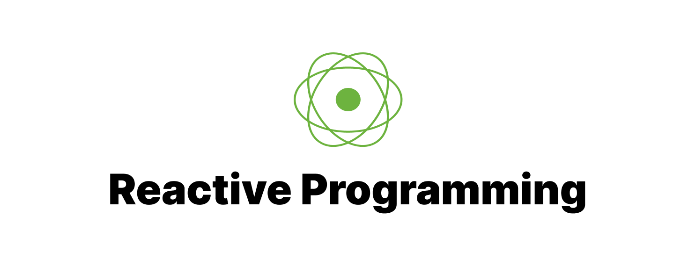
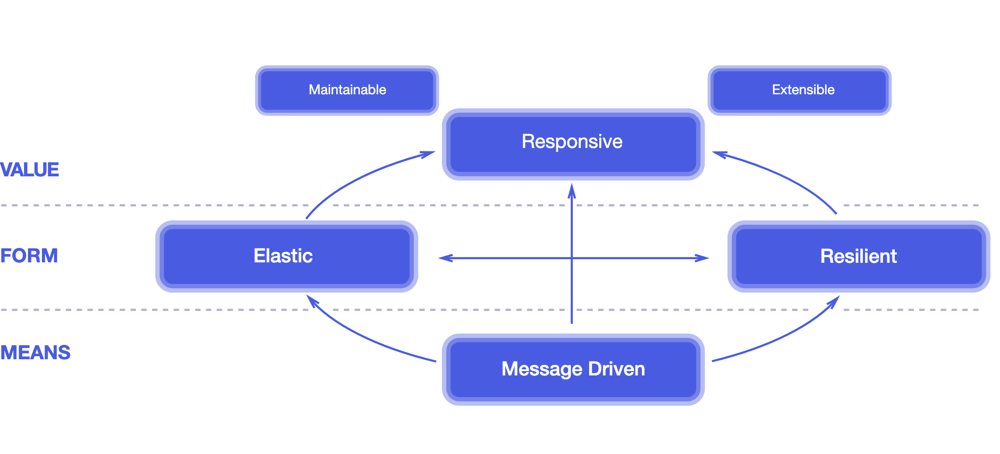
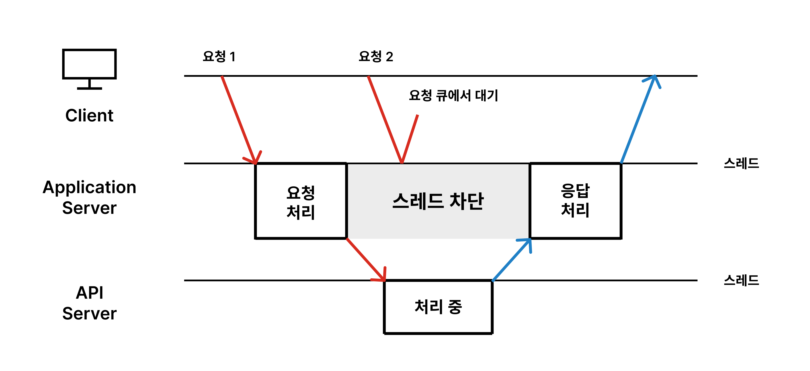
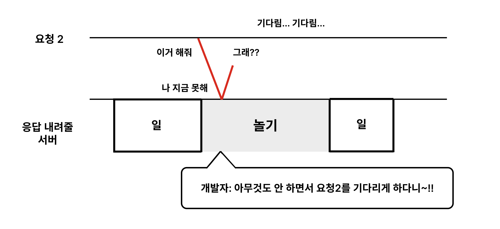
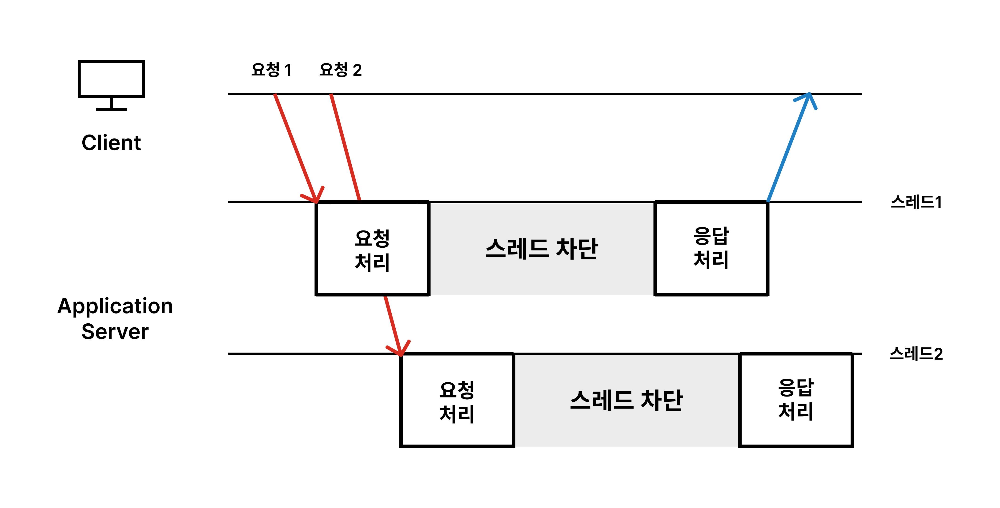
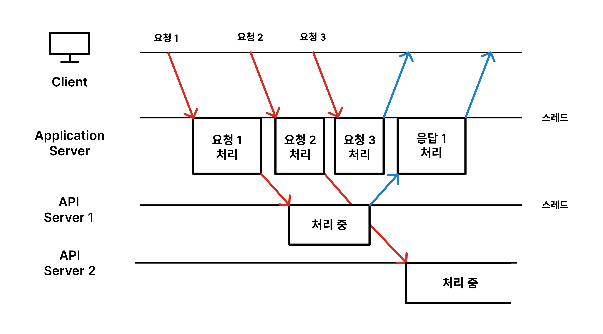
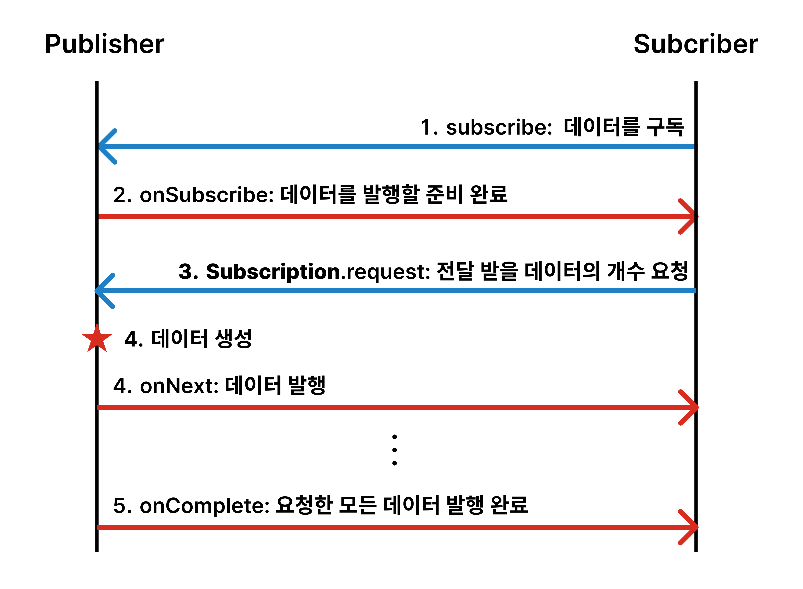

# 응답성 높은 시스템을 위한 Reactive Programming

<center></center>

> 자바/스프링 프레임워크에서의 비동기 프로그래밍을 공부하고자 도서 [스프링으로 시작하는 리액티브 프로그래밍](https://product.kyobobook.co.kr/detail/S000201399476)을 읽고 기록한 글입니다.

<br>

컴퓨팅에서 **Reactive**란 어떤 의미일까요? 말 그대로 **응답을 잘하는, 반응이 좋은** 특성을 말합니다. 그렇다면 높은 반응성이 구체적으로 어떻게 실현될 수 있을까요? 응답을 잘하는 시스템을 설계하기 위해 노력하는 사람들이 일종의 원칙으로서 [리액티브 선언문](https://reactivemanifesto.org/)을 작성해두었습니다.

리액티브 선언문을 바탕으로 리액티브 시스템의 특성에 관해 알아보고, 자바 개발자로서 리액티브 프로그래밍을 어떻게 시작할 수 있는지 알아봅시다.

<br>

---

## Reactive System

- 빠른 **응답성**을 바탕으로 **유지보수**와 **확장**에 용이한 시스템을 말합니다.
- 다음과 같은 설계 원칙을 따릅니다.

<br><center></center>
<div class="figcaption"> The Reactive Manifesto, 2014 </div>

##### 방법

- 구성요소 간 결합도를 낮춘 **비동기 메시지 기반 통신**으로 동작합니다.

##### 형태

- **탄력성**: 입력 양에 관계 없이 동일한 응답성을 유지합니다.

- **회복성**: 장애가 발생하더라도 응답성을 유지합니다.

##### 핵심 가치

- 이러한 탄력성과 회복성을 확보한 설계를 통해 **즉각적으로 응답할 수 있는 시스템**을 구축합니다.

- 빠르고 일정한 응답 속도를 갖춰, **항상 동일한 퀄리티의 서비스를 제공**해야 합니다.

<br>

---

## Reactive Programming

위와 같은 리액티브 시스템 설계 원칙에 부합하는, 비동기 Non-Blocking 통신을 위한 프로그래밍 모델을 말합니다.

### 왜 비동기 Non-Blocking 통신일까?

동기/비동기 및 블로킹/논블로킹의 차이는 [다음 포스팅](https://mingdodev.github.io/blog/cs/2025-02-03-sync-async-blocking-non-blocking/)을 통해 자세히 확인할 수 있습니다.

리액티브 시스템은 응답성을 높이기 위해, 기본적으로 **비동기 Non-Blocking 통신** 모델을 사용합니다. 이는 동기 Blocking 통신과 비교했을 때 요청-응답 과정에서 어떤 차이가 있을까요? 다음과 같은 상황을 가정해서 왜 비동기 통신이 높은 응답성을 갖는지 이해해 봅시다.

여러분의 애플리케이션 서버는 몇몇 요청들을 처리하기 위해 외부 API 서버들에 접근해야 합니다. 따라서 통신 과정에서 네트워크 I/O가 발생하게 됩니다.

우선 이 네트워크 I/O를 Blocking 방식으로 처리해봅시다.

<br>

- **Blocking I/O**

<center></center><br>

API 요청을 **블로킹** 방식으로 처리하게 된다면, 위 그림과 같이 요청을 보낸 스레드는 **차단되어 대기**하게 됩니다. 해당 스레드에 클라이언트의 다른 요청이 들어오더라도, 서버로부터 API 응답이 올 때까지 아무것도 할 수 없는 것이죠!

<br><center></center><br>

이 상황을 요청 2의 입장에서 바라보면 그저 '서버가 바쁘구나'하고 기다리겠지만, 모든 것을 아는 개발자의 입장에서는 스레드가 놀고 있는 시간 동안 요청 2도 대기하는 것이 상당히 비효율적이라고 느껴집니다. 우선, 이 스레드는 쓸 수 없다고 보고 다른 방식으로 새 요청을 처리하는 방법에 대해 생각해봅시다.

<br>

- **Blocking I/O + 멀티 스레드**

<center></center>

똑같은 블로킹 방식에서 멀티 스레드 환경을 채택하는 방법이 있습니다. 한 번 I/O 요청을 보낸 스레드는 응답이 올 때까지 다른 작업을 못하니, 애초에 클라이언트의 요청이 올 때마다 새로운 스레드를 데려와 처리하도록 하는 방식입니다. (스레드를 매번 새롭게 생성하는 대신 미리 생성해두고 가져다 쓰는 스레드 풀 방식을 더 많이 사용합니다.)

그러나 이 방식 역시 스레드 수가 증가하면 문제가 발생합니다. 많은 수의 스레드 만큼 **빈번한 컨텍스트 스위칭**이 일어나기 때문입니다. 컨텍스트 스위칭이 일어날 때마다 스레드 상태 정보를 저장했다 다시 불러오는 작업이 수행되는데, 이때도 CPU가 대기하는 시간이 발생합니다. 즉 이 방식도 전체적으로 봤을 때 대기 시간이 상당하기 때문에 여전히 비효율적인 부분이 있습니다.

<br>

- **비동기 Non-Blocking-I/O**

<center></center>

앞서 봤던 그림의 '아무것도 안 하면서 요청을 기다리게 하다니~!'라는 말을 떠올려 보면 애초에 **스레드를 차단하지 않는** 방식을 생각해볼 수 있습니다. 이 방식이 논블로킹 I/O입니다. 따라서 근본적인 스레드 대기 시간을 없애 응답 지연 시간을 줄이고, 이것이 높은 반응성으로 이어집니다.

이러한 통신 방식에 응답과 요청을 분리하면 **비동기성**을 통해 더 효율적인 작업이 가능해집니다. 위 그림에서 API에 요청을 보낼 때 '이거 다 하면 알려줘~'라고 말한 뒤 다른 작업을 하다가 '다 했어!'라는 반응이 오면 그에 따른 작업을 수행하는 방식입니다.

단, 스레드를 차단하지 않으려면 **그 시간에 수행할 작업이 앞선 요청의 결과와 무관**해야 할 것입니다. 즉 리액티브 프로그래밍에서는 이런 요소를 고려한 세심한 설계가 필요하므로, 전통적인 프로그래밍에 비해 난이도가 있다고 볼 수 있습니다.

### 리액티브 프로그래밍의 특징과 필요성

정의에 따르면, 리액티브 프로그래밍은 다음과 같은 특징을 가집니다.

#### 1. 선언형 프로그래밍 기반

- 동작을 구체적으로 명시하지 않고 목표만 선언

- 여러 동작을 각각의 코드로 분리하는 것이 아니라, 각 동작에 대한 메서드 체인을 형성하여 코드를 한 문장으로 구성

- 함수형 프로그래밍으로 구성

위와 같은 특징으로 간결한 코드, 가독성을 유지하는 프로그래밍을 선언형 프로그래밍이라고 합니다.

> 책에서는 선언형 프로그래밍은 ‘동작을 부탁’하는 것, 명령형은 ‘직접 동작하는 것’으로 예시를 들었습니다.  
> 명칭과 연결지어 보면 명령형은 ‘나는 이렇게 동작한다.’ 선언형은 ‘나는 이러한 동작이다.’로 동작하는 느낌입니다. 그러니 선언형은 동작 자체는 다른 곳(프레임 워크 또는 런타임)에서 하게 되는 것!

#### 2. 데이터 스트림 기반

- 지속적으로 발생하는 데이터를 하나의 흐름, **데이터 스트림**으로 다룹니다.

- 데이터의 변화를 **이벤트**로 보고 이벤트 발생에 따라 필요한 작업을 수행합니다.

<br>

즉 **리액티브 프로그래밍**은 **선언형 프로그래밍**을 기반으로 하며, **데이터를 연속적인 흐름** <span style="color:#737373; font-size:14px; font-weight:300;"> stream </span>으로 다루고, **변화**<span style="color:#737373; font-size:14px; font-weight:300;"> event </span>**에 반응**하여 데이터를 처리하는 방식입니다.

<br>

- 동시에 대량의 클라이언트 요청이 들어오는 서비스
- 지속적인 I/O가 발생하는 마이크로 서비스 기반 시스템
- 실시간 시스템

이 필요한 애플리케이션에 활용하기 적합하다고 볼 수 있습니다.

<br>

---

## Reactive Streams

개발자가 리액티브한 코드를 편리하게, 목적에 알맞게 작성하려면 라이브러리가 필요할 것입니다. **리액티브 라이브러리를 어떻게 구현할지 정의해 놓은 표준 사양**을 리액티브 스트림즈라고 합니다.

### 구성 요소

리액티브 스트림즈는 `Publisher, Subscriber, Subscription, Processor` 컴포넌트로 구성되어 있습니다. 리액티브 스트림즈의 구현체, 즉 리액티브 라이브러리는 이 API 컴포넌트들을 역할에 맞게 구현하게 됩니다.

<br>

- **Publisher**

    - 데이터를 생성하고 발행하는 역할

- **Subscriber**

    - 구독한 Publisher로부터 발행된 데이터를 받아 처리하는 역할

- **Subscription**

    - Publisher에게 요청할 데이터의 개수를 지정하고, 구독을 취소하는 역할

- **Processor**

    - Publisher, Subscriber의 기능을 모두 가짐
    
    - Subscriber가 Processor를 구독할 수도, Processor가 Publisher를 구독할 수도 있음

    - 데이터 흐름의 유연한 처리를 가능하게 하는 역할

<br>

### 컴포넌트 동작 흐름

`Subscriber`과 `Publisher` 두 컴포넌트는 다음과 같은 흐름으로 상호작용하며 데이터를 발행, 처리합니다.

<center></center><br>

1. `Subscriber`가 전달 받을 데이터를 구독합니다.

2. `Publisher`는 데이터를 발행할 준비가 되었음을 `Subscriber`에게 알립니다.

3. `Subscriber`는 `Publisher`가 준비 되었음을 확인하고, 전달 받기 원하는 데이터의 개수를 `Publisher`에게 알립니다.

    > 데이터의 개수를 따로 전달하는 이유는, Subscriber가 데이터를 처리하는 속도와 Publisher가 데이터를 통지하는 속도를 맞추는 흐름 제어가 필요하기 때문입니다. 두 컴포넌트는 대부분 서로 다른 스레드에서 비동기적으로 상호작용 하기 때문에 처리할 데이터가 일방적으로 쌓이게 되면 시스템 부하로 이어질 수 있습니다.

4. `Publisher`는 `Subscriber`로부터 요청 받은 만큼의 데이터를 발행합니다.

5. 모든 데이터를 통지하게 되면 `onComplete`로 `Subscriber`에게 알립니다. 만약 `Publisher`의 데이터 처리 과정에서 에러가 발생하면 `onError`를 호출합니다. (둘 중 하나는 반드시 호출해 구독을 취소해야 합니다. 해당 구독이 유지하고 있는 리소스를 적절한 시기에 안전하게 해제해야 하기 때문입니다.)

<br>

### Reactive Streams JVM API 코드

각 인터페이스들의 코드 구성을 살펴보며 통신 과정에 메서드들이 어떻게 관여하는지 이해해 봅시다.

###### 1. Publisher

```java

    public interface Publisher<T> {
        void subscribe(Subscriber<? super T> s);
    }

```

- `Publisher`는 파라미터로 `Subscriber`를 받아 구독을 등록하는 `subscribe` 메서드 하나만 가집니다.

- 개념적으로는 `Subscriber`가 '구독'이란 행위의 주체가 됩니다. 그러니 Subscriber가 '구독' 메서드를 지녀야 하는 게 아닌가?! 라는 생각이 들 수 있습니다! 그러나 리액티브 스트림즈의 코드 상에서는 **`Publisher`가 `Subscriber`를 등록하는 형태로 구독이 이뤄집니다.**

> 컴포넌트 동작 흐름 그림에서도 `Subscriber` 쪽에서 `subscribe`를 호출하지만, 실제로 해당 메서드는 `Publisher`에 정의되어 있습니다. `Publisher`가 `Subscriber` 구현 객체를 `subscribe` 메서드의 파라미터로 전달합니다.

###### 2. Susbcriber

```java

    public interface Subscriber<T> {
        void onSubscribe(Subscription s);
        void onNext(T t);
        void onError(Throwable t);
        void onComplete();
    }

```

- `Subscriber`는 `Publisher`가 호출하는 `onSubscribe, onNext, onError, onComplete` 메서드를 가집니다.

- `onSubscribe`: 구독 시작 시점에서 필요한 처리(발행할 데이터 개수 요청, 구독 취소)를 담당합니다. `Subscription` 객체를 통해 이뤄집니다.

- `onNext`: `Publisher`가 발행한 데이터를 처리합니다.

- `onError`: 데이터의 발행 과정에서 에러 발생 시 에러를 처리합니다.

- `onComplete`: 모든 데이터의 발행이 완료된 후 어떤 처리가 필요하다면 해당 메서드가 담당합니다.

###### 3. Susbcription

```java

    public interface Subscription {
        void request(long n);
        void cancel();
    }

```

- `request` 메서드를 통해 `Subscriber`가 `Publisher`에게 '나 데이터 n개가 필요해! n개 줘!'라고 요청할 수 있습니다.

    - 해당 메서드를 통해 `Subscriber`가 처리 가능한 만큼의 데이터만 전달됩니다. **백 프레셔(Back pressure)**를 구현한 메서드라고 할 수 있습니다.

- `cancel` 메서드를 통해 데이터 요청을 취소, 즉 구독을 해지합니다.

###### 4. Processor

```java

    public interface Processor<T, R> extends Subscriber<T>, Publisher<R> { }

```

- 역할 그대로 다른 구현할 메서드 없이 `Subscriber`와 `Publisher`를 상속 받고 있습니다.

<br>

---

## JVM 환경 Reactive Streams 구현체 비교

#### RxJava (ReactiveX)

- 전통적인 **옵저버 패턴**을 활용한 리액티브 프로그래밍 모델

- 리액티브 스트림즈 표준이 나오기 이전부터 존재

    - 초기에는 백프레셔 미지원

    - `RxJava 2.0`부터 리액티브 스트림즈 표준 지원

- 다양한 플랫폼 지원 (Rx.NET, RxJava, RxSwift, RxJS 등)

####  Project Reactor

- **Spring WebFlux**의 기반이 되는 JVM 환경 전용 리액티브 스트림 라이브러리

- Spring 팀에서 개발한 구현체로 Spring Framework와 강한 호환성

- 기본적으로 백프레셔 지원

#### Java Flow API

- JDK 9부터 추가된 리액티브 스트림즈 표준 API

- 정확히는 구현체가 아니라, 표준 사양이 SPI(service Provider Interface)로서 Java API에 정의되어 있는 것

- 실제 동작을 위해서는 구현체를 직접 구현하거나 라이브러리를 이용해야 함

<br>

---

#### 정리하면 ❗️

- 리액티브 프로그래밍은 선언형 프로그래밍을 기반으로 하며, 데이터를 연속적인 흐름으로 다루고, 변화에 반응하여 데이터를 처리하는 프로그래밍 방식입니다.

- 요청이 많거나, MSA 기반이거나, 실시간 시스템 또는 스트리밍이 필요한 애플리케이션에 적합합니다.

- Reactive Streams에 정의된 Publisher, Subscriber 간의 통신으로 리액티브 프로그래밍의 표준 사양을 표현합니다.

- Reactive Streams를 구현한 라이브러리 RxJava, Project Reactor 등으로 리액티브 프로그래밍을 시작할 수 있습니다.

<br>

이렇게 사용자들과 효율적으로 상호 소통할 수 있도록 **반응성**을 높이는 데 중점을 둔 리액티브 프로그래밍에 대해 알아보았습니다!