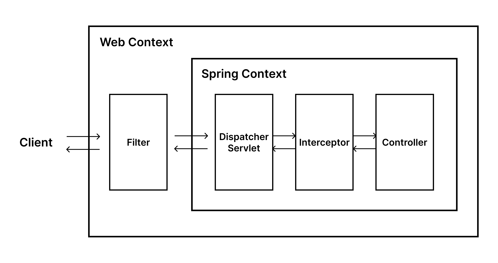
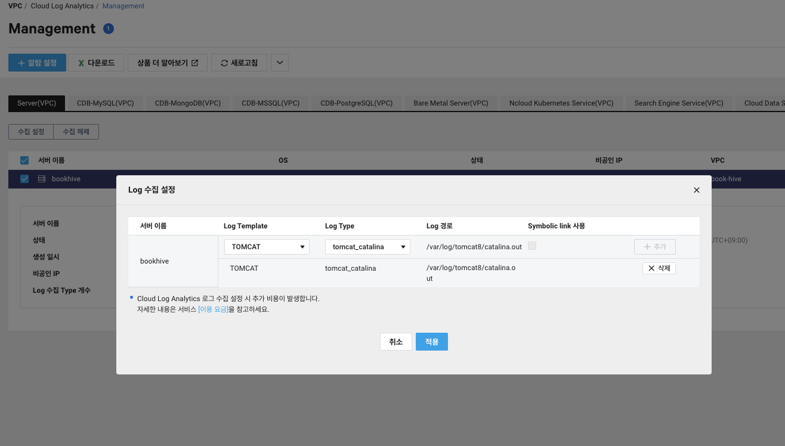
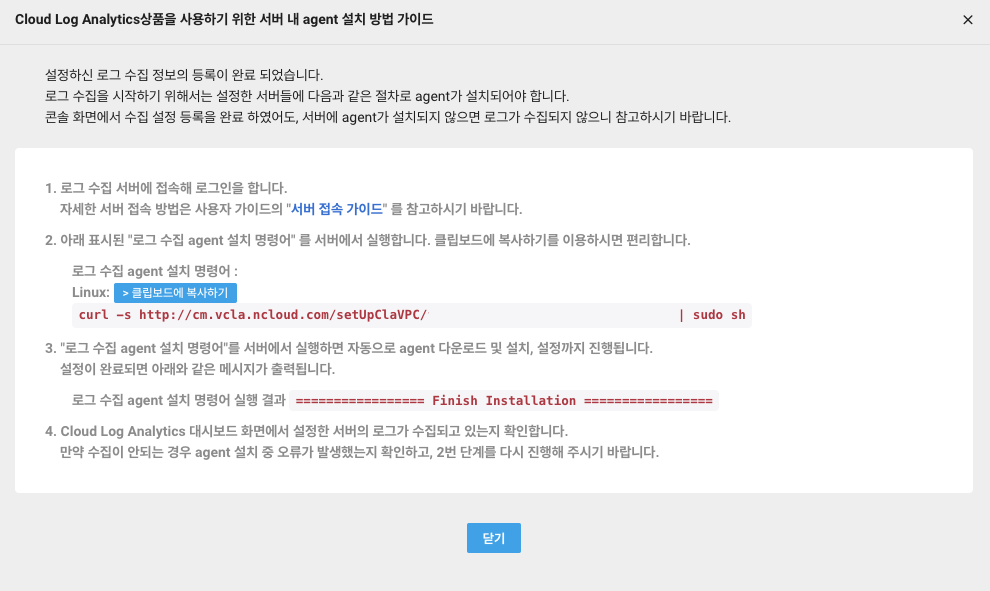
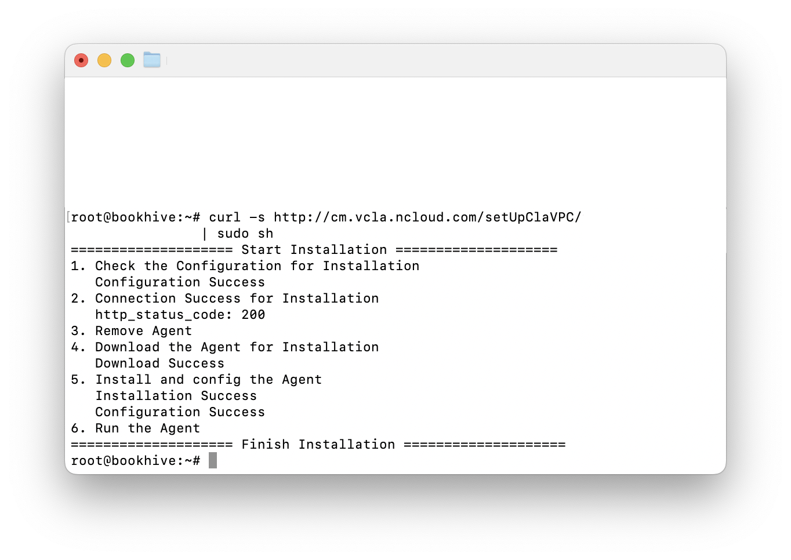
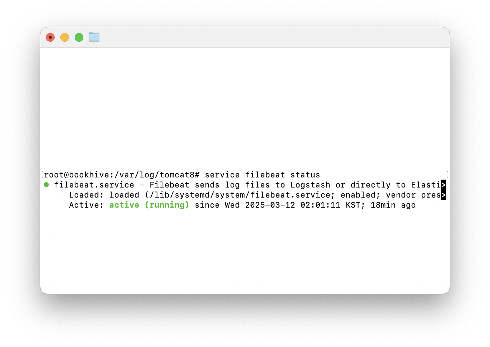
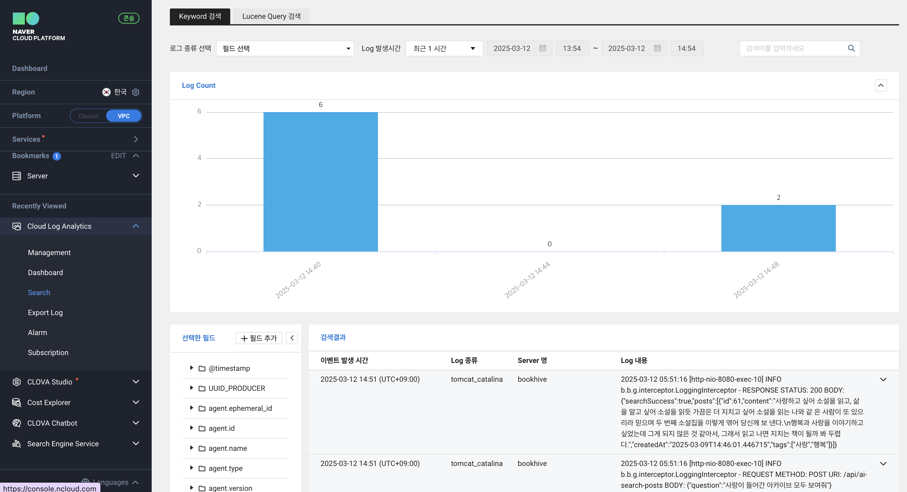
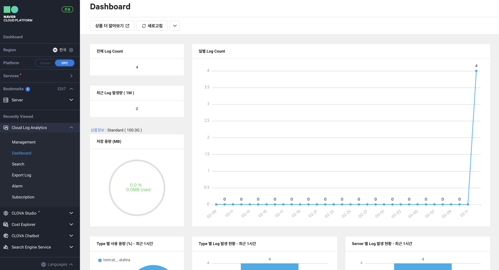

# [Spring Boot] 로그 생성/관리하기 (with NCP Cloud Log Analytics)

<center></center>

## 요구 사항 및 설계

프로젝트 도중, 사용자 활동 분석을 위해 **특정 API를 호출할 때의 요청/응답 데이터 로깅**이 필요했다. 이를 위해 스프링 부트 애플리케이션에서 로그를 생성하기 위해 했던 고민들을 기록해본다.

또한 로깅의 목적은 기획 방향을 결정하기 위한 것으로 팀원 모두가 간편하게 확인할 수 있어야 했다. 따라서 단순히 파일만 생성하는 대신 로그를 시각적으로 편리하게 관리할 수 있는 **NCP Cloud Log Analytics**를 도입해 보았다.

<br>

> 해당 프로젝트는 `Spring Boot 3.4.3` , `java 17` 을 사용하였다.

<br>

---

## 구현 기술: Spring Boot의 Logging Framework

기본적으로 스프링은 **JCL(Jakarta Common Logging)**이라는 자체 로깅 모듈을 추상화 계층으로 사용한다. 공식문서를 보면 스프링 프레임워크 내부에서 로깅이 필요할 때에는 JCL을 활용하는 듯 하다. 그러나 애플리케이션 코드 로깅을 위해서는 SLF4J(Simple Logging Facade for Java)와 같은 개선된 추상화 계층을 사용하는 것을 권장하고 있다. 스프링 부트에서도 JCL을 직접 사용하지 않고, 어댑터를 통해 리다이렉트된 **SLF4J**와 그 구현체 **Logback**을 기본 로깅 모듈로 사용하도록 설정되어 있다.

- **SLF4J**는 다양한 로깅 프레임워크 구현체를 지원하는 인터페이스이다. 컴파일 타임에 사용할 로깅 구현체를 결정하여, 런타임에 로깅 구현체를 결정하는 JCL의 문제점을 보완한다.
- **Logback**은 스프링 부트에서 SLF4J의 기본 구현체로 동작한다. 기존에 사용했던 로깅 프레임워크 Log4j 1의 성능을 개선하여 만들었다.

스프링 부트의 `spring-boot-starter-web` 의존성이 존재한다면 로깅을 위한 `spring-boot-starter-logging`이 자동으로 포함되어, 곧바로 **SLF4J**와 **Logback**을 이용한 로깅이 가능하다. 따라서 기본적으로 사용할 수 있는 Logback을 이용해 로그를 관리할 것이다.

<br>

---

## 구현 방법: Spring Interceptor

로깅이 일어나야 하는 정확한 시점이 언제일까? 이에 따라 구현 방법을 선택했다.

<center></center>

처음에는 `로깅 = 핵심 기능이 아닌 공통 관심사`이므로 단순히 **스프링 AOP**를 이용해 구현하려 했다. 그러나 AOP는 스프링 빈으로 등록된 클래스나 메서드를 대상으로 동작하므로, 객체 지향 관점에서 **객체의 행위**에 대한 작업에 좀 더 가깝다는 생각이 들었다. 즉 AOP는 비즈니스 로직을 감싸는 데 유용하지만 HTTP 요청/응답 자체를 다루기에 최선의 방법은 아니라고 생각했다.

나는 애플리케이션 내부의 특정 로직보다는 **HTTP 요청과 응답 그 자체**에 관심이 있기 때문에, 이를 처리하는 필터(Filter)나 인터셉터(Interceptor)를 검토하는 것이 더 적절하다고 판단했다. 특히 모든 API가 아닌 **특정 API 호출**에 대해서만 로깅을 진행할 예정이니, 필터보다 **인터셉터**에서 로깅을 진행하는 것이 적합하다고 결론을 내렸다.

<br>

#### 0. HTTP request/response 다루기

본격적인 구현에 앞서, 인터셉터를 올바르게 사용하려면 자바 서블릿 API에서 HTTP 요청과 응답이 어떻게 처리되는지 이해해야 한다.

클라이언트와 서버 간 HTTP 요청/응답 데이터는 `HttpServletRequest`와 `HttpServletResponse` 객체로 캡슐화하여 사용한다. 따라서 이 객체들을 통해 본문(body) 데이터를 직접 읽어오는 방식을 자연스럽게 생각할 수 있다.

그러나 HTTP 요청 및 응답 본문은 **stream**을 통해 전달된다. 즉 본문 데이터는 **한 번 읽으면 사라져버린다.**

우리가 인터셉터에서 클라이언트 요청 본문을 한 번 읽어버리면, 정작 요청을 처리해야 할 핸들러가 본문을 읽을 수 없게 된다. 응답 본문 역시 마찬가지다.

따라서 인터셉터도, 핸들러도 본문을 읽을 수 있도록, 즉 본문 데이터를 여러 번 읽을 수 있도록 `HttpServletRequest/HttpServletResponse`를 **캐싱**하는 작업이 필요하다.

<br>

#### 1. Filter에서 HTTP 요청/응답 캐싱하기

- 클라이언트에서 요청이 들어오고 `HttpServletRequest/HttpServletResponse` 객체가 생성되는 시점에서 캐싱을 위한 새로운 객체를 생성해준다.

- 스프링 프레임워크에서 제공하는 `ContentCachingRequestWrapper`와 `ContentCachingResponseWrapper`로 객체를 감싸주면 스트림으로 다루는 모든 컨텐츠를 캐싱할 수 있다.

```java

    @Slf4j
    @Component
    public class HttpContentCacheFilter extends OncePerRequestFilter {

        @Override
        protected void doFilterInternal(HttpServletRequest request, HttpServletResponse response, FilterChain filterChain)
                throws ServletException, IOException {

            ContentCachingRequestWrapper requestWrapper = new ContentCachingRequestWrapper(request);
            ContentCachingResponseWrapper responseWrapper = new ContentCachingResponseWrapper(response);

            filterChain.doFilter(requestWrapper, responseWrapper);

            responseWrapper.copyBodyToResponse();
        }
    }

```

- 동일한 요청에서 단 한 번만 필터를 호출하도록 `OncePerRequestFilter`를 상속 받았다.

- 요청 본문의 경우 `doFilter()` 실행 후 컨트롤러의 응답 생성으로 채워지며, `responseWrapper.copyBodyToResponse()`를 통해 클라이언트로 전송된다.

- 이제 wrapper로 감싼 객체를 이용하면 캐싱된 스트림을 통해 데이터를 여러 번 읽어올 수 있다.

<br>

#### 2. LoggingInterceptor 구현하기

스프링 인터셉터는 `HandlerInterceptor` 인터페이스를 구현함으로써 활용할 수 있다. 코드를 살펴보면, 총 세 개의 메서드를 구현할 수 있다.

```java

    public interface HandlerInterceptor {
        default boolean preHandle(HttpServletRequest request, HttpServletResponse response, Object handler) throws Exception {
            return true;
        }

        default void postHandle(HttpServletRequest request, HttpServletResponse response, Object handler, @Nullable ModelAndView modelAndView) throws Exception {
        }

        default void afterCompletion(HttpServletRequest request, HttpServletResponse response, Object handler, @Nullable Exception ex) throws Exception {
        }
    }

```

- `preHandle()`은 핸들러 실행 이전, `postHandle()`은 핸들러 실행 이후 호출된다.

- `afterCompletion()`은 요청이 모두 완료된 이후 호출된다.
    
- `postHandle()`은 핸들러 실행 이후, 즉 실행에 따른 리턴 값이 반환되어야 호출되기 때문에 예외 발생시 호출되지 않는다.

따라서 어떤 경우에도 인터셉터를 호출하기 위해 `afterCompletion()` 메서드를 구현하여 로깅을 진행할 것이다.

<br>

```java

    @Slf4j
    @Component
    public class LoggingInterceptor implements HandlerInterceptor {

        @Override
        public void afterCompletion(HttpServletRequest request, HttpServletResponse response, Object handler, Exception exception) {

            if (request instanceof ContentCachingRequestWrapper requestWrapper) {
                String requestBody = requestWrapper.getContentAsString();

                log.info("REQUEST METHOD: {} URI: {} BODY: {}", request.getMethod(), request.getRequestURI(), requestBody);
            }

            if (response instanceof ContentCachingResponseWrapper responseWrapper) {
                String responseBody = new String(responseWrapper.getContentAsByteArray(), StandardCharsets.UTF_8);

                log.info("RESPONSE STATUS: {} BODY: {}", response.getStatus(), responseBody);
            }
        }
    }

```

- Lombok 라이브러리의 `@Slf4j`을 사용하면 별도로 Logger 인스턴스를 생성하지 않고도 로깅을 진행할 수 있다.

- `afterCompletion()`을 구현하여, 인터셉터가 호출될 때 캐싱된 요청과 응답에서 원하는 데이터를 가져와 로그로 기록했다.

> 신기했던 점은 `ContentCachingRequestWrapper` 객체는 문자열로 requestBody를 가져오는 메서드 `getContentAsString()`가 정의되어 있었는데, `ContentCachingResponseWrapper`는 그렇지 않았다는 점이다. 그래서 ByteArray로 받아온 뒤 UTF8 형식으로 인코딩하는 방식을 사용했다. 요청과 응답 특성상 문자열이 일반적인지 아닌지에 따라 구현해둔 것 같은데, 이 부분은 조금 더 찾아봐야겠다.

<br>

#### 3. LoggingInterceptor 등록하기

- 구현한 인터셉터는 `WebMvcConfigurer` 인터페이스를 구현한 `WebConfig`에서 Spring MVC에 등록하여 사용할 수 있다.

- 등록시 path pattern을 지정하여 특정 경로에 대해서만 인터셉터를 적용할 수 있다.

```java

    @Configuration
    @RequiredArgsConstructor
    public class WebConfig implements WebMvcConfigurer {

        private final LoggingInterceptor loggingInterceptor;

        @Override
        public void addInterceptors(InterceptorRegistry registry) {
            registry.addInterceptor(loggingInterceptor)
                    .addPathPatterns(InterceptorPath.API_AI_SEARCH.getPath());
        }
    ...
    // 아래에는 CORS 설정이 있다.

```

- 추후 다른 경로의 요청에도 로깅을 적용할 수 있도록, path pattern은 `InterceptorPath Enum`으로 따로 관리해주었다.

<br>

#### 4. Logback 설정하기

- 기본적으로 SLF4J의 `log.info()`를 사용하면 콘솔에 로그가 출력되기만 한다.

- `/main/resources`에 `logback.xml` 설정 파일을 생성하여 로그 출력 및 파일에 대한 설정을 직접 관리할 수 있다.

```xml

    <configuration>
        <!-- 파일 로그 설정: catalina log로 관리 -->
        <appender name="CATALINA" class="ch.qos.logback.core.FileAppender">
            <file>/var/log/tomcat8/catalina.out</file>
            <append>true</append>
            <encoder>
                <pattern>%d{yyyy-MM-dd HH:mm:ss} [%thread] %-5level %logger{36} - %msg%n</pattern>
            </encoder>
        </appender>

        <!-- 콘솔 로그 설정 -->
        <appender name="STDOUT" class="ch.qos.logback.core.ConsoleAppender">
            <encoder>
                <pattern>%d{yyyy-MM-dd HH:mm:ss} [%thread] %-5level %logger{36} - %msg%n</pattern>
            </encoder>
        </appender>

        <!-- 특정 패키지의 로그를 파일로 저장하는 설정 -->
        <logger name="bookhive.bookhiveserver.global.interceptor" level="info">
            <appender-ref ref="CATALINA" />
        </logger>

        <!-- 전체 로그 설정: 모든 info 이상의 로그를 콘솔 출력 -->
        <root level="info">
            <appender-ref ref="STDOUT" />
        </root>
    </configuration>

```

- 인터셉터로 로깅한 데이터를 파일로 저장하기 위해서는 따로 설정이 필요하다.

- 원하는 파일 경로를 지정하고, 로그는 톰캣 서버의 표준 로그 파일인 Catalina 로그로 관리하도록 설정해주었다.

- 설정을 완료하면 로그가 발생될 때마다 특정 경로로 로그가 쌓이게 된다.

여기까지 완료하면 파일로 로그를 저장하는 작업은 마무리가 된다. 이제 추가로 NCP CLA를 활용하여, 이런 로깅 이벤트 발생을 자동으로 감지하여 로그를 수집하고 콘솔에서 편리하게 데이터를 관리하는 작업을 진행해보겠다!

<br>

---

## NCP Cloud Log Analytics로 로그 수집하기

NCP에는 로깅을 위한 서비스로 **Effective Log Search & Analytics**와 **Cloud Log Analytics**를 제공한다. 전자는 어떠한 애플리케이션이든 로그 정보를 SDK, API를 통해 NCP에 수집할 수 있다. 모바일 앱의 크래시 정보도 SDK를 통해 로깅할 수 있다. 반면 Cloud Log Analytics는 클라우드 서비스 내에서 발생하는 다양한 로그들을 한 곳에서 관리해준다. 나는 SDK나 API 활용 없이 NCP 내 편리한 서비스 연계를 활용하고자 **Cloud Log Analytics**를 선택했다.

#### 1. 콘솔에서 로그 수집 설정하기

NCP 콘솔에서 `Management & Governance > Cloud Log Analytics` 서비스에 접속한 뒤 서비스 이용 신청을 해준다.

<center></center><br>

- Management 탭에서 클라우드 서비스의 종류별로 운영중인 서버를 확인할 수 있다.

- 로깅할 애플리케이션을 운영 중인 서버를 선택하고 위와 같이 **Log 수집 설정**을 진행한다.

- 어떤 경로에서 어떤 형태의 로그가 발생했을 때 에이전트가 이를 감지하고 수집할지를 지정해준다.

- TOMCAT 서버의 Catalina 로그 형태로 수집하기 위해 위와 같이 설정했다.

<br>

#### 2. 서버 내 agent 설치하기

<center></center><br>

- 로그 수집 설정이 완료되면 해당 서버 내에 로그 수집 에이전트를 설치해야 한다.

- 서버에 원격 접속 후, 제공되는 agent 설치 명령어를 통해 간편하게 에이전트를 설치할 수 있다.

<br>

<center></center>

- Finish Installation을 확인하면 설치가 완료된 것이다.

<br>

<center></center>

- `service filebeat status` 명령어를 통해 에이전트의 실행 상태를 확인할 수 있다.

<br>

#### 3. 콘솔에서 수집된 로그 확인하기

- 이제 여기까지 완료되면, 애플리케이션 서버에서 로깅이 일어날 때 수집된 로그를 확인할 수 있다.

- 앞서 구현한 로그를 확인하기 위해 특정 API로 클라이언트 요청을 보내보았다.

<center></center><br>

- 잠시 후 콘솔을 통해 로그 데이터가 쌓이는 것을 시각적으로 확인할 수 있었다!

- Search 탭은 기본적으로 시간대별로 로그를 분류하며, 이벤트 발생 시각에 따라 로그를 검색하는 것도 가능하다.

- 다만 테스트 결과 완벽한 실시간은 아니었다. 그러나 1분 내외로 확인이 가능해 장기적인 데이터 분석에는 큰 무리가 없었다.

<br>

<center></center><br>

- 대시 보드에서도 일별 로그 발생 현황을 확인할 수 있다.

- 여러 NCP 서비스에 분산된 서버가 많고 로그 형태가 다양한 경우 CLA의 장점을 더욱 활용할 수 있을 것 같다!

- 이렇게 저장된 로그는 **NCP Sub Account**를 팀원들과 공유함으로써 개발 직군이 아닌 팀원들도 활용할 수 있게 된다.