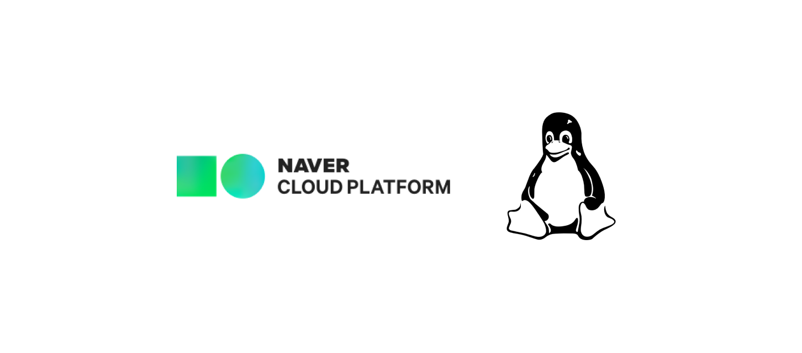
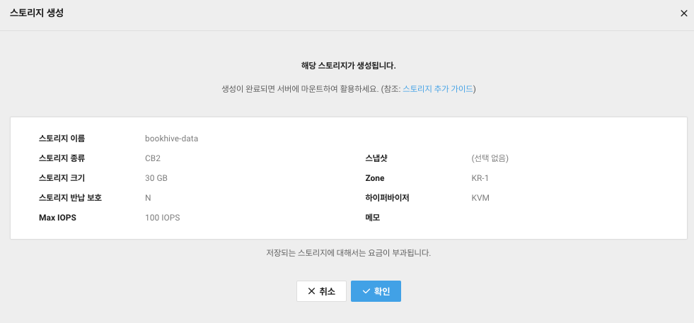
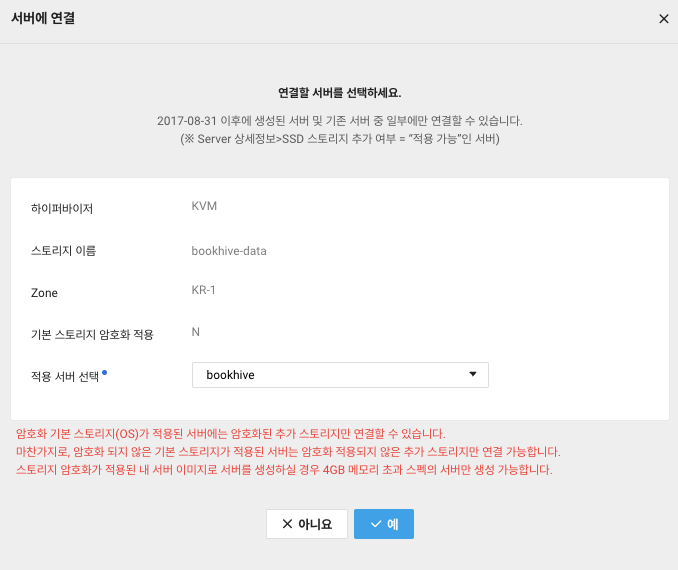
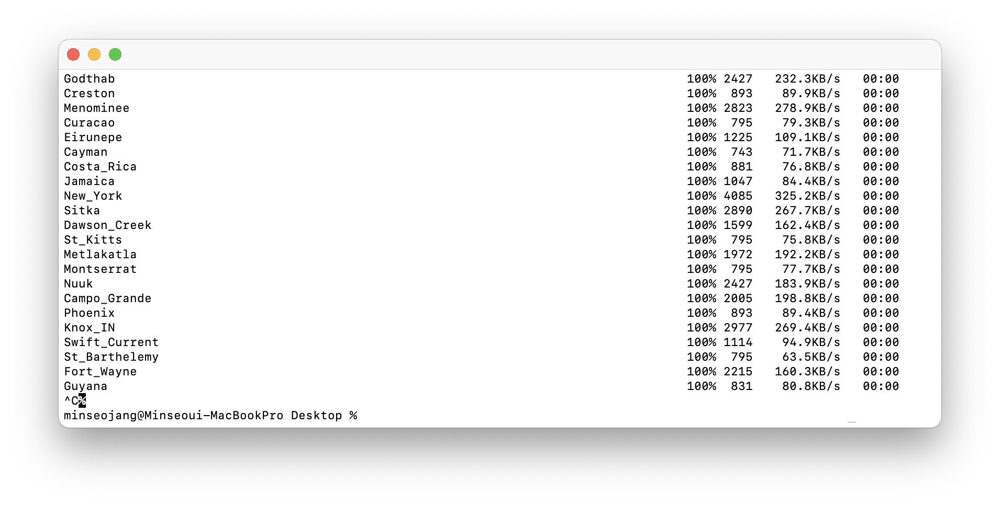

# [NCP] 운영 서버 디스크 부족 대응기: 디스크 증설과 마운트 관리

<center></center><br>

최근 개발 중인 애플리케이션 서버는 `NAVER CLOUD PLATFORM` 우분투 서버에서 운영되고 있다. 해커톤으로 시작해 최소 사양으로 생성했던 서버였지만, 서비스를 계속 운영하다보니 어느새 디스크 사용량이 70%를 넘기기 시작했다.

초기에는 사용하지 않는 Docker 리소스를 제거하는 것만으로 충분했는데, 지속적으로 쌓이는 로그와 향후 유입될 데이터까지 고려하면 10GB라는 용량은 확실히 부족했다.

따라서 본격적인 유저 유입에 앞서, 스토리지를 재정비하고 디스크 환경을 안정화하는 작업을 진행하기로 했다.

<br>

---

## 요구 사항

<center></center><br>

사용 중인 서버와 스토리지는 KVM 하이퍼바이저 기반이다. 그러나 NCloud Docs를 확인해보니 서버 타입 특성상 기본 블록 스토리지의 크기 변경이 불가능했다.
따라서 다음과 같은 사항을 고려하여 세 가지 설계를 고민해보았다.

<br>

- 기본 디스크는 용량 변경이 불가능하다. 따라서 어떤 방식이든 **새로운 디스크를 생성**해야 한다.

- **부팅 디스크**는 가능하면 접근하지 않는 것이 좋다.

- 새롭게 추가할 디스크는 용량 확장이 가능하므로, 앞으로 **데이터가 증가할 여지가 있는 항목**을 이곳에 두는 게 바람직하다.

<br>

#### 1. 부팅 디스크 포함 기본 디스크 교체

- 현재 사용 중인 스토리지의 스냅샷을 생성하고, 이를 기반으로 더 큰 용량의 새로운 디스크를 생성한다.
- 새롭게 생성한 디스크를 부팅 디스크로 교체한다.

- 가장 단순한 방법이다.
- 그러나 여전히 크기가 큰 파일들이 OS 디스크에 남는 구조이므로, 운영이 길어지면 또 다시 원점으로 돌아오게 될 것이다.
- 부팅 디스크를 건드려 운영 서버 재부팅이 필요하고, 결국에는 확장성이 부족한 방식이다.

#### 2. 디스크 추가 + LVM 통합

- 새로운 디스크를 생성한 후, `LVM(Logical Volume Manager)`으로 묶어 논리적으로 하나의 디스크처럼 관리한다.
- 디스크 여러 개가 추가 되어도 유연하게 대처 가능하고, 기존 데이터의 마이그레이션이 따로 필요 없다.
- 묶어서 다시 Logical Volume으로 관리하면 용도에 맞게 디스크를 구분해 사용할 수 있다. 유연성, 확장성 측면에서는 가장 뛰어나다.

- 그러나 구현 부담이 크고 구조를 완전히 이해하고 있지 않으면 오히려 생산성이 떨어질 수 있다.
- 복구 시나리오가 복잡해 보였기 때문에, 소규모 운영을 이어가야 하는 입장에서 적절하지 않다고 생각했다.
- 무엇보다 우리 서비스에는 아직 엄청난 유연성은 불필요하다. LVM은 오버 엔지니어링이라는 느낌.

#### 3. 데이터 디스크 추가 + 마이그레이션

- 현재 사용하고 있는 스토리지는 그대로 두고, 크기가 큰 데이터를 저장할 용도로 사용할 새로운 디스크를 추가한다.
- 기본 스토리지에서 용량을 많이 차지하는 항목들을 마이그레이션한다.
- 특히 지금은 용량이 많이 드는 부분이 로그, 도커 리소스 등 데이터성 항목이기 때문에, 아예 부팅과 데이터 관리를 분리하는 구조로 설계하고 싶었다.

<br>

이렇게 여러 가지 방안을 모색하다, 다시 이슈가 발생할 때에도 빠르게 확장할 수 있으며 당장 안정적인 시스템을 구축해야 하는 지금 상황에 가장 적합한 3번 방식을 택하기로 했다.

NCP 서버에 새로운 디스크를 추가하고, 원하는 데이터 항목들을 새로운 디스크로 마이그레이션하여 깔끔하게 관리하기 위한 작업을 진행해보았다.

<br>

> NCP VPC 서버 3세대 Standard 타입, `ubuntu-22.04` 환경 기준으로 진행된 작업이다.

<br>

---

## 새로운 디스크 추가

NCP 콘솔에서 새로운 디스크를 생성하고, 서버에서 사용할 수 있도록 마운트해주자.

#### NCP SSD Block Storage 생성 및 서버 연결

<center></center><br>

- Server/Storage 탭으로 접속해 새로운 스토리지를 생성한다.
- 스토리지 종류는 CB1보다 성능이 좋은 CB2, 크기는 우선 30GB로 생성하였다. 기본 스토리지가 아니기 때문에, 추후 크기 확장이 가능하다.

<br>

<center></center><br>

- 연결할 서버를 선택한다.

- 연결이 완료되면, 서버에 접속해 `lsblk` 명령어로 다음과 같이 새로운 디스크가 연결되었음을 확인할 수 있다.

```zsh

    vda    252:0    0   10G  0 disk   # 기본 스토리지
    ├─vda1 252:1    0    1M  0 part 
    └─vda2 252:2    0   10G  0 part /
    vdb    252:16   0   30G  0 disk   # 추가 스토리지

```

#### 새로운 디스크에 파일 시스템 생성

방금 추가된 디스크는 아직 텅 빈 책장일 뿐이다. 이제 여기에 책을 어떻게 분류하고 보관할지에 대한 규칙을 만들어주어야 한다. 즉, **파일 시스템**을 생성해야 한다.

```zsh

    # 방금 추가된 디스크 장치 이름으로 지정
    sudo mkfs.ext4 /dev/vdb

```

- `mkfs.ext4` 명령어는 디스크에 `ext4` 형식의 파일 시스템을 생성해, 디스크를 리눅스가 이해할 수 있는 구조로 포맷한다.

- 이 작업을 통해 디스크는 리눅스가 인식 가능한 저장 공간으로 사용될 수 있다. 즉, '파일'을 저장할 수 있는 구조가 된다.

<br>

> 앞으로 진행할 마운트, 심볼릭 링크의 개념을 이해하고 사용하기 위해 리눅스의 파일 시스템에 대해 공부하면 좋다! 혹은 리눅스 운영체제는 기본적으로 모든 것을 '파일'로 관리한다는 점만 알고 있어도 이해에 도움이 될 것이다.

<br>

#### 새로운 디스크 마운트

완료되면, Filesystem UUID와 함께 `done`이라는 문구가 여러 줄 뜰 것이다. 이제 스토리지를 마운트 해보자. (이 파일 시스템 UUID는 미리 복사해두자)

```zsh

    sudo mkdir /mnt/data

```
- 마운트 포인트로 사용할 디렉토리를 생성한다.

<br>


```zsh

    sudo mount /dev/vdb /mnt/data

```
- 스토리지와 디렉토리를 연결한다.

- `/dev/vdb`는 앞서 확인했듯 새로 추가한 디스크의 이름이다.

<br>

```zsh

    # 확인
    df -h

    # 결과
    /dev/vdb         30G   24K   28G   1% /mnt/data

```

- 스토리지가 마운트되었다. 이제 스토리지를 사용할 수 있게 되었다!

<br>

#### fstab 설정: 재부팅 시에도 디스크가 마운트 되도록

서버가 재부팅되어도 마운트 정보를 유지하도록, `/etc/fstab`에서 볼륨 설정을 변경힌디. `/etc/fstab`은 부팅 단계에서 마운트되어야 할 볼륨 정보들이 저장되는 경로이다.

```zsh

    # 볼륨 설정 파일 열기
    sudo nano /etc/fstab

    # 아래 설정 추가
    UUID={아까 복사한 UUID 값} /mnt/data ext4 defaults 0 2

```

- 순서대로 볼륨을 나타내는 UUID(경로 이름으로도 대체 가능하다), 마운트 포인트, 파일 시스템 종류, 옵션, 덤프, fsck 설정이다.

- defaults 옵션을 사용하면, 부팅 시 자동으로 읽기와 쓰기가 가능하도록 마운트된다. 좀 더 자세한 설명은 [공식 문서](https://guide.ncloud-docs.com/docs/ko/server-storage-classic#%EC%8A%A4%ED%86%A0%EB%A6%AC%EC%A7%80-%EB%A7%88%EC%9A%B4%ED%8A%B8linux)를 참고

<br>

---

## 데이터 마이그레이션

나는 디스크에서 비교적 큰 용량을 차지했고, 앞으로 데이터가 늘어날 여지가 있는 항목들을 새로운 디스크에서 관리하기로 했었다. 따라서 우선 Docker 데이터와 MySQL 데이터를 새로운 디스크로 마이그레이션해주었다.

#### 어떻게 옮기고 연결해줘야 안전하게 사용할 수 있을까?

큰 흐름은 다음과 같다.

1. 필요한 데이터를 `/mnt/data`로 옮기기
2. Docker, MySQL DBMS가 사용하는 기존 경로로 새로운 저장소를 사용할 수 있도록 심볼릭 링크로 연결하기

<br>

#### Docker

우선 도커 데이터를 옮겨보자. 도커 데이터는 `/var/lib/docker/` 경로에 저장되어 있다.

<br>

```bash

    sudo mkdir /mnt/data/docker

```

- 가장 먼저 새로운 디스크에 도커 데이터를 옮길 디렉토리를 생성해준다.

<br>

###### 도커 중지

```bash

    sudo systemctl stop docker
    sudo systemctl stop docker.socket

```

- 본격적으로 데이터를 옮기기 전, 도커를 완전히 정지해준다!

- docker는 도커 소켓으로 트리거되기 때문에, 확실하게 도커 소켓까지 정지해주었다.

<br>

###### 디렉토리 복사

```bash

    sudo cp -a /var/lib/docker/. /mnt/data/docker/

```

- 해당 경로에 대한 접근 권한을 유지하며, 디렉토리의 내용물을 새로운 디렉토리로 복사한다.

<br>

###### 백업

```bash

    sudo mv /var/lib/docker /var/lib/docker.backup

```

- 원래 디스크에 존재하던 파일은 백업 파일로 남겨두었다.

<br>

###### 심볼릭 링크 생성

```bash

    sudo ln -s /mnt/data/docker /var/lib/docker

```

- 기존 경로와 실제 데이터가 위치한 새로운 디스크의 경로에 **심볼릭 링크**를 만들어준다.

- 후자의 경로는 존재하는 파일이 아니라 연결 링크로서 동작한다.

- `/var/lib/docker`라는 가짜 문을 열고 들어오면 내부는 `/mnt/data/docker`인 것!

###### 도커 재시작

```bash

    sudo systemctl start docker.socket # 옵션
    sudo systemctl start docker

```

- 이제 다시 도커를 재시작해주고, 애플리케이션 서버 컨테이너 상태를 체크해주면 끝!

<br>

#### MySQL

다음은 데이터베이스이다. MySQL 데이터는 `/var/lib/mysql`에 저장되어 있다.

기본 원리는 도커와 동일하므로 빠르게 진행했다. 다만 데이터베이스 서버는 애플리케이션 서버에 영향을 줄 수 있으므로, 안전하게 애플리케이션 컨테이너를 중지하고 마이그레이션을 진행했다.

```bash

    # 애플리케이션 서버 중지
    docker stop {container}

    # MySQL 서버 중지
    sudo systemctl stop mysql

    # 권한 유지하며 새로운 디스크로 데이터 복사
    sudo cp -a /var/lib/mysql /mnt/data/mysql

    # 백업 파일 유지
    sudo mv /var/lib/mysql /var/lib/mysql.backup

    # 심볼릭 링크 생성
    sudo ln -s /mnt/data/mysql /var/lib/mysql

    # MySQL 서버 시작
    sudo systemctl start mysql

    # 애플리케이션 서버 시작
    docker start {container}

```

동일하게 마이그레이션을 진행하면 된다. 단, 서버 환경에 따라 에러가 발생할 수 있어 추가로 트러블 슈팅 기록을 작성해두겠다!

<br>

###### 🚨 Error: MySQL 서버 시작 실패

심볼릭 링크까지 잘 생성했는데, 데이터베이스 서버를 다시 시작하려 하니 에러가 발생하며 서버가 켜지지 않았다.

<br>

```zsh

    × mysql.service - MySQL Community Server
    ...
    Error: 13 (Permission denied)

```
분명 디렉토리 권한도 그대로 복사했는데, 왜 이런 문제가 발생한 걸까!

<br>

```zsh

    # 권한 확인
    ls -ld /mnt/data/mysql

    drwx------ ...

```
다시 해당 디렉토리의 권한을 확인해 보아도 위와 같이 올바르게 권한이 위임되어 있을 수 있다.

그런데도 거부 당한 이유는, `Ubuntu 22.04`의 AppArmor 보안 정책에 의해 MySQL이 기본 경로 외의 접근이 차단되고 있기 때문이다.

<br>

```bash

    # 확인: mysqld가 enforce모드임
    sudo aa-status

```

위 명령어로 AppArmor 정책을 확인해볼 수 있는데, MySQL이 enforce 모드에 포함되어 있다면 해당 이슈는 보안 정책에 의해 자연스레 발생하게 된다!

해결을 위해, 설정 파일에서 mysql 경로를 설정하는 부분을 수정해주자.

```bash

    sudo nano /etc/apparmor.d/usr.sbin.mysqld

    # mysql 경로 설정 부분
    /var/lib/mysql/ r,
    /var/lib/mysql/** rwk,
    /mnt/data/mysql/ r,
    /mnt/data/mysql/** rwk,

    # 설정 적용 
    sudo apparmor_parser -r /etc/apparmor.d/usr.sbin.mysqld

```

기본 경로에 추가로 새로운 디스크의 경로를 넣어주면, 이제 해당 경로로도 MySQL에 접근할 수 있게 된다! 서버도 정상적으로 시작되며, 서버 접속도 잘 되는 것을 확인할 수 있다.

<br>

#### Cf. 백업 파일을 일정기간 보존하고 싶다면

`이슈가 발생하면 어떡하죠?! 마음이 불안 ㅠ.ㅠ`할 수도 있으니

혹시 모를 경우에 대비해, 백업해둔 파일을 로컬에 복사하고 일주일 간 안정성을 지켜보기로 했다.

DBMS 데이터는 비교적 크지 않았기 때문에 바로 옮겨도 문제가 되지 않았다.

그러나... Docker 데이터를 백업하려고 하자

<center></center>

어마어마한 양의 파일이 복사되며 세계 각국의 도시 이름이 나왔다~! 멈추고 찾아보았더니, 컨테이너를 복사하는 과정에서 컨테이너 OS 내 타임존 파일들이 함께 복사되는 것이었다. 리눅스의 `/usr/share/zoneinfo/`에 포함된 타임존 데이터 파일들이니 정상적인 과정이지만, 압축 없이 복사하면 오래 걸리니 tar로 묶어 보내는 것을 추천한다.

```zsh

    # 로컬로 생성해둔 백업 파일 복사
    scp -r root@223.130.154.234:/var/lib/mysql.backup ./mysql.backup

    sudo tar -czvf docker.backup.tar.gz /var/lib/docker.backup
    scp -r root@223.130.154.234:/var/lib/docker.backup.tar.gz ./docker.backup

    # 리모트 서버에서는 삭제하고, 용량 확보!
    sudo rm -rf /var/lib/mysql.backup
    sudo rm -rf /var/lib/docker.backup

```

하지만, 도커 볼륨이 따로 존재하는 게 아니라면 전체 데이터를 백업하는 것은 사실상 불필요한 작업이라고 생각한다. 컨테이너는 본래 그 자체로 휘발성을 가지기 때문이다. 나는 소중한 MySQL 데이터만 백업해두었다.

이런 과정을 거쳐, 지금은 **안정적인 디스크 시스템** 위에서 서버가 잘 돌아가고 있다.  
안정성에 확장성도 챙기고, 운영체제 시간에 배웠던 내용을 실제로 적용해볼 수 있었던 재밌는 시간이었다!

<br><br>

---

<br><br>

<center></center><br>