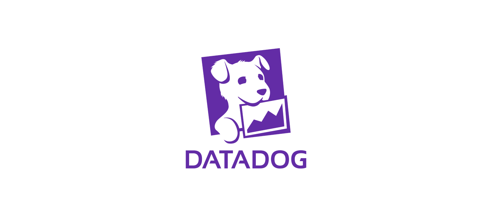

# [Datadog] Datadog 모니터링으로 서버 감시하기

 

북카이브 앱 서비스를 운영할 때 모니터링을 위해 Datadog을 도입했었다. 🐶

NCP가 표면적으로는 인스턴스를 빌려주는 하나의 클라우드 플랫폼이지만, Datadog과의 통합을 얘기할 땐 좀 달라진다. AWS, GCP, Azure와 같이 공식 통합을 지원하는 플랫폼들은 클라우드 계정을 기반으로 더 쉽고 강력하게 통합된다. NCP는 그렇지 않기 때문에, 에이전트를 설치하고 수집할 메트릭을 직접 다루는 과정이 더 많이 필요하다.  흔치 않은 경험 오히려 신나긴 함 

내 첫 모니터링 경험을 기록할 겸, NCP에서 Datadog를 활용해 **Infrastructure Monitoring과 APM**을 진행한 방법을 적어보려 한다. NCP와 Datadog 조합은 거의 못 본 것 같아, 공유해두면 누군가 도움을 받지 않을까~~

 

---

## Datadog?

#### 도입 배경

백엔드 개발 환경에서 API 테스트를 수행했음에도 실제 앱에서 들어오는 요청은 예상과 다를 때가 있었다. 처음엔 간단한 로깅으로 에러를 해결했지만, 갈수록 모든 걸 로깅으로 처리하기에는 애플리케이션이 너무 많은 책임을 갖는 모양이 되었다. 또 특히 이번에는 서버를 혼자서만 관리했기에 다른 팀원들에게 보이지 않는 서버 동작을 시각화해서 보여줄 무언가 필요했다. 때문에 "지금이 모니터링을 도입할 때다!"라는 생각이 들어 필요한 메트릭을 원할 때 관찰할 수 있는 모니터링 시스템을 구축하게 되었다.

1. **Prometheus와 Grafana**

처음에는 널리 사용하는 듯한 Prometheus  또는 InfluxDB  + Grafana 조합을 고려했다. 원하던 슬랙과의 통합도 편리했고, 많은 사용자가 있어 대시보드 꾸미기도 쉬워보였다. 그러나 서버에 새로운 DB를 구축해 추가로 데이터를 관리해야 한다는 점, 시각화 도구를 따로 사용해야 한다는 점이 살짝 쩌기했다. 이렇게 스스로 관리하는 툴 같은 경우에는 관리자의 자유도가 높았던 것 같긴 한데 난 이번에는 간단하고 편리한 올인원(?) 서비스를 원했다.

2.  **New Relic vs. Datadog**

그래서 찾은 게 New Relic과 Datadog이었다. 둘은 클라우드 기반 서비스로, 인프라와 애플리케이션 등 분석이 필요한 데이터를 모두 하나의 플랫폼에서 관리할 수 있다. 최근에 알게 되었는데, 단순한 모니터링을 넘어 [Observability](https://newrelic.com/kr/blog/best-practices/what-is-observability)를 위한 툴인 것 같다. 어쨌든 편리하고 올인원이라는 점은 마음에 들었는데, 문제는 그만큼 비용이 강렬했다는 점이다.

많진 않았지만 회사 내 활용 사례들도 찾아보고, 두 기술을 나름의 기준으로 비교해봤다. 결론은 **Datadog**를 선택하기로 했다.

[이 글](https://newrelic.com/kr/competitive-comparison/datadog)만 보면 뉴렐릭은 한도 내에서 무료로 사용할 수 있어서 비용 면에서는 더 유리해 보이기도 한다. 그러나! Datadog은 **GitHub Student Pack을 통해 2년간 무료로 사용할 수 있다.** 나는 학생이기 때문에 이 기회를 야무지게 써보고 싶었다.  또한 뉴렐릭의 한국 지사가 작년에 철수했다고... 공식 사이트에 들어가 확인해보니 정말로 정보가 없었다

실은 Datadog은 운영체제 수업 시간에 교수님께서 소개해주셔서 예전부터 관심을 갖고 있던 도구였다. ㅎㅎ

**호기심 + 비용 부담 완화 → 기술 선택 완료!**

#### 목표

우선 기본적인 헬스 체크와 리소스 실시간 모니터링을 위해 서버의 CPU, Memory, Disk, Network 상태를 확인할 수 있어야 한다. 또한 Spring 애플리케이션이 실시간으로 어떤 요청을 받았는지, latency는 어떤지, 오류가 있는지 그 상태를 알아야 한다.
추가적으로는, 에러가 발생했을 때 슬랙으로 알림이 오는 것까지 원했다. 찾아보니 이것도 올인언으로 가능해서 선택한 것도 있다.

따라서 서버 리소스 수집, 애플리케이션 메트릭 수집을 목표로 두 가지 과정을 진행했다.

 

---

## Infrastructure Monitoring

im

 

---

## APM (Application Performance Monitoring)

apm