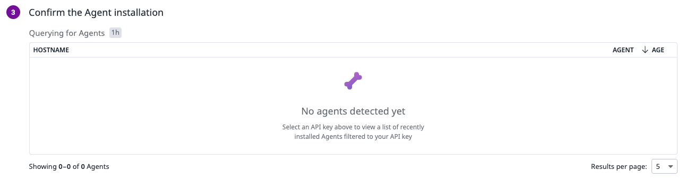

# [Datadog] NCP 서버에서 Datadog 모니터링 시작하기

<center></center><br>

북카이브 앱 서비스를 운영할 때 모니터링을 위해 Datadog을 도입했었다. 🐶

NCP가 표면적으로는 인스턴스를 빌려주는 하나의 클라우드 플랫폼이지만, Datadog과의 통합을 얘기할 땐 좀 달라진다. AWS, GCP, Azure와 같이 공식 통합을 지원하는 플랫폼들은 클라우드 계정을 기반으로 더 쉽고 강력하게 통합된다. NCP는 그렇지 않기 때문에, 에이전트를 설치하고 수집할 메트릭을 직접 다루는 과정이 더 많이 필요하다.

우선 NCP에서 Datadog를 활용해 **Infrastructure Monitoring과 APM**을 시작하는 방법을 적어보려 한다. NCP와 Datadog 조합은 거의 못 본 것 같아, 공유해두면 누군가 도움을 받지 않을까~~ 바로바로 미래의 나

<br>

---

## Datadog?

#### 도입 배경

백엔드 개발 환경에서 API 테스트를 수행했음에도 실제 앱에서 들어오는 요청은 예상과 다를 때가 있었다. 처음엔 간단한 로깅으로 에러를 해결했지만, 갈수록 모든 걸 로깅으로 처리하기에는 애플리케이션이 너무 많은 책임을 갖는 모양이 되었다. 또 특히 이번에는 서버를 혼자서만 관리했기에 다른 팀원들에게 보이지 않는 서버 동작을 시각화해서 보여줄 무언가 필요했다. 때문에 "지금이 모니터링을 도입할 때다!"라는 생각이 들어 필요한 메트릭을 원할 때 관찰할 수 있는 모니터링 시스템을 구축하게 되었다.

<br>

1. **Prometheus와 Grafana**

    처음에는 널리 사용하는 듯한 Prometheus <span style="color:#737373; font-size:14px; font-weight:300;"> 또는 InfluxDB </span> + Grafana 조합을 고려했다. 원하던 슬랙과의 통합도 편리했고, 많은 사용자가 있어 대시보드 꾸미기도 쉬워보였다. 그러나 서버에 새로운 DB를 구축해 추가로 데이터를 관리해야 한다는 점, 시각화 도구를 따로 사용해야 한다는 점이 다소 불편하게 느껴졌다. 이렇게 스스로 관리하는 툴 같은 경우에는 관리자의 자유도가 높았던 것 같긴 한데.. 난 이번에는 간단하고 편리한 올인원(?) 서비스를 원했다.

2.  **New Relic vs. Datadog**

    그래서 찾은 게 New Relic과 Datadog이었다. 둘은 클라우드 기반 서비스로, 인프라와 애플리케이션 등 분석이 필요한 데이터를 모두 하나의 플랫폼에서 관리할 수 있다. 최근에 알게 되었는데, 단순한 모니터링을 넘어 [Observability](https://newrelic.com/kr/blog/best-practices/what-is-observability)를 위한 툴인 것 같다. 어쨌든 편리하고 올인원이라는 점은 마음에 들었는데, 문제는 그만큼 비용이 강렬했다는 점이다.

    많진 않았지만 회사 내 활용 사례들도 찾아보고, 두 기술을 나름의 기준으로 비교해봤다. 결론은 **Datadog**를 선택하기로 했다.

    [이 글](https://newrelic.com/kr/competitive-comparison/datadog)만 보면 뉴렐릭은 한도 내에서 무료로 사용할 수 있어서 비용 면에서는 더 유리해 보이기도 한다. 그러나! Datadog은 **GitHub Student Pack을 통해 2년간 무료로 사용할 수 있다.** 나는 학생이기 때문에 이 기회를 야무지게 써보고 싶었다. <span style="color:#737373; font-size:14px; font-weight:300;"> 또한 뉴렐릭의 한국 지사가 작년에 철수했다고... 공식 사이트에 들어가 확인해보니 정말로 정보가 없었다</span>

<br>   

사실 Datadog은 운영체제 수업 시간에 교수님께서 소개해주셔서 예전부터 써보고싶긴 했다 ㅎ.ㅎ

아무튼 호기심 + 비용 부담 완화를 목적으로 기술 선택 완료

#### 목표

간단하게는 리소스 모니터링을 위해 서버의 CPU, Memory, Disk, Network 상태를 실시간으로 확인할 수 있어야 한다. 또한 Spring 애플리케이션이 실시간으로 어떤 요청을 받았는지, latency는 어떤지, 어떤 오류가 있는지 그 상태를 알아야 한다.

따라서 서버 리소스 수집, 애플리케이션 메트릭 수집을 목표로 다음 두 가지 과정을 진행했다.

<br>

---

## Infrastructure Monitoring

먼저 NCP 서버 자체의 리소스를 모니터링하기 위해, 서버에 Datadog Agent를 설치해야 한다. 왼쪽 탭의 아래에 있는 `Integration`으로 들어가면 에이전트를 설치할 수 있는 UI가 따로 제공된다.

<br><center></center>

여기서 해당하는 서버 운영체제를 선택해준다.

<br><center></center>

이 순서를 그대로 따라해서 에이전트를 설치하면 된다.
첫 번째는 Observability 범위를 선택하는 부분인데, 필요에 따라 선택해주면 된다. 나는 이 서버 인프라 바로 위에서 애플리케이션을 운영하고 있지 않아, APM은 여기서 활성화하지 않았다.
컨테이너로 애플리케이션을 실행할 경우 컨테이너 수준에서 따로 모니터링을 설정해줄 수 있다.

<br>

```bash

    DD_API_KEY=XXXXXXXXXXXXXXXXXXXXXXXXXXXXXXXX \
    DD_SITE="us5.datadoghq.com" \
    bash -c "$(curl -L https://install.datadoghq.com/scripts/install_script_agent7.sh)"

```

설치에는 API 키가 필요하다. 키는 `내 프로필 - Organizations Settings`에서 발급된 API Key를 사용하면 된다.

<br>

<center></center><br>

설치 후 잠시 기다리면 여기에 감지된 에이전트가 뜬다! 이제 에이전트가 내 서버에서 데이터를 수집하기 시작..

<br>

<center></center><br>

처음 연결되면 이런 대시보드가 하나 제공되는데, 내가 원하는 값만 보기 위해 따로 만들기로 했다.

<br>

<center></center><br>

위젯 추가 버튼을 누르면 요런 화면이 뜨는데, 여기서 원하는 서비스의 원하는 데이터값을 뽑아 대시보드에 보여줄 수 있다. 처음엔 낯설어도 하나하나 살펴보면 굉장히 직관적이라 원하는대로 쉽게 만들 수 있었다!

<br>

<center></center><br>

처음에 만들었던 대시보드 사진이다. <span style="color:#737373; font-size:14px; font-weight:300;"> 큰일났다 사진이 이것밖에 없다 </span>

이렇게! NCP 서버 내부에 에이전트를 설치해 서버 감시를 시작할 수 있다.

<br>

---

## APM (Application Performance Monitoring)

다음은 도커 컨테이너 위에서 돌아가는 스프링 애플리케이션을 감시할 것이다.
자, 방금 서버 위에 에이전트를 설치했다. 즉 호스트 내부에 에이전트가 설치된 상태이며, 나는 컨테이너 수준에서 APM을 시작하는 방법을 찾아야만 했다. 공식 문서를 읽는데 전부 내 상황과 조금씩 다른 케이스를 설명하고 있어 다음으로 할 적합한 행동이 무엇인지 찾기가 어려웠다.

<br>

<center></center><br>

그래서 인공지능의 힘을 빌려 아주 친절한 [튜토리얼](https://docs.datadoghq.com/ko/tracing/guide/tutorial-enable-java-container-agent-host)을 찾았다. 이 페이지에서는 호스트에 에이전트가 설치된 상태에서 컨테이너 위 자바 애플리케이션을 추적하는 방법을 알려준다.

데이터독은 정말 다양한 환경에서 APM을 시작하는 방법을 알려주고 있다.. 이 페이지를 찾기가 힘들었지만요

<br>

우선 Datadog APM으로 자바 애플리케이션을 추적할 수 있도록, Java Tracer를 컨테이너에 포함해야 한다.

```dockerfile

    ADD https://dtdg.co/java-tracer-v1 dd-java-agent.jar

```

- 이 코드는 Datadog에서 제공하는 Java APM Agent JAR 파일을 컨테이너 내부로 다운로드 한다.

- `dd-java-agent.jar`라는 이름으로 지정한 디렉토리에 저장된다.

이제 entrypoint를 수정해준다.

```dockerfile

    ENTRYPOINT ["java", "-javaagent:dd-java-agent.jar", "-Ddd.service=서비스명", "-Ddd.env=production(환경 설정)", "-Ddd.version=(앱 버전/선택 사항)", "-jar", "app.jar"]

```

- `-javaagent`을 추가하면 Agent가 작동한다.

- 추가로 변수들을 설정해준다. 서비스명과 환경 이름은 앞에서 설정한대로 지정해주면 된다. 따로 지정하지 않아서 production으로 넣어주었다.

<br>

이렇게 빌드한 이미지로 도커 컨테이너를 run하면 컨테이너 내부에서는 서비스 추적을 위한 설정이 완료되었다.

마지막으로, Datadog Agent에서 해당 APM을 정상적으로 수신하기 위해 Datadog Agent 설정 파일 코드 한 줄만 수정해주면 된다.

<br>

<center></center>

`/etc/datadog-agent/datadog.yaml` 파일에서 `apm_config` 설정을 찾아 활성화시켜준다. 이를 통해 Datadog Agent가 애플리케이션 추적 데이터를 수신할 수 있게 된다.

<br>

```bash

    sudo systemctl restart datadog-agent

```

에이전트를 재시작하고 잠시 기다리면, 데이터독 APM 탭에서 다음과 같이 운영 중인 애플리케이션이 감지된다!

<br>

<center></center><br>

서비스명을 클릭하면, 이제 APM이 수집한 메트릭을 통해 내 애플리케이션의 통신 상태, 오류 등 정말 다양한 정보들을 분석할 수 있다.

<br>

<center></center><br>
<div class="figcaption"> 편안한 초록색 </div>

<center></center><br>
<div class="figcaption"> 요건 OpenAI의 웹 크롤러가 자동으로 보낸 요청 </div>

이 추적 데이터들을 통해 앱 클라이언트에서 API 요청이 잘 들어오고 있는지, 응답 상태는 어떤지, latency에 이상은 없는지 확인할 수 있었다.

<br>

<center></center><br>

자꾸만 민감 경로에 대한 요청이 짧은 주기로 들어오는 걸 발견하고 악성 공격에 대한 조치 및 예방을 해보는 시간도 가질 수 있었다 😅  
데이터독 내부에서 `3초에 한 번 404 요청이 들어오면 나한테 이메일 보내줘` 이런 설정도 가능하다.

<Br>

<center></center><br>

마지막으로 APM 메트릭을 이용해 꾸민 대시보드를 소개하고 마치도록 하겠다!

한번 써보니 모니터링... 없으면 정말 불편할 것 같다. 다음 프로젝트에서는 좀 더 세부적인 데이터 하나하나 분석하며 성능 개선에 도움을 얻어보아야겠다.

Observability가 어떤 건지도 체감해보고 싶다~~!