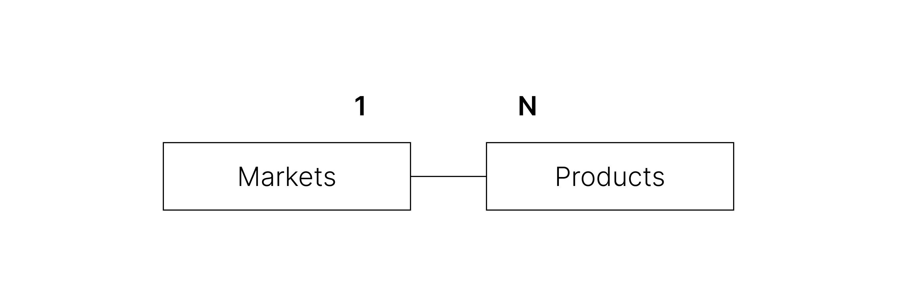
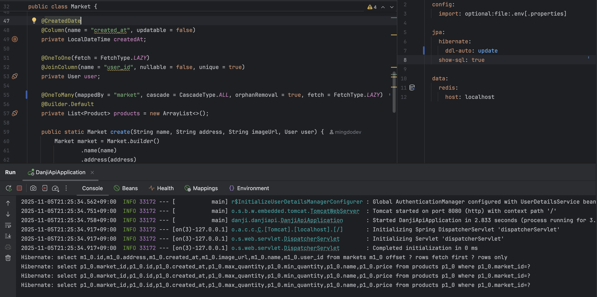
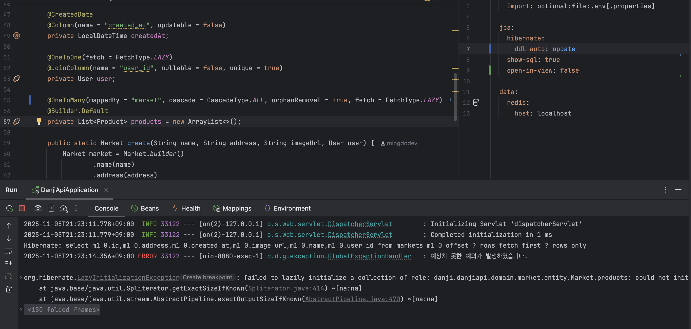
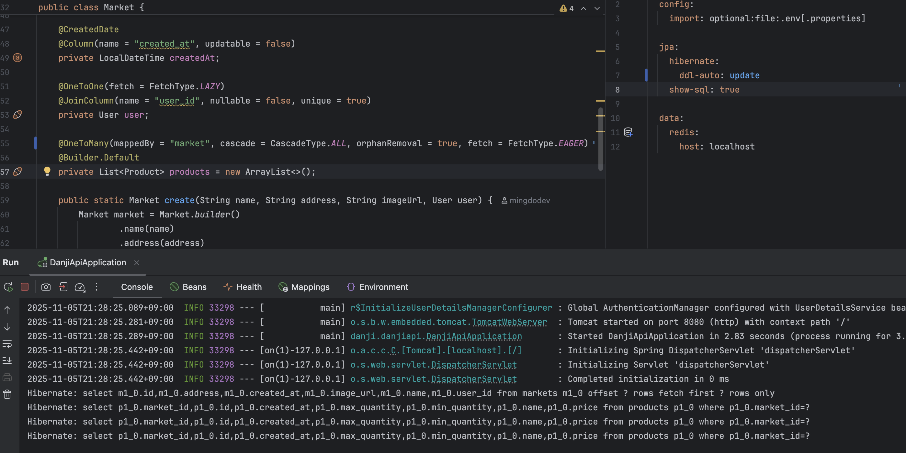
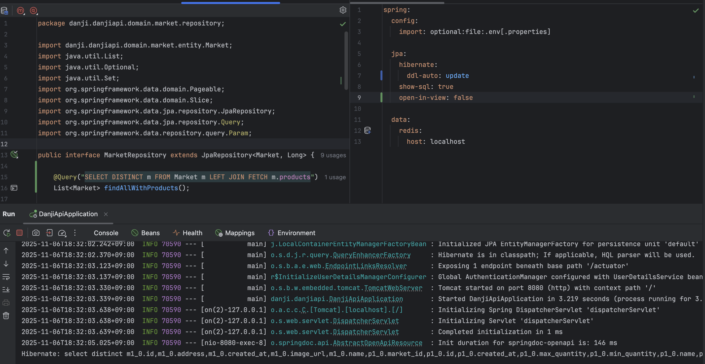

# [JPA] OSIV로 본 책임 분리 vs. 성능 최적화 (feat. N+1 문제)

<br><br><center></center><br><br><br><br>

불과 2개월 전 작성한 코드인데도 잘 안 읽히는 개인 프로젝트를 리팩토링하는 중이다. 고치고 싶은 게 너무 많은데 자동 테스트도 없어서 아주 총체적 난국이다. <span style="color:#737373; font-size:14px; font-weight:300;"> 와~ 레거시 코드를 리팩토링할 수 있는 경험을 스스로 만들어내다니 (?) </span>

테스트 코드를 붙이며 가장 먼저 하고 있는 일은 **DTO 변환 책임을 서비스에서 컨트롤러**로 옮기는 것이다. API 응답으로 사용하는 DTO는 UI의 책임을 가지기 때문에, Presentation 계층에서 담당하여 서비스 로직과는 의존성이 없도록 관리하는 것이 좋다고 생각했다. 따라서 서비스는 도메인 엔티티를 반환하고, 컨트롤러는 엔티티를 받아 DTO로 변환하도록 코드를 리팩토링 했다.

이 작업을 수행하던 중, 컨트롤러에서 API 응답을 구성할 때 **서비스로부터 받은 엔티티와 연관 관계를 지니는 다른 엔티티의 정보가 필요**한 경우이 생겼다.

JPA는 자바 객체와 RDB의 테이블을 맵핑하기 위한 ORM 기술로서, 트랜잭션 커밋이 이뤄진 시점에 목표를 달성한 것으로 친다면 영속성 컨텍스트는 서비스 계층에서 이미 사라졌을 것으로 보인다.

새롭게 정보를 받아오려면 또 다시 DB에 접근해 영속성 컨텍스트에 객체를 불러와야 할까? 이러한 상황에서 유용하게 사용되는 기술이 **Spring의 Open Session in View(OSIV)**이다.

<br>

---

## OSIV (Open Session in View) 패턴

DB와 매핑된 **ORM 세션을 HTTP 요청의 시작부터 끝까지 열어두는 아키텍처 패턴**을 말한다.  
원래 트랜잭션이 이미 완료된 이후에도, **웹 뷰에서 지연 로딩(Lazy Loading)을 허용하는 데 사용**된다.

### Hibernate에서의 OSIV

- Hibernate 진영에서는 OSIV 패턴을 요청의 시작부터 끝까지 `Session`을 열어두는 방식으로 구현하였다.
- 이를 위해 서블릿 필터인 `OpenSessionInViewFilter`를 사용하여, 요청 처리 전반에 걸쳐 `Session`을 현재 스레드에 바인딩하는 구조로 동작한다.

### Spring의 OSIV 지원

Spring Framework는 Hibernate의 OSIV 패턴을 JPA 표준을 기반으로 지원한다.  
JPA에서는 ORM 세션인 영속성 컨텍스트를 다룰 때 `EntityManager`를 사용하므로 공식 용어로서는 **Open EntityManager In View**라고 부르는 듯하다.

- 스프링 부트는 기본적으로 `OpenEntityManagerInViewInterceptor`를 통해 요청 전반에 걸쳐 `EntityManager`를 유지하며, 웹 뷰에서의 지연 로딩을 허용한다.
- 스프링 부트 프로젝트에서 OSIV 기능을 비활성화하려면 자동 구성의 `spring.jpa.open-in-view` 값을 false로 설정해주면 된다.

>  스프링도 Hibernate와 마찬가지로 필터 기반 구현(`OpenEntityManagerInViewFilter`)을 제공하는 것으로 보인다. 근데 공식 문서를 보면 기본 설정은 인터셉터로 구현하는 듯.

### 문제점

- 요청 전체 동안 영속성 컨텍스트를 유지하므로, DB 커넥션을 더 오래 점유하게 된다. 동시 트래픽이 많은 환경에서는 **커넥션 부족 문제**가 발생할 수 있다.
- 뷰 계층에서의 지연 로딩을 위한 기능이므로, 지연 로딩으로 인한 **N+1 문제**가 발생해 성능이 저하될 수 있다.

<br>

정확히 어떻게 사용하며 뭐가 좋은 건지, 어떤 부분에서 문제인지 실제 예시를 통해 이해해 보자!

<br>

---

## OSIV를 이용한 지연 로딩 예시

<center></center><br>

현재 개발 중인 음식 단체 주문 플랫폼 '단지'에서는 **가게(Markets)**와 **상품(Products)**을 **일대다 연관 관계**로 관리하고 있다.  
클라이언트는 **가게 목록 조회 API** 요청을 통해, 가게 정보뿐만 아니라 **해당 가게가 판매하고 있는 상품들의 정보**까지 받아와 화면에 보여줘야 한다고 가정해 보자.

> 설명을 위해 상황을 최대한 단순하게 재구성한 것으로, 다소 실제성이 낮거나 비효율적인 동작이 포함되어 있을 수 있다.

### Market Entity

가게와 상품 중 연관 관계의 주인은 외래 키 가진 상품(Product) 엔티티이다.  
JPA에서는 연관 관계의 주인이 아닌 쪽에서도 연관 엔티티에 접근할 수 있도록 `mappedBy` 속성을 이용해 **양방향 참조**를 설정할 수 있다.

<br>

```java
// file: "Market.java"
@OneToMany(mappedBy = "market", cascade = CascadeType.ALL, orphanRemoval = true)
private List<Product> products;
```

`Market` 엔티티는 위와 같이 `Product` 목록을 필드로 가지고 있으며, 이를 통해 ORM의 도움으로 연관된 상품 엔티티들을 편리하게 조회할 수 있다.  
**일대다 관계의 기본 FetchType은 LAZY(지연 로딩)**이다. 따라서 `Market` 조회 시 연관 관계를 가지는 `products` 컬렉션은 즉시 로드되지 않고 **프록시 객체**로 초기화된다. 따라서, 실제 `Product` 데이터에 접근하는 시점에 실제로 데이터를 로드하는 추가 쿼리가 발생한다.

### 응답 DTO를 구성하는 MarketController

API 응답에서 **어떤 데이터를 어떤 형태로 내려줄 지 결정하는 일**은 보통 프레젠테이션 계층의 책임이다. 서비스 계층은 가게 조회 조건이나 비즈니스 규칙에만 집중하여, 컨트롤러에게는 **도메인 엔티티(`Market`)를 그대로 반환**한다. 컨트롤러는 그 결과를 바탕으로 **클라이언트에 전달할 응답 DTO를 조립**하는 식으로 책임을 분리해 동작하도록 만들었다.

<br>

```java
@GetMapping("/api/markets")
@Operation(
        summary = "가게 목록 조회",
        description = "고객이 모든 가게 목록을 조회합니다. 가게 목록에는 가게 정보와 가게 내 상품에 대한 정보가 포함되어 있습니다."
)
public ApiResponse<List<MarketDetail>> getMarkets() {
    List<Market> markets = marketService.getAllMarkets();

    return ApiResponse.success(
            markets.stream()
                    .map(MarketDetail::from) // 지연 로딩 발생
                    .toList()
    );
}
```
위 코드는 컨트롤러가 서비스로부터 `List<Market>`을 그대로 전달받고, 이를 응답에 사용할 `MarketDetail` DTO로 변환해 반환하는 모습을 보여준다.

<br>

```java
public record MarketDetail(
        Long marketId,
        String name,
        String address,
        List<ProductDetail> products
) {
    public static MarketDetail from(Market market) {
        return new MarketDetail(
                market.getId(),
                market.getName(),
                market.getAddress(),
                market.getProducts().stream() // 지연 로딩 발생
                    .map(ProductDetail::from)
                    .toList()
        );
    }
}
```
`MarketDetail`은 응답에 필요한 정보만 담는 DTO이다. 정적 메서드 `from`은 도메인 엔티티 `Market`에서 필요한 필드만 골라 담고, `market.getProducts()` 호출을 통해 연관된 `Product` 엔티티 컬렉션에도 접근한다. 바로 이 시점에서 지연 로딩으로 실제 데이터가 로드되는 일이 일어난다.

<br>

OSIV가 켜져 있다면, 다음과 같이 **추가 쿼리가 발생하며 지연 로딩**에 성공해 API 응답 시 올바르게 DTO를 내려줄 수 있다.

<center></center><br>
cf. 실제 API에는 페이징이 적용되어 있기에 관련 쿼리도 섞여 있다
{:.figcaption}

위 예시에서는 Market의 전체 개수가 3개라 **3번의 추가 쿼리가 발생**하였다.  
이렇게 OSIV를 통해 **프레젠테이션 로직의 책임을 올바르게 분리**할 수 있지만, **N+1 문제**로 인한 성능 저하가 발생할 수 있다.

### 만약 OSIV를 끈다면?

OSIV로 영속성 컨텍스트가 유지되었음을 확인하기 위해, `application.yml`에서 `spring.jpa.open-in-view` 설정을 false로 두고 다시 API 요청을 보내 보았다.

<br>

<center></center><br>

이 경우, `LazyInitializationException`이 발생한다. `could not initialize proxy - no Session`이라는 문구를 통해, 요청 처리 시점에는 이미 ORM 세션이 닫혀 프록시 객체를 지연 초기화할 수 없음을 알 수 있다.

<br>

---

## OSIV로 누리는 계층별 책임의 분리 vs. 성능 최적화

앞서 살펴본 예시처럼, OSIV를 활용하면 서비스는 비즈니스 로직에 집중하고 컨트롤러는 응답 구성에 관여하는 **계층 간 명확한 책임 분리**를 만들 수 있다. 이는 분명한 장점이다.

<br>

그러나 조회해야 할 가게가 만약 10,000개였다면?  
**가게-상품**뿐만 아니라 **상품-상품 정보**와 같은 또 다른 지연 로딩 연관 관계가 존재한다면?  
N+1 문제는 단순한 성능 저하에서 그치지 않고 심각한 장애로 이어질 수도 있다.

따라서 N+1 문제를 피하고 성능을 최적화하기 위해서는, 컨트롤러에서 DTO를 구성하는 대신 SQL 수준에서 필요한 데이터를 미리 join으로 조회한 뒤 서비스 로직에서 DTO를 만드는 것이 낫다. <span style="color:#737373; font-size:14px; font-weight:300;"> 추가로 OSIV를 비활성화하면, 요청 전반에 걸쳐 불필요하게 커넥션이 붙잡혀 있는 상황을 줄여 
DB 커넥션 고갈 위험도 완화할 수 있다. </span>  
그러나 이 경우 "UI 로직이 비즈니스 로직을 넘어, SQL까지 침범하는 게 아닌가요?!"라는 의문이 생길 수도 있다. 엄격하게 따지고 든다면 **계층 간 의존성이 역전되었다**고 볼 수 있겠다.

따라서 **책임의 분리와 성능 사이에는 트레이드 오프**가 존재한다.

<br>

최근 토비님의 클린 스프링 강의를 듣고 이 트레이드 오프를 어떻게 바라봐야 할지 감을 잡게 되었다. 뭐든 핵심은 **본질에 집중하는 것**이다.  
여러 엔티티를 조합해 만들어내는 복잡한 UI 요구사항이라면, 이를 위한 DTO 구성 로직 역시 비즈니스 로직으로 간주하는 것이 어떨까 하는 말씀을 하셨다. 개인적으로는 **어떠어떠한 복잡한 데이터 조회 자체가 비즈니스 로직**이라는 의견이 매우 자연스럽게 느껴졌고, 앞으로 성능이 중요한 조회 로직에서는 책임의 분리와 원칙에 집착하기 보다는 N+1 문제를 해소하고 성능을 최적화하는 방향으로 개발을 해나갈 것 같다.

<br>

---

### cf. N+1 문제를 피하는 방법

지연 로딩(Lazy Loading)이 N+1 문제를 야기한다면, 단순히 즉시 로딩(Eager Loading) 전략으로 바꾸는 것만으로 해당 문제를 회피할 수 있을까? **그렇지 않다.**

<center></center><br>

즉시 로딩과 지연 로딩은 JPA에서 로딩 전략을 정하는 방식일 뿐이지 내부적인 쿼리 구현까지 강제하지 않는다. 위 사진처럼 연관 관계 로딩 전략을 즉시 로딩으로 설정하더라도, 실제로는 연관 엔티티를 각각 별도의 쿼리로 조회하는 조회해오는 추가 `select`가 발생했음을 확인할 수 있다.

> fetch join은 때로는 예측하기 어려운 쿼리 결과(예. 너무 많은 데이터 로드)를 만들기 때문에, JPA 구현체는 일반적으로 컬렉션 연관 관계에 대해 fetch join을 자동으로 적용하지 않는다고 들었다.

<br>

<center></center><br>

근본적인 문제를 해결하기 위해서는 ORM에게 책임을 맡기지 않고 개발자가 명시적으로 연관 관계를 조회해야 한다.
위와 같이 직접 JPQL로 fetch join을 사용해, 첫 번째 쿼리에서 연관 관계까지 함께 조회하도록 작성하면 N+1 문제를 해결할 수 있다.