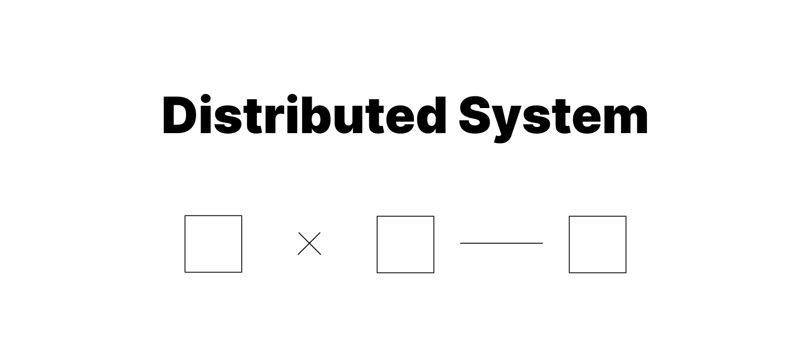

# 분산 시스템 기초 이해하기

 

분산 데이터베이스를 설계해야 할 일이 생겨... 분산 시스템을 처음으로  공부하게 되었는데, 무턱대고 구현체부터 마주하려니 너무 어려웠다. 기본기부터 이해해야 응용이 가능할 것 같다는 생각이 들어! 오랜만에 내 언어로 개념을 정리하고자 써보는 블로그닷.
 어렵당 ~.~ 

 

---

## 분산 시스템이란?

**메모리나 시계를 공유하지 않는** 프로세서의 모음으로, 다양한 **네트워크를 통해 서로 통신**한다.
일반적으로는 하나의 공동 목표를 위해 동작하는 여러 컴퓨터들의 집합이라고 볼 수 있다.

그렇다면 분산 시스템은 단일 시스템과 뭐가 다를까? 가장 큰 차이 중 하나는 **다른 구성 요소의 상태를 직접 알 수 없다는 것**이다.

같은 프로세스 안에서 함수를 호출한다면 호출자는 함수의 반환이나 예외를 통해 실행 결과를 직접 전달받을 수 있다.  
반면 분산 시스템에서 다른 노드에 요청을 보내는 경우, 요청과 응답 사이에 **네트워크가 개입**한다.

예를 들어 노드 A가 B에게 요청을 보냈지만 응답을 받지 못했다고 해보자. A가 관찰할 수 있는 사실은 그저 '일정 시간동안 B의 응답을 받지 못했다'는 것뿐이다!
이것만으로 B의 실제나 응답이 오지 않은 원인을 확정할 수 있을까?

- B가 죽었다.
- B가 살아 있지만 매우 느리다.
- A → B 네트워크가 끊겼다.
- B → A 네트워크만 끊겼다.
- 요청이 중간에서 유실됐다.
- 요청은 도착했는데 응답이 유실됐다.
- B가 처리 중이지만 아직 끝나지 않았다.
- A 자신의 네트워크에 문제가 생겼다.

없다. 즉, **응답이 없다는 관찰이 곧 상대 노드의 실패를 의미하지 않는다.**
따라서 분산 시스템을 설계할 때에는 **불확실성(uncertainty)** 자체를 시스템 설계에 포함해야 한다.

 

---

## Partial Failure

- 전체 장애와 부분 장애의 차이
- 노드 장애 / 프로세스 장애/ 네트워크 장애

 

---

## Timeout과 Failure Detection

- 응답 없음 이 노드 죽음 이 아니다.
- 타임아웃이 필요한 이유
- 하트비트
- False Positive
- 타임아웃 길게/짧게 트레이드 오프

 

---

## Network Partition

- 노드는 살아있는데 서로 통신하지 못함
- 누가 고립된 것인지 자기 자신은 모른다.

그럼 이게 왜 문제냐?

 

---

## Split Brain

- Network Partition과 Split Brain의 차이
- Replica가 승격되면서 두 Primary가 생기는 과정
- Split Brain 자체와 data divergence의 차이: 리더가 두 개인 게 문제가 아니라, 실제로 쓰기가 동시에 일어나는 게 문제

그렇다면 네트워크가 갈라져 서로의 상태를 믿을 수 없는 상황에서, 어떻게 한쪽에만 유효한 권한을 줄 수 있을까?

관찰자의 위치에 따라 시스템 상태가 다르게 보이며, 다른 시스템이 '응답이 없다'만 알 수 있을 뿐 왜 응답이 없는지 이유를 단정할 수 없다.
