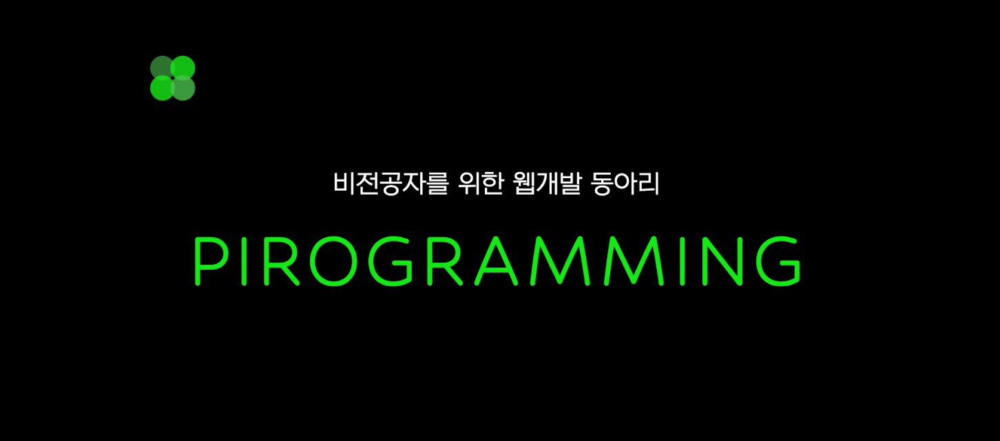

## [피로그래밍] 19기 활동 후기, 짧은 회고

 

  

> 2023.06.23. - 2024.08.22. Pirogramming 19th

 

피로그래밍 21기 모집이 시작되었다. 그 말인즉슨 내가 19기로 활동한 지 거의 1년이 다 되어간다는 뜻이다 ^^ 얏호  
어제 우연히 **내 인생의 터닝포인트**에 대해 생각해 볼 기회가 있었는데, 아무래도 가장 최근의 터닝포인트라 하면 피로그래밍이 먼저 떠올랐다.  개발에 대한 나의 진심부터 도전, 몰입, 사람과 협업.. 다양한 부분에서 많은 것을 느끼게 해준  

예전부터 후기를 남기고 싶은 마음이 있었지만 어쩌면 너무 소중한 동아리이기 때문에 글쓰기가 더 망설여졌다.  
나 역시도 동아리 지원을 위해 후기 글을 여럿 읽어본 경험이 있으니 이 글의 한 문장이 누군가에게 미칠 영향에 대해 한 번 더 생각해 보게 된다. 피로그래밍이 지향하는 바를 온전히 전달하면서도 많은 사람들이 도전을 두려워하지 않도록 하는 깔끔한 글을 쓰고 싶다.

그런 고민이 있지만.. 심지어 완전히 뒷북인 데다가.. 19기 후기는 많지 않아서 조금 수줍 😅 기도 하지만!!  
많은 사람들이 피로그래밍에서 내가 얻어간 것들, 나아가 그 이상의 가치를 얻어가는 값진 경험을 했으면 좋겠다는 마음 하나로 활동 후기를 작성해 보겠다. 또 내가 했었던 생각과, 앞으로의 마음가짐에 대해 정리해 봐야겠다.  완전히 두서없고 사적인 글이 될 것 같다 우뜨카니~ 

원래는 동아리 지원, 세션과 과제, 프로젝트, 수료 이후 이렇게 활동 중심의 후기를 써보려고 했는데   
사실상 활동 관련해서는 피로그래밍 홈페이지와 인스타그램 그리고 다른 분들의 후기에서 양질의 정보를 얻을 수 있다.  
따라서 나는 내가 느낀 피로그래밍이라는 동아리의 강점을 바탕으로 여기서 어떤 기회들을 얻을 수 있는지, 그걸 어떻게 200% 활용할 수 있는지에 대해 소개해 보려고 한다. 

회고 겸 쓰는 거라 말이 많을 예정 ㅎㅎ

 

---

# 지원 과정

피로그래밍 지원 프로세스는 코딩테스트를 포함한 서류 전형, 면접 전형으로 이루어진다.

지원서 질문은 자기소개, 지원 동기, 노력한 경험, 만들고 싶은 웹 서비스 등으로 구성되어 있고 마지막에 코딩 테스트 문제가 주어진다. 1차 서류 전형에 합격하면 2차 대면 면접 전형에 응시하여 최종합격을 결정하는 방식이다.

## 지원 동기

나는 프로그래밍이 재미있어 개발을 시작한 단순한 사람이다. 근데 이제 그 재미가 인생을 살짝 뒤흔들 정도였기에 공부할 것, 할 수 있는 활동을 찾아보다가 피로그래밍을 발견했다. 보통 코딩에 흥미를 갖고 여러 가지 개발 트렌드를 살펴본 사람이라면 Django라는 기술을 사용한다는 점에 의문을 가질 수도 있을 것이라 생각한다. 나 역시도 비슷한 우려와 새로운 도전에 대한 불확실함으로 지원을 고민했었다. 전공자도 아니고 개발은 완전히 처음인데 나 같은 사람이 이걸 해도 될까? (+ 코앞인 기말고사…) 하지만 오히려 완전히 처음이기 때문에 **일단 시작**해야 했다. 그게 무엇이든 일단 부딪혀봐야겠다는 마음이 컸다. 특히 비전공자로서 놓칠 수 없는 기회라는 생각이 들어 거의 하루 만에 서류를 쓰고 지원했다. (그리고 나중에 얘기하겠지만 사용한 기술 스택에 대한 아쉬움은 전혀 없다.)

## 서류

**지원서**에 이런 생각들과 구체적인 경험을 솔직하게 적었다. 특히나 피로그래밍은 당장 화려한 결과물, 실력이 없어도 개발에 대한 열정, 잠재력이 있다면 환영해 줄 것 같았기에 부족한 경험을 애써 감추려 하지는 않았다. 글을 잘 쓰는 편이 아니지만 내가 어떤 사람인지 진솔하게 표현하고 나니 큰 후회는 없었고, 서류를 평가한 분들도 어느 정도 좋게 봐주신 것 같다.

**코딩테스트**는 실력이 아닌 최소한의 열정을 보기 위한 수단이다. 나는 모르는 파이썬 문법이 많아 그때그때 찾아 공부하고 답을 적었다. 파이썬을 처음 접해본 사람이라면 조금 어려울 수 있지만, 할 수 있는 만큼 노력하면 우리의 피로그래밍은 다 알아준다 (진짜임)

## 면접

**면접**도 마찬가지로 ‘진심만 전하고 오자!’라는 마음으로 임했다. 개발을 하고 싶은 내 진심만 왜곡되지 않게 전달한다면 결과에 만족할 수 있을 거라는 자신이 있었다.

생각보다 편안한 분위기라 오히려 면접 전보다 덜 떨렸다. 대부분 **작성한 서류에 기반한 질문**이 나왔고, 미리 연습해 보고 갔기 때문에 크게 당황할 일은 없었다. 나중에 들어보니 나는 비전공자치고는 **기술 질문**을 많이 받은 편이었다. 학교에서 C, C++을 배운 적이 있다고 하니 포인터, 상속, 오버로딩, OOP의 4가지 특징 정도로 물어보셨다. 오버로딩과 OOP의 특징은 정확히 답변을 못했었는데, 이럴 경우 비전공자임을 충분히 감안하여 평가하기 때문에 너무 겁먹지 않아도 된다!!

 

아무튼 결론은 진심이 통했다는 것이고 2023년 여름 피로그래밍 19기로 활동하게 되었다.  

 

---

# 피로그래밍은 어떤 동아리일까?

나는 동아리를 내 인생의 피버타임처럼 활용했던 것 같다.  우하하 경험치 두 배 이벤트  개성 있고 열정 있는 집단 속에서 매 순간 배울 점이 보였고 덕분에 혼자일 때보다 빠르게 성장할 수 있었다. 비전공자의 입장 + 1년 동안 조금 더 공부한 이 시점에서 지난 동아리 활동에 대해 적어보겠다. 다소 주관적일 수 있다.

## 개발에 필요한 도구들을 폭 넓게 다룬다.

웹 개발을 처음 해보는 사람들이 다양한 경험을 해보고 앞으로의 방향을 설정하기에 좋은 커리큘럼을 가지고 있다.

- 첫 번째 세션에서 **git** 사용법을 배우고 꾸준히 이를 활용하도록 과제가 나오기 때문에 git과 친해질 수 있다.
- **프론트엔드**와 **백엔드**를 모두 다룬다.  
    둘 다 경험해보고 나에게 맞는 직군을 선택할 수 있다. 나는야 프론트를 외치며 들어왔는데 지금은 백엔드 개발을 하고 있는 나처럼   
- **기획** 세션도 하루 준비되어 있다. 나는 개발자가 하는 일 외에는 전혀 아는 것이 없었는데 기획이 어떤 식으로 이루어지는지 접해볼 수 있어 도움이 되었다. 프로젝트 초반에 기획 피드백도 받을 수 있다.
- 깊게 다루지는 않지만 Notion, Figma, Figjam, ERDCloud 등 **개발에 필요한 협업 툴**을 써볼 수 있다. 피그마같은 경우 이때 처음 써본 후 지금까지도 잘 쓰고 있다.

개인적으로는 `이런 게 있어~` 라는 정보 자체가 초심자에게 굉장히 귀하다고 생각하기 때문에 좋다고 느꼈다. 

## 협업 프로세스, 개발 센스, 좋은 마음가짐을 배울 수 있는 커뮤니티이다.

매주 있는 팀 과제와 최종 프로젝트를 통해 **협업 과정에 익숙해질 수 있다**. 공유 문서 작성, 이슈 기반 브랜치와 PR 활용하기, 커밋 컨벤션 지키기, 코드 주석 달기 등 원활한 협업을 위한 습관을 형성할 수 있었다. 이런 규칙들은 팀에 따라 지킬 수도 있고 아닐 수도 있는데 되도록이면 함께 찾아보고 논의해서 연습해보길! 초반에 잘 배워두니 지금까지 편하다. 특히 커밋을 잘 쌓아두면 오류가 발생했을 때 해결하기도 쉽고 서로 어떤 일을 하고 있는지 파악하기도 좋다. 정말로.

경험이 풍부한 동기들로부터 **개발 센스**를 습득하기도 하고, 다양한 사람들과 교류하며 **좋은 헙업을 위해 어떤 노력을 해야 할지 고민해볼 수 있다**. 개발을 떠나서 많은 사람들과 어울리며 배운 점이 정말 많다. 팀 과제, 팀 미션, 소모임 등 활동 자체가 다양한 사람들과 함께할 수 있게 짜여지기 때문에 소통의 기회가 열려있다. 그 속에서 시행착오를 겪으며 나를 건강하게 다스리는 방법, 상대방을 존중하는 힘을 기를 수 있었다.

열정 있는 사람들이 모이는 곳이다보니 나도 더 열심히 하게 된다. 특히 프로젝트를 할 때에 `팀과 함께이기에 가능했다`는 말을 몸소 체감했다. 팀원들이 없었다면 타협하지 않고 무한정 몰입하는 이런 경험을 할 수 없었을 것이다.

## 모두에게 발표 기회가 주어진다. 무려 기획으로

이게 무슨 뜬금없는 소리지 할 수 있지만 나름 동아리의 특징이라고 생각한다. 프로젝트를 진행하기 전, 모두가 자신의 아이디어로 프로젝트를 기획하고 발표하는 시간을 갖는다. 어쩌면 프로젝트에 기획자가 없다는 것은 단점으로 여겨질 수 있다. 하지만 반대로 생각하면 개발자가 기획자의 입장에서 생각해볼 수 있는 좋은 기회이다. 더구나 전문가 수준의 기획안을 요구하는 것도 아니기 때문에 부담없이 역지사지의 기회를 누려볼 수 있다!  사실 초반엔 완전 부담이었지만 발표를 준비하는 과정에서 어느정도 극복이 되었다 ㅎㅎ

또한 최근에 발표의 소중함을 느꼈기 때문에 구성원 모두가 발표에 참여할 수 있는 이 동아리.. 훌륭하다고 생각한다.  
나의 생각을 정리해서 입 밖으로 꺼내는 것 자체가 스스로에게 큰 도움이 된다. 흩어져있는 생각을 체계화할 수 있다. 여담으로 동아리에서 만난 사람들과 따로 프로젝트, 스터디를 진행하게 되면 발표의 기회가 더 많이 생긴다.  
발표를 공부 수단으로 활용하기 완전 추천! 

 

---

# 기회의 땅 그 이후

이건 또 무슨 소리지? 가장 하고 싶은 말은 여기서 멈추지 말라는 것이다. 활동이 끝난 후 피로그래밍을 발판 삼아 **새로운 도전**을 계속했으면 좋겠다. 이건 모든 경험에 적용할 수 있는 말이자 나 스스로에게 당부하는 말이다.

피로그래밍은 비전공자, 전공자이지만 프로젝트 경험이 적은 사람 등 특히 막 출발한 사람들이 많이 모이는 곳이다. 그렇기 때문에 활동이 끝난 후 새로운 도전을 하기에 정말 좋은 환경이라고 생각한다. 도전은 새로운 분야·기술 공부, 기존 서비스 디벨롭, 다른 동아리 지원 혹은 개발 이외의 것이 될 수도 있다. 처음이라는 점을 무기로 이것저것 해보고 실패도 해보고... `'나는 이럴 때 즐겁구나'`, `'나는 이런 건 좀 어려워하네'` 를 꾸준히 느낄 수 있는, 그런 좋은 **기회**를 잡는 사람이 되고 싶다.

무언가 하나에 집중하고 끝까지 최선을 다한 경험은 그 자체로 큰 **용기**가 되어준다. 실제로 피로그래밍 활동 이후 안 될 거라는 막연한 걱정이 많이 줄었다. 나보다 뛰어난 누군가 해주길 기다리는 대신 '내가 해볼게.'라고 말할 수 있게 되었다. 또 앞으로도 계속 함께 도전할 수 있는 **동료들**이 생겼다.

열정 넘치는 19기 동료들과 단기간에 Node.js와 RN을 공부해서 동아리 운영을 위한 앱도 만들어보고, 여러 가지 스터디를 만들어서 같이 공부하기도 했다. 낯선 기술을 두려워하지 않고 적극적으로 파고드는 자세가 어딜 가든 여전히 도움이 된다. 그래서 Django 라는 특정 프레임워크를 배우고 사용한 것에 후회는 없다. 오히려 **기술의 필요성을 알고 공부하는 것**이 중요하다고 생각하기 때문에 노드나 스프링 공부를 할 때 대조군이 되어주는 느낌이라 좋다! 이외에도 특정 기술, 분야 또는 특별한 목표에 도전하는 다양한 모임이 많았다고 알고 있다. 지금은 꾸준히 개발 블로그 쓰는 것을 함께 실천하고 있다~

 

---

# 마무리

돌아보며! 감사했던 일과 잊고 있었던 생각을 다시 떠올릴 수 있었다. 어마어마한 양의 과제, 부족한 시간과 체력, 뜻대로 흘러가지 않는 상황들에 힘들 때도 많았다. 하지만 앞으로 비슷한 문제를 마주한다면 좀 더 편안한 마음으로 상황을 바라볼 수 있을 것 같다.

몰입의 경험 너무 좋고 후회 없다. 다시 돌아가도 그렇게 개발할 것이고 미래에도 그럴 것 같다. 다만, 앞으로는 나를 해치지 않는 선에서 건강하게 개발할 수 있도록 노력해 보자. 나를 위해서도 남을 위해서도 충전의 시간은 필요하다.

활동 기간에 개발하느라 밥과 잠을 무시할 때가 많았다. 나뿐만 아니라 많은 친구들이 그랬다 🥲  자연스럽게 건강을 잃었고, 가용 에너지가 없어지니 오히려 필요할 때 일을 제대로 못 하는 경우도 생겼다. 지속적으로 효율을 내기 위해서는 건강 관리에도 신경 써야 한다. 식사를 잘 챙기고, 수면 시간도 충분히 확보하자. 좋아하는 일을 멈추었다가 다시 시작할 줄도 알아야 한다.

끊임없이 공유하자. 내가 지금 무엇을 하고 있는지 알리고, 어떤 문제를 겪고 있는지 메신저에 남기자.  
겪은 문제와 해결 방법을 공유하여 팀의 성장에 활용하자.

기록하자. 정리해서 남겨두지 않아 사라져 버린 것들이 많다. 블로그 열심히 쓰자.

  

 

 20기에 리뉴얼된 홈페이지가 정말 예쁘다. 백엔드 회장님과 프론트엔드 부회장님 작품. 

  

> 2024.05.24. - 2024.06.08.

 

아직 21기 모집을 진행 중이던데, 이번 여름이 앞으로 피로그래밍과 함께하게 될 분들께  그리고 잠깐이라도 인연이 닿았던 모든 사람들에게! 기억에 남을 소중한 시간이 되었으면 좋겠다.  그리고 나도~ 나도나도 열심히 살아야지 ^^ 

다들 6월도 행복하세요 ~