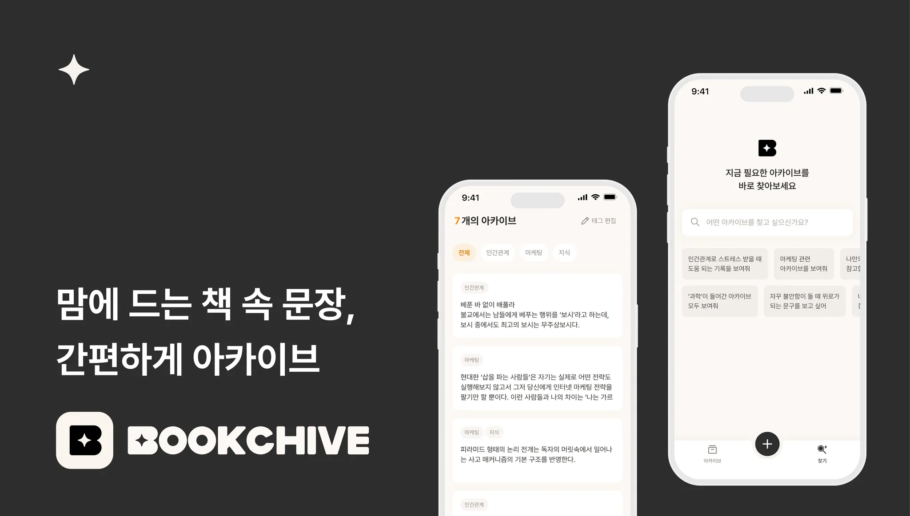
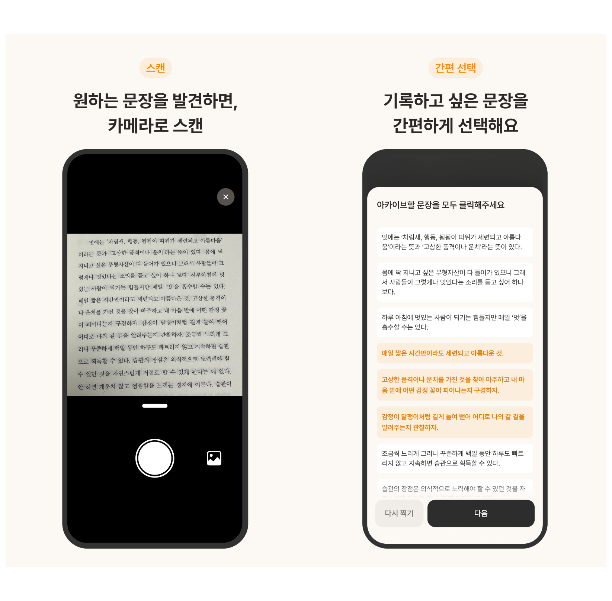
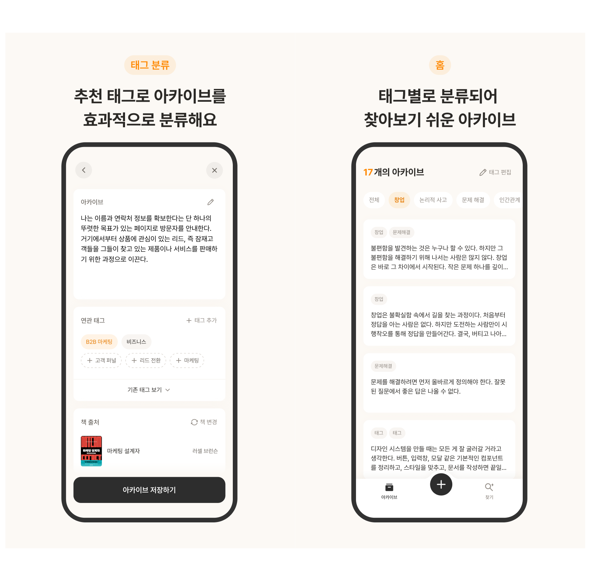
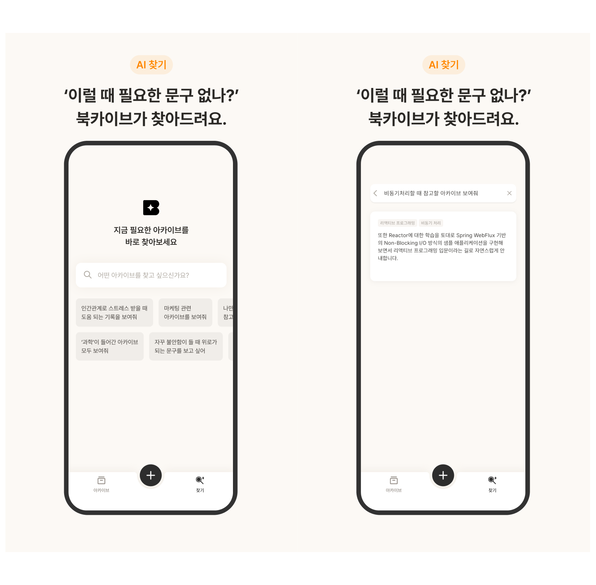
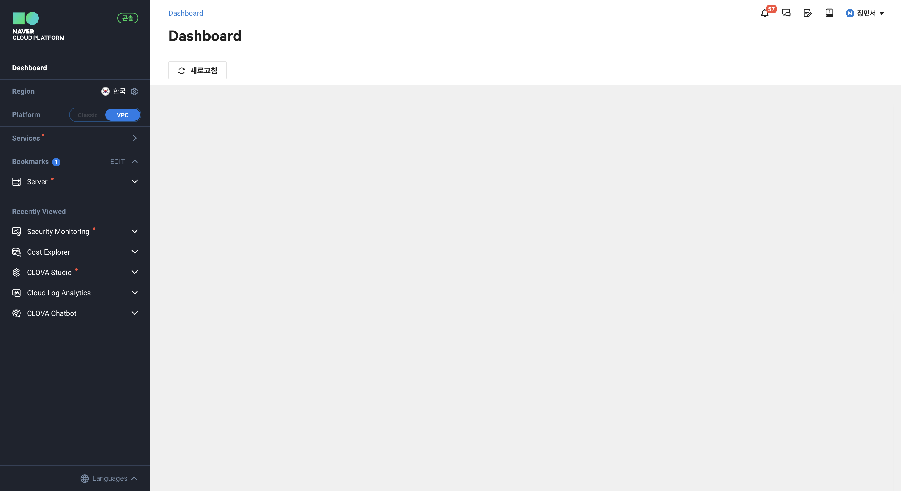
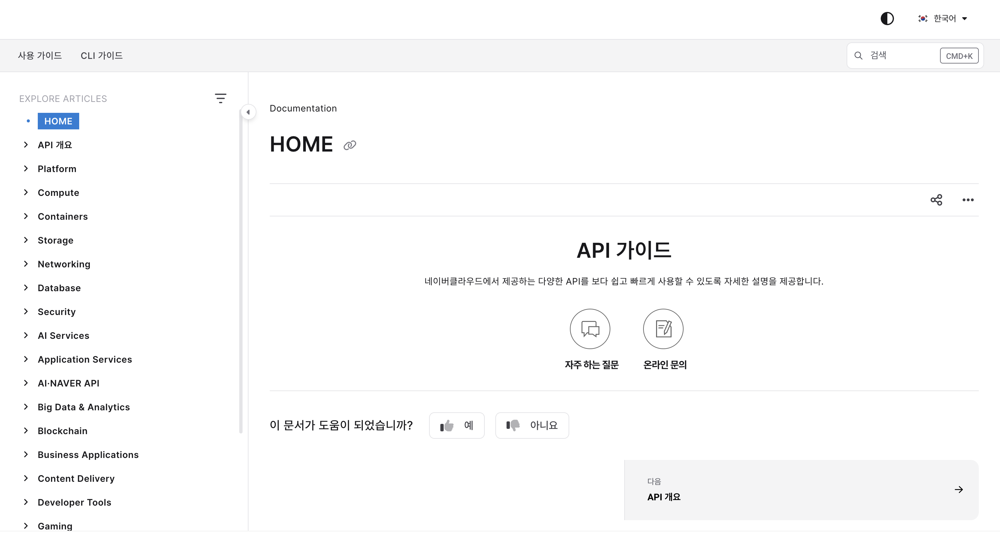
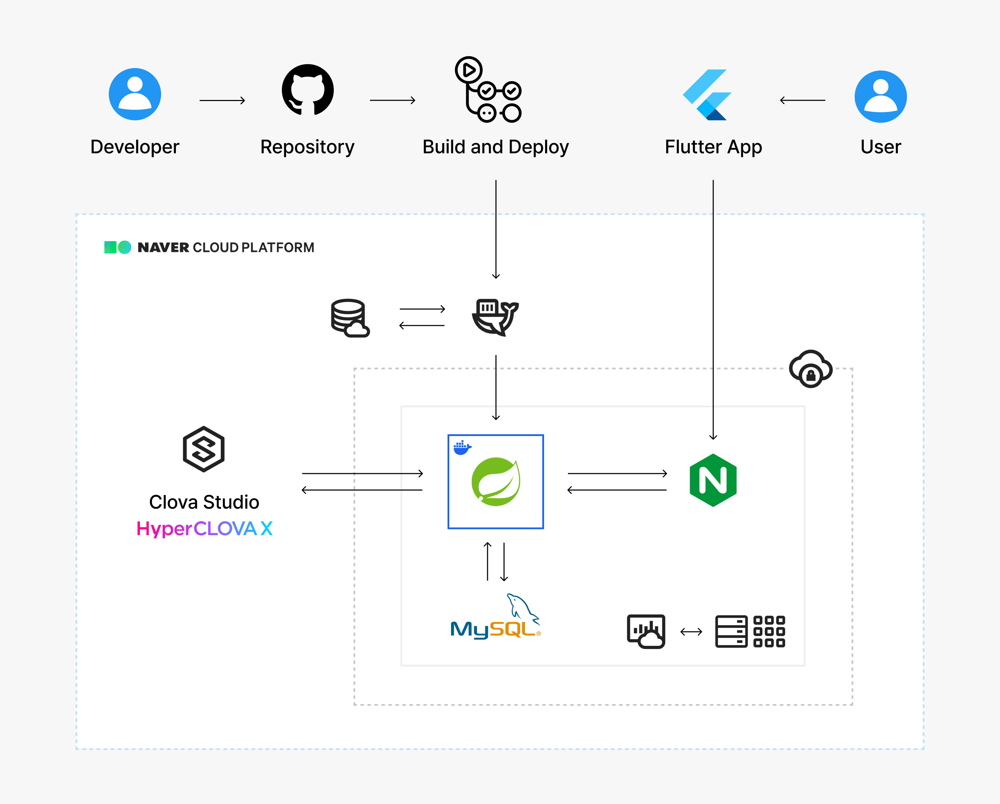

# [비사이드 포텐데이] AI 문장 기록 서비스 북카이브: NCP & Clova Studio 활용기

 

지난 2월 말 10일간의 해커톤 **비사이드 AI 포텐데이 502**에 참여했다. 포텐데이에서의 프로덕트 개발 기록, 그리고 **Naver Cloud Platform**과 **Clova Studio**를 활용해 서비스를 개발한 후기를 남겨보겠다.

 

---

## 502 AI 포텐데이 x 네이버 클라우드

AI 포텐데이는 특별하게 **AI 도구를 적용한 서비스**를 개발하는 것을 목표로 진행한다.

이번 502 포텐데이에서는 최종 프로토타입에 Naver Cloud의 CLOVA Studio, CLOVA OCR, CLOVA Chatbot 중 최소 1개의 기술을 적용해야 하는 룰이 있었다. 즉, AI 기술을 서비스에 녹여내는 경험 자체가 핵심인 해커톤이었다.

AI 기술이 무서운 속도로 성장하고 있는 지금, `AI를 어떤 서비스에, 어떻게 적재적소에 사용할 수 있을까?`라는 고민과 함께 실제 사용자가 있는 서비스를 직접 만들고 싶어 이번 해커톤에 참여하게 되었다.

## 사용자의 일상 속 불편함을 해결하는 서비스를 만들자

포텐데이 팀 빌딩에 앞서, **서비스 출시뿐 아니라 운영까지 이어가며** 사용자 중심 엔지니어링을 경험하자라는 목표를 세웠다. 서비스 운영에 뜻이 있는 팀원들과 만나면서, 우리 팀의 방향은 자연스럽게 **"사용자들이 정말 쓰고 싶은 서비스를 만들자"**로 모아졌다. 특히 일상 속에 스며들 수 있는 서비스를 목표로 아이데이션을 진행했는데, 그 과정에서 책 문장 기록 서비스 **북카이브**가 탄생하게 되었다.

<!-- 변화하는 요구사항에 대응할 수 있는 유연한 설계, 장기적 가치를 제공할 수 있는 유지보수하기 쉬운 설계 -->

### 문제 의식과 문제 정의

- 책은 읽었는데, 어떤 내용이었는지 기억에 안 남아 🤔
- 마음에 드는 문장을 일일이 쓰고 타이핑하기 귀찮아...
- 분명 기록해뒀는데, 그 기록을 어디에 뒀더라?

북카이브는 이러한 문제 의식으로부터 출발했다. **기존의 독서 기록 방식이 불편**하거나, **흩어진 기록을 효과적으로 관리/활용**하고자 하는 사용자를 위한 솔루션을 제공한다.

 

그리고 다음과 같은 고객을 타겟으로 한다.

- 독서를 하며 기록을 남기고 싶지만 번거로움을 느끼는 사람
- 책에서 메모한 내용이 여러 곳에 흩어져 있어 찾기 어려운 사람
- 기록을 체계적으로 분류하고 활용하고자 하는 욕구가 있는 사람

특히, 성장에 관심이 많고 일상 속 문제를 능동적으로 해결하고자 하는 **2030 직장인**을 핵심 타겟으로 설정하고 있다. 자세한 [메이커 로그](https://eopla.net/magazines/28658) 및 [타겟을 대상으로 한 첫 UT 후기](https://eopla.net/magazines/29380?utm_source=copy_link&utm_medium=share#) 등은 프로덕트 디자이너님께서 작성해주신 아티클에서 확인할 수 있다 🙌

 

---

## 불편함을 해결하는 핵심 기능

정의한 문제를 해결하기 위해, 북카이브 MVP는 AI와 함께하는 세 가지 핵심 기능을 제공한다.

### 1. OCR로 간편한 기록

- OCR로 텍스트를 추출하고, 문장 단위로 구분해 편리하게 선택한다.
- 인식된 텍스트는 LLM을 활용해 오탈자를 교정한다.

북카이브는 문장 기록 과정에서 **압도적인 편리함**을 주는 것이 중요하다. 불필요한 타이핑을 최대한 줄이고 빠르게 기록하기 위해 Google ML Kit의 OCR 기술을 활용하여 사진으로부터 문장을 추출한다.

초기에는 Clova OCR API 사용을 고려했지만, 결국 서비스의 핵심 가치를 되짚으며 빠른 처리 속도와 비용 효율성이 더 중요하다고 판단했다. 따라서 온디바이스의 SDK 형태로 앱에 직접 통합할 수 있는 Google ML Kit를 채택하였다.

 

한편 어떤 OCR 기술이든 흔들림, 초점과 같은 물리적인 문제로 인해 늘 완벽한 문장이 추출되지는 않는다. 이런 오류를 사용자가 번거롭게 수정하지 않도록, **Clova Studio API**를 통해 문장의 오탈자, 맞춤법을 교정하도록 구현했다.

여담으로, 문장 교정 프롬프트로 통제하기 가장 어려웠던 부분이 **한국어의 다채로운 표현**을 살리는 것이었다.

예를 들어 '병마'라는 단어는 ‘병’을 마귀에 비유한 표현으로, 교정 대상이 아니다. 프롬프트를 통해 예시와 규칙을 명시해주었지만 HCX-003 모델은 '병마'를 '병'으로 바꿔버리곤 했다. 그러나 최근 새로운 모델인 HCX-005를 동일한 프롬프트로 테스트해본 결과, '병마'를 수정하지 않고 오탈자만 교정하는 일관된 결과를 확인할 수 있었다! 이렇게 몇 주 간격으로 새로운 모델이 등장하고 높아진 성능을 체감할 수 있는 것도 신기했다.

### 2. 태그로 깔끔한 분류

- 구절을 기록할 때, 기존 태그 중 가장 어울리는 태그를 추천해 효과적으로 분류한다.
- 구절에 어울리는 새로운 태그를 추천해 적은 고민으로 새로운 분류 기준을 추가할 수 있다.

사용자가 문장을 선택하면, Clova Studio API 호출을 통해 **Hyper Clova X LLM**이 해당 내용에 가장 잘 어울리는 태그를 추천해준다.

초기에는 태그 추천을 단 하나의 프롬프트로 처리했었다. 첫 UT 결과 태그 추천에서 높은 만족도를 보이긴 했지만, 사용자의 취향과 행동을 얼마나 반영하여 태그를 추천해주는지에 대해서는 신뢰도가 떨어진다는 피드백이 있었다. 이를 개선하기 위해, 태그 추천 기능은 `사용자 태그 분석, 연관 태그 추천, 새로운 태그 추천`이라는 각각의 역할을 가진 LLM의 협력으로 보다 **사용자 맞춤형 시스템**에 가까워지도록 구현하였다.

LLM은 단순하고 명료한 작업을 지시할 때 훨씬 높은 정확도와 응답 일관성을 보였다. 객체 지향 프로그래밍에서 각 클래스가 하나의 책임만 가지듯, LLM 에이전트 설계에서도 **책임 분리**가 중요하다는 것을 배웠다.

또한 NCP 포럼에서는 Clova Studio 운영자님이 활용법을 직접 공유해주시는데, [이런 공식 자료들](https://www.ncloud-forums.com/topic/103/)을 참고했을 때 프롬프트 성능 개선에 유의미한 도움을 받을 수 있었다. 활용 팁과 예제들이 꾸준히 업데이트되고 있으니 다들 적극 참고할 것을 추천한다!

### 3. AI 찾기로 필요할 때, 필요한 문구를 바로!

- 사용자의 질문을 LLM이 분석하여, 상황에 알맞은 구절을 제시해준다.

문득 떠오른 구절이 갑자기 필요할 때, 저장 위치와 분류 방식이 기억나지 않는 경우가 있다. 북카이브는 그런 순간을 위해 AI 기반 문장 검색 기능을 제공한다. 사용자가 자연어로 질문을 입력하면, AI가 저장된 기록 중 관련 구절을 검색해준다. 이 기능은 단순 검색을 넘어, 저장한 기록을 **더 편리하게 꺼내 활용할 수 있도록** 돕기 위해 설계되었다.

 

AI 검색을 단기에 MVP로서 완성하기 위해서는 많은 고민이 필요했다.

- 단순 단어 검색에 매번 LLM 호출을 사용하는 것은 낭비이다. 따라서 사용자의 질문 유형을 먼저 분류해야 한다.
- RAG 구조가 아닌 이상, 검색 대상 데이터를 전부 API로 전달해야 한다. 그러나 사용자의 모든 아카이브 데이터를 한 번에 전송하는 것은 비효율적이며 성능과 보안 측면에서도 부담이 크다.

따라서 `사용자 질문 유형 분석` LLM이 먼저 질문을 파악한 뒤, 단순 단어 검색이 아니라고 판단되면 `검색 키워드 추출` LLM에게 추가로 요청을 보냈다. LLM이 사용자의 태그 리스트와 검색창에 입력된 질문을 보고 관련된 키워드들을 추출하면 서버에서 해당 키워드들을 기준으로 데이터를 필터링해 기록을 검색하는 방식을 사용하였다.

 

---

## Naver Cloud Plaform 활용 후기

포텐데이 참가팀은 Green Developers 프로그램을 통해 NCP 크레딧을 지원받아, 비용 부담을 줄이며 클라우드 서비스를 자유롭게 활용할 수 있었다. 학생 개발자에게 이런 지원은 정말 큰 도움이 되었다.

 

 

처음 NCP 콘솔에 접속했을 때, 가장 먼저 느꼈던 건 **친절한 UI**였다.
리전, 서비스 목록 등 자주 손이 가는 요소들이 왼쪽 하나의 섹션에 직관적으로 모여있다. 또한 최초 접속이라면 가이드 화면이 뜬다.
NCP 사용이 처음이었지만 이런 디테일 덕에 진입 장벽이 높게 느껴지지 않았다.

반면, 가이드 문서 접근 방식은 낯설었다. 서비스 소개 페이지나 콘솔 내 서비스 탭에서 바로 해당 서비스의 문서로 가는 방법을 못 찾아 구글링을 통해 접속하곤 했다. API 가이드와 서비스 가이드가 따로 존재하는 점은 좋았지만, 개인적으로는 헷갈릴 때도 많았다.

해커톤이 끝난 직후 NCP 사용 후기에도 이러한 어려움을 남겼었다. 그런데..!

 

최근 확인해보니 가이드 시스템 UI 자체가 깔끔하게 바뀌고, 헤더 왼쪽에 내가 활용할 수 있는 가이드 목록이 한눈에 보였다! 전에는 가이드 목록이 오른쪽에 있었던 걸로 기억하는데, 한국인이라 시선이 왼쪽 위부터 닿아서인지 업데이트된 구성이 훨씬 직관적으로 느껴졌다. 색상이 다양했던 전과 달리, 톤도 통일되어 내가 집중하고 싶은 부분에만 집중할 수 있었다.

이건 되게 신기한 경험이었다. 사소한 부분까지 신경쓰고 주기적으로 개선하는 것이 체감되었고, 사용자 입장에서 신뢰도가 높아졌다.

결론. 전반적인 사용자 경험은 만족스러웠다!

### 사용한 서비스

북카이브 애플리케이션은 다음과 같은 서버 아키텍처로 구성되어 있으며, 해커톤 종료 후에도 운영을 지속할 계획이었다. 따라서 유지보수성과 효율성을 고려해 오버 엔지니어링을 피하고, 필요한 기능에만 적절한 기술을 적용하는 데 집중했다.

 

 

백엔드 환경은 **Server**와 **Block Storage**를 기반으로 구성되어 있다. **Container Registry**를 통해 빌드한 이미지를 안전하게 관리할 수 있으며, **Object Storage**는 도커 리소스와 애플리케이션 로그 데이터를 저장하는 용도로 사용하였다.

**Cloud Log Analytics**를 통해 필요한 로그를 빠르게 확인하고 관리하며 운영 효율성을 높일 수 있었으며, **Clova Studio API**를 통해 핵심 기능에 필요한 LLM 호출을 처리했다.

이처럼 NCP의 다양한 서비스를 필요할 때 즉시 활용함으로써, MVP 구현과 안정적인 운영 환경 구축을 동시에 달성할 수 있었다.

더 자세한 NCP 서비스 활용기는 [다른](https://mingdodev.github.io/blog/dev/2025-03-15-Spring-logging-with-NCP/) [포스팅](https://mingdodev.github.io/blog/dev/2025-04-09-NCP-disk-space-running-out/)에서 확인할 수 있다!

 

---

 

AI를 적용한 서비스를 개발해본 것은 이번이 처음이었다. 그럼에도 **초심자 친화적인 Clova Studio**와 상세한 가이드 덕분에 어렵지 않게 LLM을 활용할 수 있었다. 튜닝, 데이터 확장 등 다양한 기능도 시도해 보았지만 적용하지는 못했다. 앞으로는 단순 API 호출을 넘어 보다 깊이 있는 기술 활용에도 도전해보고 싶다.

LLM을 직접 서비스에 녹여내는 과정에서, **'AI가 도움을 줄 수 있는 일과 사람이 해야 할 일의 경계'**에 대해서도 많은 인사이트를 얻게 되었다. 좋은 AI 프로덕트란, 결국 사람의 강점과 AI의 능력을 균형 있게 조율하는 것이 아닐까.

사용자로서도 개발자로서도, AI를 도구로서 현명하게 활용할 수 있는 사람으로 성장하고 싶다.