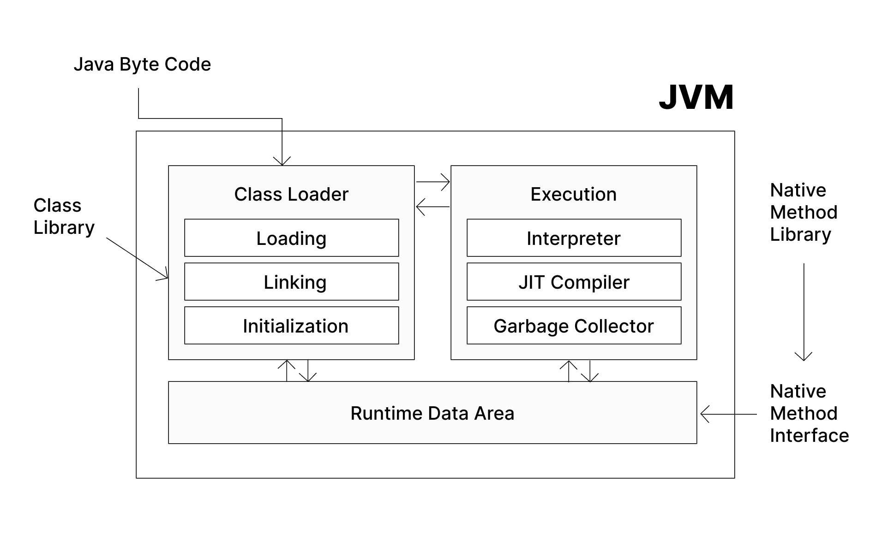

# [Java] 자바 JDK, JRE과 함께 JVM 이해하기

 

   

Java를 설치하고 시작할 때 들어본 `JDK, JRE`, 자바 애플리케이션을 실행하기 위해 필요한 `JVM`까지 Java를 둘러싼 세 가지 개념에 대해 정리해보았다.

 

---

 

 JDK, JRE, JVM 

# JDK

- Java Development Kit
- 자바로 개발하는 데 필요한 SDK이다.

> Software Development Kit, SDK란?  
>
> 소프트웨어를 개발하고 실행하는 데 필요한 도구 세트이다.  
> 디버거, 컴파일러 및 라이브러리, API 및 프레임워크 등을 포함할 수 있다. 
> 다른 회사에서 구현한 기능을 바로 내 애플리케이션에 사용할 수 있게 해준다. 예를 들어, iOS 앱을 만들려면 Apple의 iOS SDK를 사용할 수 있다.

- 자바 개발 시 필요한 컴파일러, 디버거, 라이브러리 등의 도구들과 자바 프로그램을 실행할 환경인 `JRE` 등이 포함되어 있다.

 

- **javac**

    - Java Compiler
    - 자바 컴파일러를 실행하는 명령어
    - 자바 소스코드 .java 를 바이트코드
     .class  로 변환한다.

    > 바이트 코드?  
    > 가상머신에서 실행하는 중간코드로, 가상머신이 이해할 수 있는 실행 파일의 형식

- **java**

    - 자바 애플리케이션 런타임 실행 명령어

        - `JDK` 또는 `JRE`를 설치하면 명령줄에 `java` 명령어가 추가된다.

    - 컴파일된 바이트 코드를 실행한다.

- **javadoc**

    - 자바 소스코드로 HTML형식의 API 문서를 만드는 도구

- **jdb**

    - java debugger
    - 자바 디버깅을 위한 명령어

- **jar**

    - Java ARchive
    - 자바 클래스 파일들과 리소스 파일, 메타데이터를 묶은 아카이브 파일
    - 자바 애플리케이션을 배포하고 실행할 때 사용하는 압축 파일이라고 생각하면 된다.

 

일반적으로 우리가 `Java를 설치한다`라고 하면 `JDK`를 다운받는 것을 의미한다. Java 언어를 사용하여 개발할 수 있는 도구들을 전부 갖고 있기 때문이다.
자바 언어로 개발하려면 `JDK`가 필요하다. 그러나 자바 프로그램을 실행만 하려면 `JRE`만 있어도 된다. 이 말이 무슨 뜻인지 이해하기 위해 `JRE`에 대해 알아보자.

 

---

# JRE

- Java Runtime Environment
- 자바 프로그램 실행 환경으로, **자바 프로그램이 실행될 때 필요한 라이브러리들과 JVM**을 말한다.

 앞서 프로그램 실행을 위해서는 `JRE`만 있어도 된다고 했지만, `JDK 11` 이후로는 개별 설치를 지원하지 않는다고 한다. 

 

- **Java Class Library**

    - Java API
    - 필요에 따라 호출할 수 있는 미리 작성된 코드들. 내장 메서드.
    - 프로그램이 자바 클래스 라이브러리를 호출하면, JVM의 클래스 로더가 필요한 모든 클래스 파일을 JVM에 로드한다.

- **실행 시간 라이브러리**

    - 자바 프로그램이 실제로 실행될 때 필요한 구체적인 구현체를 제공하는 라이브러리
    - 자바 API에서 제공하는 클래스와 메서드들 Java Class Library  이 실행시간 라이브러리를 통해 구현되는 것
    
    > 자바 클래스 라이브러리와의 차이점은 API(소프트웨어 컴포넌트들이 상호작용하는 방법을 정의)와 라이브러리(미리 작성된 코드들, 구현체를 포함)의 차이 정도로 보면 될 듯하다.
    
- **Bytecode 검증기**

    - 바이트 코드를 실행하기 전, JVM의 바이트 코드 검증기가 클래스 파일을 검증한다.

 

---

# JVM

- Java Virtual Machine

- 자바 가상 머신

    - 자바를 실행하는 가상 머신. 자바로 작성된 모든 프로그램은 JVM에서만 실행할 수 있다. 따라서 자바 프로그램 실행을 위해서는 반드시 JVM이 필요하다.

- 자바 언어의 **플랫폼 독립성**을 실현시켜주는 핵심 도구이다.

    - 플랫폼에 종속되어 있다는 것은 특정 운영체제 및 하드웨어에서만 돌아간다는 의미이다.
    - 어떤 플랫폼이든 위에 JVM을 올리고 거기서 자바 프로그램을 실행시키기 때문에 호스트 컴퓨터의 운영체제에 관계 없이 돌아간다.

 

 

- 일반적으로 소스 코드를 특정 플랫폼에서 컴파일/어셈블링해 실행 파일을 만들면 해당 플랫폼을 위한 실행 파일이 만들어진다.
    
    - 즉 다른 운영체제에서는 여기서 만들어진 실행 파일을 실행할 수 없다.

- 반면 자바 소스 코드를 `javac`가 컴파일하면 **가상 머신이 이해할 수 있는 바이트 코드**를 생성한다.

- 이 바이트 코드를 JVM에서 실행하면 JVM이 호스트 컴퓨터의 운영체제에 맞는 실행 파일을 생성한다.

    - 윈도우용 JVM이 윈도우 PC에게 윈도우용 실행 파일을, 리눅스용 JVM이 리눅스 PC에게 리눅스용 실행 파일을 제공하여 어떤 플랫폼이든 프로그램을 실행할 수 있게 해준다.
    
    - JVM은 하나의 언어를 여러 사람의 국적에 맞는 언어로 번역하는 `번역가`와 같은 역할을 한다고 볼 수 있다.

## JVM 구성과 실행 과정

우선 프로그램이 실행되면 JVM이 OS로부터 프로그램이 필요로 하는 메모리를 할당 받는다.  
JVM은 이 메모리를 용도에 따라 여러 영역으로 나누어 관리 Java Runtime Data Area 한다.

다음으로 자바 컴파일러가 자바 소스코드를 읽고 자바 바이트코드로 변환한다.

### 1. Class Loader

클래스 로더가 바이트 코드를 담은 클래스 파일들을 JVM으로 로드한다.

- **Loading**

    - 바이트 코드를 메소드 영역에 저장
    - 각 바이트코드는 메소드 영역에 클래스, 부모 클래스의 정보와 변수 메소드 등의 정보를 저장

- **Linking**

    - 읽어 들인 클래스가 자바 언어 명세 및 JVM 명세에 맞는지 검증
    - 클래스가 필요로 하는 메모리 할당
    - 클래스에서 정의된 필드, 메소드, 인터페이스를 나타내는 데이터 구조를 준비
    - 심볼릭 메모리 레퍼런스를 메소드 영역의 실제 레퍼런스로 교체

    > 클래스 파일에서 클래스의 메서드, 필드, 클래스 등을 참조할 때는 실제 메모리 주소가 아닌 **심볼릭 레퍼런스**로 참조한다.  
    > `java.util.ArrayList`, 클래스의 메서드나 필드 `User.printAge()`, `User.age` 등을 말한다.  
    > 컴파일 시점에 참조 정보를 기록하는 개념이며, 런타임에 실제 메모리 주소로 변환한다.  
    > 실제 메모리 주소를 숨기고 코드에서는 고수준의 이름을 사용하여 안전성을 높이는 캡슐화 개념이다.

- **Intialization**

    - 클래스 변수들을 적절한 값으로 초기화
        
        - static 필드들이 설정된 값으로 초기화됨

 

> 클래스 로더는 JVM 외부에 있지만, 작동은 JVM 내부에서 하는 것으로 이해했다.

### 2. Interpreter / JIT Compiler

로드된 클래스 파일들이 `Execution Engine`을 통해 해석된다.

- 인터프리터가 바이트 코드들을 명령어 단위로 읽어서 기계어로 해석한다.

- 성능을 높이기 위해 JIT 컴파일러와 인터프리터를 함께 사용하여 해석한다.  
    - 인터프리터 방식으로 기계어 코드를 생성할 때 자주 사용되는 메소드의 경우 컴파일 후 기계어를 캐싱한다.

### 3. Runtime Data Area

JVM의 메모리 영역으로 자바 프로그램을 실행할 때 사용되는 데이터들이 저장된다.  
해석된 바이트 코드는 Runtime Data Area에 배치되어 실질적으로 수행된다.

- **Method Area**

    - 클래스 이름, 필드, 메서드 등 클래스 로더에 의해 로드된 클래스의 정보
    - Static 변수의 데이터를 저장
    - Java 8 이후에는 `Metaspace`라고 불리기도 한다.

- **Heap Area**

    - 객체와 배열을 저장
    - 참조되지 않는 객체는 `Garbage Collector`에 의해 제거된다.

- **Stack Area**

    - 각 스레드마다 스택 프레임을 생성하여 메소드 호출 관련 정보를 저장
    - 메소드 내 사용되는 지역 변수, 매개 변수, 반환 타입
        - 지역변수로 선언된 객체의 참조값 저장

- **PC Register**

    - 스레드가 현재 수행 중인 명령어의 주소를 저장

- **Native Method Stack**

    - Java가 아닌 다른 언어로 작성된 메소드의 호출 정보를 저장

### 4. Garbage Collector, GC

Heap Area의 객체를 주기적으로 탐색하여 사용하지 않는 객체를 삭제한다.
실행 과정에서 필요에 따라 GC로 메모리를 관리한다.

 

 

JVM의 구조와 실행 흐름을 다음과 같은 그림으로 파악할 수 있다!

  

 &nbsp; 📁 참고 자료

    

    ❗️ <a href="https://jaehoney.tistory.com/173" target="_blank">Java - JVM 구성 요소와 역할 정리!</a>
    

    

    ❗️ <a href="https://docs.tosspayments.com/resources/glossary/sdk" target="_blank">토스 페이먼츠 개발자 센터</a>
    

    

    ❗️ <a href="https://mundol-colynn.tistory.com/123" target="_blank">[JAVA / 자바] API vs Library: API와 Library의 차이</a>
    

    

    ❗️ <a href="https://inpa.tistory.com/entry/JAVA-%E2%98%95-JDK-JRE-JVM-%EA%B0%9C%EB%85%90-%EA%B5%AC%EC%84%B1-%EC%9B%90%EB%A6%AC-%F0%9F%92%AF-%EC%99%84%EB%B2%BD-%EC%B4%9D%EC%A0%95%EB%A6%AC" target="_blank">JDK / JRE / JVM 개념 & 구성 원리 💯 총정리</a>
    

    

    ❗️ <a href="https://velog.io/@cv_/Java-JVM-Java-Virtual-Machine-%EA%B0%9C%EB%85%90-%EC%A0%95%EB%A6%AC-JDK-JRE#3-1-jdk" target="_blank">[Java] JVM (Java Virtual Machine) 개념 정리 (+ JDK, JRE)</a>
    

    

    ❗️ <a href="https://velog.io/@ddangle/Java-%ED%81%B4%EB%9E%98%EC%8A%A4-%EB%A1%9C%EB%8D%94%EB%9E%80" target="_blank">[Java] 클래스 로더란?</a>
    

    

    ❗️ <a href="https://lifework-archive-reservoir.tistory.com/191" target="_blank">[Java] 심볼릭 레퍼런스 Symbolic Reference</a>
    

