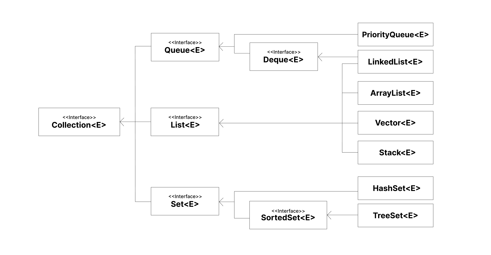
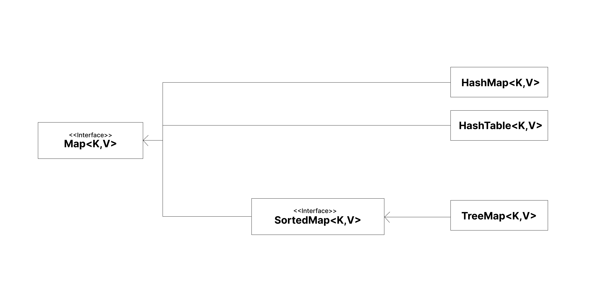

# [Java] 자바 Collections Framework (Framework vs Library)

<br><center></center>
<br><br>

자바 알고리즘 공부를 시작하며, 다양한 자료구조를 편리하게 이용할 수 있는 `Collections` 프레임워크를 자주 접하게 되었다. 언제 어떤 클래스를 사용하는 것이 좋을지 보다 빠르게 판단하기 위해, 관련 내용을 정리해보고 적절한 알고리즘 설계에 활용해보고자 한다.

더불어 `Collections`가 라이브러리가 아닌 프레임워크라는 점을 통해 라이브러리와 프레임워크가 코드에서 각각 어떻게 다르게 동작하는지도 확실히 이해해보려고 한다.

<br>

---

# Java Collections Framework, JCF

복잡한 자료구조와 알고리즘을 직접 다루는 대신, 표준화된 API로 쉽게 사용할 수 있도록 JDK에서 제공하는 하나의 프레임워크이다. `Java 1.2(Java 2)`에서 등장하였으며, `java.util` 패키지에 `HashMap, ArrayList, Vector 등`의 자료구조와 `정렬, 이분탐색 등`의 알고리즘이 클래스로 제공되어 개발자가 직접 구현하지 않고도 간편하게 이용할 수 있다.

## 🤨 프레임워크와 라이브러리의 차이

자바 프로그램에서 JCF는 **프레임워크**로서 동작한다.  
우선 프레임워크는 라이브러리를 포함하는 더 포괄적인 개념이다. 그러나 개발자의 코드와 어떻게 상호작용하는지, 프로그램을 주도하는 주체가 어느 쪽인지에 따라 둘의 차이를 구분할 수 있다.

<br>

- 라이브러리 관점

```java

    ArrayList<Integer> al = new ArrayList<>();

```

단순히 라이브러리를 사용할 때에는 개발자가 필요에 의해 라이브러리 코드를 호출하며, **프로그램의 흐름을 주도하는 쪽은 개발자**이다.

<br>

- 프레임워크 관점

```java

    ...
        
    Collections.sort(al, new Comparator() {
        // 개발자의 코드
        @Overide
        public int compare(Integer o1, Integer o2) {
            return -Integer.compare(o1,o2);
        }
    });


```

반면 프레임워크에서는 프레임워크가 프로그램의 흐름을 주도하는 **제어의 역전(Inversion of Control, IoC)**이 일어날 수 있다. 

예를 들어 위와 같은 코드는 개발자가 이미 정해진 구조와 규칙에 따라 코드를 작성해야 하며, 이에 따라 *프레임워크 코드가 개발자의 코드를 호출*하여 미리 정의되어 있는 기능을 수행한다. 따라서 **프로그램의 흐름을 제어하는 주체는 프레임워크**이다.

이러한 제어의 역전이 일어날 수 있는 이유는, 프레임워크는 이미 정해진 추상화된 **틀**을 제공하기 때문이다. 이 틀은 추상화되어 있기 때문에 개발자가 구체적인 동작 방식을 몰라도 이 도구를 사용할 수 있고, 이미 잘 짜여진 인터페이스와 클래스 간의 의존성으로부터 정해진 흐름에 따라 내 코드가 동작할 수 있게 해준다. 즉, 프레임워크 내부에 이미 제어 흐름에 대한 주도성이 정의되어있는 것이다.

<br>

차이점에 대한 직관적인 이해를 위해 예시로 코드를 작성해봤지만, 이 차이는 물리 계층이 아닌 논리 계층에서 이해하는 것이 좋다.

> 스프링 사용자라면, 스프링 프레임워크 <span style="color:#737373; font-size:14px; font-weight:300;">컨테이너</span> 가 개발자가 작성한 코드 <span style="color:#737373; font-size:14px; font-weight:300;">빈</span> 를 호출하여 의존성을 주입 <span style="color:#737373; font-size:14px; font-weight:300;">프로그램의 흐름을 주도하는 기능 수행</span> 하는 것을 떠올려보면 이해가 될 것이다!

<br>

라이브러리는 내 프로그램을 만들기 위해 내 입맛대로 골라 쓸 수 있는 <span style="color:#737373; font-size:14px; font-weight:300;">제공된 기능을 언제 어떻게 사용할지 개발자가 결정한다</span> 연장 도구 키트라면, 프레임워크는 내 프로그램의 일부를 완전히 믿고 맡겨버리는 <span style="color:#737373; font-size:14px; font-weight:300;">어떻게 이런 결과물이 나오는지는 모르겠지만 어쨌든 내가 원하는 기능을 수행해서 제공해준다</span> 위탁업체라고 이해해볼 수 있겠다. 

<br>

---

# Collection Interfaces

컬렉션 프레임워크는 `Collection` 인터페이스를 기반으로 이루어져있다.  
컬렉션 프레임워크에서 다루는 인터페이스는 크게 두 그룹, `Collection` 인터페이스와 `Map` 인터페이스로 나뉘며 이를 상속하여 구현된 클래스들로 구성된다.

<br>

<center></center>
<center></center><br>


공식 문서에서는 `Collection` 인터페이스의 범주를 위의 두 인터페이스 전부를 포함하는 것으로 정의하고 있다. 그러나 실제로 `Map` 인터페이스는 `java.util.Map`, `Collection` 인터페이스는 `java.util.Collection`으로 상호 간 의존성이 없는 관계이다. 즉 `Map` 인터페이스가 `Collection` 인터페이스의 서브 인터페이스인 것이 아니다.

그러나 `Map` 인터페이스에서는 `collection-view`라는 특별한 기능을 제공하여 컬렉션 인터페이스의 기능을 사용할 수 있도록 만들어준다. 따라서 둘은 상호작용할 수 있게 되며 **Collection**이라는 이름 아래 하나의 프레임워크로 묶일 수 있게 된다.

> 포괄적으로 사용하는 Collection이란 명칭과 실제 프레임워크에 구현된 인터페이스의 이름을 구분하자.

<br>

이제 컬렉션 프레임워크에서 자주 사용하는 클래스들이 어떤 자료구조를 내부적으로 어떻게 구현했는지, 어떠한 데이터를 다룰 때에 사용하기 적합한지 각각의 특징을 살펴보자. <span style="color:#737373; font-size:14px; font-weight:300;">동기화는 따로 다루기 위해 싱글스레드 환경만 고려하였다.</span>

<br>

---

# Queue Interface

순서가 있는 데이터의 집합이자, 선입선출의 규칙에 따라 삽입/삭제의 위치가 정해져있는 Queue 자료구조이다.

## PriorityQueue

```java

    PriorityQueue<Integer> pq = new PriorityQueue<>();

    // 큰 수부터 나오도록
    PriorityQueue<Integer> rpq = new PriorityQueue<>(Collections.reverseOrder());

```

**특징**

- 기본적으로 우선순위가 낮은 수(작은 수)부터 나온다.
- Comparator를 오버라이드한 클래스를 따로 정의해, 객체에 대한 우선순위를 지정할 수 있다.

- 주요 메서드

    - `offer, poll, peek, isEmpty, size`

    > `add, remove`도 `offer, poll`과 같은 역할을 하지만, 연산에 실패하면 에러를 발생시킨다는 차이가 있다. 

**성능**

- 성능 때문에 사용한다기보다, 큐 자료구조에서 **먼저**의 기준이 들어온 순서가 아닌 특별한 기준이 되어야하는 경우 사용할 수 있다.

<br>

---

# List Interface

순서가 있는 데이터의 집합인 List이다.

## ArrayList

```java

    ArrayList<Integer> al = new ArrayList<>(20);

```

**특징**

- 크기가 고정적인 배열과 달리, 데이터의 양에 따라 크기를 조정하는 **동적 배열**이다.

- 내부적으로 자바의 `Object[]` 배열을 사용한다.

    - 배열이 꽉 찰 때마다 배열을 복사하는 방식으로 크기를 조정한다.

    - 연속적인 메모리를 갖는다.

- 주요 메서드

    - `add, get, remove, contains, size`

**성능**

- 배열을 이용하므로 인덱스를 이용하여 요소에 빠르게 접근할 수 있다.

- 맨 앞/뒤가 아닌 곳에 삽입/삭제가 일어날 경우 요소들이 재배치되므로 느리다.

- 배열이 꽉 찰 때마다 복사가 일어나 지연이 발생한다.

<br>

> 삽입/삭제보다 데이터 검색이 빈번히 일어날 때 적합하다.

## LinkedList

```java

    LinkedList<Integer> al = new LinkedList<>();

```

**특징**

- 메모리의 이곳 저곳에 위치한 노드가 서로 연결된 형태로 데이터를 저장하는 연결 리스트 자료구조이다.

- 데이터뿐만 아니라 포인터를 저장할 공간도 필요하다.

- Queue 인터페이스와 List 인터페이스를 동시에 상속받는다.

    - 연결리스트 자료구조 자체가 큐의 선입선출 동작 방식과 잘 호환되는 점이 있다.`Queue` 인터페이스를 연결리스트 방식으로 구현한 것이 `LinkedList`라고 볼 수 있다.

**성능**

- `ArrayList`와 달리 삽입/삭제 시 데이터 이동이 필요하지 않다.

- 단 연속적인 메모리가 아니므로 삽입/삭제 위치까지 이동하는 시간이 더 걸린다. 즉 탐색 성능이 좋지 않다.

- 무작위 접근이 아닌 순차 접근만 가능하다.

<br>

> 이론 상 데이터의 삽입/삭제 연산이 많은 경우 적합하다.
> 
> 또한 Queue를 구현할 때 사용할 수 있으나, 사실 동적 배열로 구현되고 최적화된 ArrayDeque라는 더 좋은 대안이 있어 실제로 LinkedList 컬렉션은 잘 사용하지 않는 듯하다.
>
> 이미 내부적으로 튜닝이 잘 되어있기 때문에 ArrayList로 충분하다!


<br>

---

# Map Interface

키-값 쌍의 구조를 가진 데이터들이 순서를 유지하지 않은 채 모여있는 자료구조이다.

## HashMap

```java

    HashMap<String, String> hm = new HashMap<>();

```

**특징**

- key-value 쌍으로 데이터를 저장한다.

- 키 값은 고유하며, 밸류 값은 키가 다르다면 중복이 가능하다.

- 키 값으로 해시함수를 실행한 결과로 저장할 메모리를 결정한다.

- 주요 메서드

    - `put, remove, get, replace`

**성능**

- 해시 함수를 통해 데이터의 저장 위치를 알 수 있으므로 검색, 삽입/삭제 연산이 빠르다.

- 삽입 또는 정렬 순서가 보장되지 않는다.

- 데이터가 저장되는 단위인 버킷이 실제 사용량에 비해 많이 할당되는 경우 메모리 낭비가 심하다.

> 빠른 검색/삽입/삭제가 필요할 때 적절하다.

## TreeMap

```java

   TreeMap<Integer, String> tm = new TreeMap<>();

```

**특징**

- 저장과 동시에 키 값이 오름차순으로 정렬된다.

    - 내부적으로 레드-블랙 트리(RBT)로 구현되어 있다.

- 주요 메서드

    - `put, remove, get, replace`
    - `firstKey, firstEntry, lastKey, lastEntry`

**성능**

- 연산이 일어날 때마다 정렬이 일어나므로, 해시맵에 비해 삽입/삭제 성능이 좋지 않다.

> 정렬된 데이터의 안정적인 검색 성능이 필요할 때 적합하다.
>
> 연결리스트를 기반으로 한 LinkedHashMap을 이용하면 입력된 순서대로 데이터를 유지할 수 있다.

<br>

---

# Set Interface

순서를 유지하지 않으며 중복을 허용하지 않는 데이터의 집합 Set이다.

## HashSet

```java

    HashSet<String> hs = new HashSet<>();

```

**특징**

- 내부적으로 HashMap을 사용하며 메모리가 불연속적이다.

```java

    private transient HashMap<E,Object> map;

    // Dummy value to associate with an Object in the backing Map
    private static final Object PRESENT = new Object();

```

- `HashMap<E,Object>`을 가지고 있어 해시맵의 해시 함수 기능을 재사용하며, 밸류에 해당하는 부분에는 `PRESENT`라는 더미 값을 넣어준다.

- 중복을 자동으로 제거해준다.

- 주요 메서드

    - `add, remove, contains, size`

**성능**

- 해시맵의 장점을 동일하게 가지되, 중복된 요소를 허용하지 않는 집합 자료구조를 구현할 때 사용한다.


## TreeSet

```java

    TreeSet<String> ts = new TreeSet<>();

```

**특징**

- 내부적으로 TreeMap을 사용하여 자동으로 오름차순 정렬을 수행한다.

- 주요 메서드

    - `add, remove, contains, size`
    - `first, last`

**성능**

- 성능이라기 보다 중복된 요소를 허용하지 않는 집합 자료구조가 정렬된 상태를 유지해야 할 때 사용한다.

> 마찬가지로 LinkedHashMap을 사용하는 LinkedHashSet을 입력 순서 유지에 활용할 수 있다.

<br>

---

## 🧐 Collection 인터페이스 별 특징 정리

알고리즘 문제를 해결할 때, 각 클래스들이 자료구조로서 어떻게 사용되면 좋을지도 함께 생각해보았다.

### List

- 순서가 있는 데이터의 집합
- 데이터의 중복을 허용
- 인덱스를 사용해 요소에 접근해야할 때

- 구현된 클래스
    - ArrayList, Vector, LinkedList
    - 동적 배열 또는 연결 리스트 형태로 구분

### Queue

- 순서가 있는 데이터의 집합
- 데이터의 중복을 허용
- 선입선출이라는 특별한 삽입/삭제 연산이 필요할 때 활용

- 구현된 클래스
    - LinkedList, PriorityQueue

### Set

- 순서를 유지하지 않는 데이터의 집합
- 데이터의 중복을 허용하지 않는다.
- 데이터의 정렬이 필요하다면 TreeSet, 빠른 삽입/삭제/검색 성능이 필요하다면 HashSet

- 구현된 클래스
    - HashSet, TreeSet

### Map

- <K,V>
- 순서를 유지하지 않는 데이터의 집합
- key 값은 고유한 값으로 데이터의 중복을 허용하지 않으나, value 값은 중복을 허용한다.
- 데이터의 정렬이 필요하다면 TreeMap, 빠른 삽입/삭제/검색 성능이 필요하다면 HashMap

- 구현된 클래스
    - HashTable, HashMap, TreeMap


<br><br>
<details>
<summary> &nbsp; 📁 참고 자료</summary>
<div>
    <div>
    ❗️ Java SE 11 & JDK 11 docs
    </div>
    <div>
    ❗️ <a href="https://webclub.tistory.com/458" target="_blank">프레임워크와 라이브러리의 차이점</a>
    </div>
    <div>
    ❗️ <a href="https://gangnam-americano.tistory.com/41" target="_blank">Java 컬렉션(Collection) 정리</a>
    </div>
    <div>
    ❗️ <a href="https://inpa.tistory.com/entry/JCF-%F0%9F%A7%B1-ArrayList-vs-LinkedList-%ED%8A%B9%EC%A7%95-%EC%84%B1%EB%8A%A5-%EB%B9%84%EA%B5%90" target="_blank">ArrayList vs LinkedList 특징 & 성능 비교</a>
    </div>
    <div>
    ❗️ <a href="https://dev-coco.tistory.com/39" target="_blank">[Java] TreeMap</a>
    </div>
</div>
</details>